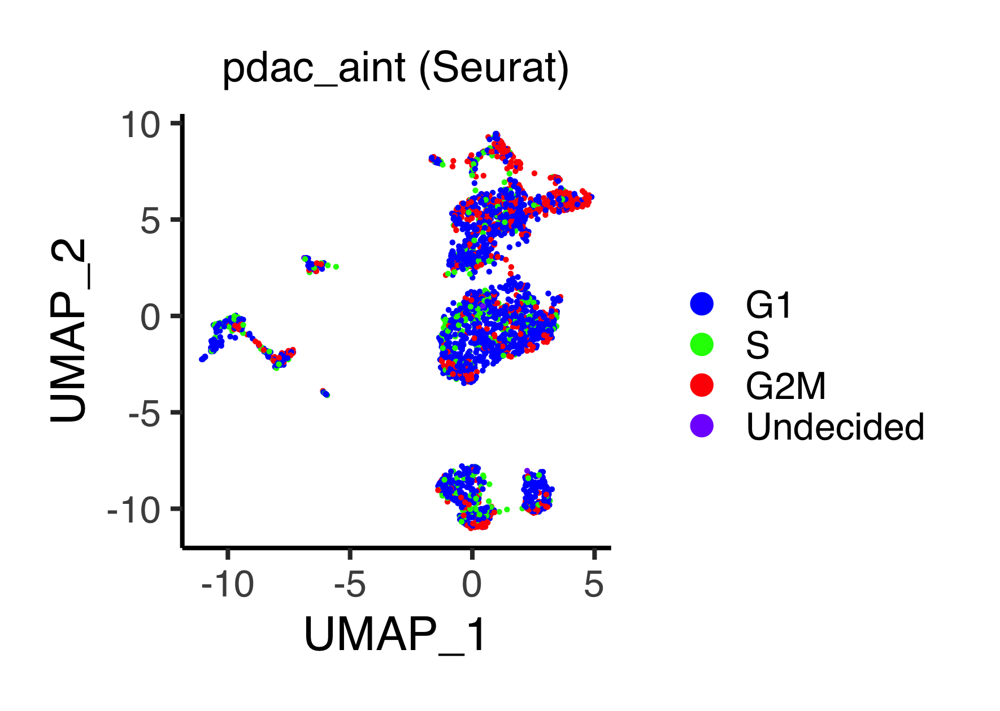

# Data integration {#integration}
## Integrate PDAC inDrop and ST data by Seurat
Load the data.
```{r, eval = FALSE}
source("R/function_general.R")
source("R/function_seurat.R")
pdac_ast1 <- readRDS(file = "backup/05_005_pdac_ast1_normalized.rds")
pdac_arna <- readRDS(file = "backup/06_005_pdac_arna_normalized.rds")
```

The following function `do_IntegrateData_seurat()` combines two scRNA-seq type
data (here we regard spatial transcriptome data as scRNA-seq type data) into
one Seurat object by using data integration method in Seurat package.
The arguments are `obj_1` and `obj_2` (ASURAT objects),
`nfeatures_1` and `nfeature_2` (number of features as top variable features:
we use `FindVariableFeatures()` setting `selection.method = "vst"`),
`anchor.features` (an argument of Seurat function `SelectIntegrationFeatures()`:
number of features used for data integration), and
`normalization.method = "LogNormalize"` (an argument of Seurat function
`IntegrateData()`: name of normalization method used).
```{r, eval = FALSE}
# ----------------------------------------
# pdac_aint
# ----------------------------------------
pdac_aint_seurat <- do_IntegrateData_seurat(
  obj_1 = pdac_ast1, obj_2 = pdac_arna, nfeatures_1 = 3000, nfeatures_2 = 3000,
  nfeatures = 2000, normalization.method = "LogNormalize")
```

Rename `obj@meta.data[["orig.ident"]]`.
```{r, eval = FALSE}
# ----------------------------------------
# pdac_aint_seurat
# ----------------------------------------
name1 <- pdac_ast1[["history"]][["make_asurat_obj"]][["obj_name"]]
name2 <- pdac_arna[["history"]][["make_asurat_obj"]][["obj_name"]]
tmp <- pdac_aint_seurat@meta.data
tmp[which(tmp$orig.ident == name1),]$orig.ident <- name1
tmp[which(tmp$orig.ident == "cell"),]$orig.ident <- name2
pdac_aint_seurat@meta.data <- tmp
```

Perform scaling, dimensionality reduction, and clustering using Seurat's
standard processes.
```{r, eval = FALSE}
# ----------------------------------------
# pdac_aint_seurat
# ----------------------------------------
pdac_aint_seurat <- ScaleData(pdac_aint_seurat, verbose = FALSE)
pdac_aint_seurat <- RunPCA(pdac_aint_seurat, npcs = 100, verbose = FALSE)
pdac_aint_seurat <- RunTSNE(pdac_aint_seurat, reduction.use = "cca.aligned",
                            dims.use = 1:30, do.fast = TRUE)
pdac_aint_seurat <- RunUMAP(pdac_aint_seurat, reduction = "pca", dims = 1:30)
pdac_aint_seurat <- FindNeighbors(pdac_aint_seurat, reduction = "pca",
                                  dims = 1:30)
pdac_aint_seurat <- FindClusters(pdac_aint_seurat, resolution = 0.15)

tmp <- pdac_aint_seurat@meta.data[["seurat_clusters"]]
tmp <- as.integer(as.character(tmp)) + 1
tmp <- factor(tmp, levels = 1:max(tmp))
pdac_aint_seurat@meta.data[["seurat_clusters"]] <- tmp
pdac_aint_seurat <- SetIdent(pdac_aint_seurat, value = "seurat_clusters")
```


## Identifying differentially expressed genes
Find differentially expressed genes using Seurat's function and stores the
results into `obj@misc[["markers"]]`.
```{r, eval = FALSE}
pdac_aint_seurat@misc[["markers"]] <- FindAllMarkers(
  pdac_aint_seurat, only.pos = T, min.pct = 0.25, logfc.threshold = 0.25)
```

Users can check the marker genes of each cluster by the following command:
```{r, eval = FALSE}
datatable(pdac_aint_seurat@misc[["markers"]], rownames = FALSE)
```

* `pdac_aint_seurat`

<iframe src="figures/pdac_aint_marker_seurat.html" style="width:100%; height:400px;"></iframe>

<br><br><br><br><br>


## Inferring cell cycle phases
Assign each cell a cell cycle score using `CellCycleScoring()`.
```{r, eval = FALSE}
s.genes <- cc.genes$s.genes
g2m.genes <- cc.genes$g2m.genes

pdac_aint_seurat <- CellCycleScoring(pdac_aint_seurat, s.features = s.genes,
                                     g2m.features = g2m.genes,
                                     set.ident = FALSE)
tmp <- factor(pdac_aint_seurat@meta.data[["Phase"]],
              levels = c("G1", "S", "G2M", "Undecided"))
pdac_aint_seurat@meta.data[["Phase"]] <- tmp
```

Rename the batch names.
```{r, eval = FALSE}
tmp <- pdac_aint_seurat@meta.data
tmp[which(tmp$orig.ident == "pdac_ast1"),]$orig.ident <- "ST"
tmp[which(tmp$orig.ident == "pdac_arna"),]$orig.ident <- "inDrop"
pdac_aint_seurat@meta.data <- tmp
```

The following function `plot_manifold2d_seurat()` outputs a `ggplot` object,
which shows the clustering results between batches or putative subpopulations
in a two-dimensional reduced space.
The arguments are `obj_seurat` (Seurat object), `batch` (`TRUE` or `FALSE`:
if `TRUE`, `obj@meta.data[["orig.ident"]]` is labeled, otherwise
`obj_seurat@meta.data[["seurat_clusters"]]` is labeled), and
`plot_type` (one of `"pca"`, `"tsne"` or `"umap"`).
```{r, eval = FALSE}
# ----------------------------------------
# pdac_aint_seurat
# ----------------------------------------
p <- plot_manifold2d_seurat(obj = pdac_aint_seurat, batch = TRUE,
                            plot_type = "umap", title = "pdac_aint",
                            title_size = 18, xlabel = "UMAP_1",
                            ylabel = "UMAP_2", default_color = TRUE)
filename <- "figures/figure_07_0010.png"
ggsave(file = filename, plot = p, dpi = 300, width = 5.5, height = 4.2)

p <- plot_manifold2d_seurat(obj = pdac_aint_seurat, batch = FALSE,
                            plot_type = "umap", title = "pdac_aint",
                            title_size = 18, xlabel = "UMAP_1",
                            ylabel = "UMAP_2", default_color = TRUE)
filename <- "figures/figure_07_0011.png"
ggsave(file = filename, plot = p, dpi = 300, width = 5, height = 4.2)
```


The following function `plot_integrated_geneExpression_seurat()` outputs
a `ggplot` object, which shows gene expression levels as z-score
in a two-dimensional reduced space.
The arguments are `obj` (Seurat object processed by `ScaleData()`),
`gene_name` (gene name), and `plot_type` (one of `"pca"`, `"tsne"` or `"umap"`).
```{r, eval = FALSE}
# ----------------------------------------
# pdac_aint_seurat
# ----------------------------------------
p <- plot_integrated_geneExpression_seurat(obj = pdac_aint_seurat,
                                           gene_name = "TM4SF1",
                                           plot_type = "umap",
                                           title = "pdac_aint (TM4SF1)",
                                           title_size = 18,
                                           xlabel = "UMAP_1", ylabel = "UMAP_2",
                                           label_name = "Z-score")
filename <- "figures/figure_07_0015.png"
ggsave(file = filename, plot = p, dpi = 300, width = 5.4, height = 4.2)
```

```{r, eval = FALSE, echo = FALSE, results = "hide"}
p <- plot_integrated_geneExpression_seurat(obj = pdac_aint_seurat,
                                           gene_name = "S100A4",
                                           plot_type = "umap",
                                           title = "pdac_aint (S100A4)",
                                           title_size = 18,
                                           xlabel = "UMAP_1", ylabel = "UMAP_2",
                                           label_name = "Z-score")
filename <- "figures/figure_07_0016.png"
ggsave(file = filename, plot = p, dpi = 300, width = 5.4, height = 4.2)
```


The following function `plot_cc_umap_seurat()` shows the result of
`CellCycleScoring()` in a two-dimensional UMAP space.
```{r, eval = FALSE}
p <- plot_cc_umap_seurat(obj = pdac_aint_seurat, title = "pdac_aint (Seurat)",
                         title_size = 18, xlabel = "UMAP_1", ylabel = "UMAP_2",
                         default_color = FALSE)
filename <- "figures/figure_07_0017.png"
ggsave(file = filename, plot = p, dpi = 300, width = 5.9, height = 4.2)
```



The following function `convert_seurat2asurat()` converts Seurat objects into
ASURAT objects.
The arguments are `obj_seurat` (Seurat object),
`orgdb` (annotation data package　such as `org.Hs.eg.db` and `org.Mm.eg.db`),
which is used to convert　gene symbols to Entrez IDs, and
`obj_name` (name of ASURAT object).
```{r, eval = FALSE}
pdac_aint <- convert_seurat2asurat(obj_seurat = pdac_aint_seurat,
                                   orgdb = org.Hs.eg.db, obj_name = "pdac_aint")
```

Copy some information.
```{r, eval = FALSE}
pdac_aint[["sample"]][["phase"]] <- pdac_aint_seurat@meta.data[["Phase"]]
pdac_aint[["misc"]][["images"]] <- pdac_ast1[["misc"]][["images"]]
```


## Save results 
Save the objects.
```{r, eval = FALSE}
saveRDS(pdac_aint,        file = "backup/07_005_pdac_aint_normalized.rds")
saveRDS(pdac_aint_seurat, file = "backup/07_005_pdac_aint_seurat.rds")
```

Users can load the data.
```{r, eval = FALSE}
pdac_aint        <- readRDS(file = "backup/07_005_pdac_aint_normalized.rds")
pdac_aint_seurat <- readRDS(file = "backup/07_005_pdac_aint_seurat.rds")
```
