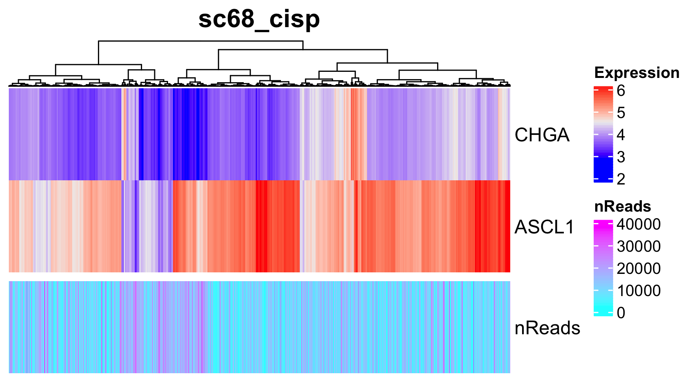
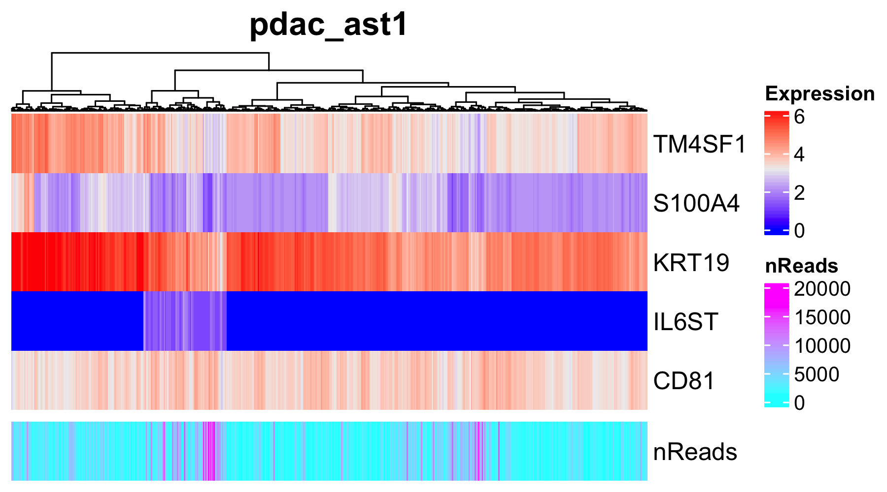

# Checking expression profiles of marker genes {#markergenes}
To confirm that important marker genes are detected in the datasets,
we recommend users to investigate the gene expression profiles of
expected marker genes before running ASURAT.

Load the normalized data.
```{r, eval = FALSE}
rm(list = ls())
source("R/function_general.R")
source("R/plot.R")
sc68_vehi <- readRDS(file = "backup/01_005_sc68_vehi_normalized.rds")
sc68_cisp <- readRDS(file = "backup/02_005_sc68_cisp_normalized.rds")
pdac_aint <- readRDS(file = "backup/07_005_pdac_aint_normalized.rds")
pbmc_4000 <- readRDS(file = "backup/10_005_pbmc_4000_normalized.rds")
pbmc_6000 <- readRDS(file = "backup/11_005_pbmc_6000_normalized.rds")
```

The following function `plot_Heatmap_GenexSamp()` shows normalized read counts
of a given gene set as a heatmap, using the results of 
`obj[["data"]][["normalized"]]`.
The arguments are `obj` (ASURAT object), `genes` (genes of interest, e.g.,
marker genes), `method` (agglomeration method to be used such as `complete`,
`ward.D2`, `average`, etc.), and `show_nReads` (if `TRUE`, the number of reads
is shown).
```{r, eval = FALSE}
# ----------------------------------------
# sc68_vehi
# ----------------------------------------
filename <- "figures/figure_01_0040.png"
png(file = filename, height = 1000, width = 1800, res = 300)
plot_Heatmap_GenexSamp(obj = sc68_vehi,
                       genes = c("CHGA", "ASCL1", "NEUROD1", "YAP1"),
                       method = "ward.D2", show_nReads = TRUE,
                       title = "sc68_vehi", name = "Expression")
dev.off()
```

```{r, eval = FALSE, echo = FALSE, results = "hide"}
# ----------------------------------------
# sc68_cisp
# ----------------------------------------
filename <- "figures/figure_02_0040.png"
png(file = filename, height = 1000, width = 1800, res = 300)
plot_Heatmap_GenexSamp(obj = sc68_cisp,
                       genes = c("CHGA", "ASCL1", "NEUROD1", "YAP1"),
                       method = "ward.D2", show_nReads = TRUE,
                       title = "sc68_cisp", name = "Expression")
dev.off()
# ----------------------------------------
# pdac_ast1
# ----------------------------------------
filename <- "figures/figure_05_0040.png"
png(file = filename, height = 1000, width = 1800, res = 300)
plot_Heatmap_GenexSamp(obj = pdac_ast1,
                       genes = c("TM4SF1", "S100A4", "KRT19", "IL6ST", "CD81"),
                       method = "ward.D2", show_nReads = TRUE,
                       title = "pdac_ast1", name = "Expression")
dev.off()
# ----------------------------------------
# pdac_arna
# ----------------------------------------
filename <- "figures/figure_06_0040.png"
png(file = filename, height = 1000, width = 1800, res = 300)
plot_Heatmap_GenexSamp(obj = pdac_arna,
                       genes = c("TM4SF1", "S100A4", "KRT19", "IL6ST", "CD81"),
                       method = "ward.D2", show_nReads = TRUE,
                       title = "pdac_arna", name = "Expression")
dev.off()
# ----------------------------------------
# pdac_aint
# ----------------------------------------
filename <- "figures/figure_07_0040.png"
png(file = filename, height = 1000, width = 1800, res = 300)
plot_Heatmap_GenexSamp(obj = pdac_aint,
                       genes = c("TM4SF1", "S100A4", "KRT19", "IL6ST", "CD81"),
                       method = "ward.D2", show_nReads = FALSE,
                       title = "pdac_aint", name = "Expression")
dev.off()
```






