# Inferring biological functions (optional) {#biological_function}
In this section, we infer biological functions for individual cells using ASURAT
by inputting Gene Ontology database.

ASURAT transforms normalized and centered read count tables to cell-type or
functional spectrum matrix, which we term sign-by-sample matrices (SSMs).
The resulting matrices can be supplied to the subsequent unsupervised
clusterings.


## Add database to ASURAT objects
Load the data.
```{r, eval = FALSE}
rm(list = ls())
source("R/plot.R")
source("R/function_asurat.R")
sc68_vehi <- readRDS(file = "backup/01_005_sc68_vehi_normalized.rds")
sc68_cisp <- readRDS(file = "backup/02_005_sc68_cisp_normalized.rds")
pdac_aint <- readRDS(file = "backup/07_005_pdac_aint_normalized.rds")
pbmc_4000 <- readRDS(file = "backup/10_005_pbmc_4000_normalized.rds")
pbmc_6000 <- readRDS(file = "backup/11_005_pbmc_6000_normalized.rds")

sc68_vehi_cor <- readRDS(file = "backup/01_006_sc68_vehi_correlation.rds")
sc68_cisp_cor <- readRDS(file = "backup/02_006_sc68_cisp_correlation.rds")
pdac_aint_cor <- readRDS(file = "backup/07_006_pdac_aint_correlation.rds")
pbmc_4000_cor <- readRDS(file = "backup/10_006_pbmc_4000_correlation.rds")
pbmc_6000_cor <- readRDS(file = "backup/11_006_pbmc_6000_correlation.rds")
```

Load Gene Ontology (GO) database.
```{r, eval = FALSE}
tidy_GO <- readRDS(file = "data/2020_001_databases/20201213_tidy_GO_human.rds")
```
See that GO has categories MF, BP, and CC.

Load the tables of information contents.
```{r, eval = FALSE}
IC_GO <- readRDS(file = "data/2020_001_databases/20201213_IC_GO_human.rds")
```

To make the object small, unused items are removed.
```{r, eval = FALSE}
myfunc <- function(obj){
  obj[["data"]][["raw"]] <- NULL
  return(obj)
}

sc68_vehi <- myfunc(sc68_vehi)
sc68_cisp <- myfunc(sc68_cisp)
pdac_aint <- myfunc(pdac_aint)
pbmc_4000 <- myfunc(pbmc_4000)
pbmc_6000 <- myfunc(pbmc_6000)
```

Add formatted databases into ASURAT objects.
```{r, eval = FALSE}
sc68_vehi[["sign"]][["GO"]] <- tidy_GO
sc68_cisp[["sign"]][["GO"]] <- tidy_GO
pdac_aint[["sign"]][["GO"]] <- tidy_GO
pbmc_4000[["sign"]][["GO"]] <- tidy_GO
pbmc_6000[["sign"]][["GO"]] <- tidy_GO
```


## Quick QC
The following function `do_quickQC_sign()` takes an intersection of genes
between user's scRNA-seq data and collected database, and then excludes the IDs
including too few or too many genes by setting thresholds `min_ngenes`
(minimal number of genes which must be greater than one) and `max_ngenes`
(maximal number of genes which must be greater than one).
Here, the values of `min_ngenes` and `max_ngenes` were set as 2 and 1000,
respectively, as default values.
```{r, eval = FALSE}
sc68_vehi <- do_quickQC_sign(obj = sc68_vehi, data_type = "GO",
                             min_ngenes = 2, max_ngenes = 1000)
sc68_cisp <- do_quickQC_sign(obj = sc68_cisp, data_type = "GO",
                             min_ngenes = 2, max_ngenes = 1000)
pdac_aint <- do_quickQC_sign(obj = pdac_aint, data_type = "GO",
                             min_ngenes = 2, max_ngenes = 1000)
pbmc_4000 <- do_quickQC_sign(obj = pbmc_4000, data_type = "GO",
                             min_ngenes = 2, max_ngenes = 1000)
pbmc_6000 <- do_quickQC_sign(obj = pbmc_6000, data_type = "GO",
                             min_ngenes = 2, max_ngenes = 1000)
```
The results are stored in `obj[["sign"]][[data_type]][[category]]`.


## Correlation graph-based decomposition
The following function `separate_variables_sign()` clusters each functional
gene set into three groups, i.e., strongly correlated gene set (SCG),
variably correlated gene set (VCG), and weakly correlated gene set (WCG).
The arguments are `obj` (ASURAT object), `obj_cor`, `data_type`,
`method = "spearman"` (one of `names(obj_cor)`), `th_posi`, and `th_nega`
(thresholds of positive and negative correlation coefficients, respectively).

**Tips:**
This function sometimes produces unexpected results.
In fact, the smaller values of `th_posi` and `th_nega` do not always result in
the larger sizes of SCG and VCG.
Hence we recommend users to carefully turn the parameters and check if the
biological terms (i.e., signs) of interest are included in the results.
```{r, eval = FALSE}
sc68_vehi_red <- separate_variables_sign(obj = sc68_vehi,
                                         obj_cor = sc68_vehi_cor,
                                         data_type = "GO", method = "spearman",
                                         th_posi = 0.49, th_nega = -0.39)
sc68_cisp_red <- separate_variables_sign(obj = sc68_cisp,
                                         obj_cor = sc68_cisp_cor,
                                         data_type = "GO", method = "spearman",
                                         th_posi = 0.34, th_nega = -0.20)
pdac_aint_red <- separate_variables_sign(obj = pdac_aint,
                                         obj_cor = pdac_aint_cor,
                                         data_type = "GO", method = "spearman",
                                         th_posi = 0.26, th_nega = -0.30)
pbmc_4000_red <- separate_variables_sign(obj = pbmc_4000,
                                         obj_cor = pbmc_4000_cor,
                                         data_type = "GO", method = "spearman",
                                         th_posi = 0.25, th_nega = -0.25)
pbmc_6000_red <- separate_variables_sign(obj = pbmc_6000,
                                         obj_cor = pbmc_6000_cor,
                                         data_type = "GO", method = "spearman",
                                         th_posi = 0.25, th_nega = -0.22)
```
The result is stored in `obj[["sign"]][[data_type]][[category]]`.


## Creating systems of signs
The following function `select_sign()` selects the signs by a user-defined
criteria, which has been preset as follows:

1. sum of the number of genes in SCG and VCG is greater than or equal to
`min_cnt`, and
2. the number of genes in WCG is greater than or equal to `min_cnt_weak`
(the default value is 2).

Users can modify the programming code indicated by "User-defined criteria"
in the file `R/function_asurat.R`.
Note that the signs having at most one gene will be removed when creating
sign-by-sample matrices.
For example, given a certain parent sign having SCG = \{GENE_A, GENE_B\} and
VCG = \{GENE_C\}, the VCG will be removed from the downstream analysis.

**Tips:**
The larger the value of `min_cnt` is, the more reliable signs users can obtain.
However, one should pay attention to several bias problems such as annotation
bias, that is some biological terms are associated with many genes, while
others with few.
```{r, eval = FALSE}
sc68_vehi_red <- select_sign(obj = sc68_vehi_red, data_type = "GO",
                             min_cnt = 4, min_cnt_weak = 2)
sc68_cisp_red <- select_sign(obj = sc68_cisp_red, data_type = "GO",
                             min_cnt = 4, min_cnt_weak = 2)
pdac_aint_red <- select_sign(obj = pdac_aint_red, data_type = "GO",
                             min_cnt = 3, min_cnt_weak = 2)
pbmc_4000_red <- select_sign(obj = pbmc_4000_red, data_type = "GO",
                             min_cnt = 4, min_cnt_weak = 2)
pbmc_6000_red <- select_sign(obj = pbmc_6000_red, data_type = "GO",
                             min_cnt = 4, min_cnt_weak = 2)
```
The result is stored in `obj[["sign"]][[data_type]][[category]]`.

Save the objects.
```{r, eval = FALSE}
saveRDS(sc68_vehi_red, file = "backup/01_100_sc68_vehi_select_GO.rds")
saveRDS(sc68_cisp_red, file = "backup/02_100_sc68_cisp_select_GO.rds")
saveRDS(pdac_aint_red, file = "backup/07_100_pdac_aint_select_GO.rds")
saveRDS(pbmc_4000_red, file = "backup/10_100_pbmc_4000_select_GO.rds")
saveRDS(pbmc_6000_red, file = "backup/11_100_pbmc_6000_select_GO.rds")
```

Load the objects.
```{r, eval = FALSE}
sc68_vehi_red <- readRDS(file = "backup/01_100_sc68_vehi_select_GO.rds")
sc68_cisp_red <- readRDS(file = "backup/02_100_sc68_cisp_select_GO.rds")
pdac_aint_red <- readRDS(file = "backup/07_100_pdac_aint_select_GO.rds")
pbmc_4000_red <- readRDS(file = "backup/10_100_pbmc_4000_select_GO.rds")
pbmc_6000_red <- readRDS(file = "backup/11_100_pbmc_6000_select_GO.rds")
```


## Removing redundant signs
The following function `compute_SemSim_sign()` computes pairwise semantic
similarities between biological terms.
Note that this function can be used only for ontology databases such as
DO, CO, and GO.
The arguments are `obj`, `data_type`, `measure` (see below),
`orgdb` (this is necessary only for GO analysis, otherwise `NULL`),
`treeTable` (this is necessary only for CO, otherwise `NULL`), and
`IC` (information contents: this is necessary only for DO, CO, and GO).
Here `measure` must be chosen as follows:

* DO: one of `"Wang"`, `"Resnik"`, `"Rel"`, `"Jiang"`, and `"Lin"`;
* CO: one of `"Lin"` and `"Resnik"`; and
* GO: one of `"Resnik"`, `"Rel"`, `"Jiang"`, and  `"Lin"`.

**Tips:**
The similarity between biological terms are computed based on `measure`, and
the optimal choice depends on the ontology structure.
```{r, eval = FALSE}
sc68_vehi_red <- compute_SemSim_sign(obj = sc68_vehi_red, data_type = "GO",
                                     measure = "Jiang", orgdb = org.Hs.eg.db,
                                     treeTable = NULL, IC = IC_GO)
sc68_cisp_red <- compute_SemSim_sign(obj = sc68_cisp_red, data_type = "GO",
                                     measure = "Jiang", orgdb = org.Hs.eg.db,
                                     treeTable = NULL, IC = IC_GO)
pdac_aint_red <- compute_SemSim_sign(obj = pdac_aint_red, data_type = "GO",
                                     measure = "Jiang", orgdb = org.Hs.eg.db,
                                     treeTable = NULL, IC = IC_GO)
pbmc_4000_red <- compute_SemSim_sign(obj = pbmc_4000_red, data_type = "GO",
                                     measure = "Jiang", orgdb = org.Hs.eg.db,
                                     treeTable = NULL, IC = IC_GO)
pbmc_6000_red <- compute_SemSim_sign(obj = pbmc_6000_red, data_type = "GO",
                                     measure = "Jiang", orgdb = org.Hs.eg.db,
                                     treeTable = NULL, IC = IC_GO)
```
The results are stored in `obj[["sign"]][["data_type_Sim"]]`.
Note that the row and column names are in ascending order with respect to the
values of information content (IC).

The following function `reduce_sign()` removes the biological terms based on the
results of `compute_SemSim_sign()`.
The arguments are `obj`, `data_type`, `threshold` (threshold for regarding
two biological terms as similar ones), and `keep_rareID` (if `"TRUE"`, then the
biological terms with larger ICs are kept).
Note that the larger ICs are, the deeper the biological terms tend to be.
Users can access a correspondence table in `obj[["sign"]][["data_type_Sim"]]`,
where SCG, VCG, and WCG are separated by `||`.

**Tips:**
The optimal value of `threshold` depends on the ontology structure as well as
the measure used in `compute_SemSim_sign()`.
The logical argument `keep_rareID` should be carefully determined by the
research objective.
For example, if users are interested in detailed information,
it might be `keep_rareID = TRUE`.
Note that the smaller ICs are, the more genes tend to be associated with.
```{r, eval = FALSE}
sc68_vehi_red <- reduce_sign(obj = sc68_vehi_red, data_type = "GO",
                             threshold = 0.80, keep_rareID = TRUE)
sc68_cisp_red <- reduce_sign(obj = sc68_cisp_red, data_type = "GO",
                             threshold = 0.80, keep_rareID = TRUE)
pdac_aint_red <- reduce_sign(obj = pdac_aint_red, data_type = "GO",
                             threshold = 0.85, keep_rareID = TRUE)
pbmc_4000_red <- reduce_sign(obj = pbmc_4000_red, data_type = "GO",
                             threshold = 0.70, keep_rareID = TRUE)
pbmc_6000_red <- reduce_sign(obj = pbmc_6000_red, data_type = "GO",
                             threshold = 0.70, keep_rareID = TRUE)
```
The results are stored in
`obj[["sign"]][["data_type_Sim"]][[category]][["report"]]`.

The following function `manual_exclusion_sign()` removes biological terms by
specifying IDs (e.g., `GOID:XXX`) or keywords (e.g., `oocyte`)
using grepl command.
The argument are `obj`, `data_type`, and `keywords` (list of keywords
separated by `|`).
```{r, eval = FALSE}
keywords <- "foo|foofoo"
sc68_vehi_red <- manual_exclusion_sign(obj = sc68_vehi_red, data_type = "GO",
                                       keywords = keywords)
keywords <- "foo|foofoo"
sc68_cisp_red <- manual_exclusion_sign(obj = sc68_cisp_red, data_type = "GO",
                                       keywords = keywords)
keywords <- "foo|foofoo"
pdac_aint_red <- manual_exclusion_sign(obj = pdac_aint_red, data_type = "GO",
                                       keywords = keywords)
keywords <- "foo|foofoo"
pbmc_4000_red <- manual_exclusion_sign(obj = pbmc_4000_red, data_type = "GO",
                                       keywords = keywords)
keywords <- "foo|foofoo"
pbmc_6000_red <- manual_exclusion_sign(obj = pbmc_6000_red, data_type = "GO",
                                       keywords = keywords)
```
The results are stored in `obj[["sign"]][[data_type]][[category]]`.


## Creating sign-by-sample matrices
The following function `make_signxsample_matrix()` makes sign-by-sample
matrices.
The arguments are `obj`, `data_type`,
`weight_strg` (weight parameter for SCG: the default value is 0.5) and
`weight_vari` (weight parameter for VCG: the default value is 0.5).
```{r, eval = FALSE}
sc68_vehi_red <- make_signxsample_matrix(obj = sc68_vehi_red, data_type = "GO",
                                         weight_strg = 0.5, weight_vari = 0.5)
sc68_cisp_red <- make_signxsample_matrix(obj = sc68_cisp_red, data_type = "GO",
                                         weight_strg = 0.5, weight_vari = 0.5)
pdac_aint_red <- make_signxsample_matrix(obj = pdac_aint_red, data_type = "GO",
                                         weight_strg = 0.5, weight_vari = 0.5)
pbmc_4000_red <- make_signxsample_matrix(obj = pbmc_4000_red, data_type = "GO",
                                         weight_strg = 0.5, weight_vari = 0.5)
pbmc_6000_red <- make_signxsample_matrix(obj = pbmc_6000_red, data_type = "GO",
                                         weight_strg = 0.5, weight_vari = 0.5)
```
The results are stored in `obj[["sign"]][["data_typexSample"]][[category]]`.

The following command `plot_Heatmap_SignxSamp()` plots a heat map by using
`Heatmap()` in `ComplexHeatmap` package applied to the sign-by-sample matrices.
The arguments are `obj`, `data_type`, `category`, `algo_name = NULL`,
`method` (agglomeration method to be used such as `complete`, `ward.D2`,
`average`, etc.), and `show_nReads` (if `TRUE`, the number of reads is shown).
```{r, eval = FALSE}
# ----------------------------------------
# sc68_vehi
# ----------------------------------------
filename <- "figures/figure_01_0200.png"
png(file = filename, height = 1000, width = 1150, res = 300)
plot_Heatmap_SignxSamp(obj = sc68_vehi,
                       data_type = "GO", category = "BP",
                       algo_name = NULL, method = "ward.D2",
                       show_nReads = FALSE, title = "sc68_vehi (GO: BP)",
                       name = "Sign score", show_rownames_sign = FALSE,
                       show_rownames_label = FALSE,
                       show_rownames_nReads = FALSE, default_color = FALSE)
dev.off()
```

```{r, eval = FALSE, echo = FALSE, results = "hide"}
# ----------------------------------------
# sc68_cisp
# ----------------------------------------
filename <- "figures/figure_02_0200.png"
png(file = filename, height = 1000, width = 1150, res = 300)
plot_Heatmap_SignxSamp(obj = sc68_cisp_red,
                       data_type = "GO", category = "BP",
                       algo_name = NULL, method = "ward.D2",
                       show_nReads = FALSE, title = "sc68_cisp (GO: BP)",
                       name = "Sign score", show_rownames_sign = FALSE,
                       show_rownames_label = FALSE,
                       show_rownames_nReads = FALSE, default_color = FALSE)
dev.off()
# ----------------------------------------
# pdac_aint
# ----------------------------------------
filename <- "figures/figure_07_0200.png"
png(file = filename, height = 1000, width = 1150, res = 300)
plot_Heatmap_SignxSamp(obj = pdac_aint_red,
                       data_type = "GO", category = "BP",
                       algo_name = NULL, method = "ward.D2",
                       show_nReads = FALSE, title = "pdac_aint (GO: BP)",
                       name = "Sign score", show_rownames_sign = FALSE,
                       show_rownames_label = FALSE,
                       show_rownames_nReads = FALSE, default_color = FALSE)
dev.off()
# ----------------------------------------
# pbmc_4000
# ----------------------------------------
filename <- "figures/figure_10_0200.png"
png(file = filename, height = 1000, width = 1150, res = 300)
plot_Heatmap_SignxSamp(obj = pbmc_4000_red,
                       data_type = "GO", category = "BP",
                       algo_name = NULL, method = "ward.D2",
                       show_nReads = FALSE, title = "pbmc_4000 (GO: BP)",
                       name = "Sign score", show_rownames_sign = FALSE,
                       show_rownames_label = FALSE,
                       show_rownames_nReads = FALSE, default_color = FALSE)
dev.off()
# ----------------------------------------
# pbmc_6000
# ----------------------------------------
filename <- "figures/figure_11_0200.png"
png(file = filename, height = 1000, width = 1150, res = 300)
plot_Heatmap_SignxSamp(obj = pbmc_6000_red,
                       data_type = "GO", category = "BP",
                       algo_name = NULL, method = "ward.D2",
                       show_nReads = FALSE, title = "pbmc_6000 (GO: BP)",
                       name = "Sign score", show_rownames_sign = FALSE,
                       show_rownames_label = FALSE,
                       show_rownames_nReads = FALSE, default_color = FALSE)
dev.off()
```


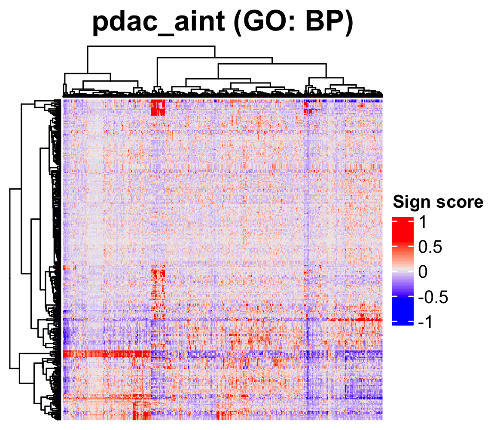
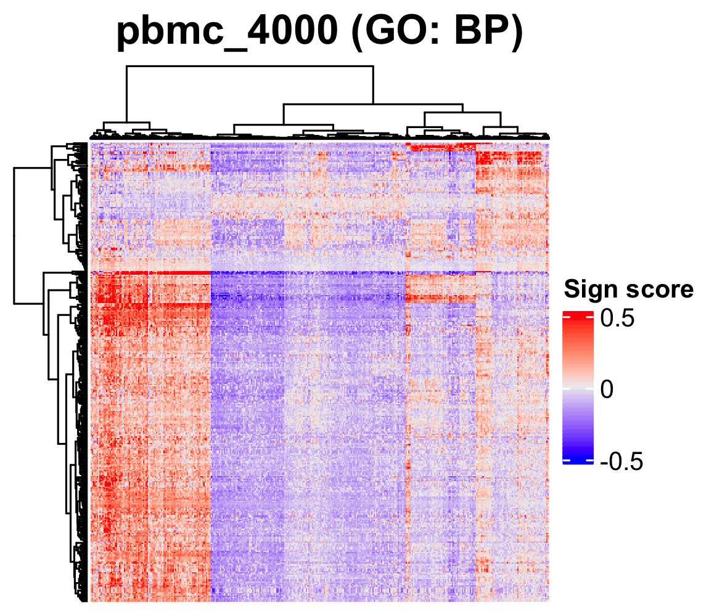
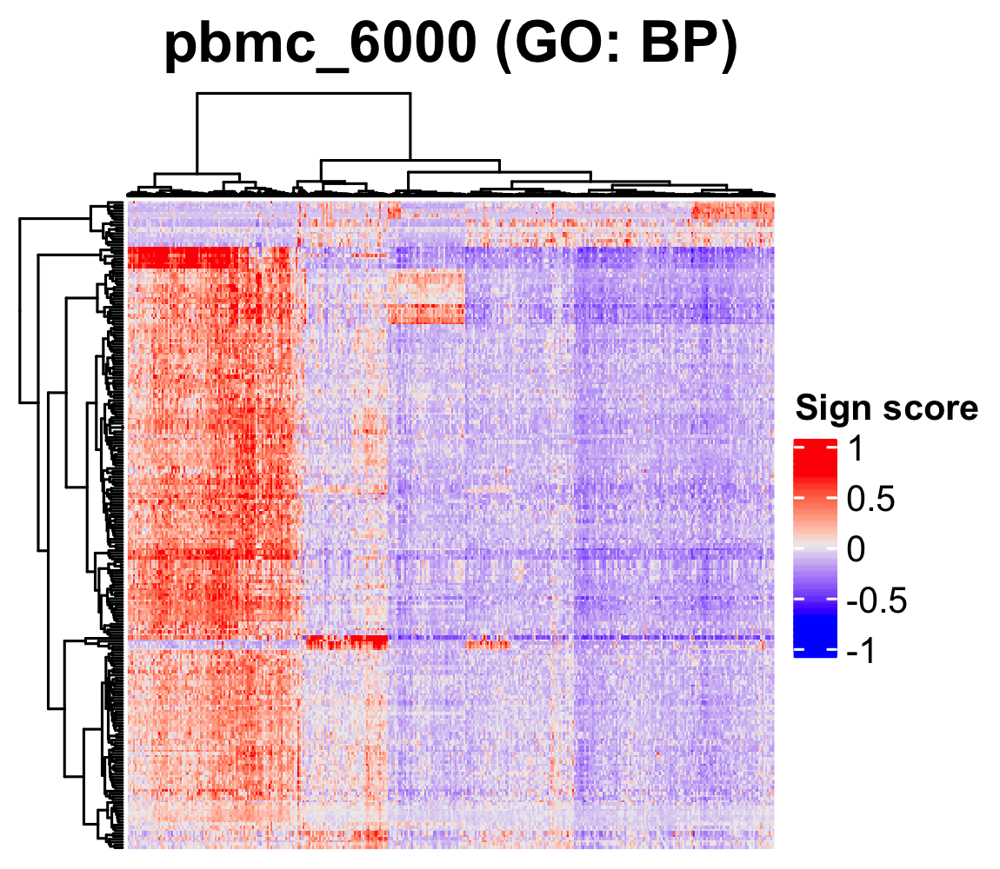

Save the objects.
```{r, eval = FALSE}
saveRDS(sc68_vehi_red, file = "backup/01_201_sc68_vehi_matrix_GO.rds")
saveRDS(sc68_cisp_red, file = "backup/02_201_sc68_cisp_matrix_GO.rds")
saveRDS(pdac_aint_red, file = "backup/07_201_pdac_aint_matrix_GO.rds")
saveRDS(pbmc_4000_red, file = "backup/10_201_pbmc_4000_matrix_GO.rds")
saveRDS(pbmc_6000_red, file = "backup/11_201_pbmc_6000_matrix_GO.rds")
```


## Dimensionality reduction
Load the objects.
```{r, eval = FALSE}
rm(list = ls())
source("R/plot.R")
source("R/function_asurat.R")
sc68_vehi <- readRDS(file = "backup/01_201_sc68_vehi_matrix_GO.rds")
sc68_cisp <- readRDS(file = "backup/02_201_sc68_cisp_matrix_GO.rds")
pdac_aint <- readRDS(file = "backup/07_201_pdac_aint_matrix_GO.rds")
pbmc_4000 <- readRDS(file = "backup/10_201_pbmc_4000_matrix_GO.rds")
pbmc_6000 <- readRDS(file = "backup/11_201_pbmc_6000_matrix_GO.rds")
```


### Principal component analysis (optional)
The following function `do_pca_sign()` performs principal component analysis
based on the sign-by-sample matrices of the input `data_type` and `category`.
```{r, eval = FALSE}
sc68_vehi <- do_pca_sign(obj = sc68_vehi, data_type = "GO", category = "BP")
sc68_cisp <- do_pca_sign(obj = sc68_cisp, data_type = "GO", category = "BP")
pdac_aint <- do_pca_sign(obj = pdac_aint, data_type = "GO", category = "BP")
pbmc_4000 <- do_pca_sign(obj = pbmc_4000, data_type = "GO", category = "BP")
pbmc_6000 <- do_pca_sign(obj = pbmc_6000, data_type = "GO", category = "BP")
```
The result is stored in `obj[["reduction"]][["pca"]][[data_type]][[category]]`.


### t-distributed stochastic neighbor embedding (optional)
The following function `do_tsne_sign()` performs `Rtsne()` in `Rtsne` package
based on the sign-by-sample matrices of the input `data_type` and `category`.
The arguments are `obj` (ASURAT object), `data_type`, `category`,
`pca_dim` (number of principal component used for t-SNE, in which `NULL` is
accepted if users would like to compute t-SNE from the original sample-by-sign
matrices), and `tsne_dim` (t-SNE dimension: either `2` or `3`).
```{r, eval = FALSE}
sc68_vehi <- do_tsne_sign(obj = sc68_vehi, data_type = "GO",
                          category = "BP", pca_dim = NULL, tsne_dim = 2)
pdac_aint <- do_tsne_sign(obj = pdac_aint, data_type = "GO",
                          category = "BP", pca_dim = NULL, tsne_dim = 2)
pbmc_4000 <- do_tsne_sign(obj = pbmc_4000, data_type = "GO",
                          category = "BP", pca_dim = NULL, tsne_dim = 2)
pbmc_6000 <- do_tsne_sign(obj = pbmc_6000, data_type = "GO",
                          category = "BP", pca_dim = NULL, tsne_dim = 2)
```
The result is stored in `obj[["reduction"]][["tsne"]][[data_type]][[category]]`.


### Uniform manifold approximation and projection (optional)
The following function `do_umap_sign()` performs `umap()` in `umap` package
based on the sign-by-sample matrices of the input `data_type` and `category`.
The arguments are `obj`, `data_type`, `category`,
`pca_dim` (number of principal component used for UMAP, in which `NULL` is
accepted if users would like to compute UMAP from the original sample-by-sign
matrices), and `umap_dim` (UMAP dimension: either `2` or `3`).

**Tips:**
If the resulting diffusion map is distorted by outliers, tuning of `pca_dim`
will be required.
```{r, eval = FALSE}
sc68_vehi <- do_umap_sign(obj = sc68_vehi, data_type = "GO",
                          category = "BP", pca_dim = 20, umap_dim = 2)
pdac_aint <- do_umap_sign(obj = pdac_aint, data_type = "GO",
                          category = "BP", pca_dim = 20, umap_dim = 2)
pbmc_4000 <- do_umap_sign(obj = pbmc_4000, data_type = "GO",
                          category = "BP", pca_dim = NULL, umap_dim = 2)
pbmc_6000 <- do_umap_sign(obj = pbmc_6000, data_type = "GO",
                          category = "BP", pca_dim = NULL, umap_dim = 2)
```
The result is stored in `obj[["reduction"]][["umap"]][[data_type]][[category]]`.


### Diffusion map (optional)
Diffusion map is not used in this section.
Please see [previous section](#cell_type) for the method.


### Visualization
The following functions `plot_tsne_sign()`, `plot_umap_sign()`, and
`plot_dmap_sign()` show sign-by-sample matrices in low dimensional space.
The space dimension is automatically given by `tsne_dim` used in
`do_tsne_sign()` for `plot_tsne_sign()` or `umap_dim` used in `do_umap_sign()`
for `plot_umap_sign()`, while manually given by `dims` for `plot_dmap_sign()`.
The arguments are `obj`, `data_type`, `category`, `algo_name = NULL`, `dims`
(dimension vector for the plot), `theta` (angle of view), and
`phi` (angle of view).
```{r, eval = FALSE}
# ----------------------------------------
# sc68_vehi
# ----------------------------------------
p <- plot_umap_sign(obj = sc68_vehi, data_type = "GO", category = "BP",
                    algo_name = NULL, theta = NULL, phi = NULL,
                    title = "sc68_vehi (GO: BP)", title_size = 18,
                    xlabel = "UMAP_1", ylabel = "UMAP_2", zlabel = NULL,
                    default_color = TRUE)
filename <- "figures/figure_01_0205.png"
ggsave(file = filename, plot = p, dpi = 300, width = 4.3, height = 4.5)
```

```{r, eval = FALSE, echo = FALSE, results = "hide"}
# ----------------------------------------
# pdac_aint
# ----------------------------------------
p <- plot_umap_sign(obj = pdac_aint, data_type = "GO", category = "BP",
                    algo_name = NULL, theta = NULL, phi = NULL,
                    title = "pdac_aint (GO: BP)", title_size = 18,
                    xlabel = "UMAP_1", ylabel = "UMAP_2", zlabel = NULL,
                    default_color = TRUE)
filename <- "figures/figure_07_0205.png"
ggsave(file = filename, plot = p, dpi = 300, width = 4.3, height = 4.5)
# ----------------------------------------
# pbmc_4000
# ----------------------------------------
p <- plot_umap_sign(obj = pbmc_4000, data_type = "GO", category = "BP",
                    algo_name = NULL, theta = NULL, phi = NULL,
                    title = "pbmc_4000 (GO: BP)", title_size = 18,
                    xlabel = "UMAP_1", ylabel = "UMAP_2", zlabel = NULL,
                    default_color = TRUE)
filename <- "figures/figure_10_0205.png"
ggsave(file = filename, plot = p, dpi = 300, width = 4.3, height = 4.5)
# ----------------------------------------
# pbmc_6000
# ----------------------------------------
p <- plot_umap_sign(obj = pbmc_6000, data_type = "GO", category = "BP",
                    algo_name = NULL, theta = NULL, phi = NULL,
                    title = "pbmc_6000 (GO: BP)", title_size = 18,
                    xlabel = "UMAP_1", ylabel = "UMAP_2", zlabel = NULL,
                    default_color = TRUE)
filename <- "figures/figure_11_0205.png"
ggsave(file = filename, plot = p, dpi = 300, width = 4.3, height = 4.5)
```


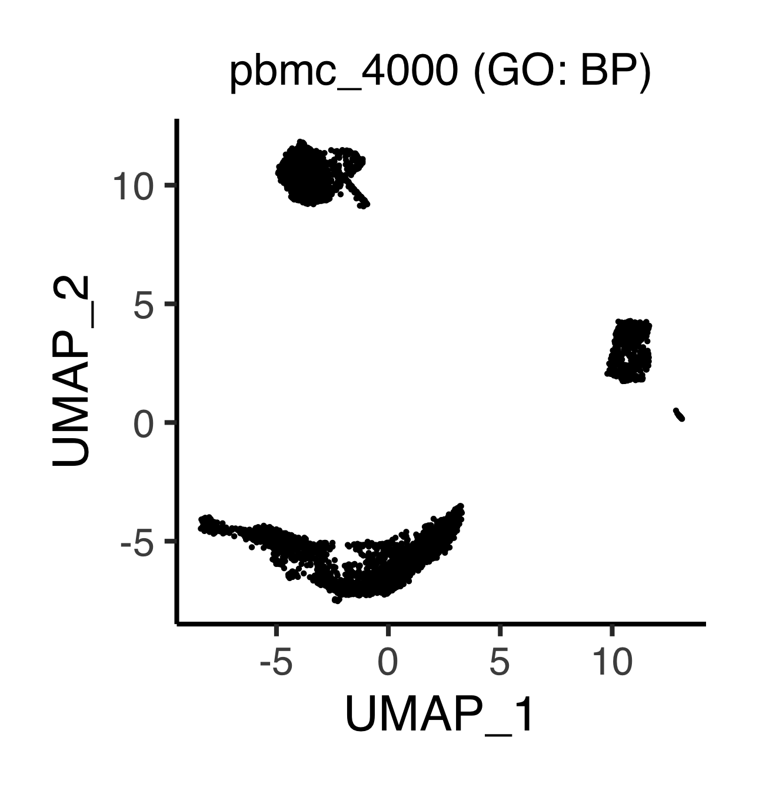
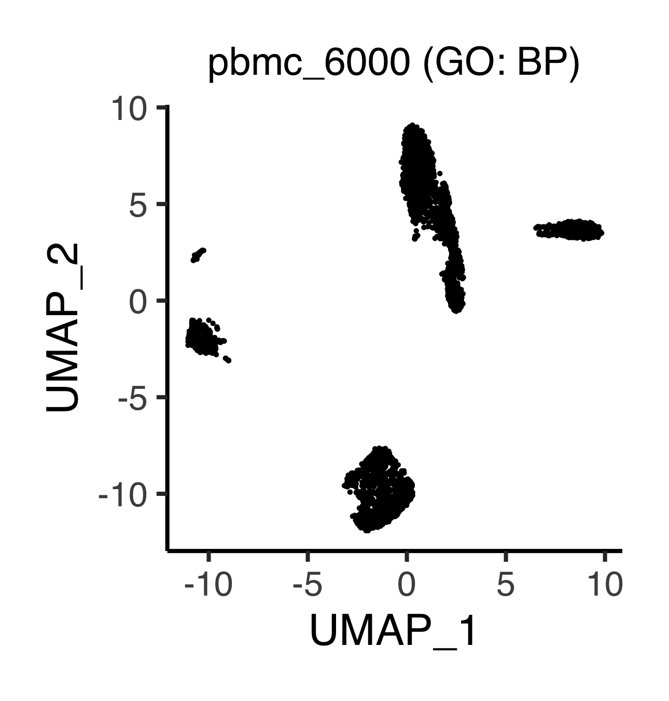


### Save results.
Save the objects.
```{r, eval = FALSE}
saveRDS(sc68_vehi, file = "backup/01_202_sc68_vehi_reduction_GO.rds")
saveRDS(sc68_cisp, file = "backup/02_202_sc68_cisp_reduction_GO.rds")
saveRDS(pdac_aint, file = "backup/07_202_pdac_aint_reduction_GO.rds")
saveRDS(pbmc_4000, file = "backup/10_202_pbmc_4000_reduction_GO.rds")
saveRDS(pbmc_6000, file = "backup/11_202_pbmc_6000_reduction_GO.rds")
```


## Cell clustering
Load the data.
```{r, eval = FALSE}
source("R/plot.R")
source("R/function_asurat.R")
sc68_vehi <- readRDS(file = "backup/01_202_sc68_vehi_reduction_GO.rds")
pdac_aint <- readRDS(file = "backup/07_202_pdac_aint_reduction_GO.rds")
pbmc_4000 <- readRDS(file = "backup/10_202_pbmc_4000_reduction_GO.rds")
pbmc_6000 <- readRDS(file = "backup/11_202_pbmc_6000_reduction_GO.rds")
```

Here users can choose one of the following unsupervised clustering methods.


### Partitioning around medoids (PAM) (optional)
The following function `cluster_samples_pam_sign()` performs `pam()` in
`cluster` package.
The arguments are `obj`, `data_type`, `category`, and `k` (argument of `pam()`).
```{r, eval = FALSE}
# pdac_aint <- cluster_samples_pam_sign(
#   obj = pdac_aint, data_type = "GO",category = "BP", k = 4)

#
# Below is a memo for plotting the result.
#
# mat <- pdac_aint[["reduction"]][["tsne"]][["GO"]][["BP"]]$Y
# lab <- pdac_aint[["sample"]][["pam_GO_BP"]]
# col <- rainbow(length(unique(lab)))
# plot(mat, pch=21, bg=col[lab])
# legend("bottomright", legend=unique(sort(lab)), pch=21, pt.bg=col)
```
The results are stored in
`obj[["clustering"]][["pam"]][[data_type]][[category]]` and
`obj[["sample"]][["pam_data_type_category"]]`.


### Hierarchical clustering and cutting tree (optional)
The following function `cluster_samples_hclustCutree_sign()` performs
`hclust()` and `cutree()` in `stats` package.
The arguments are `obj`, `data_type`, `category`, `method`
(argument of `hclust()`) and `k` (argument of `cutree()`).
```{r, eval = FALSE}
# pdac_aint <- cluster_samples_hclustCutree_sign(
#   obj = pdac_aint, data_type = "GO", category = "BP",
#   method = "ward.D2", k = 3)

#
# Below is a memo for plotting the result.
#
# mat <- pdac_aint[["reduction"]][["tsne"]][["GO"]][["BP"]]$Y
# lab <- pdac_aint[["sample"]][["hclustCutree_GO_BP"]]
# col <- rainbow(length(unique(lab)))
# plot(mat, pch=21, bg=col[lab])
# legend("bottomright", legend=unique(sort(lab)), pch=21, pt.bg=col)
```
The results are stored in
`obj[["clustering"]][["hclustCutree"]][[data_type]][[category]]` and
`obj[["sample"]][["hclustCutree_data_type_category"]]`.


### Community detection algorithm with k-nearest neighbor (KNN) graph (optional)
The following function `cluster_samples_seuratFindClusters_sign()` performs
`CreateSeuratObject()`, `ScaleData()`, `RunPCA()`, `FindNeighbors()`, and
`FindClusters()` in `Seurat` package.
The arguments are `obj`, `data_type`, `category`, `reduction`, `dims`,
`k.param`, `prune.SNN`, `resolution`, and `algorithm`, where the latter six
parameters are used in `FindNeighbors()` and `FindClusters()`.
```{r, eval = FALSE}
sc68_vehi <- cluster_samples_seuratFindClusters_sign(
  obj = sc68_vehi, data_type = "GO", category = "BP", reduction = "pca",
  dims = 1:40, k.param = 10, prune.SNN = 1./15, resolution = 0.05,
  algorithm = 1)

pdac_aint <- cluster_samples_seuratFindClusters_sign(
  obj = pdac_aint, data_type = "GO", category = "BP", reduction = "pca",
  dims = 1:15, k.param = 10, prune.SNN = 1./15, resolution = 0.20,
  algorithm = 1)

pbmc_4000 <- cluster_samples_seuratFindClusters_sign(
  obj = pbmc_4000, data_type = "GO", category = "BP", reduction = "pca",
  dims = 1:20, k.param = 10, prune.SNN = 1./15, resolution = 0.10,
  algorithm = 1)

pbmc_6000 <- cluster_samples_seuratFindClusters_sign(
  obj = pbmc_6000, data_type = "GO", category = "BP", reduction = "pca",
  dims = 1:20, k.param = 10, prune.SNN = 1./15, resolution = 0.08,
  algorithm = 1)

#
# Below is a memo for plotting the result.
#
# mat <- pdac_aint[["reduction"]][["umap"]][["GO"]][["BP"]][["layout"]]
# lab <- pdac_aint[["sample"]][["seuratFindClusters_GO_BP"]]
# col <- rainbow(length(unique(lab)))
# plot(mat, pch=21, bg=col[lab])
# legend("bottomright", legend=unique(sort(lab)), pch=21, pt.bg=col)
```
The results are stored in
`obj[["sample"]][["seuratFindClusters_data_type_category"]]` and
`obj[["clustering"]][["seuratFindClusters"]][[data_type]][[category]]`.


### Clustering by branch detection along pseudotime (optional)
Branch-based clustering is not used in this section.
Please see [previous section](#cell_type) for the method.


### Save data
Save the objects.
```{r, eval = FALSE}
saveRDS(sc68_vehi, file = "backup/01_203_sc68_vehi_clustering_GO.rds")
saveRDS(pdac_aint, file = "backup/07_203_pdac_aint_clustering_GO.rds")
saveRDS(pbmc_4000, file = "backup/10_203_pbmc_4000_clustering_GO.rds")
saveRDS(pbmc_6000, file = "backup/11_203_pbmc_6000_clustering_GO.rds")
```

Load the data.
```{r, eval = FALSE}
sc68_vehi <- readRDS(file = "backup/01_203_sc68_vehi_clustering_GO.rds")
pdac_aint <- readRDS(file = "backup/07_203_pdac_aint_clustering_GO.rds")
pbmc_4000 <- readRDS(file = "backup/10_203_pbmc_4000_clustering_GO.rds")
pbmc_6000 <- readRDS(file = "backup/11_203_pbmc_6000_clustering_GO.rds")
```


## Visualize clustering results
In this subsection, the clustering results are visualized.

The following function `plot_Heatmap_SignxSamp()` visualizes the result of
sample clustering by identifying `algo_name` (in the current version,
one of `"pam"`, `"hclustCutree"`, `"seuratFindClusters"`, and `"merlot"`).
```{r, eval = FALSE}
# ----------------------------------------
# sc68_vehi
# ----------------------------------------
filename <- "figures/figure_01_0230.png"
png(file = filename, height = 1000, width = 1400, res = 300)
plot_Heatmap_SignxSamp(obj = sc68_vehi, data_type = "GO", category = "BP",
                       algo_name = "seuratFindClusters", method = "ward.D2",
                       show_nReads = FALSE, title = "sc68_vehi (GO: BP)",
                       name = "Sign score",
                       show_rownames_sign = FALSE, show_rownames_label = FALSE,
                       show_rownames_nReads = FALSE, default_color = FALSE)
dev.off()
```

```{r, eval = FALSE, echo = FALSE, results = "hide"}
# ----------------------------------------
# pdac_aint
# ----------------------------------------
filename <- "figures/figure_07_0230.png"
png(file = filename, height = 1000, width = 1400, res = 300)
plot_Heatmap_SignxSamp(obj = pdac_aint, data_type = "GO", category = "BP",
                       algo_name = "seuratFindClusters", method = "ward.D2",
                       show_nReads = FALSE, title = "pdac_aint (GO: BP)",
                       name = "Sign score",
                       show_rownames_sign = FALSE, show_rownames_label = FALSE,
                       show_rownames_nReads = FALSE, default_color = FALSE)
dev.off()
# ----------------------------------------
# pbmc_4000
# ----------------------------------------
filename <- "figures/figure_10_0230.png"
png(file = filename, height = 1000, width = 1400, res = 300)
plot_Heatmap_SignxSamp(obj = pbmc_4000, data_type = "GO", category = "BP",
                       algo_name = "seuratFindClusters", method = "ward.D2",
                       show_nReads = FALSE, title = "pbmc_4000 (GO: BP)",
                       name = "Sign score",
                       show_rownames_sign = FALSE, show_rownames_label = FALSE,
                       show_rownames_nReads = FALSE, default_color = FALSE)
dev.off()
# ----------------------------------------
# pbmc_6000
# ----------------------------------------
filename <- "figures/figure_11_0230.png"
png(file = filename, height = 1000, width = 1400, res = 300)
plot_Heatmap_SignxSamp(obj = pbmc_6000, data_type = "GO", category = "BP",
                       algo_name = "seuratFindClusters", method = "ward.D2",
                       show_nReads = FALSE, title = "pbmc_6000 (GO: BP)",
                       name = "Sign score",
                       show_rownames_sign = FALSE, show_rownames_label = FALSE,
                       show_rownames_nReads = FALSE, default_color = FALSE)
dev.off()
```

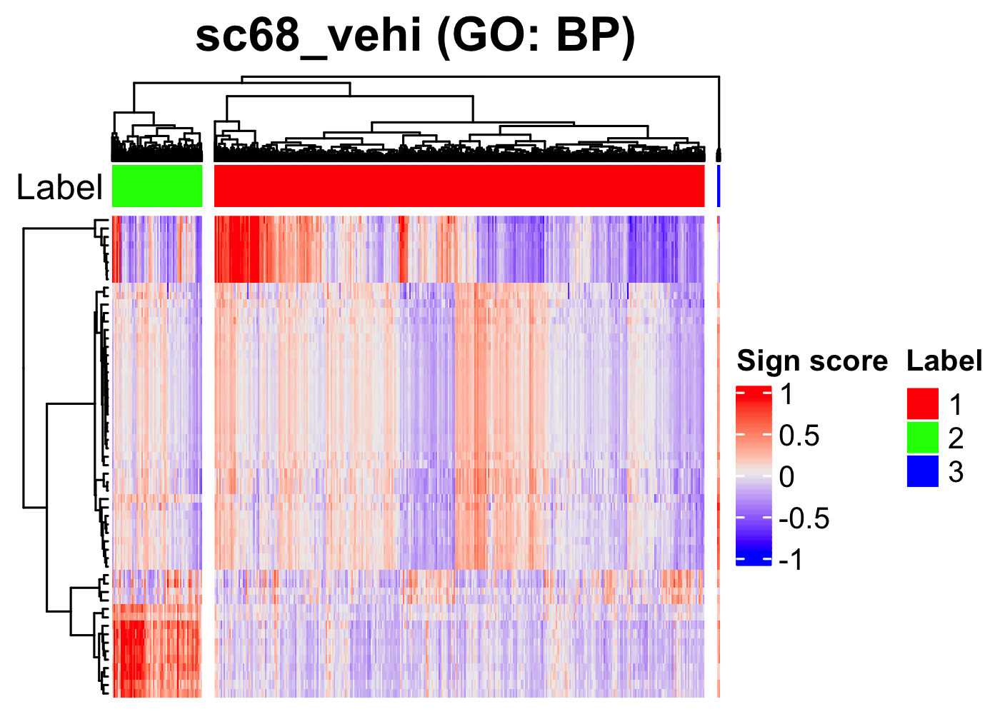
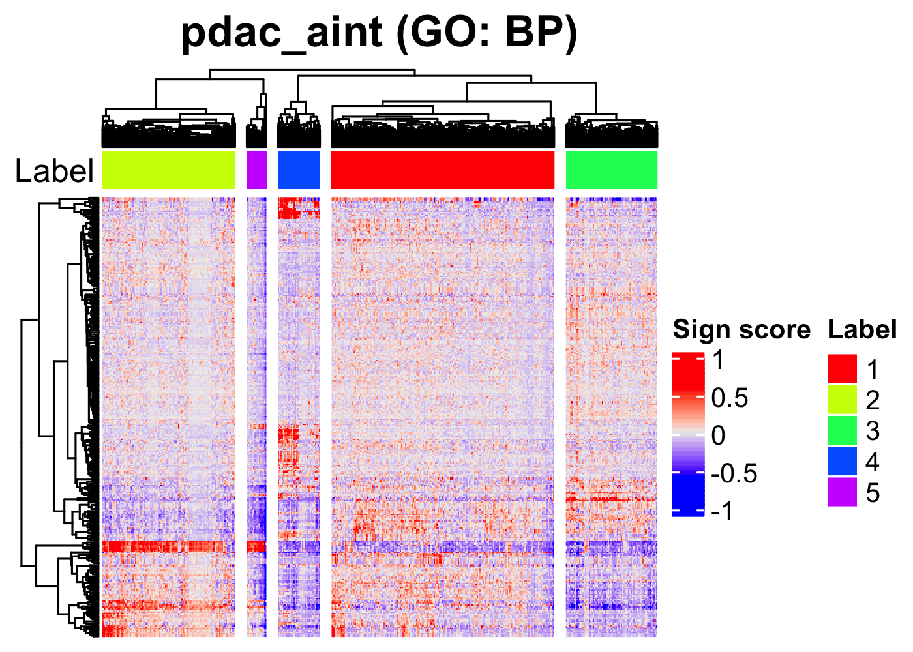


```{r, eval = FALSE}
# ----------------------------------------
# sc68_vehi
# ----------------------------------------
p <- plot_umap_sign(obj = sc68_vehi, data_type = "GO", category = "BP",
                    algo_name = "seuratFindClusters",
                    theta = NULL, phi = NULL,
                    title = "sc68_vehi (GO: BP)", title_size = 16,
                    xlabel = "UMAP_1", ylabel = "UMAP_2", zlabel = NULL,
                    default_color = FALSE)
filename <- "figures/figure_01_0231.png"
ggsave(file = filename, plot =  p, dpi = 300, width = 4.9, height = 4)
```

```{r, eval = FALSE, echo = FALSE, results = "hide"}
# ----------------------------------------
# pdac_aint
# ----------------------------------------
p <- plot_umap_sign(obj = pdac_aint, data_type = "GO", category = "BP",
                    algo_name = "seuratFindClusters",
                    theta = NULL, phi = NULL,
                    title = "pdac_aint (GO: BP)", title_size = 16,
                    xlabel = "UMAP_1", ylabel = "UMAP_2", zlabel = NULL,
                    default_color = FALSE)
filename <- "figures/figure_07_0231.png"
ggsave(file = filename, plot =  p, dpi = 300, width = 4.7, height = 4)
# ----------------------------------------
# pbmc_4000
# ----------------------------------------
p <- plot_umap_sign(obj = pbmc_4000, data_type = "GO", category = "BP",
                    algo_name = "seuratFindClusters",
                    theta = NULL, phi = NULL,
                    title = "pbmc_4000 (GO: BP)", title_size = 16,
                    xlabel = "UMAP_1", ylabel = "UMAP_2", zlabel = NULL,
                    default_color = FALSE)
filename <- "figures/figure_10_0231.png"
ggsave(file = filename, plot =  p, dpi = 300, width = 4.7, height = 4)
# ----------------------------------------
# pbmc_6000
# ----------------------------------------
p <- plot_umap_sign(obj = pbmc_6000, data_type = "GO", category = "BP",
                    algo_name = "seuratFindClusters",
                    theta = NULL, phi = NULL,
                    title = "pbmc_6000 (GO: BP)", title_size = 16,
                    xlabel = "UMAP_1", ylabel = "UMAP_2", zlabel = NULL,
                    default_color = FALSE)
filename <- "figures/figure_11_0231.png"
ggsave(file = filename, plot =  p, dpi = 250, width = 4.7, height = 4)
```


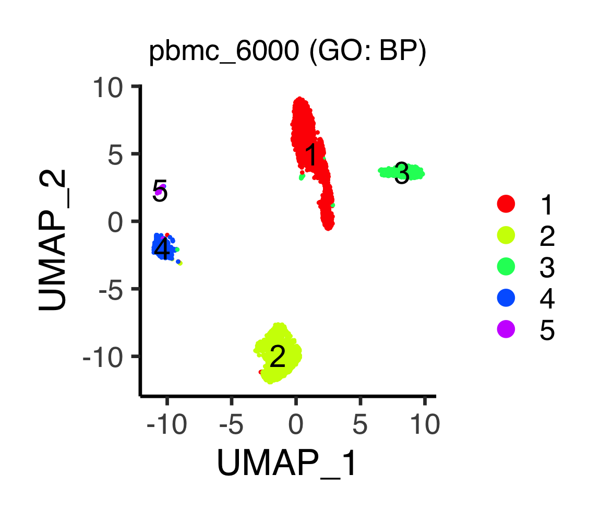

The following command shows the number of cells per cluster visualized
using bar graph.
```{r, eval = FALSE}
# ----------------------------------------
# sc68_vehi
# ----------------------------------------
p <- plot_bargraph_sign(obj = sc68_vehi, data_type = "GO", category = "BP",
                        algo_name = "seuratFindClusters",
                        title = "sc68_vehi", title_size = 20,
                        xlabel = "Label (GO: BP)",
                        ylabel = "Number of samples", ymax = 3500)
filename <- "figures/figure_01_0235.png"
ggsave(file = filename, plot = p, dpi = 300, width = 4.3, height = 4)
```

```{r, eval = FALSE, echo = FALSE, results = "hide"}
# ----------------------------------------
# pdac_aint
# ----------------------------------------
p <- plot_bargraph_sign(obj = pdac_aint, data_type = "GO", category = "BP",
                        algo_name = "seuratFindClusters",
                        title = "pdac_aint", title_size = 20,
                        xlabel = "Label (GO: BP)",
                        ylabel = "Number of samples", ymax = 1200)
filename <- "figures/figure_07_0235.png"
ggsave(file = filename, plot = p, dpi = 300, width = 4.3, height = 4)
# ----------------------------------------
# pbmc_4000
# ----------------------------------------
p <- plot_bargraph_sign(obj = pbmc_4000, data_type = "GO", category = "BP",
                        algo_name = "seuratFindClusters",
                        title = "pbmc_4000", title_size = 20,
                        xlabel = "Label (GO: BP)",
                        ylabel = "Number of samples", ymax = 2000)
filename <- "figures/figure_10_0235.png"
ggsave(file = filename, plot = p, dpi = 300, width = 4.3, height = 4)
# ----------------------------------------
# pbmc_6000
# ----------------------------------------
p <- plot_bargraph_sign(obj = pbmc_6000, data_type = "GO", category = "BP",
                        algo_name = "seuratFindClusters",
                        title = "pbmc_6000", title_size = 20,
                        xlabel = "Label (GO: BP)",
                        ylabel = "Number of samples", ymax = 2500)
filename <- "figures/figure_11_0235.png"
ggsave(file = filename, plot = p, dpi = 300, width = 4.3, height = 4)
```


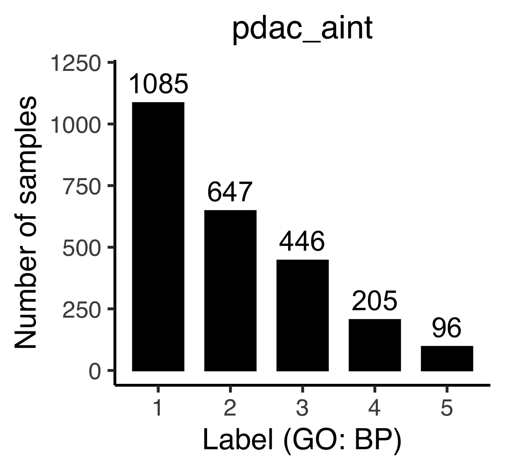


## Find significant signs
### Compute separation indices
In this subsection, signs with sign scores being specifically upregulated in
some cluster are detected by computing the separation indices (sep_I), i.e.,
non-parametric measure of degree in separation of two random variable sets
(see our paper for the definition).
The concept of significant sign is similar to that of differentially expressed
genes (DEGs).

Load the data.
```{r, eval = FALSE}
source("R/plot.R")
source("R/function_asurat.R")
sc68_vehi <- readRDS(file = "backup/01_203_sc68_vehi_clustering_GO.rds")
pdac_aint <- readRDS(file = "backup/07_203_pdac_aint_clustering_GO.rds")
pbmc_4000 <- readRDS(file = "backup/10_203_pbmc_4000_clustering_GO.rds")
pbmc_6000 <- readRDS(file = "backup/11_203_pbmc_6000_clustering_GO.rds")
```

The following function `auto_find_marker_sign()` computes separation indices
of signs of interest for each subpopulation.
The arguments are `obj`,
`data_type_for_label` (`data_type` used for sample clustering),
`category_for_label` (`category` used for sample clustering),
`algo_name_for_label` (`algo_name` used for sample clustering),
`data_type_for_expr` (`data_type` that the signs of interest belong to),
`category_for_expr` (`category` that the signs of interest belong to).
This function helps users find positive and negative marker signs of `label_1`
with the positive and negative values of the indices, respectively.
```{r, eval = FALSE}
sc68_vehi <- auto_find_marker_sign(obj = sc68_vehi, data_type_for_label = "GO",
                                   category_for_label = "BP",
                                   algo_name_for_label = "seuratFindClusters",
                                   data_type_for_expr = "GO",
                                   category_for_expr = "BP")
pdac_aint <- auto_find_marker_sign(obj = pdac_aint, data_type_for_label = "GO",
                                   category_for_label = "BP",
                                   algo_name_for_label = "seuratFindClusters",
                                   data_type_for_expr = "GO",
                                   category_for_expr = "BP")
pbmc_4000 <- auto_find_marker_sign(obj = pbmc_4000, data_type_for_label = "GO",
                                   category_for_label = "BP",
                                   algo_name_for_label = "seuratFindClusters",
                                   data_type_for_expr = "GO",
                                   category_for_expr = "BP")
pbmc_6000 <- auto_find_marker_sign(obj = pbmc_6000, data_type_for_label = "GO",
                                   category_for_label = "BP",
                                   algo_name_for_label = "seuratFindClusters",
                                   data_type_for_expr = "GO",
                                   category_for_expr = "BP")
```
The results are stored in
`obj[["marker"]][[data_type_for_expr]][[category_for_expr]]`.
Here `sep_I` stands for separation indices of signs, which quantifies the
extent of separation between two different sets of random variables.

Note that `auto_find_marker_sign()` computes `sep_I` for a given group versus
all other cells.
On the other hand, to compute `sep_I` for given two groups, e.g.,
groups 1 versus 2, run function `find_marker_sign()` as follows:
```{r, eval = FALSE}
pdac_aint <- find_marker_sign(obj = pdac_aint, data_type_for_label = "GO",
                              category_for_label = "BP",
                              algo_name_for_label = "seuratFindClusters",
                              data_type_for_expr = "GO",
                              category_for_expr = "BP",
                              labels_1 = 1, labels_2 = 2)
```
The results are stored in
`obj[["marker"]][[data_type_for_expr]][[category_for_expr]]` such as
`obj[["marker"]][["GO"]][["BP"]][["Label_GO_BP_1_vs_2"]]`.

To detect differentially expressed genes, users can use our similar functions
`find_marker_gene()` and `auto_find_marker_gene()`, which perform multiple
statistical tests for comparing two groups using normalized read counts, i.e.,
`obj[["data"]][["normalized"]]`.
The arguments of `find_marker_gene()` are `obj`, `data_type_for_label`,
`category_for_label`, `algo_name_for_label`, `labels_1`, `labels_2`, and
`parametric` (`TRUE` or `FALSE` for `t.test()` or `wilcox.exact()`, resp.).
The arguments of `auto_find_marker_gene()` are `obj`, `data_type_for_label`,
`category_for_label`, `algo_name_for_label`, and `parametric`
(`TRUE` or `FALSE` for `t.test()` or `wilcox.exact()`, resp.).
For example,
```{r, eval = FALSE}
pdac_aint <- auto_find_marker_gene(obj = pdac_aint, data_type_for_label = "GO",
                                   category_for_label = "BP",
                                   algo_name_for_label = "seuratFindClusters",
                                   parametric = FALSE)
```
The results are stored in
`obj[["marker"]][["gene"]][[data_type_for_expr]][[category_for_expr]]`.

```{r, eval = FALSE}
datatable(sc68_vehi[["marker"]][["GO"]][["BP"]][["all"]], rownames = FALSE)
datatable(pdac_aint[["marker"]][["GO"]][["BP"]][["all"]], rownames = FALSE)
datatable(pbmc_4000[["marker"]][["GO"]][["BP"]][["all"]], rownames = FALSE)
datatable(pbmc_6000[["marker"]][["GO"]][["BP"]][["all"]], rownames = FALSE)
```

* `sc68_vehi`

<iframe src="figures/sc68_vehi_GO_BP.html" style="width:100%; height:400px;"></iframe>

<br><br><br><br><br><br><br><br><br><br>

* `pdac_aint`

<iframe src="figures/pdac_aint_GO_BP.html" style="width:100%; height:400px;"></iframe>

<br><br><br><br><br><br><br><br><br><br>

* `pbmc_4000`

<iframe src="figures/pbmc_4000_GO_BP.html" style="width:100%; height:400px;"></iframe>

<br><br><br><br><br><br><br><br><br><br>

* `pbmc_6000`

<iframe src="figures/pbmc_6000_GO_BP.html" style="width:100%; height:400px;"></iframe>

<br><br><br><br><br><br><br><br><br><br>

Save the objects.
```{r, eval = FALSE}
saveRDS(sc68_vehi, file = "backup/01_204_sc68_vehi_DES_GO.rds")
saveRDS(pdac_aint, file = "backup/07_204_pdac_aint_DES_GO.rds")
saveRDS(pbmc_4000, file = "backup/10_204_pbmc_4000_DES_GO.rds")
saveRDS(pbmc_6000, file = "backup/11_204_pbmc_6000_DES_GO.rds")
```

Load the data.
```{r, eval = FALSE}
sc68_vehi <- readRDS(file = "backup/01_204_sc68_vehi_DES_GO.rds")
pdac_aint <- readRDS(file = "backup/07_204_pdac_aint_DES_GO.rds")
pbmc_4000 <- readRDS(file = "backup/10_204_pbmc_4000_DES_GO.rds")
pbmc_6000 <- readRDS(file = "backup/11_204_pbmc_6000_DES_GO.rds")
```


### Investigate sign scores
The following function `plot_violin_signScore()` shows distribution of
sign scores across all the clusters by violin plots.
The arguments are `obj`, `sign_name` (sign ID),
`data_type_for_label` (`data_type` used for sample clustering),
`category_for_label` (`category` used for sample clustering),
`algo_name_for_label` (`algo_name` used for sample clustering),
`data_type_for_expr` (`data_type` that the signs of interest belong to),
`category_for_expr` (`category` that the signs of interest belong to).
```{r, eval = FALSE}
# ----------------------------------------
# sc68_vehi
# ----------------------------------------
p <- plot_violin_signScore(
  obj = sc68_vehi, sign_name = "GO:0033044_S",
  data_type_for_label = "GO", category_for_label = "BP",
  algo_name_for_label = "seuratFindClusters",
  data_type_for_expr = "GO", category_for_expr = "BP",
  title = "GO:0033044_S\nReg..chromosome organization\n(CDC20/CENPF/..)",
  title_size = 16, default_color = FALSE)
filename <- "figures/figure_01_0240.png"
ggsave(file = filename, plot = p, dpi = 300, width = 4, height = 4)
```

```{r, eval = FALSE, echo = FALSE, results = "hide"}
# ----------------------------------------
# pdac_aint
# ----------------------------------------
p <- plot_violin_signScore(
  obj = pdac_aint, sign_name = "GO:0090090_V",
  data_type_for_label = "GO", category_for_label = "BP",
  algo_name_for_label = "seuratFindClusters",
  data_type_for_expr = "GO", category_for_expr = "BP",
  title = "GO:0090090_V\nNegative reg..Wnt signal..\n(AMFR/DVL1/..)",
  title_size = 16, default_color = FALSE)
filename <- "figures/figure_07_0240.png"
ggsave(file = filename, plot = p, dpi = 300, width = 4, height = 4)

p <- plot_violin_signScore(
  obj = pdac_aint, sign_name = "GO:0030857_S",
  data_type_for_label = "GO", category_for_label = "BP",
  algo_name_for_label = "seuratFindClusters",
  data_type_for_expr = "GO", category_for_expr = "BP",
  title = "GO:0030857_S\nNegative reg..epithelial cell diff..\n(REG3A/GSK3B/..)",
  title_size = 16, default_color = FALSE)
filename <- "figures/figure_07_0241.png"
ggsave(file = filename, plot = p, dpi = 300, width = 4, height = 4)
# ----------------------------------------
# pbmc_4000
# ----------------------------------------
p <- plot_violin_signScore(
  obj = pbmc_4000, sign_name = "GO:0051092_S",
  data_type_for_label = "GO", category_for_label = "BP",
  algo_name_for_label = "seuratFindClusters",
  data_type_for_expr = "GO", category_for_expr = "BP",
  title = "GO:0051092_S\nPositive reg..NF-kappa..\n(NPM1/RPS3/..)",
  title_size = 16, default_color = FALSE)
filename <- "figures/figure_10_0240.png"
ggsave(file = filename, plot = p, dpi = 300, width = 4, height = 4)

p <- plot_violin_signScore(
  obj = pbmc_4000, sign_name = "GO:0051092_V",
  data_type_for_label = "GO", category_for_label = "BP",
  algo_name_for_label = "seuratFindClusters",
  data_type_for_expr = "GO", category_for_expr = "BP",
  title = "GO:0051092_V\nPositive reg..NF-kappa..\n(S100A9/CD36/..)",
  title_size = 16, default_color = FALSE)
filename <- "figures/figure_10_0241.png"
ggsave(file = filename, plot = p, dpi = 300, width = 4, height = 4)

p <- plot_violin_signScore(
  obj = pbmc_4000, sign_name = "GO:0001914_S",
  data_type_for_label = "GO", category_for_label = "BP",
  algo_name_for_label = "seuratFindClusters",
  data_type_for_expr = "GO", category_for_expr = "BP",
  title = "GO:0001914_S\nReg..T cell mediated..\n(PTPRC/IL7R/..)",
  title_size = 16, default_color = FALSE)
filename <- "figures/figure_10_0242.png"
ggsave(file = filename, plot = p, dpi = 300, width = 4, height = 4)

p <- plot_violin_signScore(
  obj = pbmc_4000, sign_name = "GO:0050853_V",
  data_type_for_label = "GO", category_for_label = "BP",
  algo_name_for_label = "seuratFindClusters",
  data_type_for_expr = "GO", category_for_expr = "BP",
  title = "GO:0050853_V\nB cell differentiation\n(CD19/CD79B/..)",
  title_size = 16, default_color = FALSE)
filename <- "figures/figure_10_0243.png"
ggsave(file = filename, plot = p, dpi = 300, width = 4, height = 4)

p <- plot_violin_signScore(
  obj = pbmc_4000, sign_name = "GO:0002755_V",
  data_type_for_label = "GO", category_for_label = "BP",
  algo_name_for_label = "seuratFindClusters",
  data_type_for_expr = "GO", category_for_expr = "BP",
  title = "GO:0002755_V\nMyD88-dependent toll-like..\n(UBC/UBB/..)",
  title_size = 16, default_color = FALSE)
filename <- "figures/figure_10_0244.png"
ggsave(file = filename, plot = p, dpi = 300, width = 4, height = 4)
# ----------------------------------------
# pbmc_6000
# ----------------------------------------
p <- plot_violin_signScore(
  obj = pbmc_6000, sign_name = "GO:0050852_V",
  data_type_for_label = "GO", category_for_label = "BP",
  algo_name_for_label = "seuratFindClusters",
  data_type_for_expr = "GO", category_for_expr = "BP",
  title = "GO:0050852_V\nT cell receptor signaling..\n(CD3E/CD247/..)",
  title_size = 16, default_color = FALSE)
filename <- "figures/figure_11_0240.png"
ggsave(file = filename, plot = p, dpi = 300, width = 4, height = 4)

p <- plot_violin_signScore(
  obj = pbmc_6000, sign_name = "GO:0030224_S",
  data_type_for_label = "GO", category_for_label = "BP",
  algo_name_for_label = "seuratFindClusters",
  data_type_for_expr = "GO", category_for_expr = "BP",
  title = "GO:0030224_S\nMonocyte differentiation\n(MEF2C/CD74/..)",
  title_size = 16, default_color = FALSE)
filename <- "figures/figure_11_0241.png"
ggsave(file = filename, plot = p, dpi = 300, width = 4, height = 4)

p <- plot_violin_signScore(
  obj = pbmc_6000, sign_name = "GO:0002577_V",
  data_type_for_label = "GO", category_for_label = "BP",
  algo_name_for_label = "seuratFindClusters",
  data_type_for_expr = "GO", category_for_expr = "BP",
  title = "GO:0002577_V\nReg..antigen process..\n(HLA-DOB/CCR7/..)",
  title_size = 16, default_color = FALSE)
filename <- "figures/figure_11_0242.png"
ggsave(file = filename, plot = p, dpi = 300, width = 4, height = 4)
```

* `sc68_vehi`

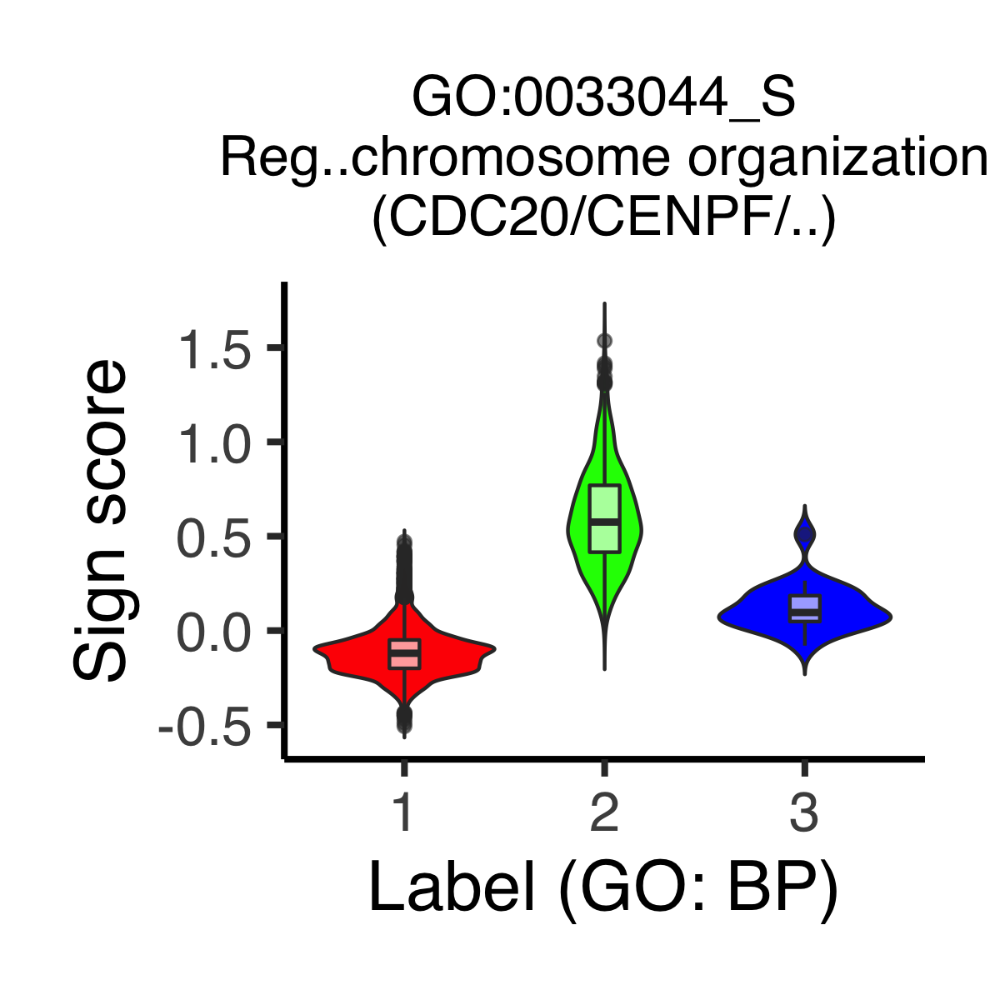

* `pdac_aint`


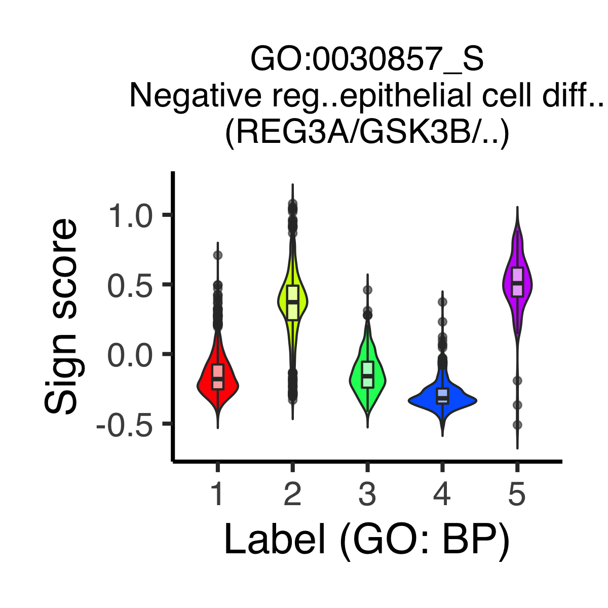

* `pbmc_4000`


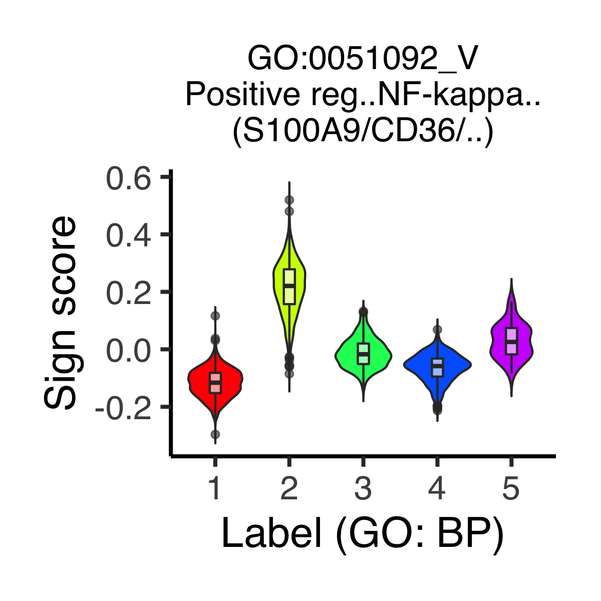


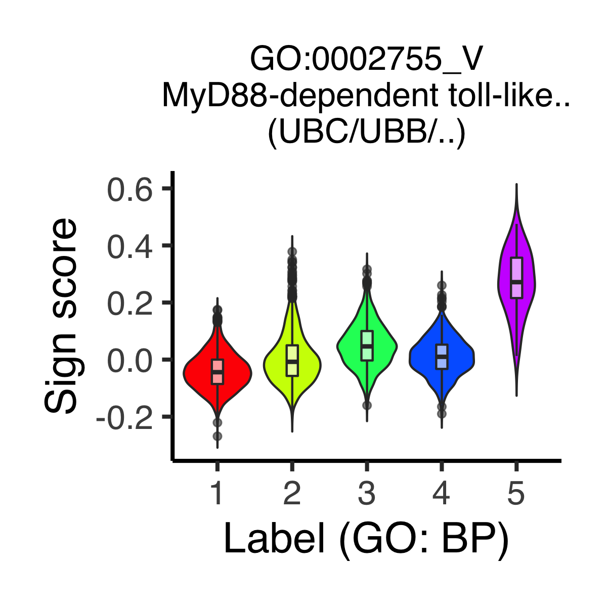

* `pbmc_6000`


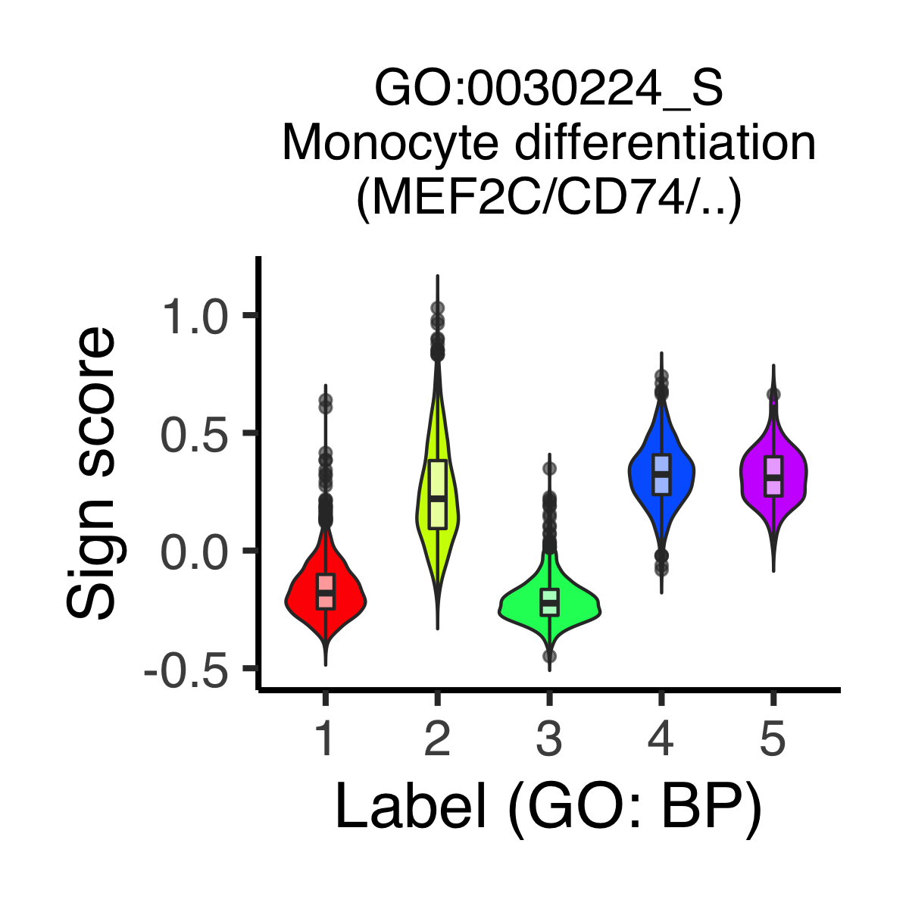
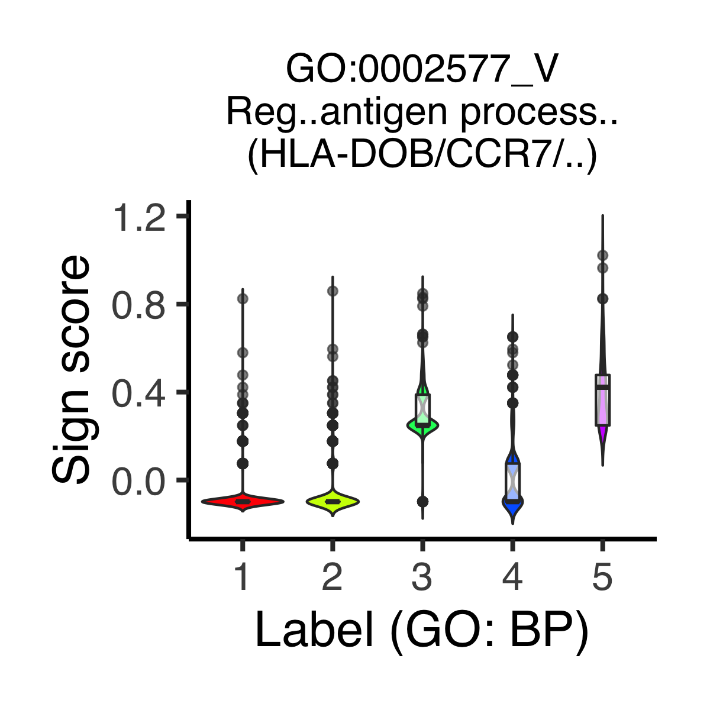

The functions `plot_tsne_signScore()`, `plot_umap_signScore()`, and
`plot_dmap_signScore()` show sign scores of a given sign on t-SNE, UMAP, and
diffusion map spaces, respectively.
The arguments are `obj`, `sign_name` (sign ID),
`data_type_for_label` (`data_type` used for sample clustering),
`category_for_label` (`category` used for sample clustering),
`data_type_for_expr` (`data_type` that the signs of interest belong to),
`category_for_expr` (`category` that the signs of interest belong to).
```{r, eval = FALSE}
# ----------------------------------------
# pdac_aint
# ----------------------------------------
p <- plot_umap_signScore(
  obj = pdac_aint, sign_name = "GO:0090090_V",
  data_type_for_umap = "GO", category_for_umap = "BP",
  data_type_for_expr = "GO", category_for_expr = "BP",
  theta = NULL, phi = NULL,
  title = "GO:0090090_V\nNegative reg..Wnt signal..\n(AMFR/DVL1/..)",
  title_size = 16, label_name = "Sign score",
  xlabel = "UMAP_1", ylabel = "UMAP_2", zlabel = NULL)
filename <- "figures/figure_07_0250.png"
ggsave(file = filename, plot = p, dpi = 300, width = 5.5, height = 4.4)
```

```{r, eval = FALSE, echo = FALSE, results = "hide"}
# ----------------------------------------
# pdac_aint
# ----------------------------------------
p <- plot_umap_signScore(
  obj = pdac_aint, sign_name = "GO:0030857_S",
  data_type_for_umap = "GO", category_for_umap = "BP",
  data_type_for_expr = "GO", category_for_expr = "BP",
  theta = NULL, phi = NULL,
  title = "GO:0030857_S\nNegative reg..epithelial cell diff..\n(REG3A/GSK3B/..)",
  title_size = 16, label_name = "Sign score",
  xlabel = "UMAP_1", ylabel = "UMAP_2", zlabel = NULL)
filename <- "figures/figure_07_0251.png"
ggsave(file = filename, plot = p, dpi = 300, width = 5.5, height = 4.4)
```

* `pdac_aint`


The functions `plot_tsne_geneExpression()`, `plot_umap_geneExpression()`, and
`plot_dmap_geneExpression()` show normalized gene expression levels
(if `zscore = TRUE`, the expression levels are converted into z-score) for
input genes (`gene_names`) on low dimensional space.
Note that if `gene_names` has more than one gene, the expression levels are
shown as the average of them.
```{r, eval = FALSE}
# ----------------------------------------
# pdac_aint
# ----------------------------------------
p <- plot_umap_geneExpression(
  obj = pdac_aint, gene_names = c("TM4SF1"), zscore = FALSE,
  data_type_for_umap = "GO", category_for_umap = "BP",
  theta = 0, phi = 0,
  title = "pdac_aint (GO: BP)", title_size = 16,
  label_name = "TM4SF1",
  xlabel = "UMAP_1", ylabel = "UMAP_2", zlabel = NULL)
filename <- "figures/figure_07_0260.png"
ggsave(file = filename, plot = p, dpi = 300, width = 5.3, height = 4)
```

```{r, eval = FALSE, echo = FALSE, results = "hide"}
# ----------------------------------------
# pdac_aint
# ----------------------------------------
p <- plot_umap_geneExpression(
  obj = pdac_aint, gene_names = c("S100A4"), zscore = FALSE,
  data_type_for_umap = "GO", category_for_umap = "BP",
  theta = 0, phi = 0,
  title = "pdac_aint (GO: BP)", title_size = 16,
  label_name = "S100A4",
  xlabel = "UMAP_1", ylabel = "UMAP_2", zlabel = NULL)
filename <- "figures/figure_07_0261.png"
ggsave(file = filename, plot = p, dpi = 300, width = 5.3, height = 4)
```

* `pdac_aint`

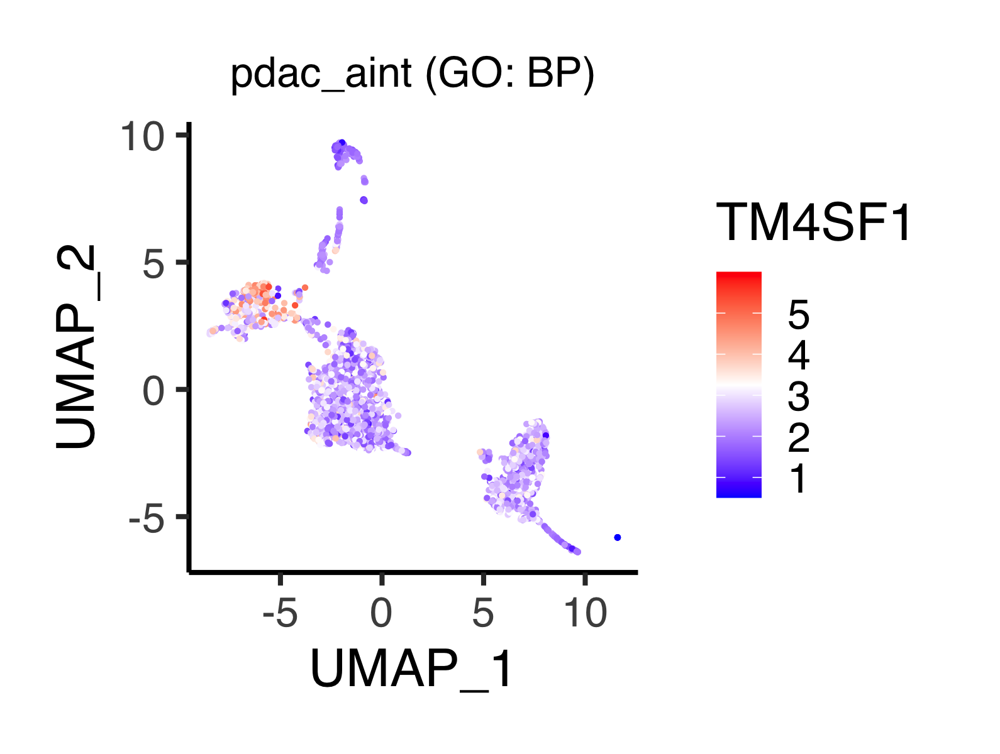


## Investigate batch effects
Load the data.
```{r, eval = FALSE}
source("R/plot.R")
pdac_aint <- readRDS(file = "backup/07_204_pdac_aint_DES_GO.rds")
```

The following function `plot_manifold_sign()` outputs a `ggplot` object,
which shows the clustering results between batches or putative subpopulations
in a two-dimensional reduced space.
The arguments are `obj_seurat` (Seurat object), `batch` (`TRUE` or `FALSE`:
if `TRUE`, the batch information is labeled, otherwise inferred clusters are
labeled), `plot_type` (one of `"tsne"`, `"umap"`, or `"dmap"`),
`data_type`, `category`, and `algo_name`.
```{r, eval = FALSE}
# ----------------------------------------
# pdac_aint
# ----------------------------------------
p <- plot_manifold_sign(obj = pdac_aint, batch = TRUE,
                        plot_type = "umap",
                        data_type = "GO", category = "BP",
                        algo_name = "seuratFindClusters",
                        title = "pdac_aint", title_size = 18,
                        xlabel = "UMAP_1", ylabel = "UMAP_2",
                        default_color = FALSE)
filename <- "figures/figure_07_0280.png"
ggsave(file = filename, plot = p, dpi = 300, width = 6.3, height = 5)

p <- plot_manifold_sign(obj = pdac_aint, batch = FALSE,
                        plot_type = "umap",
                        data_type = "GO", category = "BP",
                        algo_name = "seuratFindClusters",
                        title = "pdac_aint",
                        title_size = 18, xlabel = "UMAP_1", ylabel = "UMAP_2",
                        default_color = FALSE)
filename <- "figures/figure_07_0281.png"
ggsave(file = filename, plot = p, dpi = 300, width = 5, height = 4.2)
```

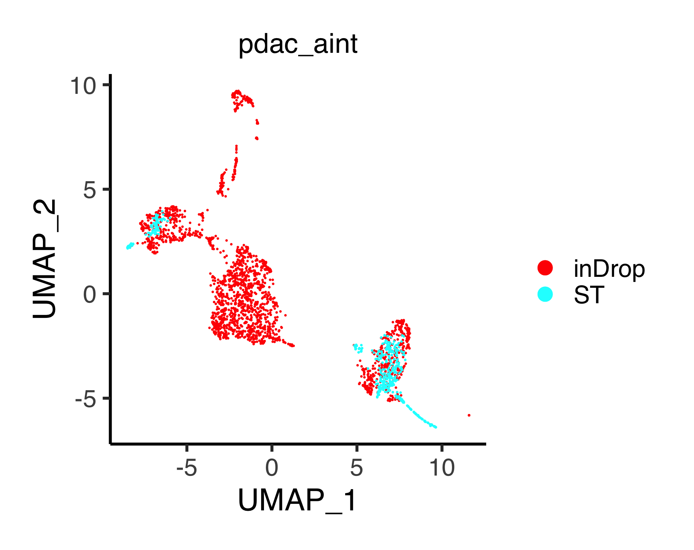
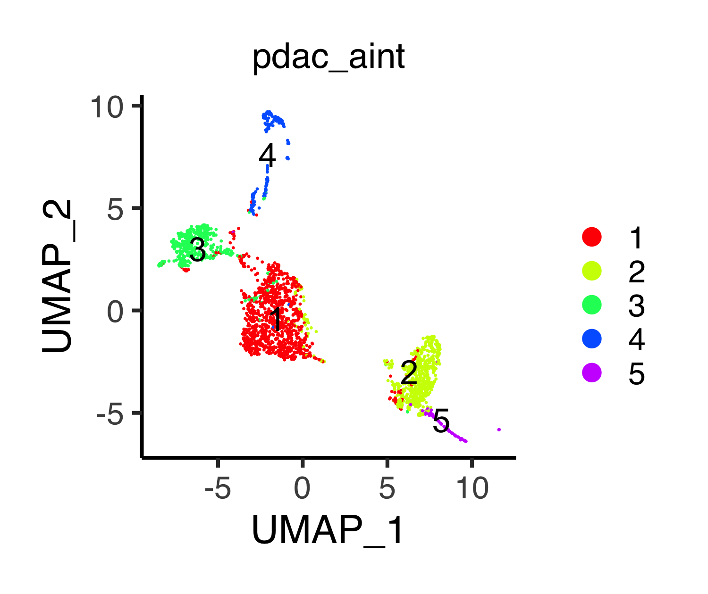


## Spatial mapping by Spaniel
Load the data.
```{r, eval = FALSE}
pdac_aint <- readRDS(file = "backup/07_204_pdac_aint_DES_GO.rds")
pdac_ast1 <- readRDS(file = "backup/05_005_pdac_ast1_normalized.rds")
fn <- "data/2020_001_Moncada/pdac_ast1/tissue_positions_list_spatial_object.tsv"
```

Create a Seurat object keeping only ST spots in integrated data `pdac_aint`.
```{r, eval = FALSE}
# ----------------------------------------
# pdac_aint
# ----------------------------------------
tmp <- pdac_aint[["sample"]]
tmp <- tmp[which(tmp$orig_ident == "ST"),]
pdac_aint[["sample"]] <- tmp

mat <- pdac_aint[["sign"]][["GOxSample"]][["BP"]]
tmp <- pdac_aint[["sample"]][["barcode"]]
mat <- mat[, which(colnames(mat) %in% tmp)]
colnames(mat) <- pdac_ast1[["sample"]][["spot"]]  # This is required by Spaniel
# ----------------------------------------
# se
# ----------------------------------------
se <- Spaniel::createSeurat(counts = mat, barcodeFile = fn,
                            projectName = "PDAC-A", sectionNumber = "1")
se@images <- pdac_aint[["misc"]][["images"]]
```

Pre-processing.
```{r, eval = FALSE}
tmp <- pdac_aint[["sample"]][["seuratFindClusters_GO_BP"]]
se@meta.data[["cluster"]] <- tmp
SetIdent(se, value = "cluster")
se <- ScaleData(se)
```

Visualize clusters on tissue images.
```{r, eval = FALSE}
p <- spanielPlot(object = se, grob = se@images[[1]], plotType = "Cluster",
                 clusterRes = "cluster", ptSize = 2.5,
                 customTitle = "Cluster (GO:BP)")
filename <- "figures/figure_07_0290.png"
ggsave(file = filename, plot = p, dpi = 300, width = 5.1, height = 4.2)
```


Visualize sign scores on histological images.
Note that in `se` underscores "_" were replaced with hyphens "-".
```{r, eval = FALSE}
p <- spanielPlot(object = se, grob = se@images[[1]], plotType = "Gene",
                 gene = "GO:0090090-V", ptSizeMax = 2.5,  ptSizeMin = 0,
                 customTitle = "GO:0090090_V")
filename <- "figures/figure_07_0295.png"
ggsave(file = filename, plot = p, dpi = 300, width = 4.7, height = 4.1)
```

```{r, eval = FALSE, echo = FALSE, results = "hide"}
p <- spanielPlot(object = se, grob = se@images[[1]], plotType = "Gene",
                 gene = "GO:0030857-S", ptSizeMax = 2.5,  ptSizeMin = 0,
                 customTitle = "GO:0030857_S")
filename <- "figures/figure_07_0296.png"
ggsave(file = filename, plot = p, dpi = 300, width = 4.7, height = 4.1)
```

* GO:0090090_V Negative reg..Wnt signal.. (AMFR/DVL1/..)


* GO:0030857_S Negative reg..epithelial cell diff.. (REG3A/GSK3B/..)


