# Inferring pathway activities (optional) {#pathway}
In this section, we infer pathway activity for individual cells using ASURAT
by inputting KEGG database.

ASURAT transforms normalized and centered read count tables to cell-type or
functional spectrum matrix, which we term sign-by-sample matrices (SSMs).
The resulting matrices can be supplied to the subsequent unsupervised
clusterings.


## Add database to ASURAT objects
Load the data.
```{r, eval = FALSE}
rm(list = ls())
source("R/plot.R")
source("R/function_asurat.R")
sc68_vehi <- readRDS(file = "backup/01_005_sc68_vehi_normalized.rds")
sc68_cisp <- readRDS(file = "backup/02_005_sc68_cisp_normalized.rds")
pdac_aint <- readRDS(file = "backup/07_005_pdac_aint_normalized.rds")
pbmc_4000 <- readRDS(file = "backup/10_005_pbmc_4000_normalized.rds")
pbmc_6000 <- readRDS(file = "backup/11_005_pbmc_6000_normalized.rds")

sc68_vehi_cor <- readRDS(file = "backup/01_006_sc68_vehi_correlation.rds")
sc68_cisp_cor <- readRDS(file = "backup/02_006_sc68_cisp_correlation.rds")
pdac_aint_cor <- readRDS(file = "backup/07_006_pdac_aint_correlation.rds")
pbmc_4000_cor <- readRDS(file = "backup/10_006_pbmc_4000_correlation.rds")
pbmc_6000_cor <- readRDS(file = "backup/11_006_pbmc_6000_correlation.rds")
```

Load KEGG database.
```{r, eval = FALSE}
tidy_KEGG <-
  readRDS(file = "data/2020_001_databases/20201213_tidy_KEGG_human.rds")
```
See that KEGG has a category pathway.

To make the object small, unused items are removed.
```{r, eval = FALSE}
myfunc <- function(obj){
  obj[["data"]][["raw"]] <- NULL
  return(obj)
}

sc68_vehi <- myfunc(sc68_vehi)
sc68_cisp <- myfunc(sc68_cisp)
pdac_aint <- myfunc(pdac_aint)
pbmc_4000 <- myfunc(pbmc_4000)
pbmc_6000 <- myfunc(pbmc_6000)
```

Add formatted databases into ASURAT objects.
```{r, eval = FALSE}
sc68_vehi[["sign"]][["KEGG"]] <- tidy_KEGG
sc68_cisp[["sign"]][["KEGG"]] <- tidy_KEGG
pdac_aint[["sign"]][["KEGG"]] <- tidy_KEGG
pbmc_4000[["sign"]][["KEGG"]] <- tidy_KEGG
pbmc_6000[["sign"]][["KEGG"]] <- tidy_KEGG
```


## Quick QC
The following function `do_quickQC_sign()` takes an intersection of genes
between user's scRNA-seq data and collected database, and then excludes the IDs
including too few or too many genes by setting thresholds `min_ngenes`
(minimal number of genes which must be greater than one) and `max_ngenes`
(maximal number of genes which must be greater than one).
Here, the values of `min_ngenes` and `max_ngenes` were set as 2 and 1000,
respectively, as default values.
```{r, eval = FALSE}
sc68_vehi <- do_quickQC_sign(obj = sc68_vehi, data_type = "KEGG",
                             min_ngenes = 2, max_ngenes = 1000)
sc68_cisp <- do_quickQC_sign(obj = sc68_cisp, data_type = "KEGG",
                             min_ngenes = 2, max_ngenes = 1000)
pdac_aint <- do_quickQC_sign(obj = pdac_aint, data_type = "KEGG",
                             min_ngenes = 2, max_ngenes = 1000)
pbmc_4000 <- do_quickQC_sign(obj = pbmc_4000, data_type = "KEGG",
                             min_ngenes = 2, max_ngenes = 1000)
pbmc_6000 <- do_quickQC_sign(obj = pbmc_6000, data_type = "KEGG",
                             min_ngenes = 2, max_ngenes = 1000)
```
The results are stored in `obj[["sign"]][[data_type]][[category]]`.


## Correlation graph-based decomposition
The following function `separate_variables_sign()` clusters each functional
gene set into three groups, i.e., strongly correlated gene set (SCG),
variably correlated gene set (VCG), and weakly correlated gene set (WCG).
The arguments are `obj` (ASURAT object), `obj_cor`, `data_type`,
`method = "spearman"` (one of `names(obj_cor)`), `th_posi`, and `th_nega`
(thresholds of positive and negative correlation coefficients, respectively).

**Tips:**
This function sometimes produces unexpected results.
In fact, the smaller values of `th_posi` and `th_nega` do not always result in
the larger sizes of SCG and VCG.
Hence we recommend users to carefully turn the parameters and check if the
biological terms (i.e., signs) of interest are included in the results.
```{r, eval = FALSE}
sc68_vehi_red <- separate_variables_sign(obj = sc68_vehi,
                                         obj_cor = sc68_vehi_cor,
                                         data_type = "KEGG",
                                         method = "spearman",
                                         th_posi = 0.34, th_nega = -0.20)
sc68_cisp_red <- separate_variables_sign(obj = sc68_cisp,
                                         obj_cor = sc68_cisp_cor,
                                         data_type = "KEGG",
                                         method = "spearman",
                                         th_posi = 0.15, th_nega = -0.15)
pdac_aint_red <- separate_variables_sign(obj = pdac_aint,
                                         obj_cor = pdac_aint_cor,
                                         data_type = "KEGG",
                                         method = "spearman",
                                         th_posi = 0.24, th_nega = -0.16)
pbmc_4000_red <- separate_variables_sign(obj = pbmc_4000,
                                         obj_cor = pbmc_4000_cor,
                                         data_type = "KEGG",
                                         method = "spearman",
                                         th_posi = 0.15, th_nega = -0.21)
pbmc_6000_red <- separate_variables_sign(obj = pbmc_6000,
                                         obj_cor = pbmc_6000_cor,
                                         data_type = "KEGG",
                                         method = "spearman",
                                         th_posi = 0.15, th_nega = -0.17)
```
The result is stored in `obj[["sign"]][[data_type]][[category]]`.


## Creating systems of signs
The following function `select_sign()` selects the signs by a user-defined
criteria, which has been preset as follows:

1. sum of the number of genes in SCG and VCG is greater than or equal to
`min_cnt`, and
2. the number of genes in WCG is greater than or equal to `min_cnt_weak`
(the default value is 2).

Users can modify the programming code indicated by "User-defined criteria"
in the file `R/function_asurat.R`.
Note that the signs having at most one gene will be removed when creating
sign-by-sample matrices.
For example, given a certain parent sign having SCG = \{GENE_A, GENE_B\} and
VCG = \{GENE_C\}, the VCG will be removed from the downstream analysis.

**Tips:**
The larger the value of `min_cnt` is, the more reliable signs users can obtain.
However, one should pay attention to several bias problems such as annotation
bias, that is some biological terms are associated with many genes, while
others with few.
```{r, eval = FALSE}
sc68_vehi_red <- select_sign(obj = sc68_vehi_red, data_type = "KEGG",
                             min_cnt = 2, min_cnt_weak = 2)
sc68_cisp_red <- select_sign(obj = sc68_cisp_red, data_type = "KEGG",
                             min_cnt = 4, min_cnt_weak = 2)
pdac_aint_red <- select_sign(obj = pdac_aint_red, data_type = "KEGG",
                             min_cnt = 3, min_cnt_weak = 2)
pbmc_4000_red <- select_sign(obj = pbmc_4000_red, data_type = "KEGG",
                             min_cnt = 7, min_cnt_weak = 2)
pbmc_6000_red <- select_sign(obj = pbmc_6000_red, data_type = "KEGG",
                             min_cnt = 4, min_cnt_weak = 2)
```
The result is stored in `obj[["sign"]][[data_type]][[category]]`.

Save the objects.
```{r, eval = FALSE}
saveRDS(sc68_vehi_red, file = "backup/01_300_sc68_vehi_select_KEGG.rds")
saveRDS(sc68_cisp_red, file = "backup/02_300_sc68_cisp_select_KEGG.rds")
saveRDS(pdac_aint_red, file = "backup/07_300_pdac_aint_select_KEGG.rds")
saveRDS(pbmc_4000_red, file = "backup/10_300_pbmc_4000_select_KEGG.rds")
saveRDS(pbmc_6000_red, file = "backup/11_300_pbmc_6000_select_KEGG.rds")
```

Load the objects.
```{r, eval = FALSE}
sc68_vehi_red <- readRDS(file = "backup/01_300_sc68_vehi_select_KEGG.rds")
sc68_cisp_red <- readRDS(file = "backup/02_300_sc68_cisp_select_KEGG.rds")
pdac_aint_red <- readRDS(file = "backup/07_300_pdac_aint_select_KEGG.rds")
pbmc_4000_red <- readRDS(file = "backup/10_300_pbmc_4000_select_KEGG.rds")
pbmc_6000_red <- readRDS(file = "backup/11_300_pbmc_6000_select_KEGG.rds")
```


## Removing redundant signs
The following function `manual_exclusion_sign()` removes biological terms by
specifying IDs (e.g., `path:hsaXXX`) or keywords (e.g., `oocyte`)
using grepl command.
The argument are `obj`, `data_type`, and `keywords` (list of keywords
separated by `|`).
```{r, eval = FALSE}
keywords <- "COVID-19"
sc68_vehi_red <- manual_exclusion_sign(obj = sc68_vehi_red, data_type = "KEGG",
                                       keywords = keywords)
keywords <- "COVID-19"
sc68_cisp_red <- manual_exclusion_sign(obj = sc68_cisp_red, data_type = "KEGG",
                                       keywords = keywords)
keywords <- "COVID-19"
pdac_aint_red <- manual_exclusion_sign(obj = pdac_aint_red, data_type = "KEGG",
                                       keywords = keywords)
keywords <- "COVID-19"
pbmc_4000_red <- manual_exclusion_sign(obj = pbmc_4000_red, data_type = "KEGG",
                                       keywords = keywords)
keywords <- "COVID-19"
pbmc_6000_red <- manual_exclusion_sign(obj = pbmc_6000_red, data_type = "KEGG",
                                       keywords = keywords)
```
The results are stored in `obj[["sign"]][[data_type]][[category]]`.


## Creating sign-by-sample matrices
The following function `make_signxsample_matrix()` makes sign-by-sample
matrices.
The arguments are `obj`, `data_type`,
`weight_strg` (weight parameter for SCG: the default value is 0.5) and
`weight_vari` (weight parameter for VCG: the default value is 0.5).
```{r, eval = FALSE}
sc68_vehi_red <- make_signxsample_matrix(obj = sc68_vehi_red,
                                         data_type = "KEGG",
                                         weight_strg = 0.5, weight_vari = 0.5)
sc68_cisp_red <- make_signxsample_matrix(obj = sc68_cisp_red,
                                         data_type = "KEGG",
                                         weight_strg = 0.5, weight_vari = 0.5)
pdac_aint_red <- make_signxsample_matrix(obj = pdac_aint_red,
                                         data_type = "KEGG",
                                         weight_strg = 0.5, weight_vari = 0.5)
pbmc_4000_red <- make_signxsample_matrix(obj = pbmc_4000_red,
                                         data_type = "KEGG",
                                         weight_strg = 0.5, weight_vari = 0.5)
pbmc_6000_red <- make_signxsample_matrix(obj = pbmc_6000_red,
                                         data_type = "KEGG",
                                         weight_strg = 0.5, weight_vari = 0.5)
```
The results are stored in `obj[["sign"]][["data_typexSample"]][[category]]`.

The following command `plot_Heatmap_SignxSamp()` plots a heat map by using
`Heatmap()` in `ComplexHeatmap` package applied to the sign-by-sample matrices.
The arguments are `obj`, `data_type`, `category`, `algo_name = NULL`,
`method` (agglomeration method to be used such as `complete`, `ward.D2`,
`average`, etc.), and `show_nReads` (if `TRUE`, the number of reads is shown).
```{r, eval = FALSE}
# ----------------------------------------
# sc68_vehi
# ----------------------------------------
filename <- "figures/figure_01_0300.png"
png(file = filename, height = 1000, width = 1150, res = 300)
plot_Heatmap_SignxSamp(obj = sc68_vehi_red,
                       data_type = "KEGG", category = "pathway",
                       algo_name = NULL, method = "ward.D2",
                       show_nReads = FALSE, title = "sc68_vehi (KEGG: pathway)",
                       name = "Sign score", show_rownames_sign = FALSE,
                       show_rownames_label = FALSE,
                       show_rownames_nReads = FALSE, default_color = FALSE)
dev.off()
```

```{r, eval = FALSE, echo = FALSE, results = "hide"}
# ----------------------------------------
# sc68_cisp
# ----------------------------------------
filename <- "figures/figure_02_0300.png"
png(file = filename, height = 1000, width = 1150, res = 300)
plot_Heatmap_SignxSamp(obj = sc68_cisp_red,
                       data_type = "KEGG", category = "pathway",
                       algo_name = NULL, method = "ward.D2",
                       show_nReads = FALSE, title = "sc68_cisp (KEGG: pathway)",
                       name = "Sign score", show_rownames_sign = FALSE,
                       show_rownames_label = FALSE,
                       show_rownames_nReads = FALSE, default_color = FALSE)
dev.off()
# ----------------------------------------
# pdac_aint
# ----------------------------------------
filename <- "figures/figure_07_0300.png"
png(file = filename, height = 1000, width = 1150, res = 300)
plot_Heatmap_SignxSamp(obj = pdac_aint_red,
                       data_type = "KEGG", category = "pathway",
                       algo_name = NULL, method = "ward.D2",
                       show_nReads = FALSE, title = "pdac_aint (KEGG: pathway)",
                       name = "Sign score", show_rownames_sign = FALSE,
                       show_rownames_label = FALSE,
                       show_rownames_nReads = FALSE, default_color = FALSE)
dev.off()
# ----------------------------------------
# pbmc_4000
# ----------------------------------------
filename <- "figures/figure_10_0300.png"
png(file = filename, height = 1000, width = 1150, res = 300)
plot_Heatmap_SignxSamp(obj = pbmc_4000_red,
                       data_type = "KEGG", category = "pathway",
                       algo_name = NULL, method = "ward.D2",
                       show_nReads = FALSE, title = "pbmc_4000 (KEGG: pathway)",
                       name = "Sign score", show_rownames_sign = FALSE,
                       show_rownames_label = FALSE,
                       show_rownames_nReads = FALSE, default_color = FALSE)
dev.off()
# ----------------------------------------
# pbmc_6000
# ----------------------------------------
filename <- "figures/figure_11_0300.png"
png(file = filename, height = 1000, width = 1150, res = 300)
plot_Heatmap_SignxSamp(obj = pbmc_6000_red,
                       data_type = "KEGG", category = "pathway",
                       algo_name = NULL, method = "ward.D2",
                       show_nReads = FALSE, title = "pbmc_6000 (KEGG: pathway)",
                       name = "Sign score", show_rownames_sign = FALSE,
                       show_rownames_label = FALSE,
                       show_rownames_nReads = FALSE, default_color = FALSE)
dev.off()
```

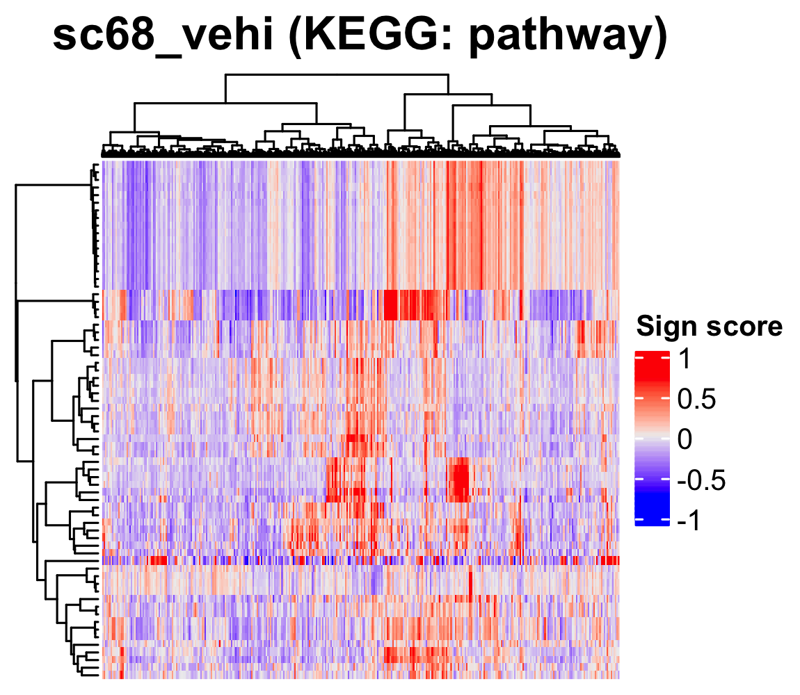

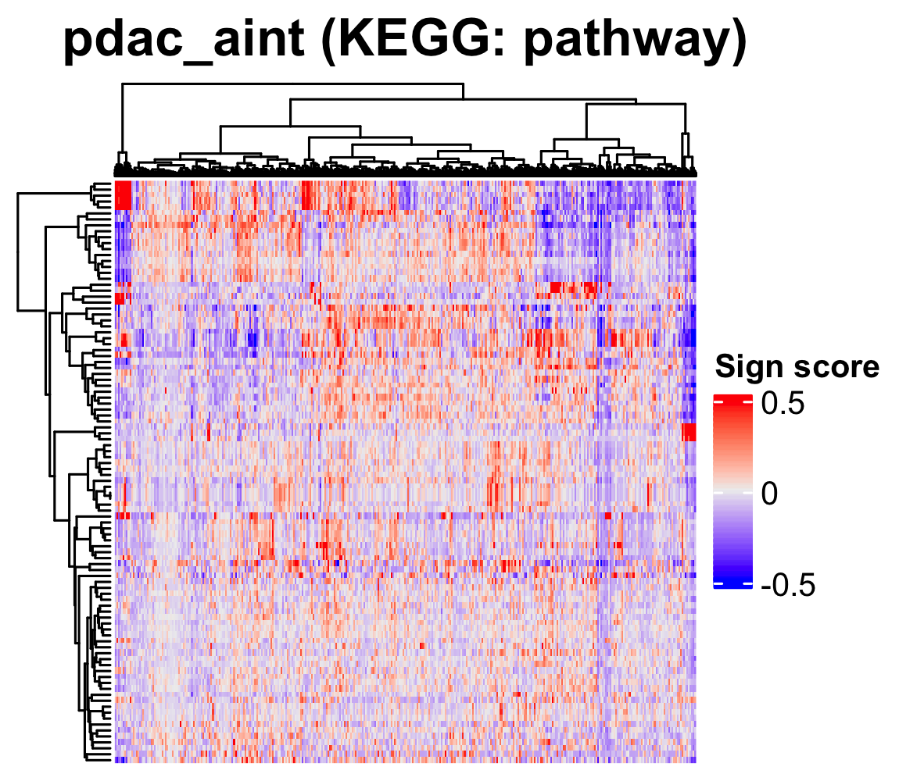
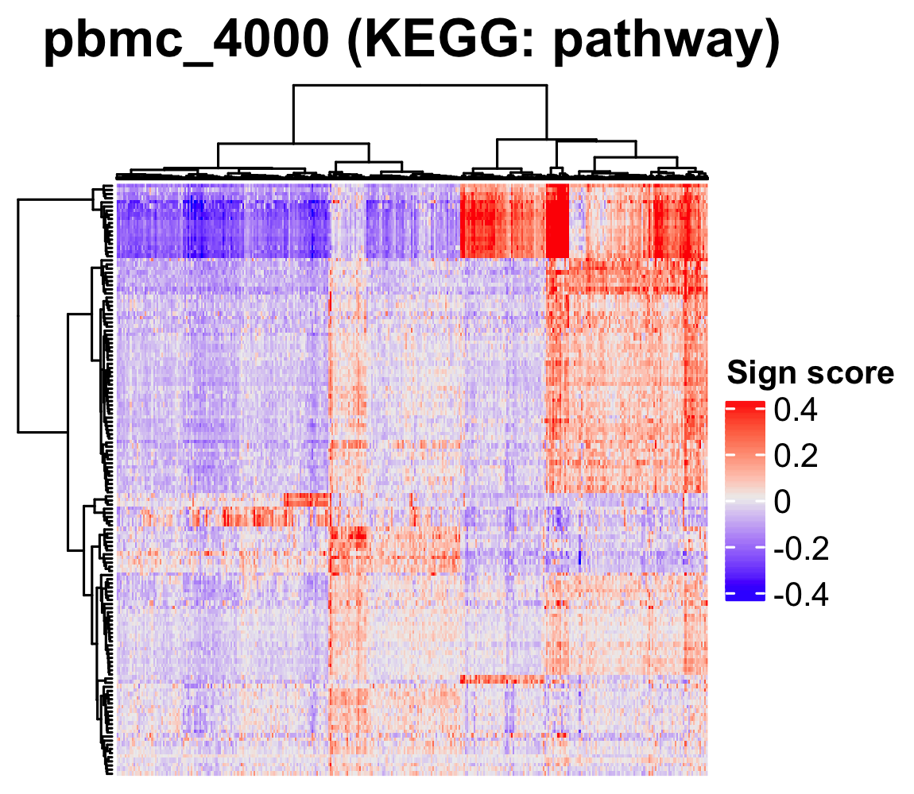


Save the objects.
```{r, eval = FALSE}
saveRDS(sc68_vehi_red, file = "backup/01_301_sc68_vehi_matrix_KEGG.rds")
saveRDS(sc68_cisp_red, file = "backup/02_301_sc68_cisp_matrix_KEGG.rds")
saveRDS(pdac_aint_red, file = "backup/07_301_pdac_aint_matrix_KEGG.rds")
saveRDS(pbmc_4000_red, file = "backup/10_301_pbmc_4000_matrix_KEGG.rds")
saveRDS(pbmc_6000_red, file = "backup/11_301_pbmc_6000_matrix_KEGG.rds")
```


## Dimensionality reduction
Load the objects.
```{r, eval = FALSE}
rm(list = ls())
source("R/plot.R")
source("R/function_asurat.R")
sc68_vehi <- readRDS(file = "backup/01_301_sc68_vehi_matrix_KEGG.rds")
sc68_cisp <- readRDS(file = "backup/02_301_sc68_cisp_matrix_KEGG.rds")
pdac_aint <- readRDS(file = "backup/07_301_pdac_aint_matrix_KEGG.rds")
pbmc_4000 <- readRDS(file = "backup/10_301_pbmc_4000_matrix_KEGG.rds")
pbmc_6000 <- readRDS(file = "backup/11_301_pbmc_6000_matrix_KEGG.rds")
```


### Principal component analysis (optional)
The following function `do_pca_sign()` performs principal component analysis
based on the sign-by-sample matrices of the input `data_type` and `category`.
```{r, eval = FALSE}
sc68_vehi <- do_pca_sign(obj = sc68_vehi, data_type = "KEGG",
                         category = "pathway")
sc68_cisp <- do_pca_sign(obj = sc68_cisp, data_type = "KEGG",
                         category = "pathway")
pdac_aint <- do_pca_sign(obj = pdac_aint, data_type = "KEGG",
                         category = "pathway")
pbmc_4000 <- do_pca_sign(obj = pbmc_4000, data_type = "KEGG",
                         category = "pathway")
pbmc_6000 <- do_pca_sign(obj = pbmc_6000, data_type = "KEGG",
                         category = "pathway")
```
The result is stored in `obj[["reduction"]][["pca"]][[data_type]][[category]]`.


### t-distributed stochastic neighbor embedding (optional)
The following function `do_tsne_sign()` performs `Rtsne()` in `Rtsne` package
based on the sign-by-sample matrices of the input `data_type` and `category`.
The arguments are `obj` (ASURAT object), `data_type`, `category`,
`pca_dim` (number of principal component used for t-SNE, in which `NULL` is
accepted if users would like to compute t-SNE from the original sample-by-sign
matrices), and `tsne_dim` (t-SNE dimension: either `2` or `3`).
```{r, eval = FALSE}
sc68_vehi <- do_tsne_sign(obj = sc68_vehi, data_type = "KEGG",
                          category = "pathway", pca_dim = NULL, tsne_dim = 2)
sc68_cisp <- do_tsne_sign(obj = sc68_cisp, data_type = "KEGG",
                          category = "pathway", pca_dim = NULL, tsne_dim = 2)
pdac_aint <- do_tsne_sign(obj = pdac_aint, data_type = "KEGG",
                          category = "pathway", pca_dim = NULL, tsne_dim = 2)
pbmc_4000 <- do_tsne_sign(obj = pbmc_4000, data_type = "KEGG",
                          category = "pathway", pca_dim = NULL, tsne_dim = 2)
pbmc_6000 <- do_tsne_sign(obj = pbmc_6000, data_type = "KEGG",
                          category = "pathway", pca_dim = NULL, tsne_dim = 2)
```
The result is stored in `obj[["reduction"]][["tsne"]][[data_type]][[category]]`.


### Uniform manifold approximation and projection (optional)
The following function `do_umap_sign()` performs `umap()` in `umap` package
based on the sign-by-sample matrices of the input `data_type` and `category`.
The arguments are `obj`, `data_type`, `category`,
`pca_dim` (number of principal component used for UMAP, in which `NULL` is
accepted if users would like to compute UMAP from the original sample-by-sign
matrices), and `umap_dim` (UMAP dimension: either `2` or `3`).

**Tips:**
If the resulting diffusion map is distorted by outliers, tuning of `pca_dim`
will be required.
```{r, eval = FALSE}
sc68_vehi <- do_umap_sign(obj = sc68_vehi, data_type = "KEGG",
                          category = "pathway", pca_dim = NULL, umap_dim = 2)
sc68_cisp <- do_umap_sign(obj = sc68_cisp, data_type = "KEGG",
                          category = "pathway", pca_dim = NULL, umap_dim = 2)
pdac_aint <- do_umap_sign(obj = pdac_aint, data_type = "KEGG",
                          category = "pathway", pca_dim = NULL, umap_dim = 2)
pbmc_4000 <- do_umap_sign(obj = pbmc_4000, data_type = "KEGG",
                          category = "pathway", pca_dim = NULL, umap_dim = 2)
pbmc_6000 <- do_umap_sign(obj = pbmc_6000, data_type = "KEGG",
                          category = "pathway", pca_dim = NULL, umap_dim = 2)
```
The result is stored in `obj[["reduction"]][["umap"]][[data_type]][[category]]`.


### Diffusion map (optional)
Branch-based clustering is not used in this section.
Please see [previous section](#cell_type) for the method.


### Visualization
The following functions `plot_tsne_sign()`, `plot_umap_sign()`, and
`plot_dmap_sign()` show sign-by-sample matrices in low dimensional space.
The space dimension is automatically given by `tsne_dim` used in
`do_tsne_sign()` for `plot_tsne_sign()` or `umap_dim` used in `do_umap_sign()`
for `plot_umap_sign()`, while manually given by `dims` for `plot_dmap_sign()`.
The arguments are `obj`, `data_type`, `category`, `algo_name = NULL`, `dims`
(dimension vector for the plot), `theta` (angle of view), and
`phi` (angle of view).
```{r, eval = FALSE}
# ----------------------------------------
# sc68_vehi
# ----------------------------------------
p <- plot_umap_sign(obj = sc68_vehi, data_type = "KEGG", category = "pathway",
                    algo_name = NULL, theta = NULL, phi = NULL,
                    title = "sc68_vehi (KEGG: pathway)", title_size = 18,
                    xlabel = "UMAP_1", ylabel = "UMAP_2", zlabel = NULL,
                    default_color = TRUE)
filename <- "figures/figure_01_0305.png"
ggsave(file = filename, plot = p, dpi = 300, width = 4.3, height = 4.5)
```

```{r, eval = FALSE, echo = FALSE, results = "hide"}
# ----------------------------------------
# sc68_cisp
# ----------------------------------------
p <- plot_umap_sign(obj = sc68_cisp, data_type = "KEGG", category = "pathway",
                    algo_name = NULL, theta = NULL, phi = NULL,
                    title = "sc68_cisp (KEGG: pathway)", title_size = 18,
                    xlabel = "UMAP_1", ylabel = "UMAP_2", zlabel = NULL,
                    default_color = TRUE)
filename <- "figures/figure_02_0305.png"
ggsave(file = filename, plot = p, dpi = 300, width = 4.3, height = 4.5)
# ----------------------------------------
# pdac_aint
# ----------------------------------------
p <- plot_umap_sign(obj = pdac_aint, data_type = "KEGG", category = "pathway",
                    algo_name = NULL, theta = NULL, phi = NULL,
                    title = "pdac_aint (KEGG: pathway)", title_size = 18,
                    xlabel = "UMAP_1", ylabel = "UMAP_2", zlabel = NULL,
                    default_color = TRUE)
filename <- "figures/figure_07_0305.png"
ggsave(file = filename, plot = p, dpi = 300, width = 4.3, height = 4.5)
# ----------------------------------------
# pbmc_4000
# ----------------------------------------
p <- plot_umap_sign(obj = pbmc_4000, data_type = "KEGG", category = "pathway",
                    algo_name = NULL, theta = NULL, phi = NULL,
                    title = "pbmc_4000 (KEGG: pathway)", title_size = 18,
                    xlabel = "UMAP_1", ylabel = "UMAP_2", zlabel = NULL,
                    default_color = TRUE)
filename <- "figures/figure_10_0305.png"
ggsave(file = filename, plot = p, dpi = 300, width = 4.3, height = 4.5)
# ----------------------------------------
# pbmc_6000
# ----------------------------------------
p <- plot_umap_sign(obj = pbmc_6000, data_type = "KEGG", category = "pathway",
                    algo_name = NULL, theta = NULL, phi = NULL,
                    title = "pbmc_6000 (KEGG: pathway)", title_size = 18,
                    xlabel = "UMAP_1", ylabel = "UMAP_2", zlabel = NULL,
                    default_color = TRUE)
filename <- "figures/figure_11_0305.png"
ggsave(file = filename, plot = p, dpi = 300, width = 4.3, height = 4.5)
```


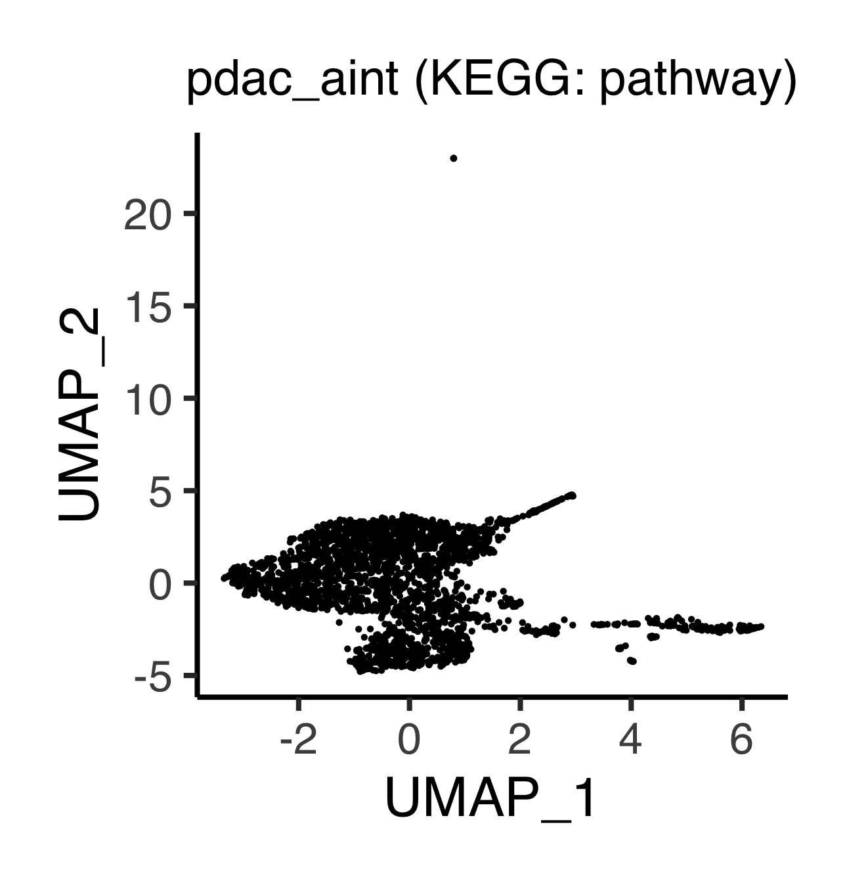


### Save results.
Save the objects.
```{r, eval = FALSE}
saveRDS(sc68_vehi, file = "backup/01_302_sc68_vehi_reduction_KEGG.rds")
saveRDS(sc68_cisp, file = "backup/02_302_sc68_cisp_reduction_KEGG.rds")
saveRDS(pdac_aint, file = "backup/07_302_pdac_aint_reduction_KEGG.rds")
saveRDS(pbmc_4000, file = "backup/10_302_pbmc_4000_reduction_KEGG.rds")
saveRDS(pbmc_6000, file = "backup/11_302_pbmc_6000_reduction_KEGG.rds")
```


## Cell clustering
Load the data.
```{r, eval = FALSE}
source("R/plot.R")
source("R/function_asurat.R")
pbmc_4000 <- readRDS(file = "backup/10_302_pbmc_4000_reduction_KEGG.rds")
pbmc_6000 <- readRDS(file = "backup/11_302_pbmc_6000_reduction_KEGG.rds")
```

Here users can choose one of the following unsupervised clustering methods.


### Partitioning around medoids (PAM) (optional)
The following function `cluster_samples_pam_sign()` performs `pam()` in
`cluster` package.
The arguments are `obj`, `data_type`, `category`, and `k` (argument of `pam()`).
```{r, eval = FALSE}
# pbmc_4000 <- cluster_samples_pam_sign(
#   obj = pbmc_4000, data_type = "KEGG",category = "pathway", k = 4)

#
# Below is a memo for plotting the result.
#
# mat <- pbmc_4000[["reduction"]][["tsne"]][["KEGG"]][["pathway"]]$Y
# lab <- pbmc_4000[["sample"]][["pam_KEGG_pathway"]]
# col <- rainbow(length(unique(lab)))
# plot(mat, pch=21, bg=col[lab])
# legend("bottomright", legend=unique(sort(lab)), pch=21, pt.bg=col)
```
The results are stored in
`obj[["clustering"]][["pam"]][[data_type]][[category]]` and
`obj[["sample"]][["pam_data_type_category"]]`.


### Hierarchical clustering and cutting tree (optional)
The following function `cluster_samples_hclustCutree_sign()` performs
`hclust()` and `cutree()` in `stats` package.
The arguments are `obj`, `data_type`, `category`, `method`
(argument of `hclust()`) and `k` (argument of `cutree()`).
```{r, eval = FALSE}
# pbmc_4000 <- cluster_samples_hclustCutree_sign(
#   obj = pbmc_4000, data_type = "KEGG", category = "pathway",
#   method = "ward.D2", k = 3)

#
# Below is a memo for plotting the result.
#
# mat <- pbmc_4000[["reduction"]][["tsne"]][["KEGG"]][["pathway"]]$Y
# lab <- pbmc_4000[["sample"]][["hclustCutree_KEGG_pathway"]]
# col <- rainbow(length(unique(lab)))
# plot(mat, pch=21, bg=col[lab])
# legend("bottomright", legend=unique(sort(lab)), pch=21, pt.bg=col)
```
The results are stored in
`obj[["clustering"]][["hclustCutree"]][[data_type]][[category]]` and
`obj[["sample"]][["hclustCutree_data_type_category"]]`.


### Community detection algorithm with k-nearest neighbor (KNN) graph (optional)
The following function `cluster_samples_seuratFindClusters_sign()` performs
`CreateSeuratObject()`, `ScaleData()`, `RunPCA()`, `FindNeighbors()`, and
`FindClusters()` in `Seurat` package.
The arguments are `obj`, `data_type`, `category`, `reduction`, `dims`,
`k.param`, `prune.SNN`, `resolution`, and `algorithm`, where the latter six
parameters are used in `FindNeighbors()` and `FindClusters()`.
```{r, eval = FALSE}
pbmc_4000 <- cluster_samples_seuratFindClusters_sign(
  obj = pbmc_4000, data_type = "KEGG", category = "pathway", reduction = "pca",
  dims = 1:20, k.param = 10, prune.SNN = 1./15, resolution = 0.15,
  algorithm = 1)

pbmc_6000 <- cluster_samples_seuratFindClusters_sign(
  obj = pbmc_6000, data_type = "KEGG", category = "pathway", reduction = "pca",
  dims = 1:20, k.param = 10, prune.SNN = 1./15, resolution = 0.15,
  algorithm = 1)

#
# Below is a memo for plotting the result.
#
# mat <- pbmc_4000[["reduction"]][["umap"]][["KEGG"]][["pathway"]][["layout"]]
# lab <- pbmc_4000[["sample"]][["seuratFindClusters_KEGG_pathway"]]
# col <- rainbow(length(unique(lab)))
# plot(mat, pch=21, bg=col[lab])
# legend("bottomright", legend=unique(sort(lab)), pch=21, pt.bg=col)
```
The results are stored in
`obj[["sample"]][["seuratFindClusters_data_type_category"]]` and
`obj[["clustering"]][["seuratFindClusters"]][[data_type]][[category]]`.


### Clustering by branch detection along pseudotime (optional)
Branch-based clustering is not used in this section.
Please see [previous section](#cell_type) for the method.


### Save data
Save the objects.
```{r, eval = FALSE}
saveRDS(pbmc_4000, file = "backup/10_303_pbmc_4000_clustering_KEGG.rds")
saveRDS(pbmc_6000, file = "backup/11_303_pbmc_6000_clustering_KEGG.rds")
```

Load the data.
```{r, eval = FALSE}
pbmc_4000 <- readRDS(file = "backup/10_303_pbmc_4000_clustering_KEGG.rds")
pbmc_6000 <- readRDS(file = "backup/11_303_pbmc_6000_clustering_KEGG.rds")
```


## Visualize clustering results
In this subsection, the clustering results are visualized.

The following function `plot_Heatmap_SignxSamp()` visualizes the result of
sample clustering by identifying `algo_name` (in the current version,
one of `"pam"`, `"hclustCutree"`, `"seuratFindClusters"`, and `"merlot"`).
```{r, eval = FALSE}
# ----------------------------------------
# pbmc_4000
# ----------------------------------------
filename <- "figures/figure_10_0330.png"
png(file = filename, height = 1000, width = 1400, res = 300)
plot_Heatmap_SignxSamp(obj = pbmc_4000, data_type = "KEGG",
                       category = "pathway",
                       algo_name = "seuratFindClusters", method = "ward.D2",
                       show_nReads = FALSE, title = "pbmc_4000 (KEGG: pathway)",
                       name = "Sign score",
                       show_rownames_sign = FALSE, show_rownames_label = FALSE,
                       show_rownames_nReads = FALSE, default_color = FALSE)
dev.off()
```

```{r, eval = FALSE, echo = FALSE, results = "hide"}
# ----------------------------------------
# pbmc_6000
# ----------------------------------------
filename <- "figures/figure_11_0330.png"
png(file = filename, height = 1000, width = 1400, res = 300)
plot_Heatmap_SignxSamp(obj = pbmc_6000, data_type = "KEGG",
                       category = "pathway",
                       algo_name = "seuratFindClusters", method = "ward.D2",
                       show_nReads = FALSE, title = "pbmc_6000 (KEGG: pathway)",
                       name = "Sign score",
                       show_rownames_sign = FALSE, show_rownames_label = FALSE,
                       show_rownames_nReads = FALSE, default_color = FALSE)
dev.off()
```

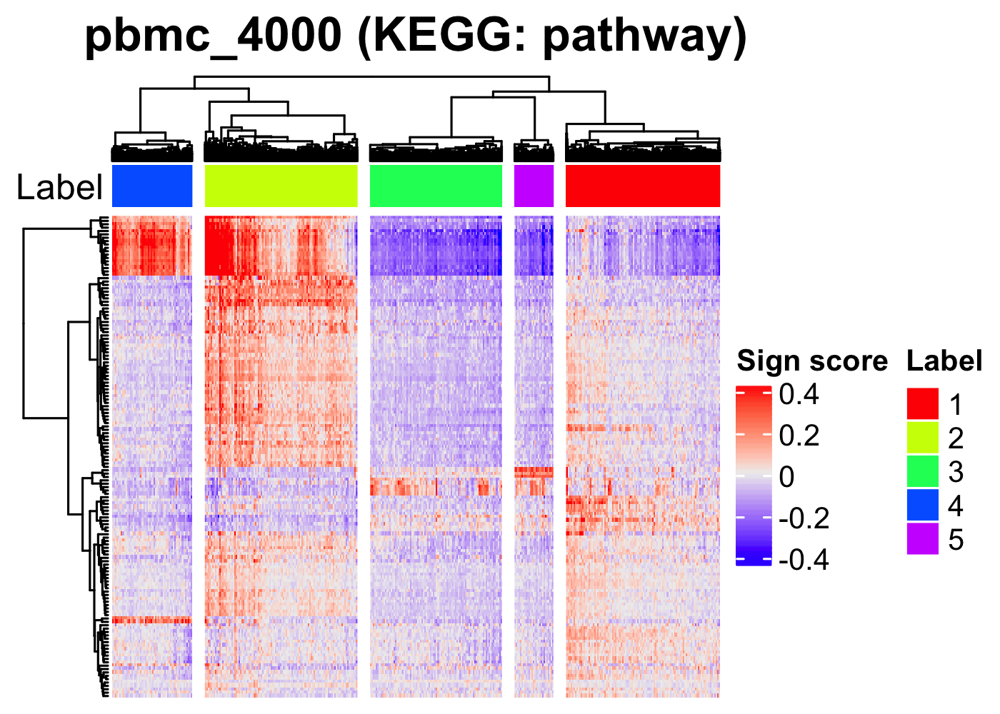
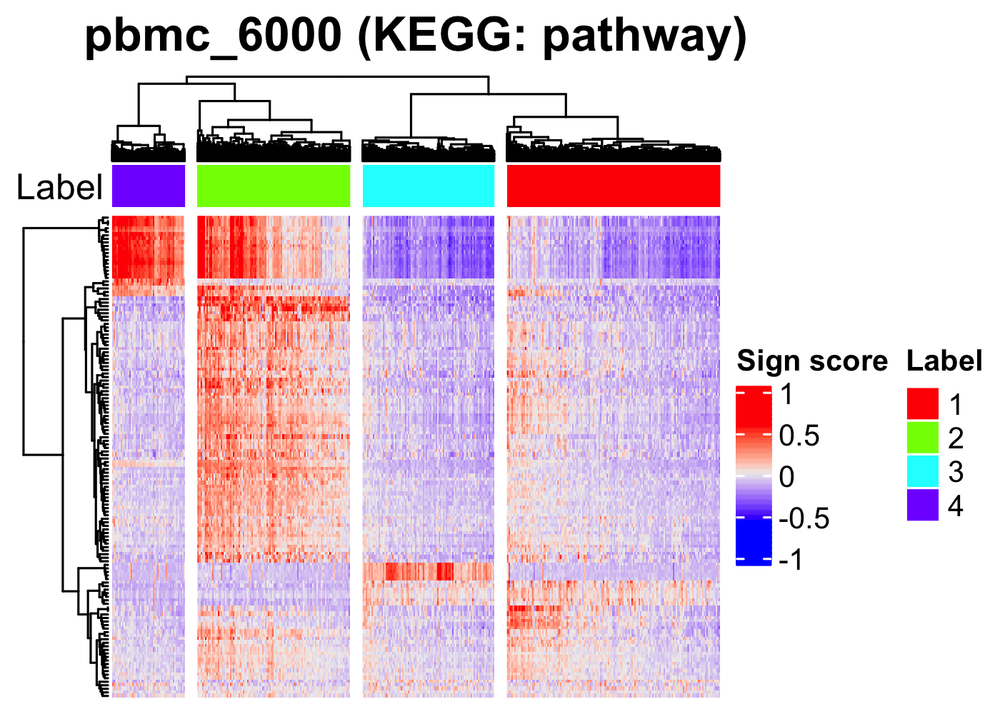

```{r, eval = FALSE}
# ----------------------------------------
# pbmc_4000
# ----------------------------------------
p <- plot_umap_sign(obj = pbmc_4000, data_type = "KEGG", category = "pathway",
                    algo_name = "seuratFindClusters",
                    theta = NULL, phi = NULL,
                    title = "pbmc_4000 (KEGG: pathway)", title_size = 16,
                    xlabel = "UMAP_1", ylabel = "UMAP_2", zlabel = NULL,
                    default_color = FALSE)
filename <- "figures/figure_10_0331.png"
ggsave(file = filename, plot =  p, dpi = 300, width = 4.7, height = 4)
```

```{r, eval = FALSE, echo = FALSE, results = "hide"}
# ----------------------------------------
# pbmc_6000
# ----------------------------------------
p <- plot_umap_sign(obj = pbmc_6000, data_type = "KEGG", category = "pathway",
                    algo_name = "seuratFindClusters",
                    theta = NULL, phi = NULL,
                    title = "pbmc_6000 (KEGG: pathway)", title_size = 16,
                    xlabel = "UMAP_1", ylabel = "UMAP_2", zlabel = NULL,
                    default_color = FALSE)
filename <- "figures/figure_11_0331.png"
ggsave(file = filename, plot =  p, dpi = 250, width = 4.7, height = 4)
```

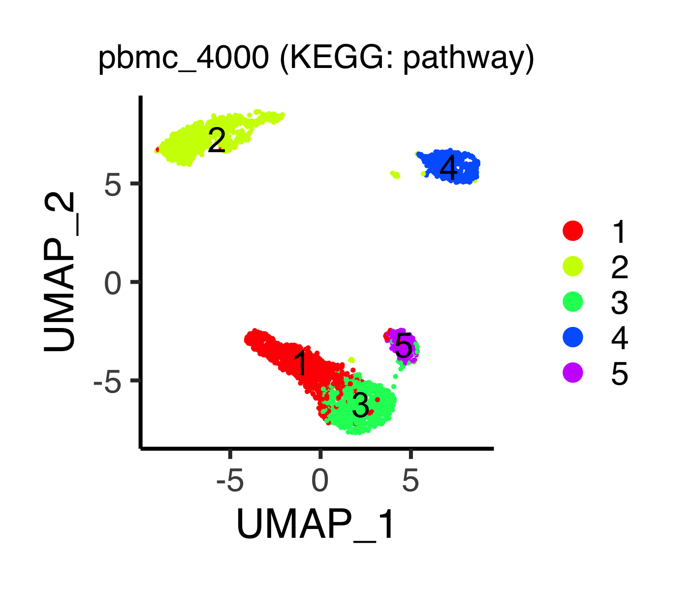
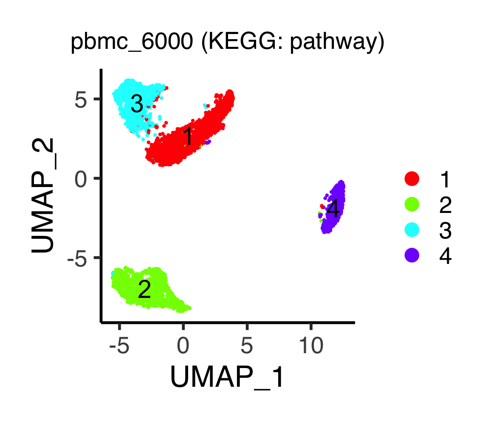

The following command shows the number of cells per cluster visualized
using bar graph.
```{r, eval = FALSE}
# ----------------------------------------
# pbmc_4000
# ----------------------------------------
p <- plot_bargraph_sign(obj = pbmc_4000, data_type = "KEGG",
                        category = "pathway",
                        algo_name = "seuratFindClusters",
                        title = "pbmc_4000", title_size = 20,
                        xlabel = "Label (KEGG: pathway)",
                        ylabel = "Number of samples", ymax = 1200)
filename <- "figures/figure_10_0335.png"
ggsave(file = filename, plot = p, dpi = 300, width = 4.3, height = 4)
```

```{r, eval = FALSE, echo = FALSE, results = "hide"}
# ----------------------------------------
# pbmc_6000
# ----------------------------------------
p <- plot_bargraph_sign(obj = pbmc_6000, data_type = "KEGG",
                        category = "pathway",
                        algo_name = "seuratFindClusters",
                        title = "pbmc_6000", title_size = 20,
                        xlabel = "Label (KEGG: pathway)",
                        ylabel = "Number of samples", ymax = 2000)
filename <- "figures/figure_11_0335.png"
ggsave(file = filename, plot = p, dpi = 300, width = 4.3, height = 4)
```


## Find significant signs
### Compute separation indices
In this subsection, signs with sign scores being specifically upregulated in
some cluster are detected by computing the separation indices (sep_I), i.e.,
non-parametric measure of degree in separation of two random variable sets
(see our paper for the definition).
The concept of significant sign is similar to that of differentially expressed
genes (DEGs).

Load the data.
```{r, eval = FALSE}
source("R/plot.R")
source("R/function_asurat.R")
pbmc_4000 <- readRDS(file = "backup/10_303_pbmc_4000_clustering_KEGG.rds")
pbmc_6000 <- readRDS(file = "backup/11_303_pbmc_6000_clustering_KEGG.rds")
```

The following function `auto_find_marker_sign()` computes separation indices
of signs of interest for each subpopulation.
The arguments are `obj`,
`data_type_for_label` (`data_type` used for sample clustering),
`category_for_label` (`category` used for sample clustering),
`algo_name_for_label` (`algo_name` used for sample clustering),
`data_type_for_expr` (`data_type` that the signs of interest belong to),
`category_for_expr` (`category` that the signs of interest belong to).
This function helps users find positive and negative marker signs of `label_1`
with the positive and negative values of the indices, respectively.
```{r, eval = FALSE}
pbmc_4000 <- auto_find_marker_sign(obj = pbmc_4000,
                                   data_type_for_label = "KEGG",
                                   category_for_label = "pathway",
                                   algo_name_for_label = "seuratFindClusters",
                                   data_type_for_expr = "KEGG",
                                   category_for_expr = "pathway")
pbmc_6000 <- auto_find_marker_sign(obj = pbmc_6000,
                                   data_type_for_label = "KEGG",
                                   category_for_label = "pathway",
                                   algo_name_for_label = "seuratFindClusters",
                                   data_type_for_expr = "KEGG",
                                   category_for_expr = "pathway")
```
The results are stored in
`obj[["marker"]][[data_type_for_expr]][[category_for_expr]]`.
Here `sep_I` stands for separation indices of signs, which quantifies the
extent of separation between two different sets of random variables.

Note that `auto_find_marker_sign()` computes `sep_I` for a given group versus
all other cells.
On the other hand, to compute `sep_I` for given two groups, e.g.,
groups 1 versus 2, run function `find_marker_sign()` as follows:
```{r, eval = FALSE}
pbmc_4000 <- find_marker_sign(obj = pbmc_4000, data_type_for_label = "KEGG",
                              category_for_label = "pathway",
                              algo_name_for_label = "seuratFindClusters",
                              data_type_for_expr = "KEGG",
                              category_for_expr = "pathway",
                              labels_1 = 1, labels_2 = 2)
```
The results are stored in
`obj[["marker"]][[data_type_for_expr]][[category_for_expr]]` such as
`obj[["marker"]][["KEGG"]][["pathway"]][["Label_KEGG_pathway_1_vs_2"]]`.

To detect differentially expressed genes, users can use our similar functions
`find_marker_gene()` and `auto_find_marker_gene()`, which perform multiple
statistical tests for comparing two groups using normalized read counts, i.e.,
`obj[["data"]][["normalized"]]`.
The arguments of `find_marker_gene()` are `obj`, `data_type_for_label`,
`category_for_label`, `algo_name_for_label`, `labels_1`, `labels_2`, and
`parametric` (`TRUE` or `FALSE` for `t.test()` or `wilcox.exact()`, resp.).
The arguments of `auto_find_marker_gene()` are `obj`, `data_type_for_label`,
`category_for_label`, `algo_name_for_label`, and `parametric`
(`TRUE` or `FALSE` for `t.test()` or `wilcox.exact()`, resp.).
For example,
```{r, eval = FALSE}
pbmc_4000 <- auto_find_marker_gene(obj = pbmc_4000,
                                   data_type_for_label = "KEGG",
                                   category_for_label = "pathway",
                                   algo_name_for_label = "seuratFindClusters",
                                   parametric = FALSE)
```
The results are stored in
`obj[["marker"]][["gene"]][[data_type_for_expr]][[category_for_expr]]`.

```{r, eval = FALSE}
datatable(pbmc_4000[["marker"]][["KEGG"]][["pathway"]][["all"]],
          rownames = FALSE)
datatable(pbmc_6000[["marker"]][["KEGG"]][["pathway"]][["all"]],
          rownames = FALSE)
```

* `pbmc_4000`

<iframe src="figures/pbmc_4000_KEGG_pathway.html" style="width:100%; height:400px;"></iframe>

<br><br><br><br><br><br><br><br><br><br>

* `pbmc_6000`

<iframe src="figures/pbmc_6000_KEGG_pathway.html" style="width:100%; height:400px;"></iframe>

<br><br><br><br><br><br><br><br><br><br><br><br><br><br><br><br><br><br><br><br>

Save the objects.
```{r, eval = FALSE}
saveRDS(pbmc_4000, file = "backup/10_304_pbmc_4000_DES_KEGG.rds")
saveRDS(pbmc_6000, file = "backup/11_304_pbmc_6000_DES_KEGG.rds")
```

Load the data.
```{r, eval = FALSE}
pbmc_4000 <- readRDS(file = "backup/10_304_pbmc_4000_DES_KEGG.rds")
pbmc_6000 <- readRDS(file = "backup/11_304_pbmc_6000_DES_KEGG.rds")
```


### Investigate sign scores
The following function `plot_violin_signScore()` shows distribution of
sign scores across all the clusters by violin plots.
The arguments are `obj`, `sign_name` (sign ID),
`data_type_for_label` (`data_type` used for sample clustering),
`category_for_label` (`category` used for sample clustering),
`algo_name_for_label` (`algo_name` used for sample clustering),
`data_type_for_expr` (`data_type` that the signs of interest belong to),
`category_for_expr` (`category` that the signs of interest belong to).
```{r, eval = FALSE}
# ----------------------------------------
# pbmc_4000
# ----------------------------------------
p <- plot_violin_signScore(
  obj = pbmc_4000, sign_name = "path:hsa04650_S",
  data_type_for_label = "KEGG", category_for_label = "pathway",
  algo_name_for_label = "seuratFindClusters",
  data_type_for_expr = "KEGG", category_for_expr = "pathway",
  title = "KEGG:hsa04650_S\nNatural killer cell mediated..\n(NCR3/GZMB/..)",
  title_size = 16, default_color = FALSE)
filename <- "figures/figure_10_0340.png"
ggsave(file = filename, plot = p, dpi = 300, width = 4, height = 4)
```

```{r, eval = FALSE, echo = FALSE, results = "hide"}
# ----------------------------------------
# pbmc_4000
# ----------------------------------------
p <- plot_violin_signScore(
  obj = pbmc_4000, sign_name = "path:hsa04662_S",
  data_type_for_label = "KEGG", category_for_label = "pathway",
  algo_name_for_label = "seuratFindClusters",
  data_type_for_expr = "KEGG", category_for_expr = "pathway",
  title = "KEGG:hsa04662_S\nB cell receptor signaling..\n(BTK/DAPP1/..)",
  title_size = 16, default_color = FALSE)
filename <- "figures/figure_10_0341.png"
ggsave(file = filename, plot = p, dpi = 300, width = 4, height = 4)

p <- plot_violin_signScore(
  obj = pbmc_4000, sign_name = "path:hsa04662_V",
  data_type_for_label = "KEGG", category_for_label = "pathway",
  algo_name_for_label = "seuratFindClusters",
  data_type_for_expr = "KEGG", category_for_expr = "pathway",
  title = "KEGG:hsa04662_V\nB cell receptor signaling..\n(CD19/CD72/..)",
  title_size = 16, default_color = FALSE)
filename <- "figures/figure_10_0342.png"
ggsave(file = filename, plot = p, dpi = 300, width = 4, height = 4)
# ----------------------------------------
# pbmc_6000
# ----------------------------------------
p <- plot_violin_signScore(
  obj = pbmc_6000, sign_name = "path:hsa04658_V",
  data_type_for_label = "KEGG", category_for_label = "pathway",
  algo_name_for_label = "seuratFindClusters",
  data_type_for_expr = "KEGG", category_for_expr = "pathway",
  title = "KEGG:hsa04658_V\nTh1 and Th2 cell differentiation\n(CD247/CD3E/..)",
  title_size = 16, default_color = FALSE)
filename <- "figures/figure_11_0340.png"
ggsave(file = filename, plot = p, dpi = 300, width = 4, height = 4)

p <- plot_violin_signScore(
  obj = pbmc_6000, sign_name = "path:hsa04662_S",
  data_type_for_label = "KEGG", category_for_label = "pathway",
  algo_name_for_label = "seuratFindClusters",
  data_type_for_expr = "KEGG", category_for_expr = "pathway",
  title = "KEGG:hsa04662_S\nB cell receptor signaling..\n(CD19/CD72/..)",
  title_size = 16, default_color = FALSE)
filename <- "figures/figure_11_0341.png"
ggsave(file = filename, plot = p, dpi = 300, width = 4, height = 4)
```

* `pbmc_4000`


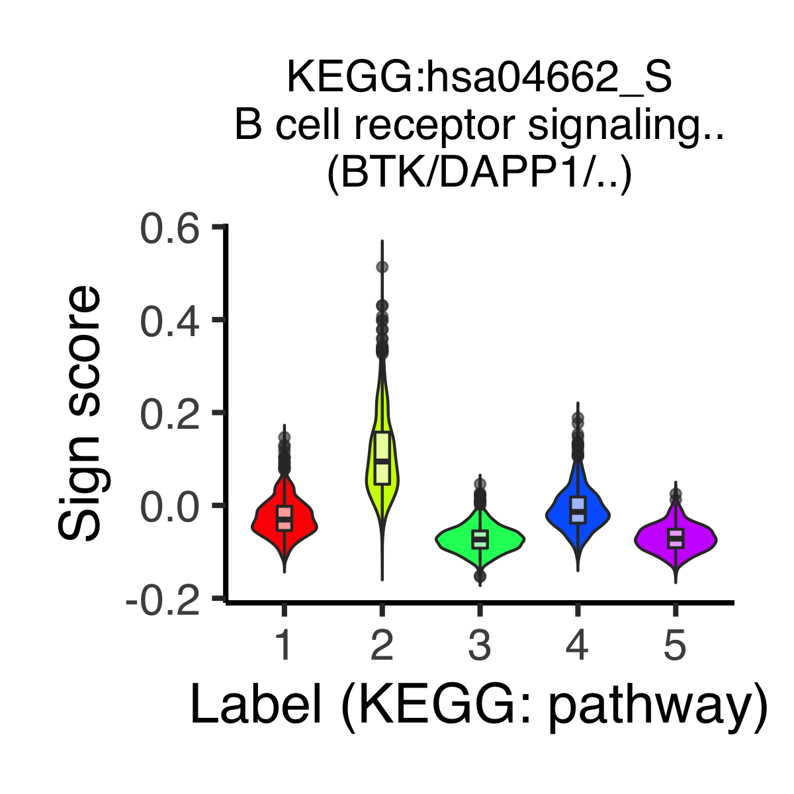
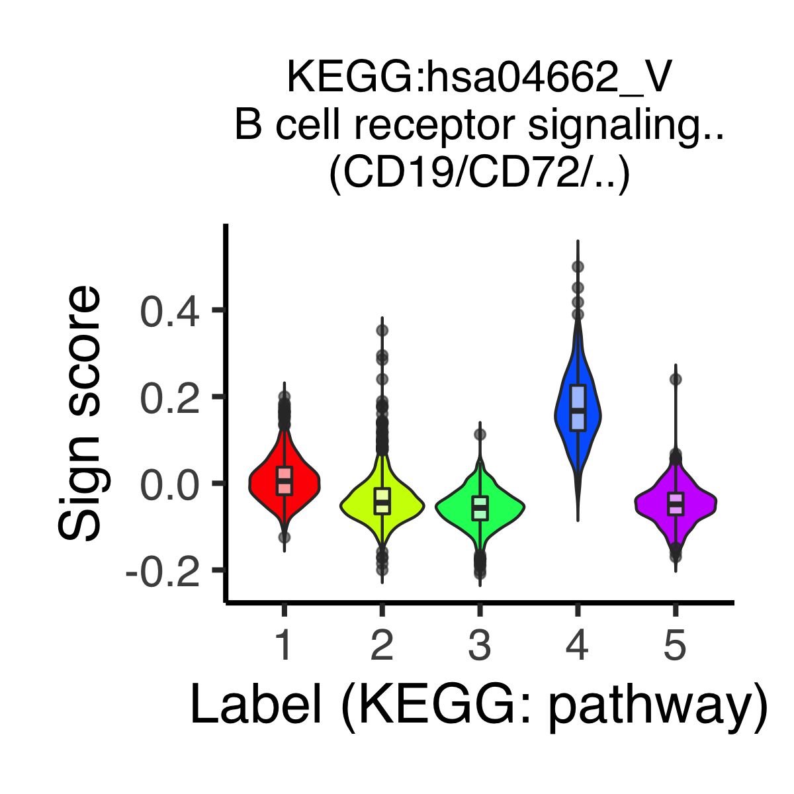

* `pbmc_6000`

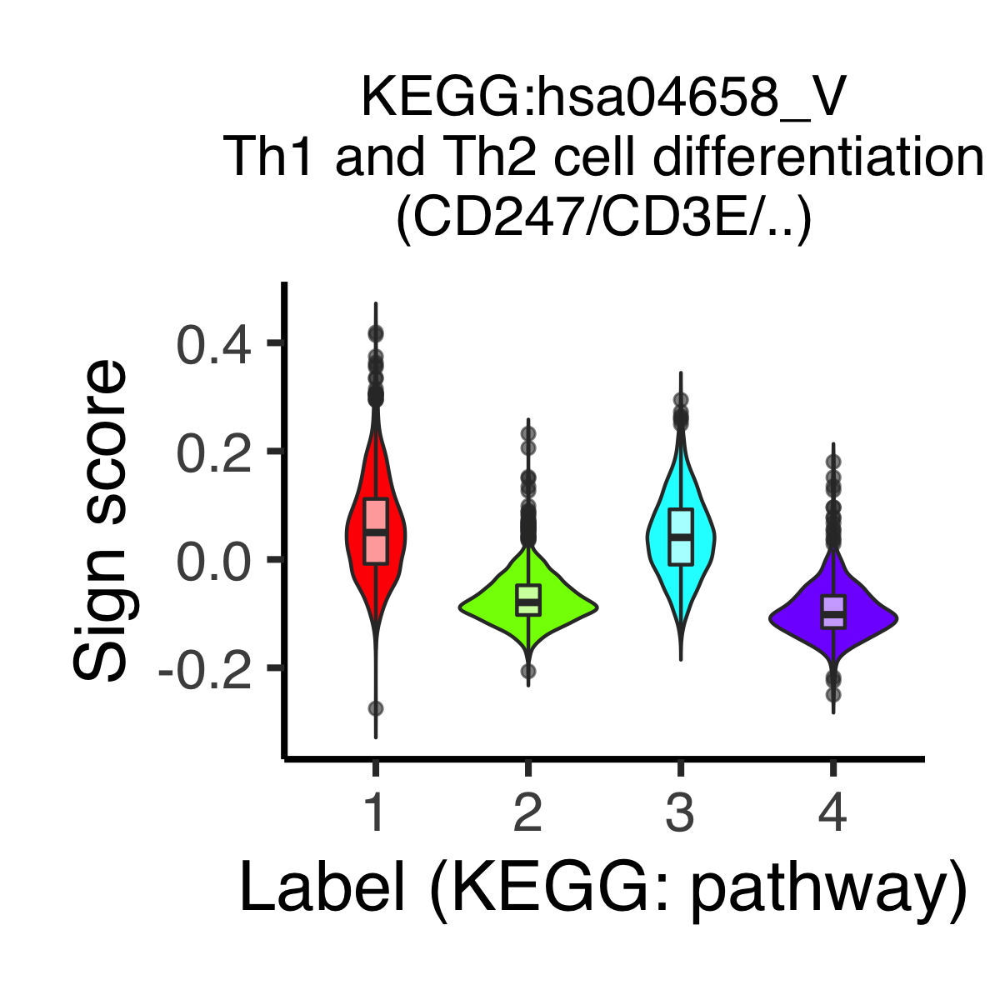


The functions `plot_tsne_signScore()`, `plot_umap_signScore()`, and
`plot_dmap_signScore()` show sign scores of a given sign on t-SNE, UMAP, and
diffusion map spaces, respectively.
The arguments are `obj`, `sign_name` (sign ID),
`data_type_for_label` (`data_type` used for sample clustering),
`category_for_label` (`category` used for sample clustering),
`data_type_for_expr` (`data_type` that the signs of interest belong to),
`category_for_expr` (`category` that the signs of interest belong to).
```{r, eval = FALSE}
# ----------------------------------------
# pbmc_4000
# ----------------------------------------
p <- plot_umap_signScore(
  obj = pbmc_4000, sign_name = "path:hsa04650_S",
  data_type_for_umap = "KEGG", category_for_umap = "pathway",
  data_type_for_expr = "KEGG", category_for_expr = "pathway",
  theta = NULL, phi = NULL,
  title = "KEGG:hsa04650_S\nNatural killer cell mediated..\n(NCR3/GZMB/..)",
  title_size = 16, label_name = "Sign score",
  xlabel = "UMAP_1", ylabel = "UMAP_2", zlabel = NULL)
filename <- "figures/figure_10_0350.png"
ggsave(file = filename, plot = p, dpi = 300, width = 5.4, height = 4.4)
```

* `pbmc_4000`

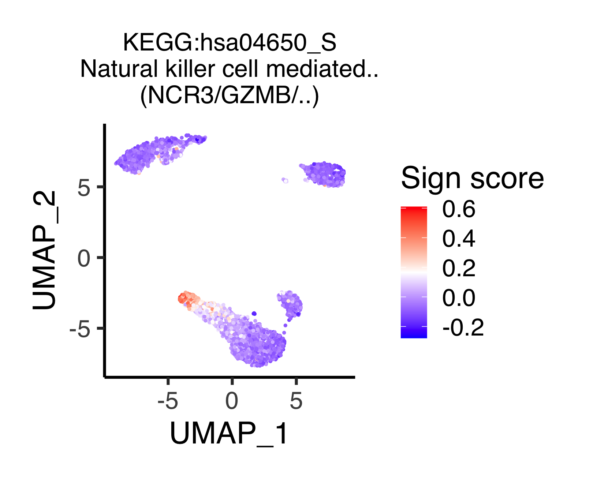


## Investigate batch effects
Batch effects are not investigated in this section.
Please see [previous section](#cell_type) for the method.
