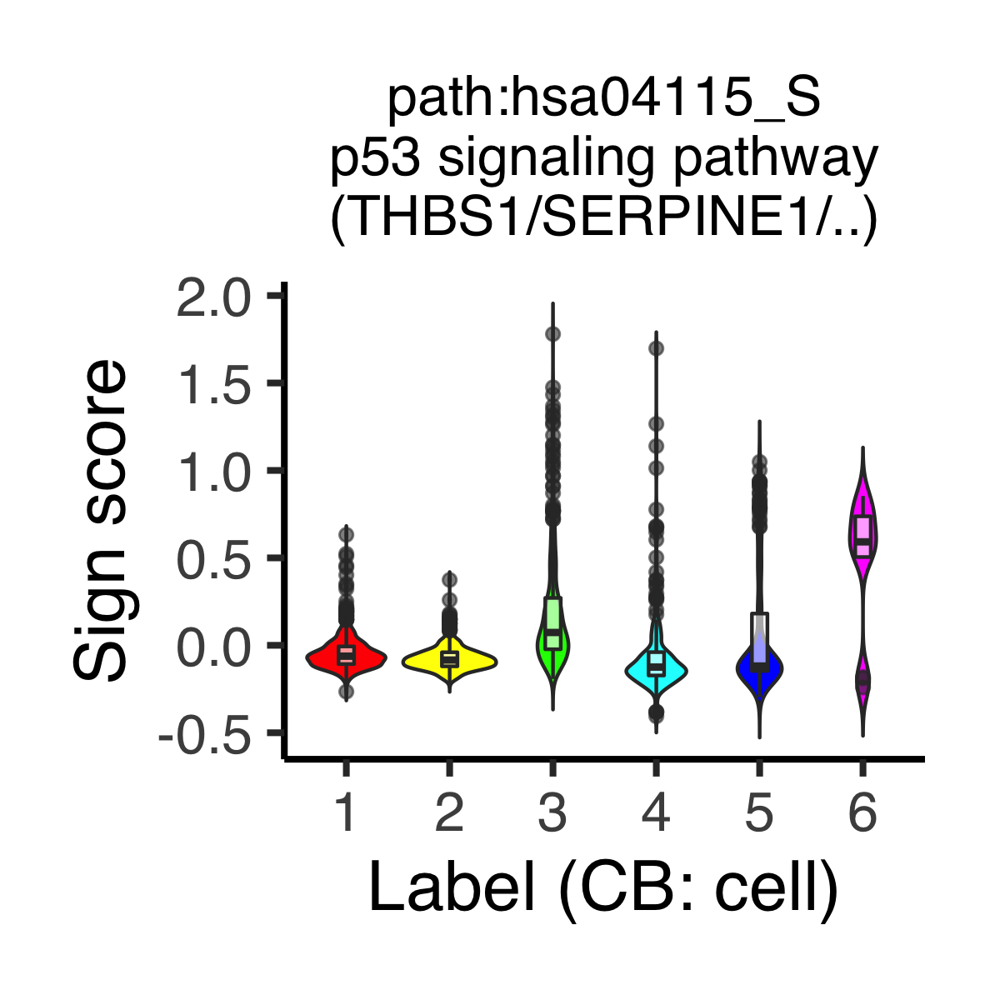
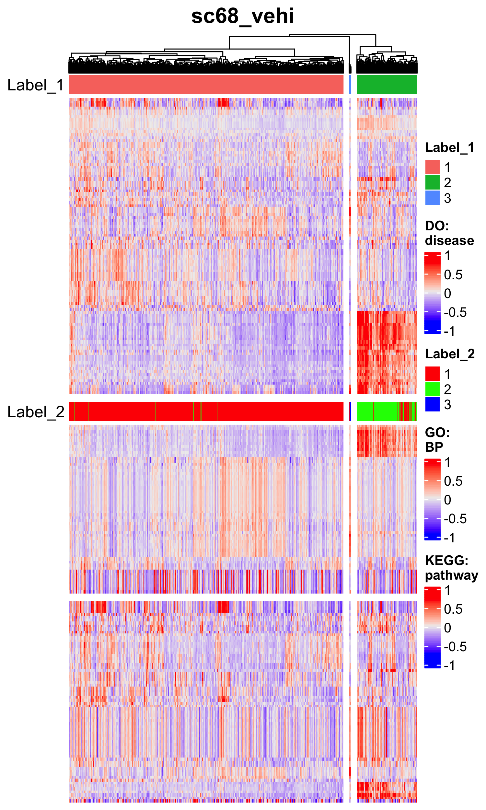
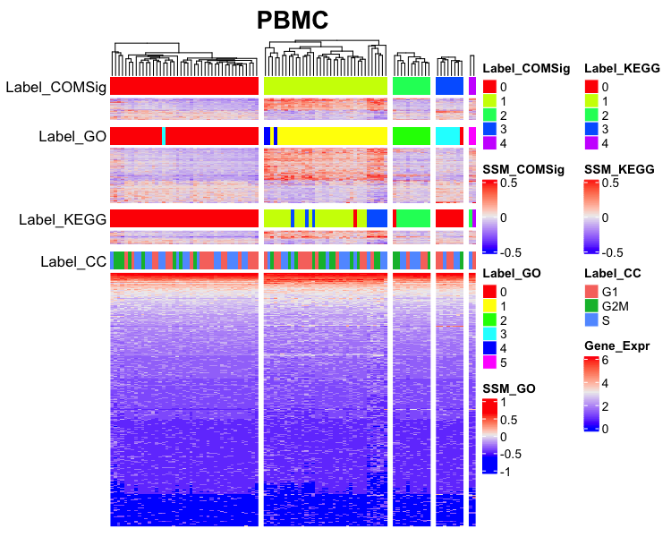
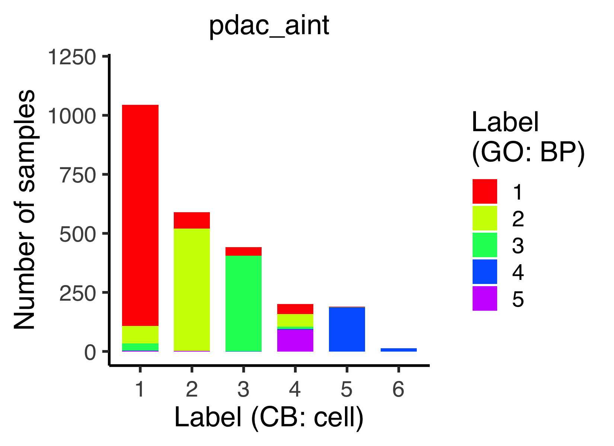
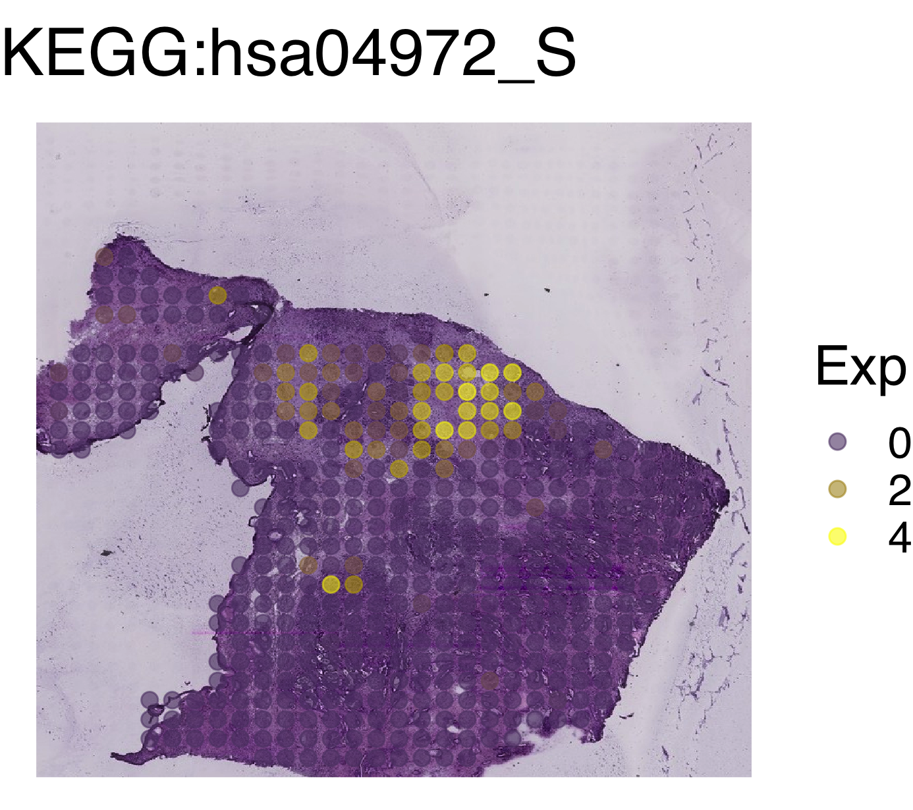
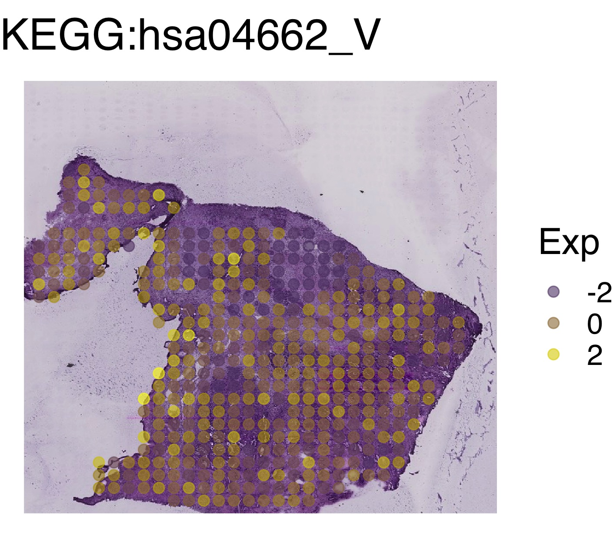

# Multi-layered analysis across all the signs {#multi_layered}
In this section, we concatenate all the sign-by-sample matrices (SSMs).
Users can simultaneously visualize cell states from various viewpoints
such as cell type, biological process, and signaling pathway.


## Concatenate ASURAT objects
Load the data.
```{r, eval = FALSE}
rm(list = ls())
source("R/plot.R")
source("R/function_asurat.R")
# ----------------------------------------
# Cell type
# ----------------------------------------
sc68_vehi_DO <- readRDS(file = "backup/01_104_sc68_vehi_DES_DO.rds")
sc68_cisp_DO <- readRDS(file = "backup/02_104_sc68_cisp_DES_DO.rds")
pdac_aint_CB <- readRDS(file = "backup/07_104_pdac_aint_DES_CB.rds")
pbmc_4000_CO <- readRDS(file = "backup/10_104_pbmc_4000_DES_CO.rds")
pbmc_6000_CO <- readRDS(file = "backup/11_104_pbmc_6000_DES_CO.rds")
# ----------------------------------------
# Biological process
# ----------------------------------------
sc68_vehi_GO <- readRDS(file = "backup/01_204_sc68_vehi_DES_GO.rds")
sc68_cisp_GO <- readRDS(file = "backup/02_202_sc68_cisp_reduction_GO.rds")
pdac_aint_GO <- readRDS(file = "backup/07_204_pdac_aint_DES_GO.rds")
pbmc_4000_GO <- readRDS(file = "backup/10_204_pbmc_4000_DES_GO.rds")
pbmc_6000_GO <- readRDS(file = "backup/11_204_pbmc_6000_DES_GO.rds")
```

The following function `concatenate_obj_sign()` concatenates two ASURAT objects,
`obj2` at the end of `obj1`.
```{r, eval = FALSE}
sc68_vehi <- concatenate_obj_sign(obj1 = sc68_vehi_DO, obj2 = sc68_vehi_GO)
sc68_cisp <- concatenate_obj_sign(obj1 = sc68_cisp_DO, obj2 = sc68_cisp_GO)
pdac_aint <- concatenate_obj_sign(obj1 = pdac_aint_CB, obj2 = pdac_aint_GO)
pbmc_4000 <- concatenate_obj_sign(obj1 = pbmc_4000_CO, obj2 = pbmc_4000_GO)
pbmc_6000 <- concatenate_obj_sign(obj1 = pbmc_6000_CO, obj2 = pbmc_6000_GO)
rm(sc68_vehi_DO, sc68_vehi_GO,
   sc68_cisp_DO, sc68_cisp_GO,
   pdac_aint_CB, pdac_aint_GO,
   pbmc_4000_CO, pbmc_4000_GO,
   pbmc_6000_CO, pbmc_6000_GO)
```

```{r, eval = FALSE}
# ----------------------------------------
# Pathway activity
# ----------------------------------------
sc68_vehi_KEGG <- readRDS(file = "backup/01_302_sc68_vehi_reduction_KEGG.rds")
sc68_cisp_KEGG <- readRDS(file = "backup/02_302_sc68_cisp_reduction_KEGG.rds")
pdac_aint_KEGG <- readRDS(file = "backup/07_302_pdac_aint_reduction_KEGG.rds")
pbmc_4000_KEGG <- readRDS(file = "backup/10_304_pbmc_4000_DES_KEGG.rds")
pbmc_6000_KEGG <- readRDS(file = "backup/11_304_pbmc_6000_DES_KEGG.rds")

sc68_vehi <- concatenate_obj_sign(obj1 = sc68_vehi, obj2 = sc68_vehi_KEGG)
sc68_cisp <- concatenate_obj_sign(obj1 = sc68_cisp, obj2 = sc68_cisp_KEGG)
pdac_aint <- concatenate_obj_sign(obj1 = pdac_aint, obj2 = pdac_aint_KEGG)
pbmc_4000 <- concatenate_obj_sign(obj1 = pbmc_4000, obj2 = pbmc_4000_KEGG)
pbmc_6000 <- concatenate_obj_sign(obj1 = pbmc_6000, obj2 = pbmc_6000_KEGG)
rm(sc68_vehi_KEGG,
   sc68_cisp_KEGG,
   pdac_aint_KEGG,
   pbmc_4000_KEGG,
   pbmc_6000_KEGG)
```


## Find significant signs and genes across different data types
Assume that `obj` has clustering results for DO but does not for GO and KEGG.
Even if that is the case, one can investigate significant signs for GO and KEGG
by computing their separation indices across groups for DO.

As described in the [previous section](#cell_type),
the following function `auto_find_marker_sign()` computes separation indices
of signs of interest for each subpopulation.
The arguments are `obj`,
`data_type_for_label` (`data_type` used for sample clustering),
`category_for_label` (`category` used for sample clustering),
`algo_name_for_label` (`algo_name` used for sample clustering),
`data_type_for_expr` (`data_type` that the signs of interest belong to),
`category_for_expr` (`category` that the signs of interest belong to).
This function helps users find positive and negative marker signs of `label_1`
with the positive and negative values of the indices, respectively.
```{r, eval = FALSE}
# ----------------------------------------
# sc68_vehi
# ----------------------------------------
sc68_vehi <- auto_find_marker_sign(obj = sc68_vehi,
                                   data_type_for_label = "GO",
                                   category_for_label = "BP",
                                   algo_name_for_label = "seuratFindClusters",
                                   data_type_for_expr = "DO",
                                   category_for_expr = "disease")

sc68_vehi <- auto_find_marker_sign(obj = sc68_vehi,
                                   data_type_for_label = "GO",
                                   category_for_label = "BP",
                                   algo_name_for_label = "seuratFindClusters",
                                   data_type_for_expr = "KEGG",
                                   category_for_expr = "pathway")
# ----------------------------------------
# sc68_cisp
# ----------------------------------------
sc68_cisp <- auto_find_marker_sign(obj = sc68_cisp,
                                   data_type_for_label = "DO",
                                   category_for_label = "disease",
                                   algo_name_for_label = "merlot",
                                   data_type_for_expr = "GO",
                                   category_for_expr = "BP")

sc68_cisp <- auto_find_marker_sign(obj = sc68_cisp,
                                   data_type_for_label = "DO",
                                   category_for_label = "disease",
                                   algo_name_for_label = "merlot",
                                   data_type_for_expr = "KEGG",
                                   category_for_expr = "pathway")
# ----------------------------------------
# pdac_aint
# ----------------------------------------
pdac_aint <- auto_find_marker_sign(obj = pdac_aint,
                                   data_type_for_label = "CB",
                                   category_for_label = "cell",
                                   algo_name_for_label = "seuratFindClusters",
                                   data_type_for_expr = "KEGG",
                                   category_for_expr = "pathway")
```
The results are stored in
`obj[["marker"]][[data_type_for_expr]][[category_for_expr]]`.
Here `sep_I` stands for separation indices of signs, which quantifies the
extent of separation between two different sets of random variables.
See [previous section](#cell_type) for implementing `find_marker_sign()` and
`auto_find_marker_gene()`.

```{r, eval = FALSE}
datatable(sc68_vehi[["marker"]][["KEGG"]][["pathway"]][["all"]],
          rownames = FALSE)
datatable(sc68_cisp[["marker"]][["KEGG"]][["pathway"]][["all"]],
          rownames = FALSE)
datatable(pdac_aint[["marker"]][["KEGG"]][["pathway"]][["all"]],
          rownames = FALSE)
```

As described in the [previous section](#cell_type),
the following function `plot_violin_signScore()` shows distribution of
sign scores across all the clusters by violin plots.
The arguments are `obj`, `sign_name` (sign ID),
`data_type_for_label` (`data_type` used for sample clustering),
`category_for_label` (`category` used for sample clustering),
`algo_name_for_label` (`algo_name` used for sample clustering),
`data_type_for_expr` (`data_type` that the signs of interest belong to),
`category_for_expr` (`category` that the signs of interest belong to).
```{r, eval = FALSE}
# ----------------------------------------
# sc68_vehi
# ----------------------------------------
p <- plot_violin_signScore(
  obj = sc68_vehi, sign_name = "DOID:5409_V",
  data_type_for_label = "GO", category_for_label = "BP",
  algo_name_for_label = "seuratFindClusters",
  data_type_for_expr = "DO", category_for_expr = "disease",
  title = "DOID:5409_V\nLung small cell carcinoma\n(MKI67/BIRC5/..)",
  title_size = 16, default_color = FALSE)
filename <- "figures/figure_01_0400.png"
ggsave(file = filename, plot = p, dpi = 300, width = 4, height = 4)
```

```{r, eval = FALSE, echo = FALSE, results = "hide"}
# ----------------------------------------
# sc68_vehi
# ----------------------------------------
p <- plot_violin_signScore(
  obj = sc68_vehi, sign_name = "path:hsa01524_S",
  data_type_for_label = "GO", category_for_label = "BP",
  algo_name_for_label = "seuratFindClusters",
  data_type_for_expr = "KEGG", category_for_expr = "pathway",
  title = "KEGG:hsa01524_S\nPlatinum drug resistance\n(TOP2A/BIRC5/..)",
  title_size = 16, default_color = FALSE)
filename <- "figures/figure_01_0401.png"
ggsave(file = filename, plot = p, dpi = 300, width = 4, height = 4)
# ----------------------------------------
# pdac_aint
# ----------------------------------------
p <- plot_violin_signScore(
  obj = pdac_aint, sign_name = "path:hsa04512_S",
  data_type_for_label = "CB", category_for_label = "cell",
  algo_name_for_label = "seuratFindClusters",
  data_type_for_expr = "KEGG", category_for_expr = "pathway",
  title = "path:hsa04512_S\nECM-receptor interaction\n(COL1A1/LAMB1/..)",
  title_size = 16, default_color = FALSE)
filename <- "figures/figure_07_0400.png"
ggsave(file = filename, plot = p, dpi = 300, width = 4, height = 4)

p <- plot_violin_signScore(
  obj = pdac_aint, sign_name = "path:hsa04115_S",
  data_type_for_label = "CB", category_for_label = "cell",
  algo_name_for_label = "seuratFindClusters",
  data_type_for_expr = "KEGG", category_for_expr = "pathway",
  title = "path:hsa04115_S\np53 signaling pathway\n(THBS1/SERPINE1/..)",
  title_size = 16, default_color = FALSE)
filename <- "figures/figure_07_0401.png"
ggsave(file = filename, plot = p, dpi = 300, width = 4, height = 4)
```





As described in the [previous section](#cell_type),
the following function `plot_pseudotime_vs_signscore()` plots sign scores
versus pseudotime for a given sign, in which filled circles, bold lines,
and the shade regions stand for the expression values of samples, mean
expression levels, and standard deviations (this value is 0 if there are less
than three samples), respectively.
The arguments `data_type_for_tree` and `category_for_tree` are the data type
and category used for the branch-based clustering of cells (i.e., the
labels assigned to the branches), while `data_type_for_expr` and
`category_for_expr` for sign scores of signs of interest.
```{r, eval = FALSE}
# ----------------------------------------
# sc68_cisp
# ----------------------------------------
p <- plot_pseudotime_vs_signscore(
  obj = sc68_cisp, sign_name = "path:hsa01524_S",
  data_type_for_tree = "DO", category_for_tree = "disease",
  data_type_for_expr = "KEGG", category_for_expr = "pathway",
  title = "KEGG:hsa01524_S\nPlatinum drug resistance\n(TOP2A/BIRC5/..)",
  title_size = 22, label_name = "Label\n(DO: disease)",
  xlabel = "Pseudotime (DO: disease)", ylabel = "Sign score")
filename <- "figures/figure_02_0400.png"
ggsave(file = filename, plot = p, dpi = 300, width = 7.5, height = 5)
```

```{r, eval = FALSE, echo = FALSE, results = "hide"}
# ----------------------------------------
# sc68_cisp
# ----------------------------------------
p <- plot_pseudotime_vs_signscore(
  obj = sc68_cisp, sign_name = "path:hsa05235_S",
  data_type_for_tree = "DO", category_for_tree = "disease",
  data_type_for_expr = "KEGG", category_for_expr = "pathway",
  title = "KEGG:hsa05235_S\nPD-L1 expression..\n(NFKBI1/HIF1A/..)",
  title_size = 22, label_name = "Label\n(DO: disease)",
  xlabel = "Pseudotime (DO: disease)", ylabel = "Sign score")
filename <- "figures/figure_02_0401.png"
ggsave(file = filename, plot = p, dpi = 300, width = 7.5, height = 5)

p <- plot_pseudotime_vs_signscore(
  obj = sc68_cisp, sign_name = "GO:0006886_S",
  data_type_for_tree = "DO", category_for_tree = "disease",
  data_type_for_expr = "GO", category_for_expr = "BP",
  title = "GO:0006886_S\nIntracellular protein transport\n(CD24/SEC61G/..)",
  title_size = 22, label_name = "Label\n(DO: disease)",
  xlabel = "Pseudotime (DO: disease)", ylabel = "Sign score")
filename <- "figures/figure_02_0402.png"
ggsave(file = filename, plot = p, dpi = 300, width = 7.5, height = 5)
```


The following function `plot_MultiHeatmaps_SignxSamp()` vertically concatenates
two or more heat maps across different databases.
The arguments are `obj` (ASURAT object), `data_types` (vector of data types,
where the first element is used for the cell clustering),
`categories` (vector of categories, where the first element is used for the
cell clustering), `algo_names` (vector of the name of algorithm used for
the cell clustering: in the current version, one of `NULL`,
`"pam"`, `"hclustCutree"`, `"seuratFindClusters"`, and `"merlot"`),
`show_labels` (vector of `TRUE` or `FALSE`: if `TRUE`, clustering labels
are shown), `splitting` (if `TRUE`, heat map is split by the first element of
`data_type`), `method` (agglomeration method to be used, e.g.,
`complete`, `ward.D2`, `average`, etc.),
`show_nReads` (if `TRUE`, number of reads is shown), `title`, `names`
(vector of names of the color bar), `show_rownames_sign`
(if `TRUE`, the name of sign is shown), `show_rownames_label`
(if `TRUE`, the name of label is shown), `show_rownames_nReads`
(if `TRUE`, the name of number of reads is shown), and
`default_colors` (vector of `TRUE` or `FALSE` for each classification:
if `TRUE`, the default color of ggplot is used, otherwise rainbow).

**Tips:**
To check the methods used for clustering, see `obj[["sample"]]`.
```{r, eval = FALSE}
# ----------------------------------------
# sc68_vehi
# ----------------------------------------
filename <- "figures/figure_01_0410.png"
png(file = filename, height = 2500, width = 1500, res = 300)
plot_MultiHeatmaps_SignxSamp(
  obj = sc68_vehi,
  data_types = c("DO", "GO", "KEGG"),
  categories = c("disease", "BP", "pathway"),
  algo_names = c("seuratFindClusters", "seuratFindClusters", NULL),
  show_labels = c(TRUE, TRUE, FALSE),
  splitting = TRUE, method = "ward.D2", show_nReads = FALSE,
  title = "sc68_vehi",
  names = c("DO:\ndisease", "GO:\nBP", "KEGG:\npathway"),
  show_rownames_sign = FALSE, show_rownames_label = FALSE,
  show_rownames_nReads = FALSE, default_colors = c(TRUE, FALSE, FALSE))
dev.off()
```

```{r, eval = FALSE, echo = FALSE, results = "hide"}
# ----------------------------------------
# sc68_cisp
# ----------------------------------------
filename <- "figures/figure_02_0410.png"
png(file = filename, height = 2500, width = 1500, res = 300)
plot_MultiHeatmaps_SignxSamp(
  obj = sc68_cisp,
  data_types = c("DO", "GO", "KEGG"),
  categories = c("disease", "BP", "pathway"),
  algo_names = c("merlot", NULL, NULL),
  show_labels = c(TRUE, FALSE, FALSE),
  splitting = TRUE, method = "ward.D2", show_nReads = FALSE,
  title = "sc68_cisp",
  names = c("DO:\ndisease", "GO:\nBP", "KEGG:\npathway"),
  show_rownames_sign = FALSE, show_rownames_label = FALSE,
  show_rownames_nReads = FALSE, default_colors = c(TRUE, FALSE, FALSE))
dev.off()
# ----------------------------------------
# pdac_aint
# ----------------------------------------
filename <- "figures/figure_07_0410.png"
png(file = filename, height = 2500, width = 1500, res = 300)
plot_MultiHeatmaps_SignxSamp(
  obj = pdac_aint,
  data_types = c("CB", "GO", "KEGG"),
  categories = c("cell", "BP", "pathway"),
  algo_names = c("seuratFindClusters", "seuratFindClusters", NULL),
  show_labels = c(TRUE, TRUE, FALSE),
  splitting = TRUE, method = "ward.D2", show_nReads = FALSE,
  title = "pdac_aint",
  names = c("CB:\ncell", "GO:\nBP", "KEGG:\npathway"),
  show_rownames_sign = FALSE, show_rownames_label = FALSE,
  show_rownames_nReads = FALSE, default_colors = c(TRUE, FALSE, FALSE))
dev.off()
# ----------------------------------------
# pbmc_4000
# ----------------------------------------
filename <- "figures/figure_10_0410.png"
png(file = filename, height = 2500, width = 1500, res = 300)
plot_MultiHeatmaps_SignxSamp(
  obj = pbmc_4000,
  data_types = c("CO", "GO", "KEGG"),
  categories = c("cell", "BP", "pathway"),
  algo_names = c("seuratFindClusters", "seuratFindClusters",
                 "seuratFindClusters"),
  show_labels = c(TRUE, TRUE, TRUE),
  splitting = TRUE, method = "ward.D2", show_nReads = FALSE,
  title = "pbmc_4000",
  names = c("CO:\ncell", "GO:\nBP", "KEGG:\npathway"),
  show_rownames_sign = FALSE, show_rownames_label = FALSE,
  show_rownames_nReads = FALSE, default_colors = c(TRUE, FALSE, FALSE))
dev.off()
# ----------------------------------------
# pbmc_6000
# ----------------------------------------
filename <- "figures/figure_11_0410.png"
png(file = filename, height = 2500, width = 1500, res = 300)
plot_MultiHeatmaps_SignxSamp(
  obj = pbmc_6000,
  data_types = c("CO", "GO", "KEGG"),
  categories = c("cell", "BP", "pathway"),
  algo_names = c("seuratFindClusters", "seuratFindClusters",
                 "seuratFindClusters"),
  show_labels = c(TRUE, TRUE, TRUE),
  splitting = TRUE, method = "ward.D2", show_nReads = FALSE,
  title = "pbmc_6000",
  names = c("CO:\ncell", "GO:\nBP", "KEGG:\npathway"),
  show_rownames_sign = FALSE, show_rownames_label = FALSE,
  show_rownames_nReads = FALSE, default_colors = c(TRUE, FALSE, FALSE))
dev.off()
```





The following function `plot_MultiBargraphs_sign()` shows the population sizes
by two-variable bar graphs.
The arguments are `obj`, `data_type_1` (for data type in x-axis),
`category_1` (for x-axis), `algo_name_1` (for x-axix), `data_type_2`
(for data type in y-axis), `category_2` (for y-axis),
`algo_name_2` (for y-axis), `title`, `title_size`,
`cbar_title` (label of the color bar), `xlabel`, `ylabel`, `ymax`, and
`default_color` (if `TRUE`, the default color of ggplot is used,
otherwise rainbow).
```{r, eval = FALSE}
# ----------------------------------------
# sc68_vehi
# ----------------------------------------
p <- plot_MultiBargraphs_sign(
  obj = sc68_vehi, data_type_1 = "DO", category_1 = "disease",
  algo_name_1 = "seuratFindClusters",
  data_type_2 = "GO", category_2 = "BP",
  algo_name_2 = "seuratFindClusters",
  title = "sc68_vehi", title_size = 18, cbar_title = "Label\n(GO: BP)",
  xlabel = "Label (DO: disease)", ylabel = "Number of samples", ymax = 3500,
  default_color = FALSE)
filename <- "figures/figure_01_0415.png"
ggsave(file = filename, plot = p, dpi = 300, width = 5.5, height = 4)
```

```{r, eval = FALSE, echo = FALSE, results = "hide"}
# ----------------------------------------
# pdac_aint
# ----------------------------------------
p <- plot_MultiBargraphs_sign(
  obj = pdac_aint, data_type_1 = "CB", category_1 = "cell",
  algo_name_1 = "seuratFindClusters",
  data_type_2 = "GO", category_2 = "BP",
  algo_name_2 = "seuratFindClusters",
  title = "pdac_aint", title_size = 18, cbar_title = "Label\n(GO: BP)",
  xlabel = "Label (CB: cell)", ylabel = "Number of samples", ymax = 1200,
  default_color = FALSE)
filename <- "figures/figure_07_0415.png"
ggsave(file = filename, plot = p, dpi = 300, width = 5.5, height = 4)
# ----------------------------------------
# pbmc_4000
# ----------------------------------------
p <- plot_MultiBargraphs_sign(
  obj = pbmc_4000, data_type_1 = "CO", category_1 = "cell",
  algo_name_1 = "seuratFindClusters",
  data_type_2 = "GO", category_2 = "BP",
  algo_name_2 = "seuratFindClusters",
  title = "pbmc_4000", title_size = 18, cbar_title = "Label\n(GO: BP)",
  xlabel = "Label (CO: cell)", ylabel = "Number of samples", ymax = 2000,
  default_color = FALSE)
filename <- "figures/figure_10_0415.png"
ggsave(file = filename, plot = p, dpi = 300, width = 5.5, height = 4)

p <- plot_MultiBargraphs_sign(
  obj = pbmc_4000, data_type_1 = "CO", category_1 = "cell",
  algo_name_1 = "seuratFindClusters",
  data_type_2 = "KEGG", category_2 = "pathway",
  algo_name_2 = "seuratFindClusters",
  title = "pbmc_4000", title_size = 18, cbar_title = "Label\n(KEGG: pathway)",
  xlabel = "Label (CO: cell)", ylabel = "Number of samples", ymax = 2000,
  default_color = FALSE)
filename <- "figures/figure_10_0416.png"
ggsave(file = filename, plot = p, dpi = 300, width = 6.3, height = 4)
# ----------------------------------------
# pbmc_6000
# ----------------------------------------
p <- plot_MultiBargraphs_sign(
  obj = pbmc_6000, data_type_1 = "CO", category_1 = "cell",
  algo_name_1 = "seuratFindClusters",
  data_type_2 = "GO", category_2 = "BP",
  algo_name_2 = "seuratFindClusters",
  title = "pbmc_6000", title_size = 18, cbar_title = "Label\n(GO: BP)",
  xlabel = "Label (CO: cell)", ylabel = "Number of samples", ymax = 2000,
  default_color = FALSE)
filename <- "figures/figure_11_0415.png"
ggsave(file = filename, plot = p, dpi = 300, width = 5.5, height = 4)

p <- plot_MultiBargraphs_sign(
  obj = pbmc_6000, data_type_1 = "CO", category_1 = "cell",
  algo_name_1 = "seuratFindClusters",
  data_type_2 = "KEGG", category_2 = "pathway",
  algo_name_2 = "seuratFindClusters",
  title = "pbmc_6000", title_size = 18, cbar_title = "Label\n(KEGG: pathway)",
  xlabel = "Label (CO: cell)", ylabel = "Number of samples", ymax = 2000,
  default_color = FALSE)
filename <- "figures/figure_11_0416.png"
ggsave(file = filename, plot = p, dpi = 300, width = 6.3, height = 4)
```





Save the objects.
```{r, eval = FALSE}
saveRDS(sc68_vehi, file = "backup/01_400_sc68_vehi_all.rds")
saveRDS(sc68_cisp, file = "backup/02_400_sc68_cisp_all.rds")
saveRDS(pdac_aint, file = "backup/07_400_pdac_aint_all.rds")
saveRDS(pbmc_4000, file = "backup/10_400_pbmc_4000_all.rds")
saveRDS(pbmc_6000, file = "backup/11_400_pbmc_6000_all.rds")
```

Load the objects.
```{r, eval = FALSE}
sc68_vehi <- readRDS(file = "backup/01_400_sc68_vehi_all.rds")
sc68_cisp <- readRDS(file = "backup/02_400_sc68_cisp_all.rds")
pdac_aint <- readRDS(file = "backup/07_400_pdac_aint_all.rds")
pbmc_4000 <- readRDS(file = "backup/10_400_pbmc_4000_all.rds")
pbmc_6000 <- readRDS(file = "backup/11_400_pbmc_6000_all.rds")
```


## Spatial mapping by Spaniel
Load the data.
```{r, eval = FALSE}
pdac_aint <- readRDS(file = "backup/07_400_pdac_aint_all.rds")
pdac_ast1 <- readRDS(file = "backup/05_005_pdac_ast1_normalized.rds")
fn <- "data/2020_001_Moncada/pdac_ast1/tissue_positions_list_spatial_object.tsv"
```

Create a Seurat object keeping only ST spots in integrated data `pdac_aint`.
```{r, eval = FALSE}
# ----------------------------------------
# pdac_aint
# ----------------------------------------
tmp <- pdac_aint[["sample"]]
tmp <- tmp[which(tmp$orig_ident == "ST"),]
pdac_aint[["sample"]] <- tmp

mat <- pdac_aint[["sign"]][["KEGGxSample"]][["pathway"]]
tmp <- pdac_aint[["sample"]][["barcode"]]
mat <- mat[, which(colnames(mat) %in% tmp)]
colnames(mat) <- pdac_ast1[["sample"]][["spot"]]  # This is required by Spaniel
# ----------------------------------------
# se
# ----------------------------------------
se <- Spaniel::createSeurat(counts = mat, barcodeFile = fn,
                            projectName = "PDAC-A", sectionNumber = "1")
se@images <- pdac_aint[["misc"]][["images"]]
```

Pre-processing.
```{r, eval = FALSE}
tmp <- pdac_aint[["sample"]][["seuratFindClusters_CB_cell"]]
se@meta.data[["cluster"]] <- tmp
SetIdent(se, value = "cluster")
se <- ScaleData(se)
```

Visualize sign scores on histological images.
Note that in `se` underscores "_" were replaced with hyphens "-".
```{r, eval = FALSE}
p <- spanielPlot(object = se, grob = se@images[[1]], plotType = "Gene",
                 gene = "path:hsa04512-S", ptSizeMax = 2.5,  ptSizeMin = 0,
                 customTitle = "KEGG:hsa04512_S")
filename <- "figures/figure_07_0420.png"
ggsave(file = filename, plot = p, dpi = 300, width = 4.7, height = 4.1)
```

```{r, eval = FALSE, echo = FALSE, results = "hide"}
p <- spanielPlot(object = se, grob = se@images[[1]], plotType = "Gene",
                 gene = "path:hsa04115-S", ptSizeMax = 2.5,  ptSizeMin = 0,
                 customTitle = "KEGG:hsa04115_S")
filename <- "figures/figure_07_0421.png"
ggsave(file = filename, plot = p, dpi = 300, width = 4.7, height = 4.1)

p <- spanielPlot(object = se, grob = se@images[[1]], plotType = "Gene",
                 gene = "path:hsa04972-S", ptSizeMax = 2.5,  ptSizeMin = 0,
                 customTitle = "KEGG:hsa04972_S")
filename <- "figures/figure_07_0422.png"
ggsave(file = filename, plot = p, dpi = 300, width = 4.62, height = 4.1)

p <- spanielPlot(object = se, grob = se@images[[1]], plotType = "Gene",
                 gene = "path:hsa04662-V", ptSizeMax = 2.5,  ptSizeMin = 0,
                 customTitle = "KEGG:hsa04662_V")
filename <- "figures/figure_07_0423.png"
ggsave(file = filename, plot = p, dpi = 300, width = 4.7, height = 4.1)
```

* KEGG:hsa04512_S ECM-receptor interaction (COL1A1/LAMB1/..)


* KEGG:hsa04115_S p53 signaling pathway (THBS1/SERPINE1/..)


* KEGG:hsa04972_S Pancreatic secretion (PNLIP/CTRB1/..)



* KEGG:hsa04662_V B cell receptor signaling pathway (FOS/NFKBIA/..)


