# Appendix A: analyzing scRNA-seq data by existing method I
In this section, we analyze scRNA-seq datasets using scran.

The following libraries are used.
```{r, eval = FALSE}
library(tidyverse)       # For efficient handling of data.frame
library(DT)              # For using datatable
library(Rtsne)           # For using Rtsne
library(umap)            # For using umap
library(destiny)         # For using diffusion map
library(scRNAseq)        # For using scran
library(scran)           # For using scran
library(scuttle)         # For using scran
library(scater)          # For using scran
```

```{r}
packageVersion("scran")
```

```
[1] '1.18.7'
```


## Preprocessing
Load the data.
```{r, eval = FALSE}
rm(list=ls())
source("R/function_scran.R")
sc68_vehi <- readRDS(file = "backup/01_005_sc68_vehi_normalized.rds")
sc68_cisp <- readRDS(file = "backup/02_005_sc68_cisp_normalized.rds")
pbmc_4000 <- readRDS(file = "backup/10_005_pbmc_4000_normalized.rds")
pbmc_6000 <- readRDS(file = "backup/11_005_pbmc_6000_normalized.rds")
```

Check the size of the gene-by-sample matrices.
```{r, eval = FALSE}
dim(sc68_vehi[["data"]][["raw"]])
dim(sc68_cisp[["data"]][["raw"]])
dim(pbmc_4000[["data"]][["raw"]])
dim(pbmc_6000[["data"]][["raw"]])
```

```
[1] 6581 3923
[1] 6347 2285
[1] 6658 3815
[1] 5169 4878
```

Create scran objects.
```{r, eval = FALSE}
sc68_vehi <- SingleCellExperiment(
  list(counts = as.matrix(sc68_vehi[["data"]][["bayNorm"]][["Bay_out"]])))

sc68_cisp <- SingleCellExperiment(
  list(counts = as.matrix(sc68_cisp[["data"]][["bayNorm"]][["Bay_out"]])))

pbmc_4000 <- SingleCellExperiment(
  list(counts = as.matrix(pbmc_4000[["data"]][["bayNorm"]][["Bay_out"]])))

pbmc_6000 <- SingleCellExperiment(
  list(counts = as.matrix(pbmc_6000[["data"]][["bayNorm"]][["Bay_out"]])))
```

According to `scran`'s protocol, we perform the following procedures:

1. perform cell clustering for computing a size factor for each cluster,
2. perform normalization within each cluster, perform a variance modeling for
each gene, and
3. extract highly variable genes for the downstream analyses, in which we
decompose the total variance of each gene into its biological and technical
components by fitting a trend to the endogenous variances and subtracting the
fitted value from the total variance to obtain the biological component for
each gene.
```{r, eval = FALSE}
sc68_vehi <- process_001_scran(obj_sce = sc68_vehi)
sc68_cisp <- process_001_scran(obj_sce = sc68_cisp)
pbmc_4000 <- process_001_scran(obj_sce = pbmc_4000)
pbmc_6000 <- process_001_scran(obj_sce = pbmc_6000)
```
Size factors are stored in `obj@colData@listData[["sizeFactor"]]`,
normalized log counts in `obj@assays@data@listData[["logcounts"]]`, and
results of variance modelling in `obj[["dec"]]`.

Visualize the results of variance modeling.
```{r, eval = FALSE}
# ----------------------------------------
# sc68_vehi
# ----------------------------------------
p <- plot_variance_modeling_scran(
  obj = sc68_vehi, title = "sc68_vehi (scran)", title_size = 18,
  xlabel = "Mean log-expression", ylabel = "Variance")
filename <- "figures/figure_01_0500.png"
ggsave(file = filename, plot = p, dpi = 300, width = 4.0, height = 4.0)
```

```{r, eval = FALSE, echo = FALSE, results = "hide"}
# ----------------------------------------
# sc68_cisp
# ----------------------------------------
p <- plot_variance_modeling_scran(
  obj = sc68_cisp, title = "sc68_cisp (scran)", title_size = 18,
  xlabel = "Mean log-expression", ylabel = "Variance")
filename <- "figures/figure_02_0500.png"
ggsave(file = filename, plot = p, dpi = 300, width = 4.0, height = 4.0)
# ----------------------------------------
# pbmc_4000
# ----------------------------------------
p <- plot_variance_modeling_scran(
  obj = pbmc_4000, title = "pbmc_4000 (scran)", title_size = 18,
  xlabel = "Mean log-expression", ylabel = "Variance")
filename <- "figures/figure_10_0500.png"
ggsave(file = filename, plot = p, dpi = 300, width = 4.0, height = 4.0)
# ----------------------------------------
# pbmc_6000
# ----------------------------------------
p <- plot_variance_modeling_scran(
  obj = pbmc_6000, title = "pbmc_6000 (scran)", title_size = 18,
  xlabel = "Mean log-expression", ylabel = "Variance")
filename <- "figures/figure_11_0500.png"
ggsave(file = filename, plot = p, dpi = 300, width = 4.0, height = 4.0)
```


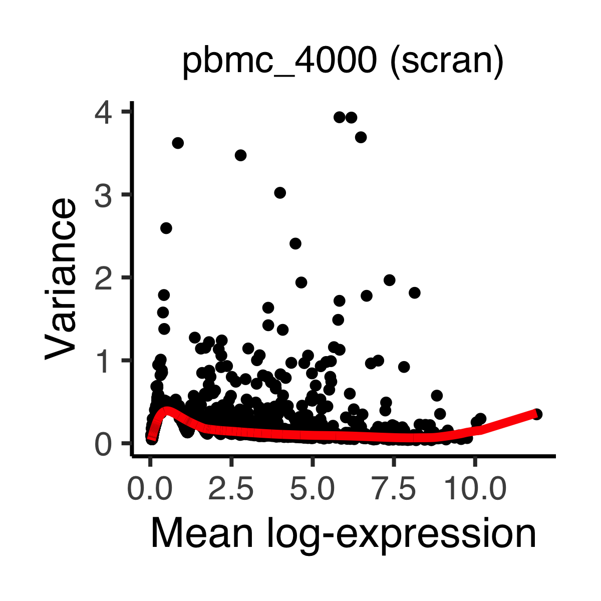


Based on the variance modeling, we can choose top variable genes by
`getTopHVGs()`, and performe principal component analysis (PCA) by inputting
those variable genes.
Note that `getTopHVGs()` has various options to define a subset of interesting
genes.

**Tips:**
As mentioned in Cruz and Wishart, Cancer Inform. 2, 59-77 (2006),
we select highly variable genes as the cell-per-variable gene ratio being 5:1.
```{r, eval = FALSE}
# ----------------------------------------
# sc68_vehi
# ----------------------------------------
hvg <- getTopHVGs(sc68_vehi[["dec"]],
                  n = round(0.2 * dim(sc68_vehi[["sce"]])[2]))
sc68_vehi[["sce"]] <- runPCA(sc68_vehi[["sce"]], subset_row = hvg)
# ----------------------------------------
# sc68_cisp
# ----------------------------------------
hvg <- getTopHVGs(sc68_cisp[["dec"]],
                  n = round(0.2 * dim(sc68_cisp[["sce"]])[2]))
sc68_cisp[["sce"]] <- runPCA(sc68_cisp[["sce"]], subset_row = hvg)
# ----------------------------------------
# pbmc_4000
# ----------------------------------------
hvg <- getTopHVGs(pbmc_4000[["dec"]],
                  n = round(0.2 * dim(pbmc_4000[["sce"]])[2]))
pbmc_4000[["sce"]] <- runPCA(pbmc_4000[["sce"]], subset_row = hvg)
# ----------------------------------------
# pbmc_6000
# ----------------------------------------
hvg <- getTopHVGs(pbmc_6000[["dec"]],
                  n = round(0.2 * dim(pbmc_6000[["sce"]])[2]))
pbmc_6000[["sce"]] <- runPCA(pbmc_6000[["sce"]], subset_row = hvg)
```

Check the eigen value (variance) of each principal component by elbow plot.
```{r, eval = FALSE}
# ----------------------------------------
# sc68_vehi
# ----------------------------------------
p <- plot_pcaEigen_scran(obj = sc68_vehi, title = "sc68_vehi (scran)",
                      title_size = 18, xlabel = "PC", ylabel = "Eigen value")
filename <- "figures/figure_01_0501.png"
ggsave(file = filename, plot = p, dpi = 300, width = 3.5, height = 3.5)
```

```{r, eval = FALSE, echo = FALSE, results = "hide"}
# ----------------------------------------
# sc68_cisp
# ----------------------------------------
p <- plot_pcaEigen_scran(obj = sc68_cisp, title = "sc68_cisp (scran)",
                      title_size = 18, xlabel = "PC", ylabel = "Eigen value")
filename <- "figures/figure_02_0501.png"
ggsave(file = filename, plot = p, dpi = 300, width = 3.5, height = 3.5)
# ----------------------------------------
# pbmc_4000
# ----------------------------------------
p <- plot_pcaEigen_scran(obj = pbmc_4000, title = "pbmc_4000 (scran)",
                      title_size = 18, xlabel = "PC", ylabel = "Eigen value")
filename <- "figures/figure_10_0501.png"
ggsave(file = filename, plot = p, dpi = 300, width = 3.5, height = 3.5)
# ----------------------------------------
# pbmc_6000
# ----------------------------------------
p <- plot_pcaEigen_scran(obj = pbmc_6000, title = "pbmc_6000 (scran)",
                      title_size = 18, xlabel = "PC", ylabel = "Eigen value")
filename <- "figures/figure_11_0501.png"
ggsave(file = filename, plot = p, dpi = 300, width = 3.5, height = 3.5)
```

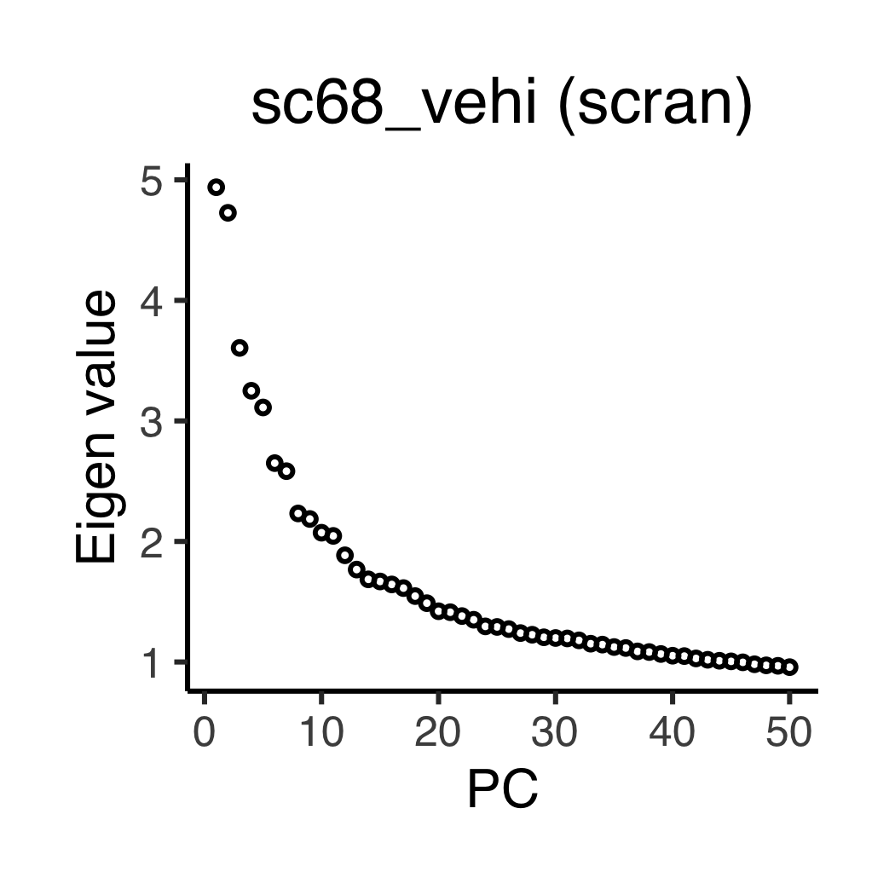
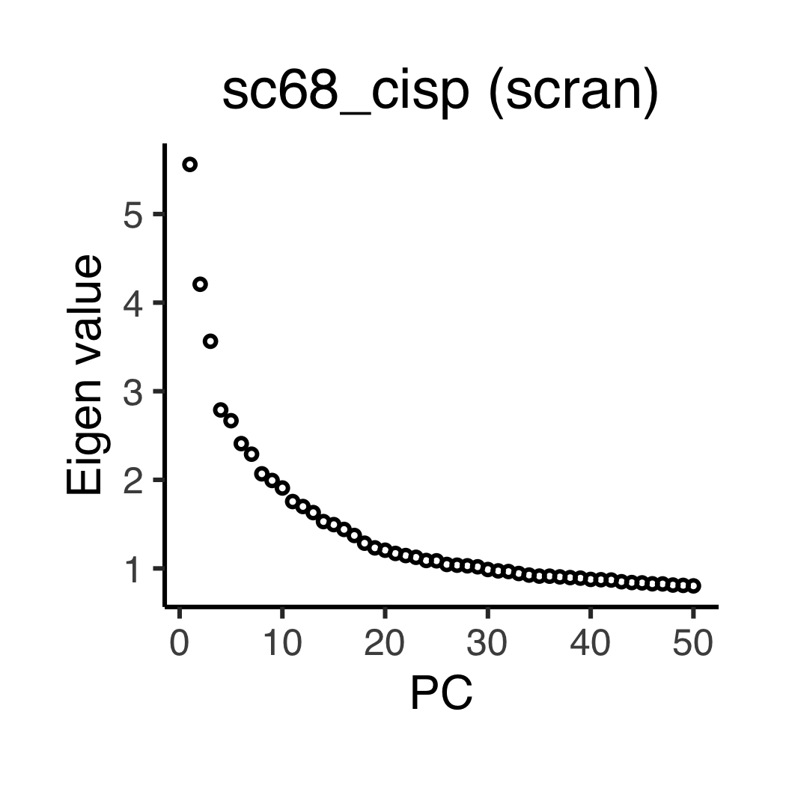

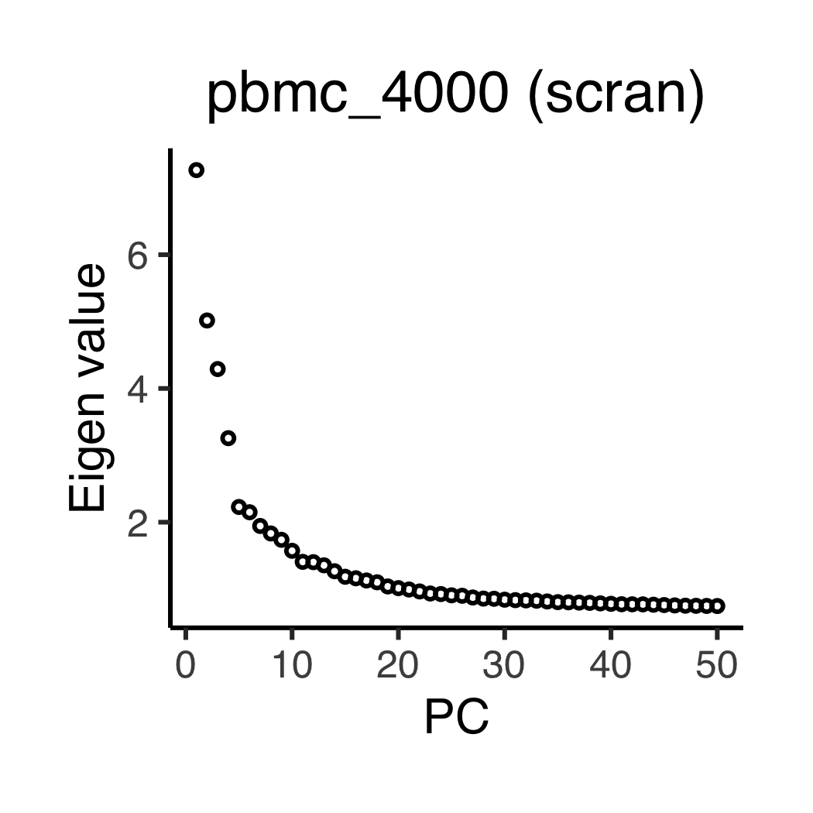
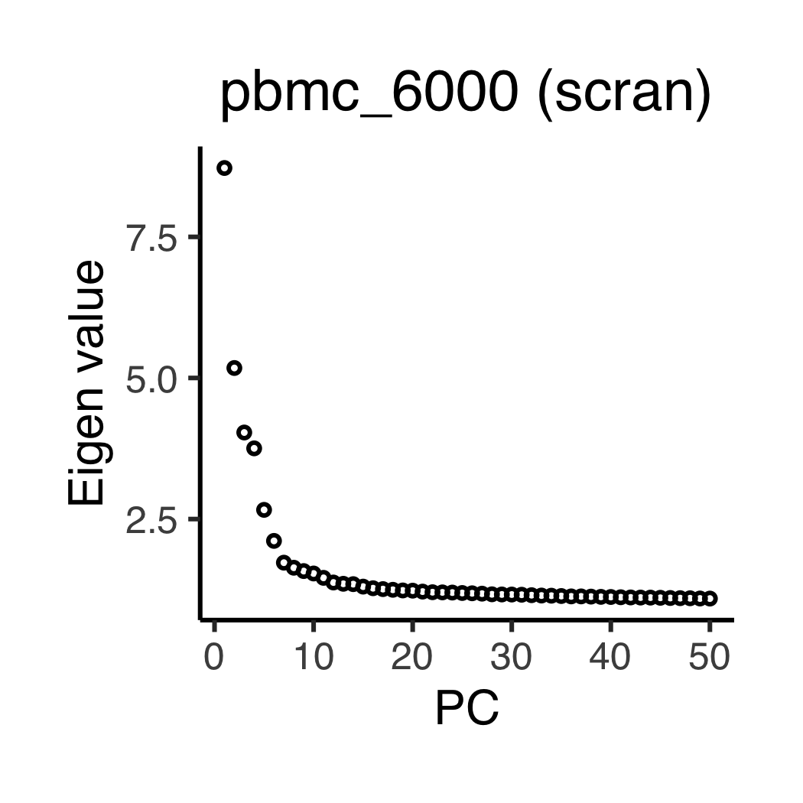


## Cluster cells
According to `scran`'s protocol, we perform the following procedures:

1. automatically reduce the PCA dimension by setting `auto_pca = TRUE` (option),
2. perform k-nearest neighbor graph-based clustering, where `k` is a heuristic
parameter (i.e., resolution parameter).
```{r, eval = FALSE}
# ----------------------------------------
# sc68_vehi
# ----------------------------------------
num_hvg <- getTopHVGs(sc68_vehi[["dec"]],
                      n = round(0.2 * dim(sc68_vehi[["sce"]])[2]))
sc68_vehi <- process_002_scran(obj = sc68_vehi, auto_pca = TRUE,
                               num_hvg = num_hvg, k = 100)
# ----------------------------------------
# sc68_cisp
# ----------------------------------------
num_hvg <- getTopHVGs(sc68_cisp[["dec"]],
                      n = round(0.2 * dim(sc68_cisp[["sce"]])[2]))
sc68_cisp <- process_002_scran(obj = sc68_cisp, auto_pca = TRUE,
                               num_hvg = num_hvg, k = 100)
# ----------------------------------------
# pbmc_4000
# ----------------------------------------
num_hvg <- getTopHVGs(pbmc_4000[["dec"]],
                      n = round(0.2 * dim(pbmc_4000[["sce"]])[2]))
pbmc_4000 <- process_002_scran(obj = pbmc_4000, auto_pca = TRUE,
                               num_hvg = num_hvg, k = 100)
# ----------------------------------------
# pbmc_6000
# ----------------------------------------
num_hvg <- getTopHVGs(pbmc_6000[["dec"]],
                      n = round(0.2 * dim(pbmc_6000[["sce"]])[2]))
pbmc_6000 <- process_002_scran(obj = pbmc_6000, auto_pca = TRUE,
                               num_hvg = num_hvg, k = 100)
```

One can check the reduced number of PCs as follows:
```{r, eval = FALSE}
ncol(reducedDim(sc68_vehi[["sce"]], "PCA"))
ncol(reducedDim(sc68_cisp[["sce"]], "PCA"))
ncol(reducedDim(pbmc_4000[["sce"]], "PCA"))
ncol(reducedDim(pbmc_6000[["sce"]], "PCA"))
```

```
[1] 50
[1] 43
[1] 44
[1] 50
```


## Visualize data in low dimensional space
The following function `do_tsne_scran()` performs two-dimensional `Rtsne()`
in `Rtsne` package.
The arguments are `obj`, and `pca_dim` (dimension of principal component used
for t-SNE, in which `NULL` is accepted if users would like to compute t-SNE
from the original gene expression matrices).
```{r, eval = FALSE}
# ----------------------------------------
# sc68_vehi
# ----------------------------------------
pca_dim <- ncol(reducedDim(sc68_vehi[["sce"]], "PCA"))
sc68_vehi <- do_tsne_scran(obj = sc68_vehi, pca_dim = pca_dim)
# ----------------------------------------
# sc68_cisp
# ----------------------------------------
pca_dim <- ncol(reducedDim(sc68_cisp[["sce"]], "PCA"))
sc68_cisp <- do_tsne_scran(obj = sc68_cisp, pca_dim = pca_dim)
# ----------------------------------------
# pbmc_4000
# ----------------------------------------
pca_dim <- ncol(reducedDim(pbmc_4000[["sce"]], "PCA"))
pbmc_4000 <- do_tsne_scran(obj = pbmc_4000, pca_dim = pca_dim)
# ----------------------------------------
# pbmc_6000
# ----------------------------------------
pca_dim <- ncol(reducedDim(pbmc_6000[["sce"]], "PCA"))
pbmc_6000 <- do_tsne_scran(obj = pbmc_6000, pca_dim = pca_dim)
```
The results are stored in
`obj[["sce"]]@int_colData@listData[["reducedDims"]]@listData[["tsne"]]`.

The following function `plot_tsne_scran()` shows the data in a two-dimensional
t-SNE space.
```{r, eval = FALSE}
# ----------------------------------------
# sc68_vehi
# ----------------------------------------
p <- plot_tsne_scran(obj = sc68_vehi, title = "sc68_vehi (scran)",
                     title_size = 18, xlabel = "tSNE_1", ylabel = "tSNE_2",
                     default_color = TRUE)
filename <- "figures/figure_01_0505.png"
ggsave(file = filename, plot = p, dpi = 300, width = 4.9, height = 4.0)
```

```{r, eval = FALSE, echo = FALSE, results = "hide"}
# ----------------------------------------
# sc68_cisp
# ----------------------------------------
p <- plot_tsne_scran(obj = sc68_cisp, title = "sc68_cisp (scran)",
                     title_size = 18, xlabel = "tSNE_1", ylabel = "tSNE_2",
                     default_color = TRUE)
filename <- "figures/figure_02_0505.png"
ggsave(file = filename, plot = p, dpi = 300, width = 4.9, height = 4.0)
# ----------------------------------------
# pbmc_4000
# ----------------------------------------
p <- plot_tsne_scran(obj = pbmc_4000, title = "pbmc_4000 (scran)",
                     title_size = 18, xlabel = "tSNE_1", ylabel = "tSNE_2",
                     default_color = TRUE)
filename <- "figures/figure_10_0505.png"
ggsave(file = filename, plot = p, dpi = 300, width = 4.9, height = 4.0)
# ----------------------------------------
# pbmc_6000
# ----------------------------------------
p <- plot_tsne_scran(obj = pbmc_6000, title = "pbmc_6000 (scran)",
                     title_size = 18, xlabel = "tSNE_1", ylabel = "tSNE_2",
                     default_color = TRUE)
filename <- "figures/figure_11_0505.png"
ggsave(file = filename, plot = p, dpi = 300, width = 4.9, height = 4.0)
```

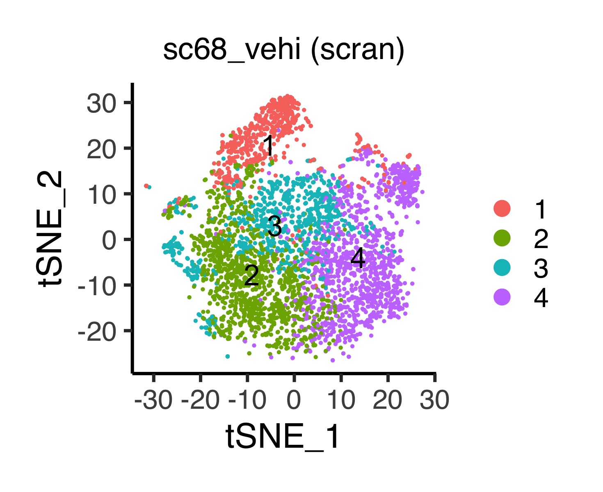
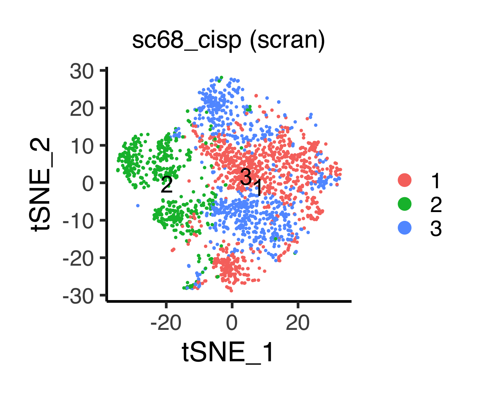


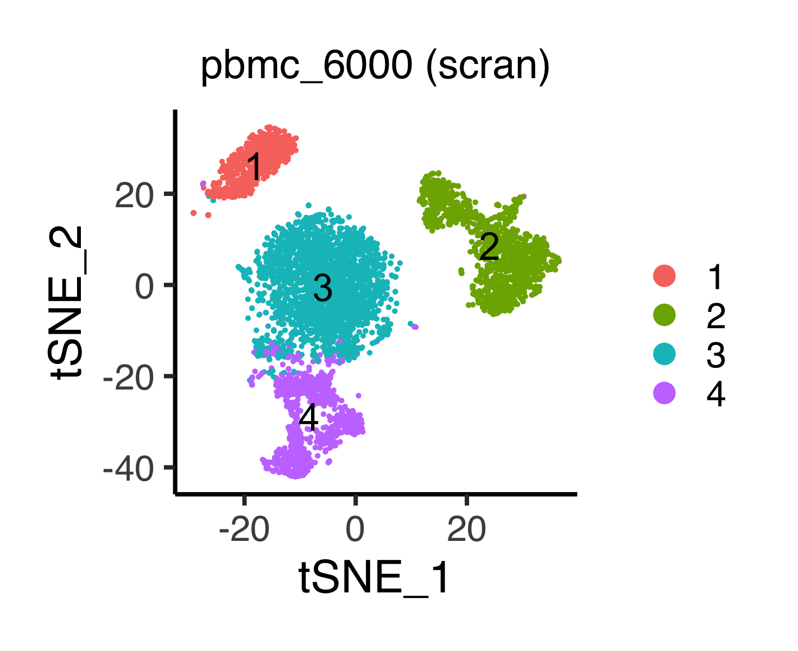

The following function `do_umap_scran()` performs two-dimensional `umap()`
in `umap` package.
The arguments are `obj`, and `pca_dim` (dimension of principal component used
for UMAP, in which `NULL` is accepted if users would like to compute UMAP
from the original gene expression matrices).
```{r, eval = FALSE}
# ----------------------------------------
# sc68_vehi
# ----------------------------------------
pca_dim <- ncol(reducedDim(sc68_vehi[["sce"]], "PCA"))
sc68_vehi <- do_umap_scran(obj = sc68_vehi, pca_dim = pca_dim)
# ----------------------------------------
# sc68_cisp
# ----------------------------------------
pca_dim <- ncol(reducedDim(sc68_cisp[["sce"]], "PCA"))
sc68_cisp <- do_umap_scran(obj = sc68_cisp, pca_dim = pca_dim)
# ----------------------------------------
# pbmc_4000
# ----------------------------------------
pca_dim <- ncol(reducedDim(pbmc_4000[["sce"]], "PCA"))
pbmc_4000 <- do_umap_scran(obj = pbmc_4000, pca_dim = pca_dim)
# ----------------------------------------
# pbmc_6000
# ----------------------------------------
pca_dim <- ncol(reducedDim(pbmc_6000[["sce"]], "PCA"))
pbmc_6000 <- do_umap_scran(obj = pbmc_6000, pca_dim = pca_dim)
```
The results are stored in
`obj[["sce"]]@int_colData@listData[["reducedDims"]]@listData[["umap"]]`.

The following function `plot_umap_scran()` shows the data in a two-dimensional
UMAP space.
```{r, eval = FALSE}
# ----------------------------------------
# sc68_vehi
# ----------------------------------------
p <- plot_umap_scran(obj = sc68_vehi, title = "sc68_vehi (scran)",
                     title_size = 18, xlabel = "UMAP_1", ylabel = "UMAP_2",
                     default_color = TRUE)
filename <- "figures/figure_01_0506.png"
ggsave(file = filename, plot = p, dpi = 300, width = 4.9, height = 4.0)
```

```{r, eval = FALSE, echo = FALSE, results = "hide"}
# ----------------------------------------
# sc68_cisp
# ----------------------------------------
p <- plot_umap_scran(obj = sc68_cisp, title = "sc68_cisp (scran)",
                     title_size = 18, xlabel = "UMAP_1", ylabel = "UMAP_2",
                     default_color = TRUE)
filename <- "figures/figure_02_0506.png"
ggsave(file = filename, plot = p, dpi = 300, width = 4.9, height = 4.0)
# ----------------------------------------
# pbmc_4000
# ----------------------------------------
p <- plot_umap_scran(obj = pbmc_4000, title = "pbmc_4000 (scran)",
                     title_size = 18, xlabel = "UMAP_1", ylabel = "UMAP_2",
                     default_color = TRUE)
filename <- "figures/figure_10_0506.png"
ggsave(file = filename, plot = p, dpi = 300, width = 4.9, height = 4.0)
# ----------------------------------------
# pbmc_6000
# ----------------------------------------
p <- plot_umap_scran(obj = pbmc_6000, title = "pbmc_6000 (scran)",
                     title_size = 18, xlabel = "UMAP_1", ylabel = "UMAP_2",
                     default_color = TRUE)
filename <- "figures/figure_11_0506.png"
ggsave(file = filename, plot = p, dpi = 300, width = 4.9, height = 4.0)
```

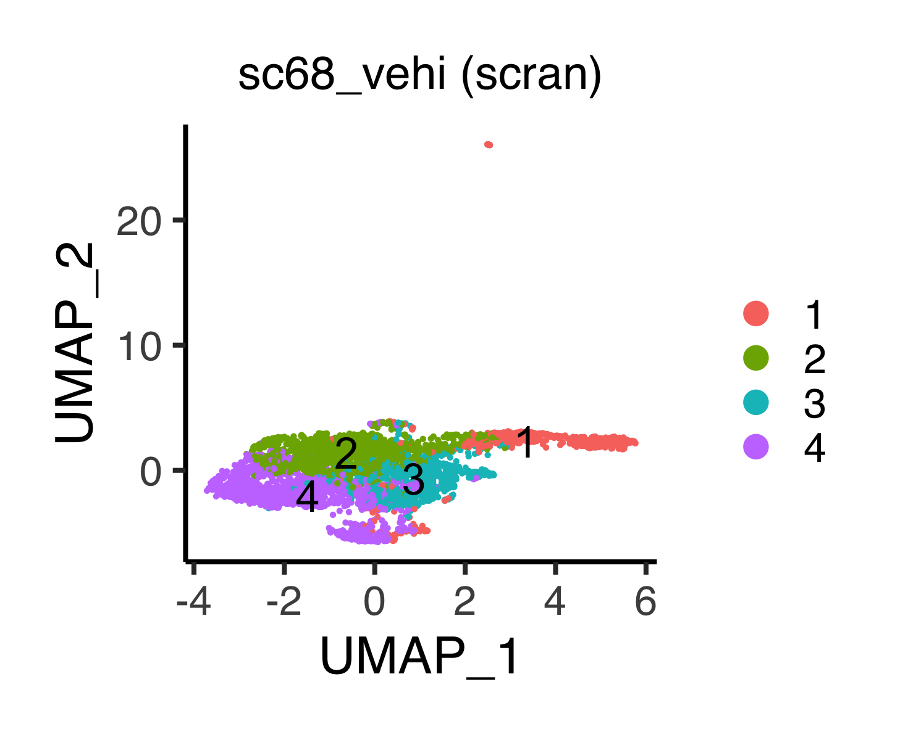
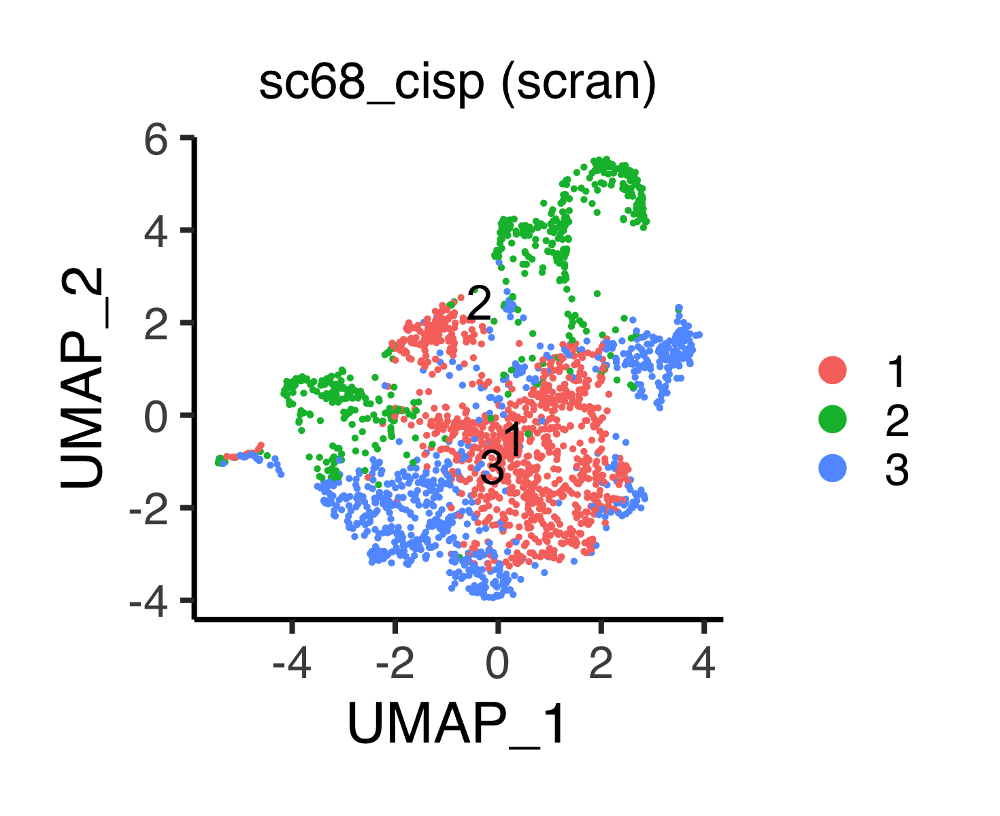

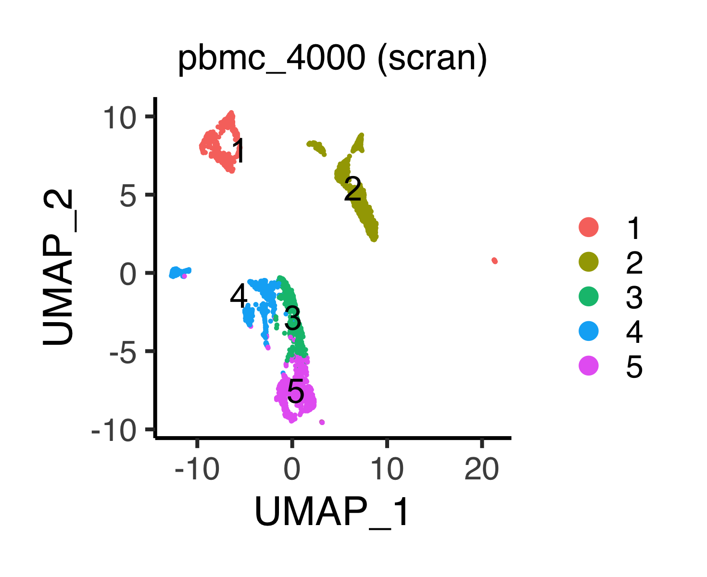
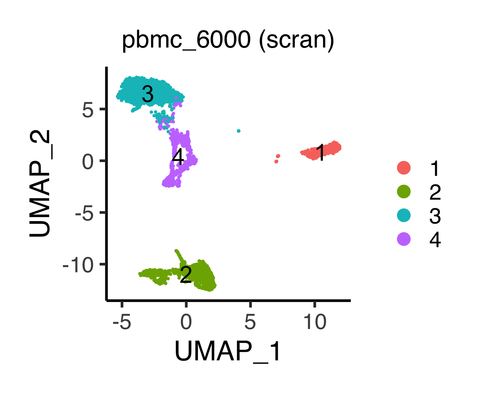

The following function `do_dmap_scran()` performs `DiffusionMap()` using
`destiny` package, where the arguments are preset as `sigma = "local"` and
`distance = "euclidean"`.
The arguments are `obj`, `sigma` (argument of `DiffusionMap()`), `distance`
(argument of `DiffusionMap()`), and `pca_dim` (an integer: dimension of
principal component, in which `NULL` is accepted if users would like to compute
diffusion map from the original gene expression matrices).

**Tips:**
If the resulting diffusion map is distorted by outliers, tuning of `pca_dim`
will be required.
```{r, eval = FALSE}
# ----------------------------------------
# sc68_vehi
# ----------------------------------------
pca_dim <- ncol(reducedDim(sc68_vehi[["sce"]], "PCA"))
sc68_vehi <- do_dmap_scran(obj = sc68_vehi, pca_dim = pca_dim)
# ----------------------------------------
# sc68_cisp
# ----------------------------------------
pca_dim <- ncol(reducedDim(sc68_cisp[["sce"]], "PCA"))
sc68_cisp <- do_dmap_scran(obj = sc68_cisp, pca_dim = pca_dim)
# ----------------------------------------
# pbmc_4000
# ----------------------------------------
pca_dim <- ncol(reducedDim(pbmc_4000[["sce"]], "PCA"))
pbmc_4000 <- do_dmap_scran(obj = pbmc_4000, pca_dim = pca_dim)
# ----------------------------------------
# pbmc_6000
# ----------------------------------------
pca_dim <- ncol(reducedDim(pbmc_6000[["sce"]], "PCA"))
pbmc_6000 <- do_dmap_scran(obj = pbmc_6000, pca_dim = pca_dim)
```
The results are stored in
`obj[["sce"]]@int_colData@listData[["reducedDims"]]@listData[["dmap"]]`.

The following function `plot_dmap_scran()` shows the data in a two-dimensional
diffusion map.
```{r, eval = FALSE}
# ----------------------------------------
# sc68_vehi
# ----------------------------------------
p <- plot_dmap_scran(obj = sc68_vehi, title = "sc68_vehi (scran)",
                     title_size = 18, xlabel = "DC_1", ylabel = "DC_2",
                     default_color = TRUE)
filename <- "figures/figure_01_0510.png"
ggsave(file = filename, plot = p, dpi = 300, width = 6, height = 5.0)
```

```{r, eval = FALSE, echo = FALSE, results = "hide"}
# ----------------------------------------
# sc68_cisp
# ----------------------------------------
p <- plot_dmap_scran(obj = sc68_cisp, title = "sc68_cisp (scran)",
                     title_size = 18, xlabel = "DC_1", ylabel = "DC_2",
                     default_color = TRUE)
filename <- "figures/figure_02_0510.png"
ggsave(file = filename, plot = p, dpi = 300, width = 6, height = 5.0)
# ----------------------------------------
# pbmc_4000
# ----------------------------------------
p <- plot_dmap_scran(obj = pbmc_4000, title = "pbmc_4000 (scran)",
                     title_size = 18, xlabel = "DC_1", ylabel = "DC_2",
                     default_color = TRUE)
filename <- "figures/figure_10_0510.png"
ggsave(file = filename, plot = p, dpi = 300, width = 6, height = 5.0)
# ----------------------------------------
# pbmc_6000
# ----------------------------------------
p <- plot_dmap_scran(obj = pbmc_6000, title = "pbmc_6000 (scran)",
                     title_size = 18, xlabel = "DC_1", ylabel = "DC_2",
                     default_color = TRUE)
filename <- "figures/figure_11_0510.png"
ggsave(file = filename, plot = p, dpi = 300, width = 6, height = 5.0)
```


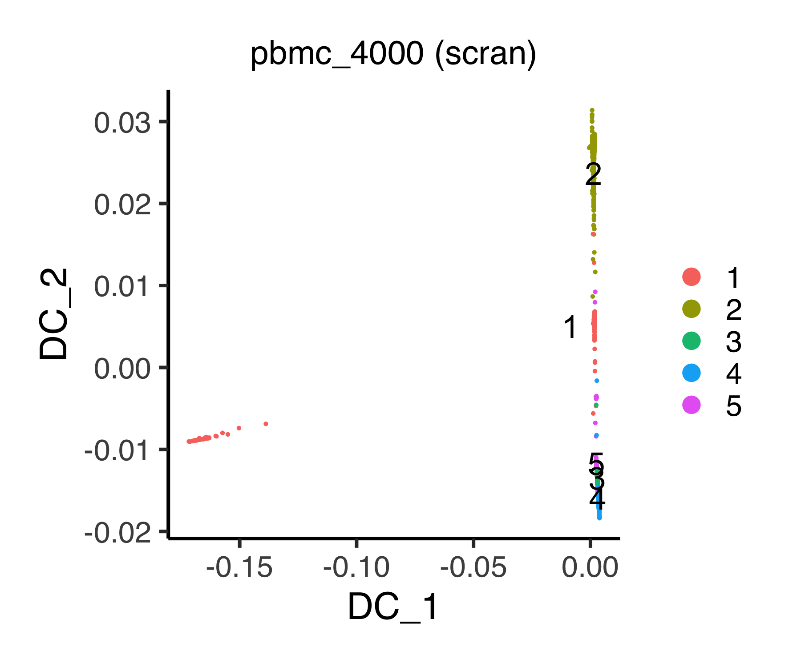


## Find differentially expressed genes
The following function `process_003_scran()` performs `pairwiseTTests()` and
`combineMarkers()` in `scran` package to find cluster marker genes.
Note that `direction = "up"` means up-regulated genes.
```{r, eval = FALSE}
sc68_vehi <- process_003_scran(obj = sc68_vehi, direction = "up",
                               pval.type = "all")
sc68_cisp <- process_003_scran(obj = sc68_cisp, direction = "up",
                               pval.type = "all")
pbmc_4000 <- process_003_scran(obj = pbmc_4000, direction = "up",
                               pval.type = "all")
pbmc_6000 <- process_003_scran(obj = pbmc_6000, direction = "up",
                               pval.type = "all")
```
The results are stored in `obj[["stat"]]`.

Users can check the marker genes of each cluster by the following command:
```{r, eval = FALSE}
sc68_vehi_dt <- sc68_vehi[["stat"]][["all"]]
sc68_cisp_dt <- sc68_cisp[["stat"]][["all"]]
pbmc_4000_dt <- pbmc_4000[["stat"]][["all"]]
pbmc_6000_dt <- pbmc_6000[["stat"]][["all"]]

datatable(sc68_vehi_dt[sc68_vehi_dt$FDR < 10^(-10),], rownames = FALSE)
datatable(sc68_cisp_dt[sc68_cisp_dt$FDR < 10^(-10),], rownames = FALSE)
datatable(pbmc_4000_dt[pbmc_4000_dt$FDR < 10^(-10),], rownames = FALSE)
datatable(pbmc_6000_dt[pbmc_6000_dt$FDR < 10^(-10),], rownames = FALSE)
```

* `sc68_vehi`

<iframe src="figures/sc68_vehi_marker_scran.html" style="width:100%; height:400px;"></iframe>

<br><br><br><br><br><br><br><br><br><br>

* `sc68_cisp`

<iframe src="figures/sc68_cisp_marker_scran.html" style="width:100%; height:400px;"></iframe>

<br><br><br><br><br><br><br><br><br><br>

* `pbmc_4000`

<iframe src="figures/pbmc_4000_marker_scran.html" style="width:100%; height:400px;"></iframe>

<br><br><br><br><br><br><br><br><br><br>

* `pbmc_6000`

<iframe src="figures/pbmc_6000_marker_scran.html" style="width:100%; height:400px;"></iframe>

<br><br><br><br><br><br><br><br><br><br>


## Save results
Save the objects.
```{r, eval = FALSE}
saveRDS(sc68_vehi, file = "backup/01_500_sc68_vehi_scran.rds")
saveRDS(sc68_cisp, file = "backup/02_500_sc68_cisp_scran.rds")
saveRDS(pbmc_4000, file = "backup/10_500_pbmc_4000_scran.rds")
saveRDS(pbmc_6000, file = "backup/11_500_pbmc_6000_scran.rds")
```

One can load the results.
```{r, eval = FALSE}
sc68_vehi <- readRDS(file = "backup/01_500_sc68_vehi_scran.rds")
sc68_cisp <- readRDS(file = "backup/02_500_sc68_cisp_scran.rds")
pbmc_4000 <- readRDS(file = "backup/10_500_pbmc_4000_scran.rds")
pbmc_6000 <- readRDS(file = "backup/11_500_pbmc_6000_scran.rds")
```


## Infer cell types for PBMC datasets
Load the data.
```{r, eval = FALSE}
rm(list=ls())
source("R/function_scran.R")
pbmc_4000 <- readRDS(file = "backup/10_500_pbmc_4000_scran.rds")
pbmc_6000 <- readRDS(file = "backup/11_500_pbmc_6000_scran.rds")
```

Based on the result of `process_003_scran()`, we manually investigate
marker genes using GeneCards as follows:

* `pbmc_4000`

```
1: B cell         # CD79A (FDR ~ e-254), MS4A1 (FDR ~ e-190), IGHM (FDR ~ e-189)
2: Monocyte       # S100A8 (FDR ~ e-270), LYZ (FDR ~ 0), CD14 (FDR ~ e-113)
3: Unspecified
4: NK or NKT cell # NKG7 (FDR ~ 0), GZMA (FDR ~ e-227), GNLY (FDR ~ e-90)
5: Unspecified
```

* `pbmc_6000`

```
1: B cell         # CD79A (FDR ~ e-302), MS4A1 (FDR ~ e-167)
2: Monocyte       # S100A8 (FDR ~ 0), LYZ (FDR ~ 0), CD14 (FDR ~ e-208)
3: T cell         # MAL (FDR ~ e-100), LEF1 (FDR ~ e-78), TCF7 (FDR ~ e-47)
4: NK or NKT cell # NKG7 (FDR ~ 0), GZMA (FDR ~ e-282), FGFBP2 (FDR ~ e-111)
```

We identify the cell types as follows:
```{r, eval = FALSE}
# ----------------------------------------
# pbmc_4000
# ----------------------------------------
tmp <-as.integer(as.character(pbmc_4000[["sce"]]@colData@listData[["cluster"]]))
tmp[tmp == 1] <- "B cell"
tmp[tmp == 2] <- "Monocyte"
tmp[tmp == 3] <- "Unspecified"
tmp[tmp == 4] <- "NK or NKT cell"
tmp[tmp == 5] <- "Unspecified"
tmp <- factor(tmp, levels = c("Monocyte", "B cell", "NK or NKT cell",
                              "Unspecified"))
pbmc_4000[["mylabel"]] <- tmp
# ----------------------------------------
# For `pbmc_6000`
# ----------------------------------------
tmp <-as.integer(as.character(pbmc_6000[["sce"]]@colData@listData[["cluster"]]))
tmp[tmp == 1] <- "B cell"
tmp[tmp == 2] <- "Monocyte"
tmp[tmp == 3] <- "T cell"
tmp[tmp == 4] <- "NK or NKT cell"
tmp <- factor(tmp, levels = c("T cell", "Monocyte", "B cell", "NK or NKT cell"))
pbmc_6000[["mylabel"]] <- tmp
```

The numbers of cells are stored in a table.
```{r, eval = FALSE}
identify_cell <- function(obj){
  tmp <- obj[["mylabel"]]
  cells <- levels(tmp)
  df <- c()
  for(cell in cells){
    df <- rbind(df, c(cell, length(tmp[tmp==cell])))
  }
  df <- as.data.frame(df)
  colnames(df) <- c("cell_type", "n")
  return(df)
}

pbmc_4000[["population"]] <- identify_cell(obj = pbmc_4000)
pbmc_6000[["population"]] <- identify_cell(obj = pbmc_6000)
```

Save the objects.
```{r, eval = FALSE}
saveRDS(pbmc_4000, file = "backup/10_501_pbmc_4000_scran.rds")
saveRDS(pbmc_6000, file = "backup/11_501_pbmc_6000_scran.rds")
```
