# Appendix B: analyzing scRNA-seq data by existing method II
In this section, we analyze scRNA-seq datasets using Seurat.

The following libraries are used.
```{r, eval = FALSE}
library(tidyverse)       # For efficient handling of data.frame
library(Seurat)          # For using Seurat
library(destiny)         # For using DiffusionMap()
library(DT)              # For using datatable

library(org.Hs.eg.db)    # For using human genome annotation package
library(DOSE)            # For using DB for Disease Ontology
library(clusterProfiler) # For using DB for Gene Ontology
library(GOSemSim)        # For using godata in GOSemSim package
library(scCATCH)         # For using scCATCH
```

```{r}
packageVersion("Seurat")
```

```
[1] '4.0.3'
```


## Preprocessing
Load the data.
```{r, eval = FALSE}
rm(list=ls())
source("R/function_seurat.R")
sc68_vehi <- readRDS(file = "backup/01_005_sc68_vehi_normalized.rds")
sc68_cisp <- readRDS(file = "backup/02_005_sc68_cisp_normalized.rds")
pbmc_4000 <- readRDS(file = "backup/10_005_pbmc_4000_normalized.rds")
pbmc_6000 <- readRDS(file = "backup/11_005_pbmc_6000_normalized.rds")
```

Check the size of the gene-by-sample matrices.
```{r, eval = FALSE}
dim(sc68_vehi[["data"]][["raw"]])
dim(sc68_cisp[["data"]][["raw"]])
dim(pbmc_4000[["data"]][["raw"]])
dim(pbmc_6000[["data"]][["raw"]])
```

```
[1] 6581 3923
[1] 6347 2285
[1] 6658 3815
[1] 5169 4878
```

Create Seruat objects.
```{r, eval = FALSE}
sc68_vehi <- CreateSeuratObject(
  counts = sc68_vehi[["data"]][["bayNorm"]][["Bay_out"]], project = "sc68_vehi")

sc68_cisp <- CreateSeuratObject(
  counts = sc68_cisp[["data"]][["bayNorm"]][["Bay_out"]], project = "sc68_cisp")

pbmc_4000 <- CreateSeuratObject(
  counts = pbmc_4000[["data"]][["bayNorm"]][["Bay_out"]], project = "pbmc_4000")

pbmc_6000 <- CreateSeuratObject(
  counts = pbmc_6000[["data"]][["bayNorm"]][["Bay_out"]], project = "pbmc_6000")
```

According to `Seurat`'s protocol, we perform the following procedures:

1. normalize the data by using `NormalizeData()` in Seurat package
with the argument `normalization.method = LogNormalize`,
2. perform variance stabilizing transform (VST) by using
`FindVariableFeatures()` setting the number of variable feature `nfeatures`,
3. scale the data, and
4. reduce the dimension by principal component analysis (PCA),
using `RunPCA()` with the argument `features = VariableFeatures(obj)`.

**Tips:**
As mentioned in Cruz and Wishart, Cancer Inform. 2, 59-77 (2006),
we select highly variable genes as the cell-per-variable gene ratio being 5:1.
```{r, eval = FALSE}
# ----------------------------------------
# sc68_vehi
# ----------------------------------------
nfeatures <- round(0.2 * sc68_vehi@assays[["RNA"]]@counts@Dim[2])
sc68_vehi <- process_001_seurat(obj = sc68_vehi, nfeatures = nfeatures)
# ----------------------------------------
# sc68_cisp
# ----------------------------------------
nfeatures <- round(0.2 * sc68_cisp@assays[["RNA"]]@counts@Dim[2])
sc68_cisp <- process_001_seurat(obj = sc68_cisp, nfeatures = nfeatures)
# ----------------------------------------
# pbmc_4000
# ----------------------------------------
nfeatures <- round(0.2 * pbmc_4000@assays[["RNA"]]@counts@Dim[2])
pbmc_4000 <- process_001_seurat(obj = pbmc_4000, nfeatures = nfeatures)
# ----------------------------------------
# pbmc_6000
# ----------------------------------------
nfeatures <- round(0.2 * pbmc_6000@assays[["RNA"]]@counts@Dim[2])
pbmc_6000 <- process_001_seurat(obj = pbmc_6000, nfeatures = nfeatures)
```

Check the eigen value (variance) of each principal component by elbow plot.
```{r, eval = FALSE}
# ----------------------------------------
# sc68_vehi
# ----------------------------------------
p <- plot_pcaEigen_seurat(obj = sc68_vehi, title = "sc68_vehi (Seurat)",
                          title_size = 18, xlabel = "PC",
                          ylabel = "Eigen value")
filename <- "figures/figure_01_0600.png"
ggsave(file = filename, plot = p, dpi = 300, width = 3.5, height = 3.5)
```

```{r, eval = FALSE, echo = FALSE, results = "hide"}
# ----------------------------------------
# sc68_cisp
# ----------------------------------------
p <- plot_pcaEigen_seurat(obj = sc68_cisp, title = "sc68_cisp (Seurat)",
                          title_size = 18, xlabel = "PC",
                          ylabel = "Eigen value")
filename <- "figures/figure_02_0600.png"
ggsave(file = filename, plot = p, dpi = 300, width = 3.5, height = 3.5)
# ----------------------------------------
# pbmc_4000
# ----------------------------------------
p <- plot_pcaEigen_seurat(obj = pbmc_4000, title = "pbmc_4000 (Seurat)",
                          title_size = 18, xlabel = "PC",
                          ylabel = "Eigen value")
filename <- "figures/figure_10_0600.png"
ggsave(file = filename, plot = p, dpi = 300, width = 3.5, height = 3.5)
# ----------------------------------------
# pbmc_6000
# ----------------------------------------
p <- plot_pcaEigen_seurat(obj = pbmc_6000, title = "pbmc_6000 (Seurat)",
                          title_size = 18, xlabel = "PC",
                          ylabel = "Eigen value")
filename <- "figures/figure_11_0600.png"
ggsave(file = filename, plot = p, dpi = 300, width = 3.5, height = 3.5)
```


## Cluster cells
Calculate the cumulative sum of variances.
These results are used to determine the dimensions of the principal components.
In what follows, we use the PCs whose contribution ratio is greater than
or equal to 0.9 for the first time. 
```{r, eval = FALSE}
sc68_vehi_pc <- which(cumsum(sc68_vehi@reductions[["pca"]]@stdev) /
                        sum(sc68_vehi@reductions[["pca"]]@stdev) > 0.9)[1]
sc68_cisp_pc <- which(cumsum(sc68_cisp@reductions[["pca"]]@stdev) /
                        sum(sc68_cisp@reductions[["pca"]]@stdev) > 0.9)[1]
pbmc_4000_pc <- which(cumsum(pbmc_4000@reductions[["pca"]]@stdev) /
                        sum(pbmc_4000@reductions[["pca"]]@stdev) > 0.9)[1]
pbmc_6000_pc <- which(cumsum(pbmc_6000@reductions[["pca"]]@stdev) /
                        sum(pbmc_6000@reductions[["pca"]]@stdev) > 0.9)[1]
```

According to `Seurat`'s protocol, we perform the following procedures:

1. run `FindNeighbors()` for creating k-nearest neighbor graph,
2. run `FindClusters()` for clustering cells, and
3. run `RunTSNE()` and `RunUMAP()`
```{r, eval = FALSE}
sc68_vehi <- process_002_seurat(obj = sc68_vehi, pc = sc68_vehi_pc,
                                resolution = 0.1)
sc68_cisp <- process_002_seurat(obj = sc68_cisp, pc = sc68_cisp_pc,
                                resolution = 0.1)
pbmc_4000 <- process_002_seurat(obj = pbmc_4000, pc = pbmc_4000_pc,
                                resolution = 0.08)
pbmc_6000 <- process_002_seurat(obj = pbmc_6000, pc = pbmc_6000_pc,
                                resolution = 0.15)
```

Change the label names by adding `1` (e.g., change from `0` to `1`).
```{r, eval = FALSE}
# ----------------------------------------
# sc68_vehi
# ----------------------------------------
sc68_vehi@meta.data[["seurat_clusters"]] <- as.factor(as.integer(
  as.character(sc68_vehi@meta.data[["seurat_clusters"]])) + 1)
sc68_vehi <- SetIdent(sc68_vehi, value = "seurat_clusters")
# ----------------------------------------
# sc68_cisp
# ----------------------------------------
sc68_cisp@meta.data[["seurat_clusters"]] <- as.factor(as.integer(
  as.character(sc68_cisp@meta.data[["seurat_clusters"]])) + 1)
sc68_cisp <- SetIdent(sc68_cisp, value = "seurat_clusters")
# ----------------------------------------
# pbmc_4000
# ----------------------------------------
pbmc_4000@meta.data[["seurat_clusters"]] <- as.factor(as.integer(
  as.character(pbmc_4000@meta.data[["seurat_clusters"]])) + 1)
pbmc_4000 <- SetIdent(pbmc_4000, value = "seurat_clusters")
# ----------------------------------------
# pbmc_6000
# ----------------------------------------
pbmc_6000@meta.data[["seurat_clusters"]] <- as.factor(as.integer(
  as.character(pbmc_6000@meta.data[["seurat_clusters"]])) + 1)
pbmc_6000 <- SetIdent(pbmc_6000, value = "seurat_clusters")
```


## Visualize data in low dimensional space
The following function `plot_tsne_seurat()` shows clustering results in a
two-dimensional t-SNE space.
```{r, eval = FALSE}
# ----------------------------------------
# sc68_vehi
# ----------------------------------------
p <- plot_tsne_seurat(obj = sc68_vehi, title = "sc68_vehi (Seurat)",
                      title_size = 18, xlabel = "tSNE_1", ylabel = "tSNE_2",
                      default_color = TRUE)
filename <- "figures/figure_01_0605.png"
ggsave(file = filename, plot = p, dpi = 300, width = 4.8, height = 4.0)
```

```{r, eval = FALSE, echo = FALSE, results = "hide"}
# ----------------------------------------
# sc68_cisp
# ----------------------------------------
p <- plot_tsne_seurat(obj = sc68_cisp, title = "sc68_cisp (Seurat)",
                      title_size = 18, xlabel = "tSNE_1", ylabel = "tSNE_2",
                      default_color = TRUE)
filename <- "figures/figure_02_0605.png"
ggsave(file = filename, plot = p, dpi = 300, width = 4.8, height = 4.0)
# ----------------------------------------
# pbmc_4000
# ----------------------------------------
p <- plot_tsne_seurat(obj = pbmc_4000, title = "pbmc_4000 (Seurat)",
                      title_size = 18, xlabel = "tSNE_1", ylabel = "tSNE_2",
                      default_color = TRUE)
filename <- "figures/figure_10_0605.png"
ggsave(file = filename, plot = p, dpi = 300, width = 4.8, height = 4.0)
# ----------------------------------------
# pbmc_6000
# ----------------------------------------
p <- plot_tsne_seurat(obj = pbmc_6000, title = "pbmc_6000 (Seurat)",
                      title_size = 18, xlabel = "tSNE_1", ylabel = "tSNE_2",
                      default_color = TRUE)
filename <- "figures/figure_11_0605.png"
ggsave(file = filename, plot = p, dpi = 300, width = 4.8, height = 4.0)
```


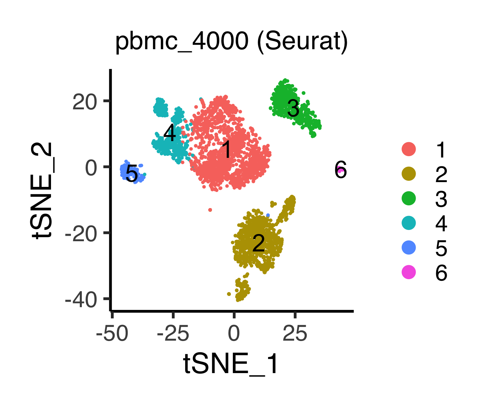
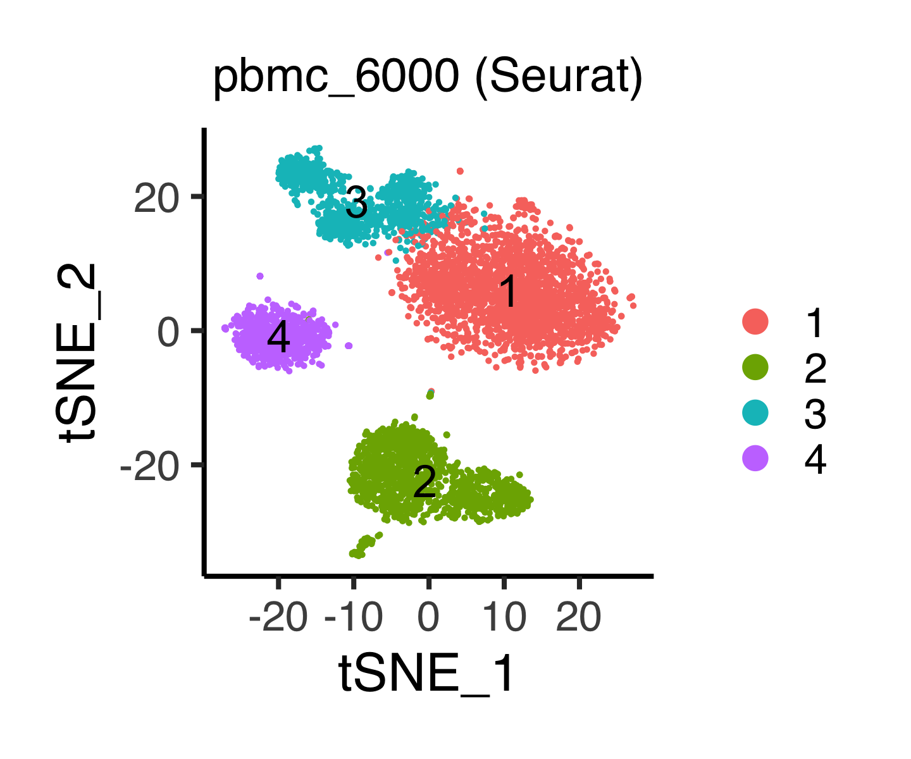

The following function `plot_umap_seurat()` shows clustering results in a
two-dimensional UMAP space.
```{r, eval = FALSE}
# ----------------------------------------
# sc68_vehi
# ----------------------------------------
p <- plot_umap_seurat(obj = sc68_vehi, title = "sc68_vehi (Seurat)",
                      title_size = 18, xlabel = "UMAP_1", ylabel = "UMAP_2",
                      default_color = TRUE)
filename <- "figures/figure_01_0606.png"
ggsave(file = filename, plot = p, dpi = 300, width = 4.8, height = 4.0)
```

```{r, eval = FALSE, echo = FALSE, results = "hide"}
# ----------------------------------------
# sc68_cisp
# ----------------------------------------
p <- plot_umap_seurat(obj = sc68_cisp, title = "sc68_cisp (Seurat)",
                      title_size = 18, xlabel = "UMAP_1", ylabel = "UMAP_2",
                      default_color = TRUE)
filename <- "figures/figure_02_0606.png"
ggsave(file = filename, plot = p, dpi = 300, width = 4.7, height = 4.0)
# ----------------------------------------
# pbmc_4000
# ----------------------------------------
p <- plot_umap_seurat(obj = pbmc_4000, title = "pbmc_4000 (Seurat)",
                      title_size = 18, xlabel = "UMAP_1", ylabel = "UMAP_2",
                      default_color = TRUE)
filename <- "figures/figure_10_0606.png"
ggsave(file = filename, plot = p, dpi = 300, width = 4.8, height = 4.0)
# ----------------------------------------
# pbmc_6000
# ----------------------------------------
p <- plot_umap_seurat(obj = pbmc_6000, title = "pbmc_6000 (Seurat)",
                      title_size = 18, xlabel = "UMAP_1", ylabel = "UMAP_2",
                      default_color = TRUE)
filename <- "figures/figure_11_0606.png"
ggsave(file = filename, plot = p, dpi = 300, width = 4.8, height = 4.0)
```

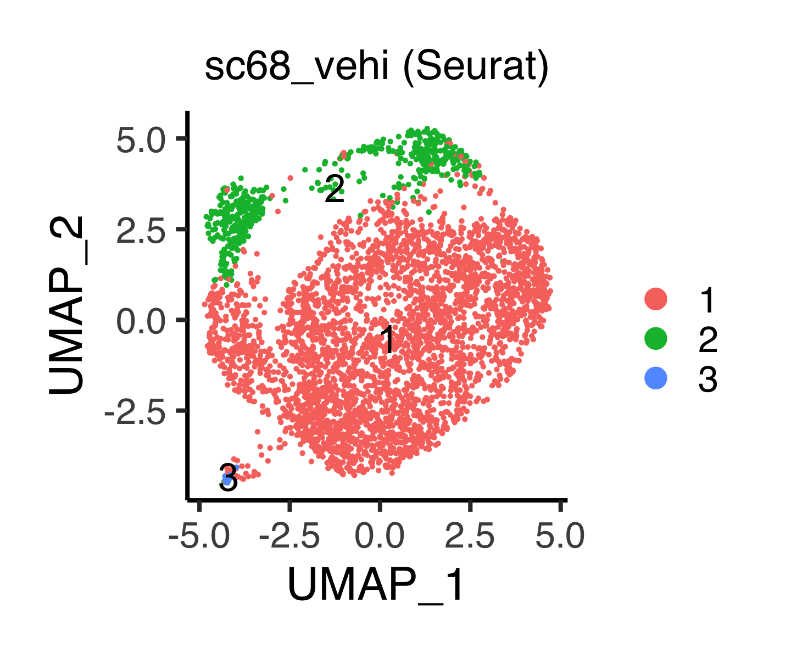


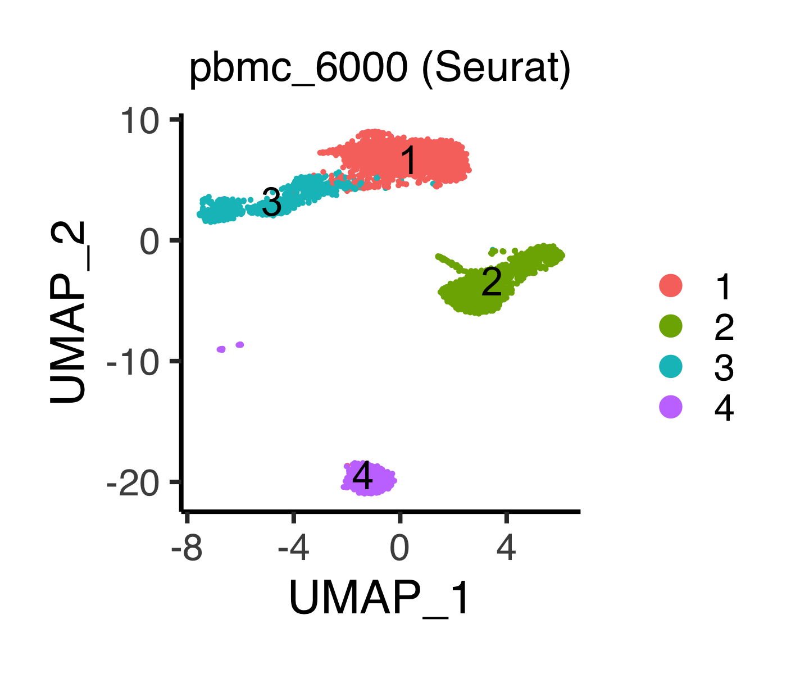

The following function `do_dmap_seurat()` performs `DiffusionMap()` using
`destiny` package, where the arguments are preset as `sigma = "local"` and
`distance = "euclidean"`.
The arguments are `obj`, `sigma` (argument of `DiffusionMap()`), `distance`
(argument of `DiffusionMap()`), and `pca_dim` (an integer: dimension of
principal component, in which `NULL` is accepted if users would like to compute
diffusion map from the original gene expression matrices).

**Tips:**
If the resulting diffusion map is distorted by outliers, tuning of `pca_dim`
will be required.
```{r, eval = FALSE}
sc68_vehi <- do_dmap_seurat(obj = sc68_vehi, pca_dim = sc68_vehi_pc)
sc68_cisp <- do_dmap_seurat(obj = sc68_cisp, pca_dim = sc68_cisp_pc)
pbmc_4000 <- do_dmap_seurat(obj = pbmc_4000, pca_dim = pbmc_4000_pc)
pbmc_6000 <- do_dmap_seurat(obj = pbmc_6000, pca_dim = pbmc_6000_pc)
```
The results are stored in `obj@reductions[["dmap"]]`.

The following function `plot_dmap_seurat()` shows the data in a two-dimensional
diffusion map.
```{r, eval = FALSE}
# ----------------------------------------
# sc68_vehi
# ----------------------------------------
p <- plot_dmap_seurat(obj = sc68_vehi, title = "sc68_vehi (Seurat)",
                      title_size = 18, xlabel = "DC_1", ylabel = "DC_2",
                      default_color = TRUE)
filename <- "figures/figure_01_0607.png"
ggsave(file = filename, plot = p, dpi = 300, width = 5.0, height = 4.0)
```

```{r, eval = FALSE, echo = FALSE, results = "hide"}
# ----------------------------------------
# sc68_cisp
# ----------------------------------------
p <- plot_dmap_seurat(obj = sc68_cisp, title = "sc68_cisp (Seurat)",
                      title_size = 18, xlabel = "DC_1", ylabel = "DC_2",
                      default_color = TRUE)
filename <- "figures/figure_02_0607.png"
ggsave(file = filename, plot = p, dpi = 300, width = 4.9, height = 4.0)
# ----------------------------------------
# pbmc_4000
# ----------------------------------------
p <- plot_dmap_seurat(obj = pbmc_4000, title = "pbmc_4000 (Seurat)",
                      title_size = 18, xlabel = "DC_1", ylabel = "DC_2",
                      default_color = TRUE)
filename <- "figures/figure_10_0607.png"
ggsave(file = filename, plot = p, dpi = 300, width = 4.9, height = 4.0)
# ----------------------------------------
# pbmc_6000
# ----------------------------------------
p <- plot_dmap_seurat(obj = pbmc_6000, title = "pbmc_6000 (Seurat)",
                      title_size = 18, xlabel = "DC_1", ylabel = "DC_2",
                      default_color = TRUE)
filename <- "figures/figure_11_0607.png"
ggsave(file = filename, plot = p, dpi = 300, width = 4.8, height = 4.0)
```


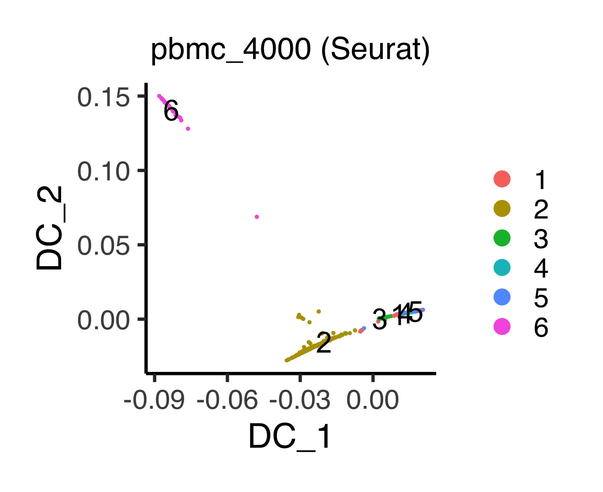


## Cell cycle scoring
Assign each cell a cell cycle score using `CellCycleScoring()`.
Note that the entries of `obj@active.ident` will be replaced with
`obj@meta.data[["Phase"]]`.
```{r, eval = FALSE}
s.genes <- cc.genes$s.genes
g2m.genes <- cc.genes$g2m.genes

sc68_vehi <- CellCycleScoring(sc68_vehi, s.features = s.genes,
                              g2m.features = g2m.genes, set.ident = TRUE)
sc68_cisp <- CellCycleScoring(sc68_cisp, s.features = s.genes,
                              g2m.features = g2m.genes, set.ident = TRUE)
pbmc_4000 <- CellCycleScoring(pbmc_4000, s.features = s.genes,
                              g2m.features = g2m.genes, set.ident = TRUE)
pbmc_6000 <- CellCycleScoring(pbmc_6000, s.features = s.genes,
                              g2m.features = g2m.genes, set.ident = TRUE)

sc68_vehi@meta.data[["Phase"]] <- sc68_vehi@active.ident
sc68_cisp@meta.data[["Phase"]] <- sc68_cisp@active.ident
pbmc_4000@meta.data[["Phase"]] <- pbmc_4000@active.ident
pbmc_6000@meta.data[["Phase"]] <- pbmc_6000@active.ident
```

The following function `plot_cc_umap_seurat()` shows cell cycle phases in
a two-dimensional UMAP space.
```{r, eval = FALSE}
# ----------------------------------------
# sc68_vehi
# ----------------------------------------
p <- plot_cc_umap_seurat(obj = sc68_vehi, title = "sc68_vehi (Seurat)",
                         title_size = 18, xlabel = "UMAP_1", ylabel = "UMAP_2",
                         default_color = FALSE)
filename <- "figures/figure_01_0608.png"
ggsave(file = filename, plot = p, dpi = 300, width = 5.2, height = 4.0)
```

```{r, eval = FALSE, echo = FALSE, results = "hide"}
# ----------------------------------------
# sc68_cisp
# ----------------------------------------
p <- plot_cc_umap_seurat(obj = sc68_cisp, title = "sc68_cisp (Seurat)",
                         title_size = 18, xlabel = "UMAP_1", ylabel = "UMAP_2",
                         default_color = FALSE)
filename <- "figures/figure_02_0608.png"
ggsave(file = filename, plot = p, dpi = 300, width = 5, height = 4.0)
# ----------------------------------------
# pbmc_4000
# ----------------------------------------
p <- plot_cc_umap_seurat(obj = pbmc_4000, title = "pbmc_4000 (Seurat)",
                         title_size = 18, xlabel = "UMAP_1", ylabel = "UMAP_2",
                         default_color = FALSE)
filename <- "figures/figure_10_0608.png"
ggsave(file = filename, plot = p, dpi = 300, width = 5.2, height = 4.0)
# ----------------------------------------
# pbmc_6000
# ----------------------------------------
p <- plot_cc_umap_seurat(obj = pbmc_6000, title = "pbmc_6000 (Seurat)",
                         title_size = 18, xlabel = "UMAP_1", ylabel = "UMAP_2",
                         default_color = FALSE)
filename <- "figures/figure_11_0608.png"
ggsave(file = filename, plot = p, dpi = 300, width = 5.2, height = 4.0)
```

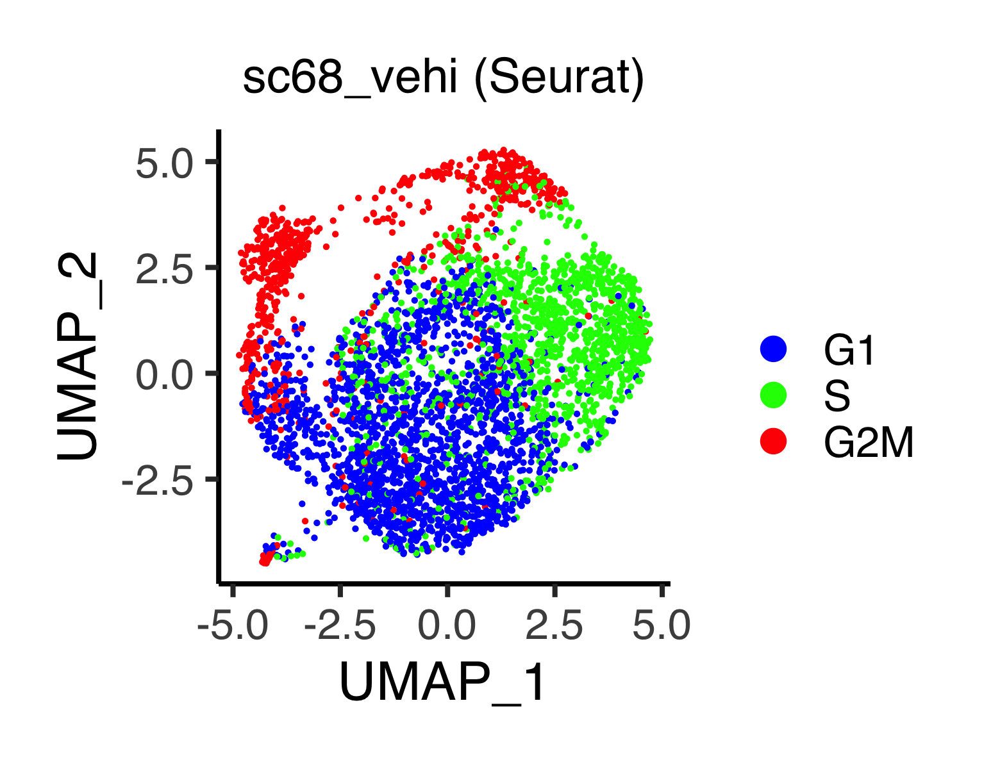


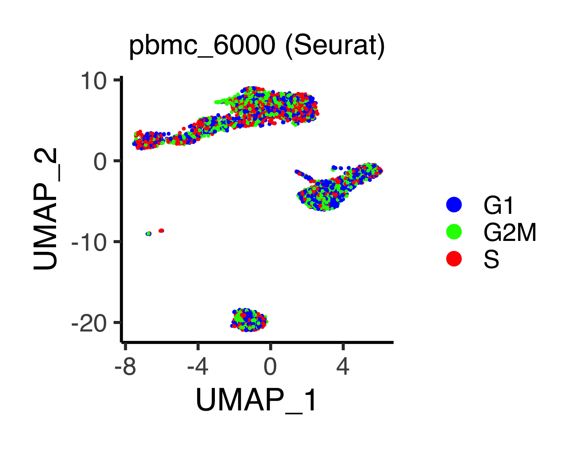

The following function `plot_ccscore_umap_seurat()` shows S to G2M scores,
i.e., standardized scores of mean expression levels of phase marker genes,
in a two-dimensional UMAP space.
```{r, eval = FALSE}
# ----------------------------------------
# sc68_vehi
# ----------------------------------------
p <- plot_ccscore_umap_seurat(obj = sc68_vehi, title = "sc68_vehi (Seurat)",
                              title_size = 18, xlabel = "UMAP_1",
                              ylabel = "UMAP_2")
filename <- "figures/figure_01_0609.png"
ggsave(file = filename, plot = p, dpi = 300, width = 5.1, height = 4.0)
```

```{r, eval = FALSE, echo = FALSE, results = "hide"}
# ----------------------------------------
# sc68_cisp
# ----------------------------------------
p <- plot_ccscore_umap_seurat(obj = sc68_cisp, title = "sc68_cisp (Seurat)",
                              title_size = 18, xlabel = "UMAP_1",
                              ylabel = "UMAP_2")
filename <- "figures/figure_02_0609.png"
ggsave(file = filename, plot = p, dpi = 300, width = 4.9, height = 4.0)
```


Reset `obj@active.ident` into `obj@meta.data[["seurat_clusters"]]`.
```{r, eval = FALSE}
sc68_vehi <- SetIdent(sc68_vehi, value = "seurat_clusters")
sc68_cisp <- SetIdent(sc68_cisp, value = "seurat_clusters")
pbmc_4000 <- SetIdent(pbmc_4000, value = "seurat_clusters")
pbmc_6000 <- SetIdent(pbmc_6000, value = "seurat_clusters")
```


## Find differentially expressed genes
Find differentially expressed genes using Seurat's function and stores the
results into `obj@misc[["markers"]]`.
```{r, eval = FALSE}
sc68_vehi@misc[["markers"]] <- FindAllMarkers(
  sc68_vehi, only.pos = T, min.pct = 0.25, logfc.threshold = 0.25)

sc68_cisp@misc[["markers"]] <- FindAllMarkers(
  sc68_cisp, only.pos = T, min.pct = 0.25, logfc.threshold = 0.25)

pbmc_4000@misc[["markers"]] <- FindAllMarkers(
  pbmc_4000, only.pos = T, min.pct = 0.25, logfc.threshold = 0.25)

pbmc_6000@misc[["markers"]] <- FindAllMarkers(
  pbmc_6000, only.pos = T, min.pct = 0.25, logfc.threshold = 0.25)
```

Users can check the marker genes of each cluster by the following command:
```{r, eval = FALSE}
datatable(sc68_vehi@misc[["markers"]], rownames = FALSE)
datatable(sc68_cisp@misc[["markers"]], rownames = FALSE)
datatable(pbmc_4000@misc[["markers"]], rownames = FALSE)
datatable(pbmc_6000@misc[["markers"]], rownames = FALSE)
```

* `sc68_vehi`

<iframe src="figures/sc68_vehi_marker_seurat.html" style="width:100%; height:400px;"></iframe>

<br><br><br><br><br><br><br><br><br><br>

* `sc68_cisp`

<iframe src="figures/sc68_cisp_marker_seurat.html" style="width:100%; height:400px;"></iframe>

<br><br><br><br><br><br><br><br><br><br>

* `pbmc_4000`

<iframe src="figures/pbmc_4000_marker_seurat.html" style="width:100%; height:400px;"></iframe>

<br><br><br><br><br><br><br><br><br><br>

* `pbmc_6000`

<iframe src="figures/pbmc_6000_marker_seurat.html" style="width:100%; height:400px;"></iframe>

<br><br><br><br><br><br><br><br><br><br>


## Enrichment analysis
The following function `do_enrichGO_seurat()` performs `clusterProfiler`
functions as follows:

1. `enrichGO()` for all Gene Ontology categories (MF, BP, CC, and ALL),
2. `simplify()` to remove redundant GO terms (but only for MF, BP, and CC), and

The arguments are `obj` (Seurat object), `padj_cutoff` (cutoff value of the
input data `obj@misc[["markers"]][["p_val_adj"]]`), `qval_cutoff_enrichGO`
(i.e., `qvalueCutoff`, an argument of `enrichGO()`), `orgdb`
(annotation data package such as `org.Hs.eg.db` and `org.Mm.eg.db`), and
`cutoff` (an argument of `simplify()`, ranging from 0 to 1).
The other arguments are set as `pAdjustMethod = "BH"`, `by = "p.adjust"`,
`select_fun = min`, `measure = "Wang"`, and `semData = NULL`.
```{r, eval = FALSE}
sc68_vehi <- do_enrichGO_seurat(obj = sc68_vehi, padj_cutoff = 0.01,
                                qval_cutoff_enrichGO = 0.05,
                                orgdb = org.Hs.eg.db, cutoff = 0.7,
                                ont = "BP")
sc68_cisp <- do_enrichGO_seurat(obj = sc68_cisp, padj_cutoff = 0.01,
                                qval_cutoff_enrichGO = 0.05,
                                orgdb = org.Hs.eg.db, cutoff = 0.7,
                                ont = "BP")
pbmc_4000 <- do_enrichGO_seurat(obj = pbmc_4000, padj_cutoff = 0.01,
                                qval_cutoff_enrichGO = 0.05,
                                orgdb = org.Hs.eg.db, cutoff = 0.7,
                                ont = "BP")
pbmc_6000 <- do_enrichGO_seurat(obj = pbmc_6000, padj_cutoff = 0.01,
                                qval_cutoff_enrichGO = 0.05,
                                orgdb = org.Hs.eg.db, cutoff = 0.7,
                                ont = "BP")
```
The results are stored in `obj@misc[["enrichGO"]]` and
`obj@misc[["enrichGO_simplified"]]`.

The following function `prepare_glist()` prepares a list of genes, which is
used for an input of `compareCluster()`.
Note that we use `org.Hs.eg.db` for using human genome annotation package.
```{r, eval = FALSE}
#--------------------------------------------------
# Preparing
#--------------------------------------------------
prepare_glist <- function(obj, padj_cutoff){
  n_groups <- length(unique(sort(obj@active.ident)))
  tmp <- obj@misc[["markers"]]
  cluster_names <- as.character(unique(tmp$cluster))
  g <- list() ; glist <- list() ; label_names <- c()
  for(i in 1:n_groups){
    df <- tmp[which(tmp$cluster == i),]
    g[[i]] <- df[which(df$p_val_adj <= padj_cutoff),]$gene
    geneID <- bitr(g[[i]], fromType = "SYMBOL", toType = "ENTREZID",
                   OrgDb = org.Hs.eg.db)$ENTREZID
    glist[[i]] <- geneID
    label_names <- c(label_names, paste("Group_", i, sep = ""))
  }
  names(glist) <- label_names
  
  return(glist)
}

glist_sc68_vehi <- prepare_glist(obj = sc68_vehi, padj_cutoff = 0.01)
glist_sc68_cisp <- prepare_glist(obj = sc68_cisp, padj_cutoff = 0.01)
glist_pbmc_4000 <- prepare_glist(obj = pbmc_4000, padj_cutoff = 0.01)
glist_pbmc_6000 <- prepare_glist(obj = pbmc_6000, padj_cutoff = 0.01)
```

Performs `compareCluster()`, which easily compares enriched biological terms
across clusters (but without `simplify()`).
```{r, eval = FALSE}
#--------------------------------------------------
# sc68_vehi
#--------------------------------------------------
sc68_vehi@misc[["compareCluster_GO"]] <- compareCluster(
  glist_sc68_vehi, fun = "enrichGO", OrgDb = org.Hs.eg.db, ont = "BP",
  pAdjustMethod = "BH", pvalueCutoff = 0.01, qvalueCutoff = 0.05)

sc68_vehi@misc[["compareCluster_KEGG"]] <- compareCluster(
  glist_sc68_vehi, fun = "enrichKEGG", organism = "hsa", keyType = "kegg",
  pAdjustMethod = "BH", pvalueCutoff = 0.01, qvalueCutoff = 0.05,
  minGSSize = 10, maxGSSize = 500) # min/max size of genes annotated for testing
#--------------------------------------------------
# sc68_cisp
#--------------------------------------------------
sc68_cisp@misc[["compareCluster_GO"]] <- compareCluster(
  glist_sc68_cisp, fun = "enrichGO", OrgDb = org.Hs.eg.db, ont = "BP",
  pAdjustMethod = "BH", pvalueCutoff = 0.01, qvalueCutoff = 0.05)

sc68_cisp@misc[["compareCluster_KEGG"]] <- compareCluster(
  glist_sc68_cisp, fun = "enrichKEGG", organism = "hsa", keyType = "kegg",
  pAdjustMethod = "BH", pvalueCutoff = 0.01, qvalueCutoff = 0.05,
  minGSSize = 10, maxGSSize = 500) # min/max size of genes annotated for testing
#--------------------------------------------------
# pbmc_4000
#--------------------------------------------------
pbmc_4000@misc[["compareCluster_GO"]] <- compareCluster(
  glist_pbmc_4000, fun = "enrichGO", OrgDb = org.Hs.eg.db, ont = "BP",
  pAdjustMethod = "BH", pvalueCutoff = 0.01, qvalueCutoff = 0.05)

pbmc_4000@misc[["compareCluster_KEGG"]] <- compareCluster(
  glist_pbmc_4000, fun = "enrichKEGG", organism = "hsa", keyType = "kegg",
  pAdjustMethod = "BH", pvalueCutoff = 0.01, qvalueCutoff = 0.05,
  minGSSize = 10, maxGSSize = 500) # min/max size of genes annotated for testing
#--------------------------------------------------
# pbmc_6000
#--------------------------------------------------
pbmc_6000@misc[["compareCluster_GO"]] <- compareCluster(
  glist_pbmc_6000, fun = "enrichGO", OrgDb = org.Hs.eg.db, ont = "BP",
  pAdjustMethod = "BH", pvalueCutoff = 0.01, qvalueCutoff = 0.05)

pbmc_6000@misc[["compareCluster_KEGG"]] <- compareCluster(
  glist_pbmc_6000, fun = "enrichKEGG", organism = "hsa", keyType = "kegg",
  pAdjustMethod = "BH", pvalueCutoff = 0.01, qvalueCutoff = 0.05,
  minGSSize = 10, maxGSSize = 500) # min/max size of genes annotated for testing
```

Plot the results of `compareCluster()`.
```{r, eval = FALSE}
#--------------------------------------------------
# sc68_vehi
#--------------------------------------------------
p <- dotplot(sc68_cisp@misc[["compareCluster_GO"]], showCategory = 5)
filename <- "figures/figure_01_0610.png"
ggsave(file = filename, plot = p, dpi = 300, width = 10, height = 5)

p <- dotplot(sc68_cisp@misc[["compareCluster_KEGG"]], showCategory = 8)
filename <- "figures/figure_01_0611.png"
ggsave(file = filename, plot = p, dpi = 300, width = 7, height = 5)
```

```{r, eval = FALSE, echo = FALSE, results = "hide"}
#--------------------------------------------------
# sc68_cisp
#--------------------------------------------------
p <- dotplot(sc68_cisp@misc[["compareCluster_GO"]], showCategory = 5)
filename <- "figures/figure_02_0610.png"
ggsave(file = filename, plot = p, dpi = 300, width = 10, height = 5)

p <- dotplot(sc68_cisp@misc[["compareCluster_KEGG"]], showCategory = 6)
filename <- "figures/figure_02_0611.png"
ggsave(file = filename, plot = p, dpi = 300, width = 7, height = 3.5)
#--------------------------------------------------
# pbmc_4000
#--------------------------------------------------
p <- dotplot(pbmc_4000@misc[["compareCluster_GO"]], showCategory = 5)
filename <- "figures/figure_10_0610.png"
ggsave(file = filename, plot = p, dpi = 300, width = 12, height = 6)

p <- dotplot(pbmc_4000@misc[["compareCluster_KEGG"]], showCategory = 8)
filename <- "figures/figure_10_0611.png"
ggsave(file = filename, plot = p, dpi = 300, width = 11, height = 6)
#--------------------------------------------------
# pbmc_6000
#--------------------------------------------------
p <- dotplot(pbmc_6000@misc[["compareCluster_GO"]], showCategory = 5)
filename <- "figures/figure_11_0610.png"
ggsave(file = filename, plot = p, dpi = 300, width = 12, height = 6)

p <- dotplot(pbmc_6000@misc[["compareCluster_KEGG"]], showCategory = 8)
filename <- "figures/figure_11_0611.png"
ggsave(file = filename, plot = p, dpi = 300, width = 10, height = 6)
```

* `sc68_vehi`


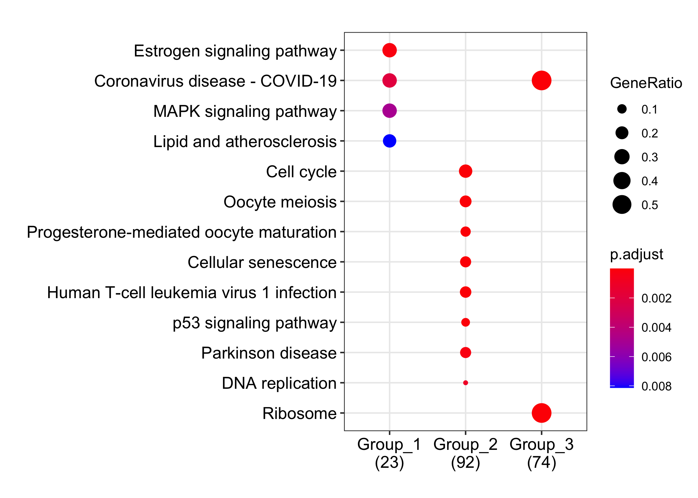

* `sc68_cisp`

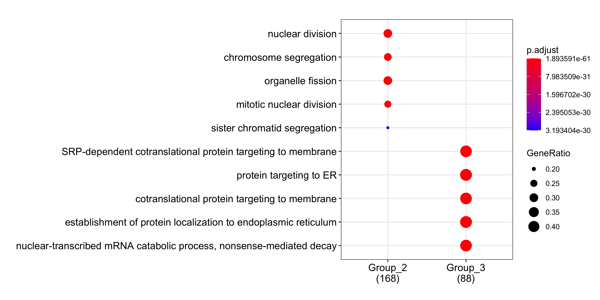


* `pbmc_4000`


* `pbmc_6000`

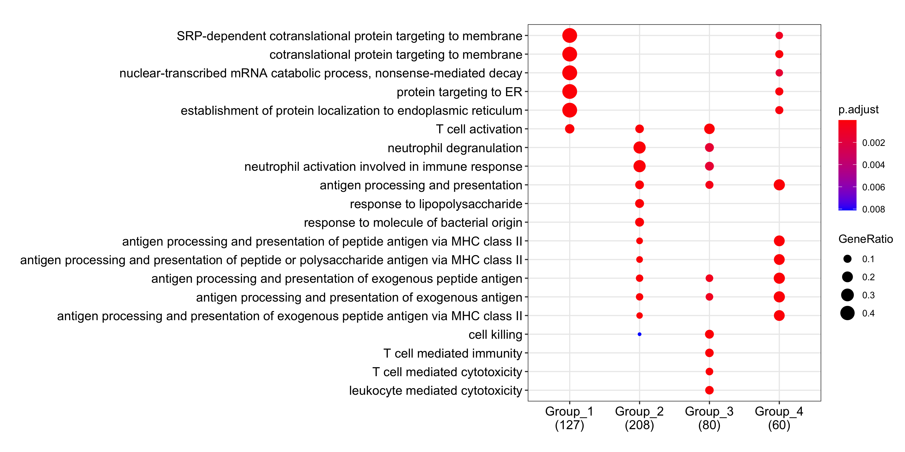
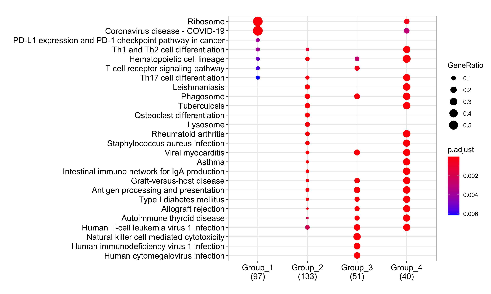


## Save results
Save the objects.
```{r, eval = FALSE}
saveRDS(sc68_vehi, file = "backup/01_600_sc68_vehi_seurat.rds")
saveRDS(sc68_cisp, file = "backup/02_600_sc68_cisp_seurat.rds")
saveRDS(pbmc_4000, file = "backup/10_600_pbmc_4000_seurat.rds")
saveRDS(pbmc_6000, file = "backup/11_600_pbmc_6000_seurat.rds")
```

One can load the results.
```{r, eval = FALSE}
sc68_vehi <- readRDS(file = "backup/01_600_sc68_vehi_seurat.rds")
sc68_cisp <- readRDS(file = "backup/02_600_sc68_cisp_seurat.rds")
pbmc_4000 <- readRDS(file = "backup/10_600_pbmc_4000_seurat.rds")
pbmc_6000 <- readRDS(file = "backup/11_600_pbmc_6000_seurat.rds")
```


## Infer cell types for PBMC datasets
Load the data.
```{r, eval = FALSE}
rm(list=ls())
source("R/function_seurat.R")
pbmc_4000 <- readRDS(file = "backup/10_600_pbmc_4000_seurat.rds")
pbmc_6000 <- readRDS(file = "backup/11_600_pbmc_6000_seurat.rds")
```

Based on the result of `FindAllMarkers()`, we manually investigate marker genes
using GeneCards as follows:

* `pbmc_4000`

```
1: T cell         # TRAC (FDR ~ 0), CD3D (FDR ~ e-251), IL32 (FDR ~ e-131)
2: Monocyte       # S100A8 (FDR ~ 0), LYZ (FDR ~ 0), CD14 (FDR ~ e-119)
3: B cell         # CD79A (FDR ~ e-301), MS4A1 (FDR ~ e-276), IGHM (FDR ~ e-234)
4: NK/NKT cell    # CD3D (FDR ~ e-211), NKG7 (FDR ~ e-211	), GZMA (FDR ~ e-198)
5: NK/NKT cell    # KLRF1 (FDR ~ 0), GZMB (FDR ~ e-264), CD160 (FDR ~ e-159)
6: Unspecified    # TCF4, MZB1, PTCRA, JCHAIN, MZB1, GZMB, ..
```

* `pbmc_6000`

```
1: T cell         # CD3D (FDR ~ 0), TCF7 (FDR ~ 0), CD27 (FDR ~ e-225)
2: Monocyte       # S100A8 (FDR ~ 0), LYZ (FDR ~ 0), CD14 (FDR ~ 0)
3: NK/NKT cell    # NKG7 (FDR ~ 0), GZMA (FDR ~ 0), FGFBP2 (FDR ~ 0)
4: B cell         # CD79A (FDR ~ 0), VPREB3 (FDR ~ 0), BANK1 (FDR ~ 0)
```

Since our manual annotations are more comparable with those of previous research
(Cao et al., Front Genet, 2020), we identify the cell types as follows:
```{r, eval = FALSE}
# ----------------------------------------
# pbmc_4000
# ----------------------------------------
tmp <- as.integer(as.character(pbmc_4000@meta.data[["seurat_clusters"]]))
tmp[tmp == 1] <- "T cell"
tmp[tmp == 2] <- "Monocyte"
tmp[tmp == 3] <- "B cell"
tmp[tmp == 4] <- "NK or NKT cell"
tmp[tmp == 5] <- "NK or NKT cell"
tmp[tmp == 6] <- "Unspecified"
tmp <- factor(tmp, levels = c("T cell", "Monocyte", "B cell", "NK or NKT cell",
                              "Unspecified"))
pbmc_4000@meta.data[["mylabel"]] <- tmp
# ----------------------------------------
# For `pbmc_6000`
# ----------------------------------------
tmp <- as.integer(as.character(pbmc_6000@meta.data[["seurat_clusters"]]))
tmp[tmp == 1] <- "T cell"
tmp[tmp == 2] <- "Monocyte"
tmp[tmp == 3] <- "NK or NKT cell"
tmp[tmp == 4] <- "B cell"
tmp <- factor(tmp, levels = c("T cell", "Monocyte", "B cell", "NK or NKT cell"))
pbmc_6000@meta.data[["mylabel"]] <- tmp
```

The numbers of cells are stored in a table.
```{r, eval = FALSE}
identify_cell <- function(obj){
  tmp <- obj@meta.data[["mylabel"]]
  cells <- levels(tmp)
  df <- c()
  for(cell in cells){
    df <- rbind(df, c(cell, length(tmp[tmp==cell])))
  }
  df <- as.data.frame(df)
  colnames(df) <- c("cell_type", "n")
  return(df)
}

pbmc_4000@misc[["population"]] <- identify_cell(obj = pbmc_4000)
pbmc_6000@misc[["population"]] <- identify_cell(obj = pbmc_6000)
```

Save the objects.
```{r, eval = FALSE}
saveRDS(pbmc_4000, file = "backup/10_601_pbmc_4000_seurat.rds")
saveRDS(pbmc_6000, file = "backup/11_601_pbmc_6000_seurat.rds")
```


## Infer cell types for PBMC datasets by Seurat and scCATCH
Load the data.
```{r, eval = FALSE}
rm(list=ls())
source("R/function_seurat.R")
pbmc_4000 <- readRDS(file = "backup/10_600_pbmc_4000_seurat.rds")
pbmc_6000 <- readRDS(file = "backup/11_600_pbmc_6000_seurat.rds")
```

To make sure our manual annotations, we perform `findmarkergenes()` and
`scCATCH()` using `scCATCH` package.
```{r, eval = FALSE}
# ----------------------------------------
# pbmc_4000
# ----------------------------------------
pbmc_4000_clu_markers <- findmarkergenes(object = pbmc_4000,
                               species = "Human",
                               cluster = 'All',
                               match_CellMatch = FALSE,
                               cancer = NULL,
                               tissue = NULL,
                               cell_min_pct = 0.25,
                               logfc = 0.25,
                               pvalue = 0.05)
pbmc_4000_clu_ann <- scCATCH(object = pbmc_4000_clu_markers$clu_markers,
                             species = "Human", cancer = NULL,
                             tissue = "Peripheral blood")
pbmc_4000@misc[["scCATCH"]][["clu_markers"]] <- pbmc_4000_clu_markers
pbmc_4000@misc[["scCATCH"]][["clu_ann"]] <- pbmc_4000_clu_ann
# ----------------------------------------
# pbmc_6000
# ----------------------------------------
pbmc_6000_clu_markers <- findmarkergenes(object = pbmc_6000,
                               species = "Human",
                               cluster = 'All',
                               match_CellMatch = FALSE,
                               cancer = NULL,
                               tissue = NULL,
                               cell_min_pct = 0.25,
                               logfc = 0.25,
                               pvalue = 0.05)
pbmc_6000_clu_ann <- scCATCH(object = pbmc_6000_clu_markers$clu_markers,
                             species = "Human", cancer = NULL,
                             tissue = "Peripheral blood")
pbmc_6000@misc[["scCATCH"]][["clu_markers"]] <- pbmc_6000_clu_markers
pbmc_6000@misc[["scCATCH"]][["clu_ann"]] <- pbmc_6000_clu_ann
```
Note that the results of `scCATCH()` are different from
those of manual annotations.

Based on the result of `scCATCH()`, we annotated the cell type labels
as follows:

* `pbmc_4000`

```
1: Unspecified
2: Monocyte
3: B cell
4: T cell
5: Unspecified
6: T cell
```

* `pbmc_6000`

```
1: T cell
2: Monocyte
3: T cell
4: B cell
```

Since our manual annotations are more comparable with those of previous research
(Cao et al., Front Genet, 2020), we identify the cell types as follows:
```{r, eval = FALSE}
# ----------------------------------------
# pbmc_4000
# ----------------------------------------
tmp <- as.integer(as.character(pbmc_4000@meta.data[["seurat_clusters"]]))
tmp[tmp == 1] <- "Unspecified"
tmp[tmp == 2] <- "Monocyte"
tmp[tmp == 3] <- "B cell"
tmp[tmp == 4] <- "T cell"
tmp[tmp == 5] <- "Unspecified"
tmp[tmp == 6] <- "T cell"
tmp <- factor(tmp, levels = c("T cell", "Monocyte", "B cell", "NK or NKT cell",
                              "Unspecified"))
pbmc_4000@meta.data[["mylabel"]] <- tmp
# ----------------------------------------
# For `pbmc_6000`
# ----------------------------------------
tmp <- as.integer(as.character(pbmc_6000@meta.data[["seurat_clusters"]]))
tmp[tmp == 1] <- "T cell"
tmp[tmp == 2] <- "Monocyte"
tmp[tmp == 3] <- "NK or NKT cell"
tmp[tmp == 4] <- "B cell"
tmp <- factor(tmp, levels = c("T cell", "Monocyte", "B cell", "NK or NKT cell"))
pbmc_6000@meta.data[["mylabel"]] <- tmp
```

The numbers of cells are stored in a table.
```{r, eval = FALSE}
identify_cell <- function(obj){
  tmp <- obj@meta.data[["mylabel"]]
  cells <- levels(tmp)
  df <- c()
  for(cell in cells){
    df <- rbind(df, c(cell, length(tmp[tmp==cell])))
  }
  df <- as.data.frame(df)
  colnames(df) <- c("cell_type", "n")
  return(df)
}

pbmc_4000@misc[["population"]] <- identify_cell(obj = pbmc_4000)
pbmc_6000@misc[["population"]] <- identify_cell(obj = pbmc_6000)
```

Save the objects.
```{r, eval = FALSE}
saveRDS(pbmc_4000, file = "backup/10_602_pbmc_4000_seurat_sccatch.rds")
saveRDS(pbmc_6000, file = "backup/11_602_pbmc_6000_seurat_sccatch.rds")
```
