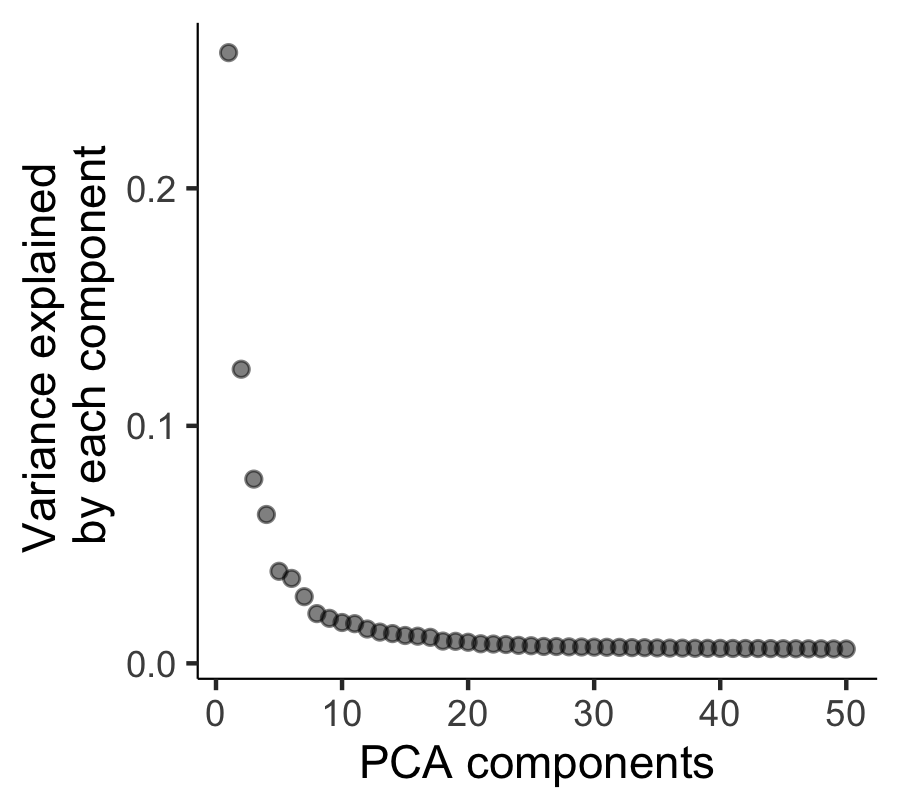
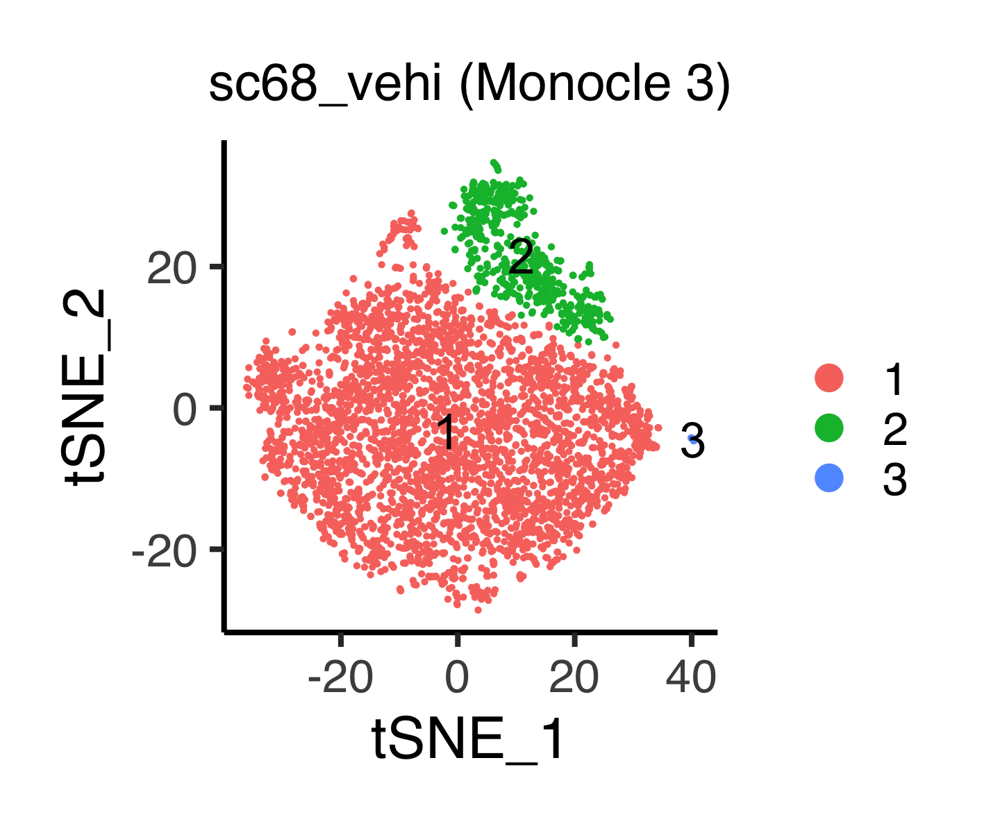
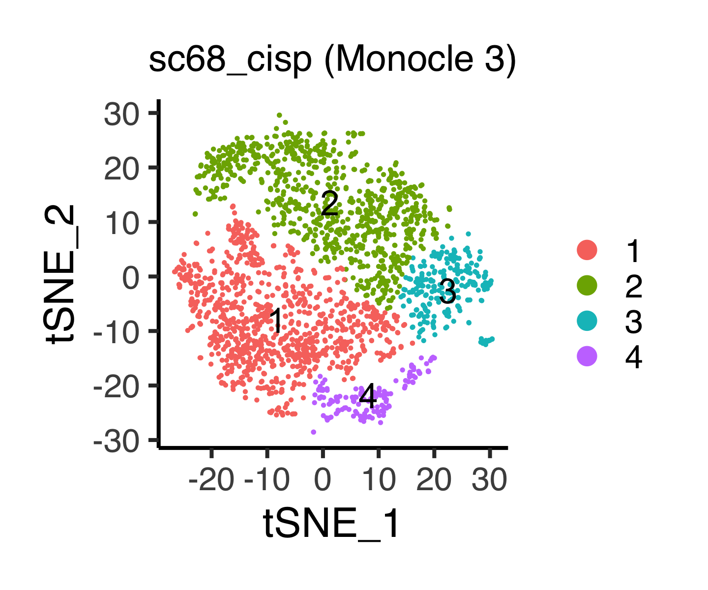
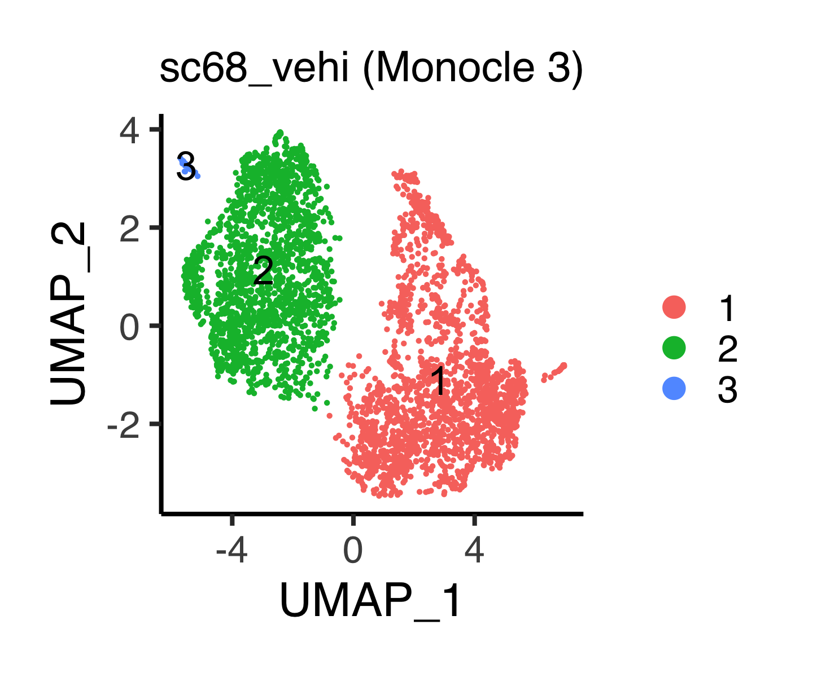
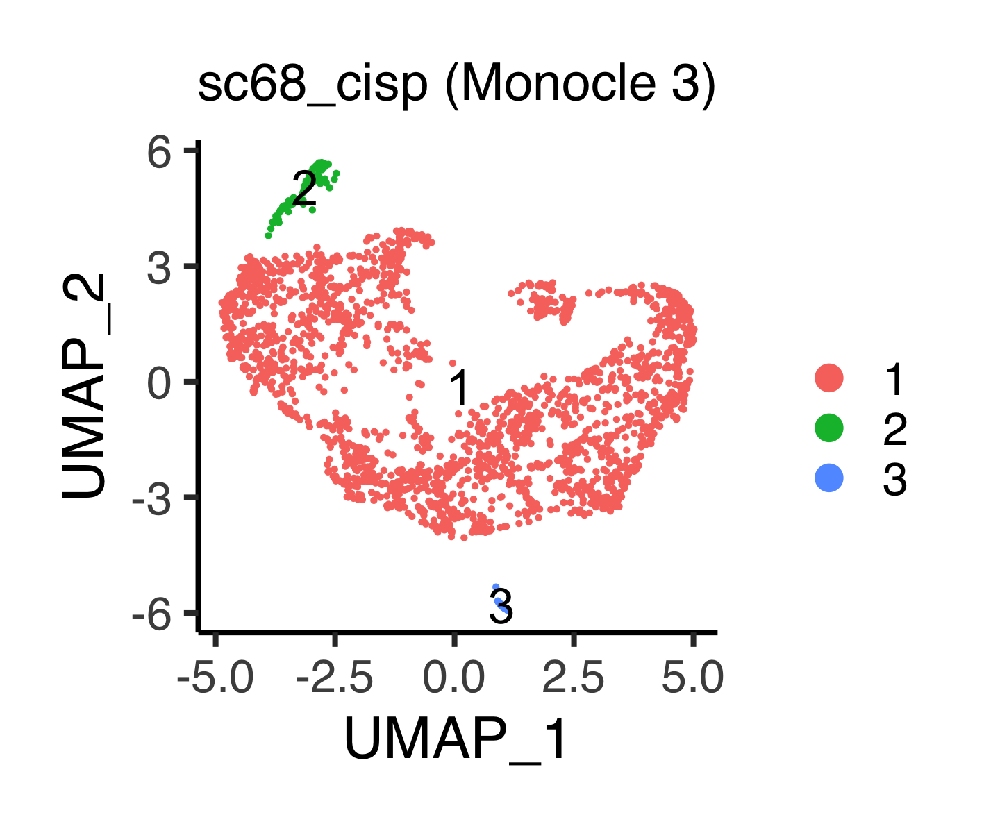
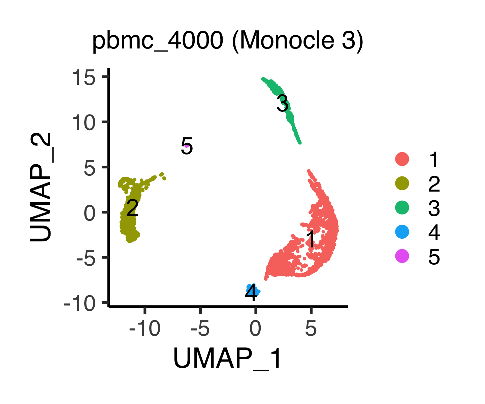
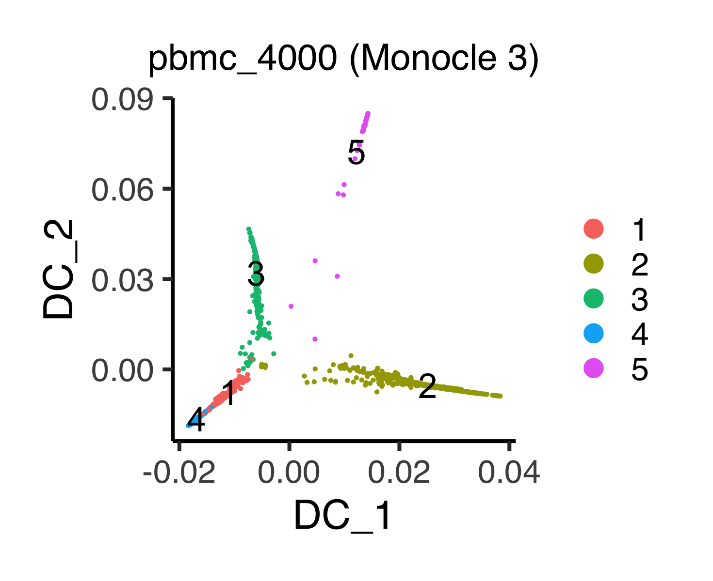
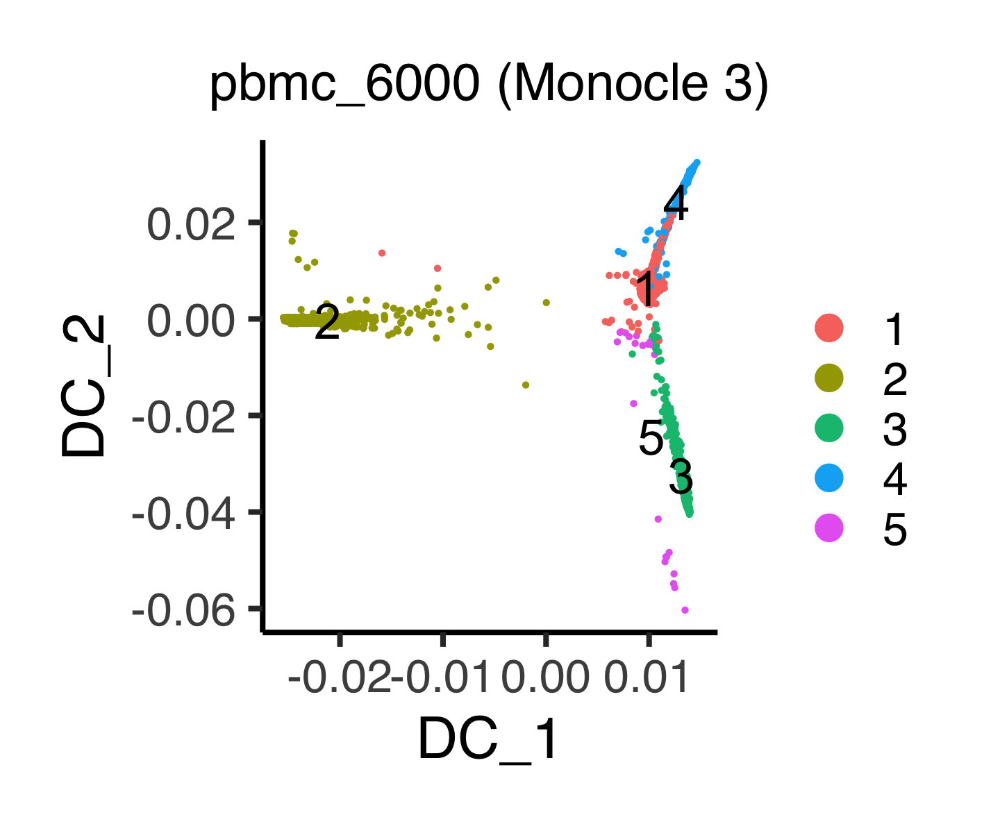

# Appendix C: analyzing scRNA-seq data by existing method III
In this section, we analyze scRNA-seq datasets using Monocle 3.

The following libraries are used.
```{r, eval = FALSE}
library(tidyverse)       # For efficient handling of data.frame
library(DT)              # For using datatable
library(monocle3)        # For using Monocle 3
library(destiny)         # For using DiffusionMap()
library(DOSE)            # For using DB for Disease Ontology
```

```{r}
packageVersion("monocle3")
```

```
[1] ‘1.0.0’
```


## Preprocessing
Load the data.
```{r, eval = FALSE}
rm(list=ls())
source("R/function_monocle3.R")
sc68_vehi <- readRDS(file = "backup/01_005_sc68_vehi_normalized.rds")
sc68_cisp <- readRDS(file = "backup/02_005_sc68_cisp_normalized.rds")
pbmc_4000 <- readRDS(file = "backup/10_005_pbmc_4000_normalized.rds")
pbmc_6000 <- readRDS(file = "backup/11_005_pbmc_6000_normalized.rds")
```

Check the size of the gene-by-sample matrices.
```{r, eval = FALSE}
dim(sc68_vehi[["data"]][["raw"]])
dim(sc68_cisp[["data"]][["raw"]])
dim(pbmc_4000[["data"]][["raw"]])
dim(pbmc_6000[["data"]][["raw"]])
```

```
[1] 6581 3923
[1] 6347 2285
[1] 6658 3815
[1] 5169 4878
```

Create Monocle 3 objects (cell_data_set (CDS)).
```{r, eval = FALSE}
create_monocle_obj <- function(obj){
  cells <- obj[["sample"]][["barcode"]]
  names(cells) <- obj[["sample"]][["barcode"]]
  genes <- obj[["variable"]][["symbol"]]
  names(genes) <- obj[["variable"]][["symbol"]]
  mat <- obj[["data"]][["bayNorm"]][["Bay_out"]]
  res <- new_cell_data_set(
    expression_data = as.matrix(mat),
    cell_metadata = as.data.frame(cells),
    gene_metadata = data.frame(gene_short_name=genes))
  obj <- NULL
  obj[["sce"]] <- res
  return(obj)
}

sc68_vehi <- create_monocle_obj(obj = sc68_vehi)
sc68_cisp <- create_monocle_obj(obj = sc68_cisp)
pbmc_4000 <- create_monocle_obj(obj = pbmc_4000)
pbmc_6000 <- create_monocle_obj(obj = pbmc_6000)
```

Preprocess the data under the default settings of Monocle 3 (version 1.0.0),
e.g., `num_dim = 50` and `norm_method = "log"`.
```{r, eval = FALSE}
sc68_vehi[["sce"]] <- preprocess_cds(sc68_vehi[["sce"]], num_dim = 50,
                                     norm_method = "log")
sc68_cisp[["sce"]] <- preprocess_cds(sc68_cisp[["sce"]], num_dim = 50,
                                     norm_method = "log")
pbmc_4000[["sce"]] <- preprocess_cds(pbmc_4000[["sce"]], num_dim = 50,
                                     norm_method = "log")
pbmc_6000[["sce"]] <- preprocess_cds(pbmc_6000[["sce"]], num_dim = 50,
                                     norm_method = "log")
```

Store the result of `normalized_counts()` with `norm_method = "log"` into
`obj@assays@data@listData[["logcounts"]]`.
```{r, eval = FALSE}
sc68_vehi[["sce"]]@assays@data@listData[["logcounts"]] <- normalized_counts(
  sc68_vehi[["sce"]], norm_method = "log", pseudocount = 1)

sc68_cisp[["sce"]]@assays@data@listData[["logcounts"]] <- normalized_counts(
  sc68_cisp[["sce"]], norm_method = "log", pseudocount = 1)

pbmc_4000[["sce"]]@assays@data@listData[["logcounts"]] <- normalized_counts(
  pbmc_4000[["sce"]], norm_method = "log", pseudocount = 1)

pbmc_6000[["sce"]]@assays@data@listData[["logcounts"]] <- normalized_counts(
  pbmc_6000[["sce"]], norm_method = "log", pseudocount = 1)
```

Check the eigen value (variance) of each principal component by elbow plot.
```{r, eval = FALSE}
# ----------------------------------------
# sc68_vehi
# ----------------------------------------
p <- plot_pc_variance_explained(sc68_vehi[["sce"]])
filename <- "figures/figure_01_0700.png"
ggsave(file = filename, plot = p, dpi = 300, width = 3, height = 2.7)
```

```{r, eval = FALSE, echo = FALSE, results = "hide"}
# ----------------------------------------
# sc68_cisp
# ----------------------------------------
p <- plot_pc_variance_explained(sc68_cisp[["sce"]])
filename <- "figures/figure_02_0700.png"
ggsave(file = filename, plot = p, dpi = 300, width = 3, height = 2.7)
# ----------------------------------------
# pbmc_4000
# ----------------------------------------
p <- plot_pc_variance_explained(pbmc_4000[["sce"]])
filename <- "figures/figure_10_0700.png"
ggsave(file = filename, plot = p, dpi = 300, width = 3, height = 2.7)
# ----------------------------------------
# pbmc_6000
# ----------------------------------------
p <- plot_pc_variance_explained(pbmc_6000[["sce"]])
filename <- "figures/figure_11_0700.png"
ggsave(file = filename, plot = p, dpi = 300, width = 3, height = 2.7)
```





Reduce data dimensions.
```{r, eval = FALSE}
# ----------------------------------------
# t-SNE
# ----------------------------------------
sc68_vehi[["sce"]] <- reduce_dimension(sc68_vehi[["sce"]],
                                       reduction_method = "tSNE",
                                       preprocess_method = "PCA")
sc68_cisp[["sce"]] <- reduce_dimension(sc68_cisp[["sce"]],
                                       reduction_method = "tSNE",
                                       preprocess_method = "PCA")
pbmc_4000[["sce"]] <- reduce_dimension(pbmc_4000[["sce"]],
                                       reduction_method = "tSNE",
                                       preprocess_method = "PCA")
pbmc_6000[["sce"]] <- reduce_dimension(pbmc_6000[["sce"]],
                                       reduction_method = "tSNE",
                                       preprocess_method = "PCA")
# ----------------------------------------
# UMAP
# ----------------------------------------
sc68_vehi[["sce"]] <- reduce_dimension(sc68_vehi[["sce"]],
                                       reduction_method = "UMAP",
                                       preprocess_method = "PCA")
sc68_cisp[["sce"]] <- reduce_dimension(sc68_cisp[["sce"]],
                                       reduction_method = "UMAP",
                                       preprocess_method = "PCA")
pbmc_4000[["sce"]] <- reduce_dimension(pbmc_4000[["sce"]],
                                       reduction_method = "UMAP",
                                       preprocess_method = "PCA")
pbmc_6000[["sce"]] <- reduce_dimension(pbmc_6000[["sce"]],
                                       reduction_method = "UMAP",
                                       preprocess_method = "PCA")
```


## Cluster cells
Group cells into clusters by using a community detection algorithm.
```{r, eval = FALSE}
# ----------------------------------------
# t-SNE
# ----------------------------------------
sc68_vehi[["sce"]] <- cluster_cells(sc68_vehi[["sce"]], resolution = 2e-4,
                                    reduction_method = "tSNE")
sc68_cisp[["sce"]] <- cluster_cells(sc68_cisp[["sce"]], resolution = 1e-3,
                                    reduction_method = "tSNE")
pbmc_4000[["sce"]] <- cluster_cells(pbmc_4000[["sce"]], resolution = 1e-4,
                                    reduction_method = "tSNE")
pbmc_6000[["sce"]] <- cluster_cells(pbmc_6000[["sce"]], resolution = 5e-4,
                                    reduction_method = "tSNE")
# ----------------------------------------
# UMAP
# ----------------------------------------
sc68_vehi[["sce"]] <- cluster_cells(sc68_vehi[["sce"]], resolution = 5e-5,
                                    reduction_method = "UMAP")
sc68_cisp[["sce"]] <- cluster_cells(sc68_cisp[["sce"]], resolution = 5e-5,
                                    reduction_method = "UMAP")
pbmc_4000[["sce"]] <- cluster_cells(pbmc_4000[["sce"]], resolution = 1e-5,
                                    reduction_method = "UMAP")
pbmc_6000[["sce"]] <- cluster_cells(pbmc_6000[["sce"]], resolution = 1e-5,
                                    reduction_method = "UMAP")
```


## Visualize data in low dimensional space
The following function `plot_tsne_monocle3()` shows clustering results in a
two-dimensional t-SNE space, in which cells are clustered by
`obj@clusters@listData[["tSNE"]][["clusters"]]`.
```{r, eval = FALSE}
# ----------------------------------------
# sc68_vehi
# ----------------------------------------
p <- plot_tsne_monocle3(obj = sc68_vehi[["sce"]],
                        title = "sc68_vehi (Monocle 3)", title_size = 18,
                        xlabel = "tSNE_1", ylabel = "tSNE_2",
                        default_color = TRUE)
filename <- "figures/figure_01_0705.png"
ggsave(file = filename, plot = p, dpi = 300, width = 4.8, height = 4.0)
```

```{r, eval = FALSE, echo = FALSE, results = "hide"}
# ----------------------------------------
# sc68_cisp
# ----------------------------------------
p <- plot_tsne_monocle3(obj = sc68_cisp[["sce"]],
                        title = "sc68_cisp (Monocle 3)", title_size = 18,
                        xlabel = "tSNE_1", ylabel = "tSNE_2",
                        default_color = TRUE)
filename <- "figures/figure_02_0705.png"
ggsave(file = filename, plot = p, dpi = 300, width = 4.8, height = 4.0)
# ----------------------------------------
# pbmc_4000
# ----------------------------------------
p <- plot_tsne_monocle3(obj = pbmc_4000[["sce"]],
                        title = "pbmc_4000 (Monocle 3)", title_size = 18,
                        xlabel = "tSNE_1", ylabel = "tSNE_2",
                        default_color = TRUE)
filename <- "figures/figure_10_0705.png"
ggsave(file = filename, plot = p, dpi = 300, width = 4.8, height = 4.0)
# ----------------------------------------
# pbmc_6000
# ----------------------------------------
p <- plot_tsne_monocle3(obj = pbmc_6000[["sce"]],
                        title = "pbmc_6000 (Monocle 3)",
                        title_size = 18, xlabel = "tSNE_1", ylabel = "tSNE_2",
                        default_color = TRUE)
filename <- "figures/figure_11_0705.png"
ggsave(file = filename, plot = p, dpi = 300, width = 4.8, height = 4.0)
```





The following function `plot_umap_seurat()` shows clustering results in a
two-dimensional UMAP space, in which cells are clustered by
`obj@clusters@listData[["UMAP"]][["clusters"]]`.
```{r, eval = FALSE}
# ----------------------------------------
# sc68_vehi
# ----------------------------------------
p <- plot_umap_monocle3(obj = sc68_vehi[["sce"]],
                        title = "sc68_vehi (Monocle 3)", title_size = 18,
                        xlabel = "UMAP_1", ylabel = "UMAP_2",
                        default_color = TRUE)
filename <- "figures/figure_01_0706.png"
ggsave(file = filename, plot = p, dpi = 300, width = 4.8, height = 4.0)
```

```{r, eval = FALSE, echo = FALSE, results = "hide"}
# ----------------------------------------
# sc68_cisp
# ----------------------------------------
p <- plot_umap_monocle3(obj = sc68_cisp[["sce"]],
                        title = "sc68_cisp (Monocle 3)", title_size = 18,
                        xlabel = "UMAP_1", ylabel = "UMAP_2",
                        default_color = TRUE)
filename <- "figures/figure_02_0706.png"
ggsave(file = filename, plot = p, dpi = 300, width = 4.8, height = 4.0)
# ----------------------------------------
# pbmc_4000
# ----------------------------------------
p <- plot_umap_monocle3(obj = pbmc_4000[["sce"]],
                        title = "pbmc_4000 (Monocle 3)", title_size = 18,
                        xlabel = "UMAP_1", ylabel = "UMAP_2",
                        default_color = TRUE)
filename <- "figures/figure_10_0706.png"
ggsave(file = filename, plot = p, dpi = 300, width = 4.8, height = 4.0)
# ----------------------------------------
# pbmc_6000
# ----------------------------------------
p <- plot_umap_monocle3(obj = pbmc_6000[["sce"]],
                        title = "pbmc_6000 (Monocle 3)", title_size = 18,
                        xlabel = "UMAP_1", ylabel = "UMAP_2",
                        default_color = TRUE)
filename <- "figures/figure_11_0706.png"
ggsave(file = filename, plot = p, dpi = 300, width = 4.8, height = 4.0)
```







The following function `do_dmap_monocle3()` performs `DiffusionMap()` using
`destiny` package, where the arguments are preset as `sigma = "local"` and
`distance = "euclidean"`.
The arguments are `obj`, `sigma` (argument of `DiffusionMap()`), `distance`
(argument of `DiffusionMap()`), and `pca_dim` (an integer: dimension of
principal component, in which `NULL` is accepted if users would like to compute
diffusion map from the original gene expression matrices).

**Tips:**
If the resulting diffusion map is distorted by outliers, tuning of `pca_dim`
will be required.
```{r, eval = FALSE}
sc68_vehi[["sce"]] <- do_dmap_monocle3(obj = sc68_vehi[["sce"]], pca_dim = 50)
sc68_cisp[["sce"]] <- do_dmap_monocle3(obj = sc68_cisp[["sce"]], pca_dim = 50)
pbmc_4000[["sce"]] <- do_dmap_monocle3(obj = pbmc_4000[["sce"]], pca_dim = 50)
pbmc_6000[["sce"]] <- do_dmap_monocle3(obj = pbmc_6000[["sce"]], pca_dim = 50)
```
The results are stored in
`obj@int_colData@listData[["reducedDims"]]@listData[["dmap"]]`.

The following function `plot_dmap_monocle3()` shows the data in a
two-dimensional diffusion map, in which cells are clustered by
`obj@clusters@listData[["UMAP"]][["clusters"]]`.
```{r, eval = FALSE}
# ----------------------------------------
# sc68_vehi
# ----------------------------------------
p <- plot_dmap_monocle3(obj = sc68_vehi[["sce"]],
                        title = "sc68_vehi (Monocle 3)", title_size = 18,
                        xlabel = "DC_1", ylabel = "DC_2",
                        default_color = TRUE)
filename <- "figures/figure_01_0707.png"
ggsave(file = filename, plot = p, dpi = 300, width = 5.0, height = 4.0)
```

```{r, eval = FALSE, echo = FALSE, results = "hide"}
# ----------------------------------------
# sc68_cisp
# ----------------------------------------
p <- plot_dmap_monocle3(obj = sc68_cisp[["sce"]],
                        title = "sc68_cisp (Monocle 3)", title_size = 18,
                        xlabel = "DC_1", ylabel = "DC_2",
                        default_color = TRUE)
filename <- "figures/figure_02_0707.png"
ggsave(file = filename, plot = p, dpi = 300, width = 4.9, height = 4.0)
# ----------------------------------------
# pbmc_4000
# ----------------------------------------
p <- plot_dmap_monocle3(obj = pbmc_4000[["sce"]],
                        title = "pbmc_4000 (Monocle 3)", title_size = 18,
                        xlabel = "DC_1", ylabel = "DC_2",
                        default_color = TRUE)
filename <- "figures/figure_10_0707.png"
ggsave(file = filename, plot = p, dpi = 300, width = 4.9, height = 4.0)
# ----------------------------------------
# pbmc_6000
# ----------------------------------------
p <- plot_dmap_monocle3(obj = pbmc_6000[["sce"]],
                        title = "pbmc_6000 (Monocle 3)", title_size = 18,
                        xlabel = "DC_1", ylabel = "DC_2",
                        default_color = TRUE)
filename <- "figures/figure_11_0707.png"
ggsave(file = filename, plot = p, dpi = 300, width = 4.8, height = 4.0)
```






## Find differentially expressed genes
Find differentially expressed genes.
```{r, eval = FALSE}
sc68_vehi[["markers"]] <- top_markers(sc68_vehi[["sce"]],
                                      group_cells_by = "cluster",
                                      reference_cells = 1000, cores = 2)
sc68_cisp[["markers"]] <- top_markers(sc68_cisp[["sce"]],
                                      group_cells_by = "cluster",
                                      reference_cells = 1000, cores = 2)
pbmc_4000[["markers"]] <- top_markers(pbmc_4000[["sce"]],
                                      group_cells_by = "cluster",
                                      reference_cells = 1000, cores = 2)
pbmc_6000[["markers"]] <- top_markers(pbmc_6000[["sce"]],
                                      group_cells_by = "cluster",
                                      reference_cells = 1000, cores = 2)
```

Find marker genes by ranking them according to the argument `pseudo_R2`.
```{r, eval = FALSE}
sc68_vehi[["topmarker"]] <- sc68_vehi[["markers"]] %>%
  filter(fraction_expressing >= 0.10) %>% group_by(cell_group) %>%
  top_n(50, pseudo_R2)

sc68_cisp[["topmarker"]] <- sc68_cisp[["markers"]] %>%
  filter(fraction_expressing >= 0.10) %>% group_by(cell_group) %>%
  top_n(50, pseudo_R2)

pbmc_4000[["topmarker"]] <- pbmc_4000[["markers"]] %>%
  filter(fraction_expressing >= 0.10) %>% group_by(cell_group) %>%
  top_n(50, pseudo_R2)

pbmc_6000[["topmarker"]] <- pbmc_6000[["markers"]] %>%
  filter(fraction_expressing >= 0.10) %>% group_by(cell_group) %>%
  top_n(50, pseudo_R2)
```

Users can check the marker genes of each cluster by the following command:
```{r, eval = FALSE}
datatable(sc68_vehi[["topmarker"]], rownames = FALSE)
datatable(sc68_cisp[["topmarker"]], rownames = FALSE)
datatable(pbmc_4000[["topmarker"]], rownames = FALSE)
datatable(pbmc_6000[["topmarker"]], rownames = FALSE)
```

* `sc68_vehi`

<iframe src="figures/sc68_vehi_marker_monocle3.html" style="width:100%; height:400px;"></iframe>

<br><br><br><br><br><br><br><br><br><br>

* `sc68_cisp`

<iframe src="figures/sc68_cisp_marker_monocle3.html" style="width:100%; height:400px;"></iframe>

<br><br><br><br><br><br><br><br><br><br>

* `pbmc_4000`

<iframe src="figures/pbmc_4000_marker_monocle3.html" style="width:100%; height:400px;"></iframe>

<br><br><br><br><br><br><br><br><br><br>

* `pbmc_6000`

<iframe src="figures/pbmc_6000_marker_monocle3.html" style="width:100%; height:400px;"></iframe>

<br><br><br><br><br><br><br><br><br><br>


## Save results
Save the objects.
```{r, eval = FALSE}
saveRDS(sc68_vehi, file = "backup/01_700_sc68_vehi_monocle3.rds")
saveRDS(sc68_cisp, file = "backup/02_700_sc68_cisp_monocle3.rds")
saveRDS(pbmc_4000, file = "backup/10_700_pbmc_4000_monocle3.rds")
saveRDS(pbmc_6000, file = "backup/11_700_pbmc_6000_monocle3.rds")
```

One can load the results.
```{r, eval = FALSE}
sc68_vehi <- readRDS(file = "backup/01_700_sc68_vehi_monocle3.rds")
sc68_cisp <- readRDS(file = "backup/02_700_sc68_cisp_monocle3.rds")
pbmc_4000 <- readRDS(file = "backup/10_700_pbmc_4000_monocle3.rds")
pbmc_6000 <- readRDS(file = "backup/11_700_pbmc_6000_monocle3.rds")
```


## Infer cell types for PBMC datasets
Load the data.
```{r, eval = FALSE}
rm(list=ls())
source("R/function_scran.R")
pbmc_4000 <- readRDS(file = "backup/10_700_pbmc_4000_monocle3.rds")
pbmc_6000 <- readRDS(file = "backup/11_700_pbmc_6000_monocle3.rds")
```

Based on the result of `top_markers()`, we manually investigate
marker genes using GeneCards as follows:

* pbmc_4000
```
1: T cell         # CD3D (FDR ~ 0), TCF7 (FDR ~ 0), CD3E (FDR ~ e-270)
2: Monocyte       # S100A8 (FDR ~ e-216), LYZ (FDR ~ 0), CD14 (FDR ~ e-94)
3: B cell        # CD79A (FDR ~ e-315), CD79B (FDR ~ e-276), BANK1 (FDR ~ e-156)
4: NK or NKT cell # GNLY (FDR ~ e-135), NKG7 (FDR ~ e-134), GZMA (FDR ~ e-109)
5: Unspecified
```

* pbmc_6000
```
1: T cell         # CD3D (FDR ~ 0), CD3E (FDR ~ e-217), IL32 (FDR ~ e-169)
2: Monocyte       # LYZ (FDR ~ 0), S100A8 (FDR ~ e-212), CD14 (FDR ~ e-148)
3: B cell        # CD79A (FDR ~ e-254), CD79B (FDR ~ e-218), MS4A1 (FDR ~ e-180)
4: NK or NKT cell # NKG7 (FDR ~ e-210), GNLY (FDR ~ e-200), GZMA (FDR ~ e-157)
5: Unspecified
```

Identify the cell types.
```{r, eval = FALSE}
# ----------------------------------------
# For `pbmc_4000`
# ----------------------------------------
tmp <- as.integer(as.character(clusters(pbmc_4000[["sce"]],
                                        reduction_method = "UMAP")))
tmp[tmp == 1] <- "T cell"
tmp[tmp == 2] <- "Monocyte"
tmp[tmp == 3] <- "B cell"
tmp[tmp == 4] <- "NK or NKT cell"
tmp[tmp == 5] <- "Unspecified"
tmp <- factor(tmp, levels = c("T cell", "Monocyte", "B cell", "NK or NKT cell",
                              "Unspecified"))
pbmc_4000[["mylabel"]] <- tmp
# ----------------------------------------
# For `pbmc_6000`
# ----------------------------------------
tmp <- as.integer(as.character(clusters(pbmc_6000[["sce"]],
                                        reduction_method = "UMAP")))
tmp[tmp == 1] <- "T cell"
tmp[tmp == 2] <- "Monocyte"
tmp[tmp == 3] <- "B cell"
tmp[tmp == 4] <- "NK or NKT cell"
tmp[tmp == 5] <- "Unspecified"
tmp <- factor(tmp, levels = c("T cell", "Monocyte", "B cell", "NK or NKT cell",
                              "Unspecified"))
pbmc_6000[["mylabel"]] <- tmp
```

The numbers of cells are stored in a table.
```{r, eval = FALSE}
identify_cell <- function(obj){
  tmp <- obj[["mylabel"]]
  cells <- levels(tmp)
  df <- c()
  for(cell in cells){
    df <- rbind(df, c(cell, length(tmp[tmp==cell])))
  }
  df <- as.data.frame(df)
  colnames(df) <- c("cell_type", "n")
  return(df)
}

pbmc_4000[["population"]] <- identify_cell(obj = pbmc_4000)
pbmc_6000[["population"]] <- identify_cell(obj = pbmc_6000)
```

Save the objects.
```{r, eval = FALSE}
saveRDS(pbmc_4000, file = "backup/10_701_pbmc_4000_monocle3.rds")
saveRDS(pbmc_6000, file = "backup/11_701_pbmc_6000_monocle3.rds")
```
