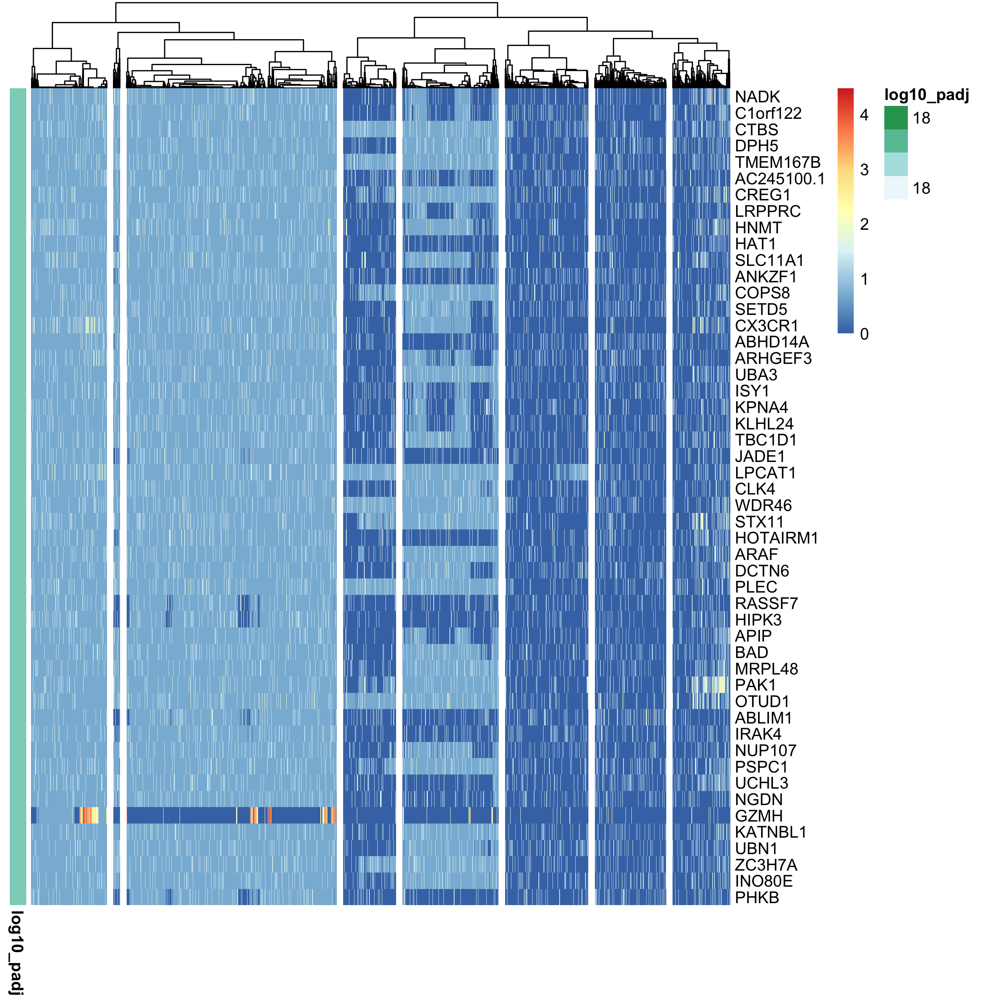
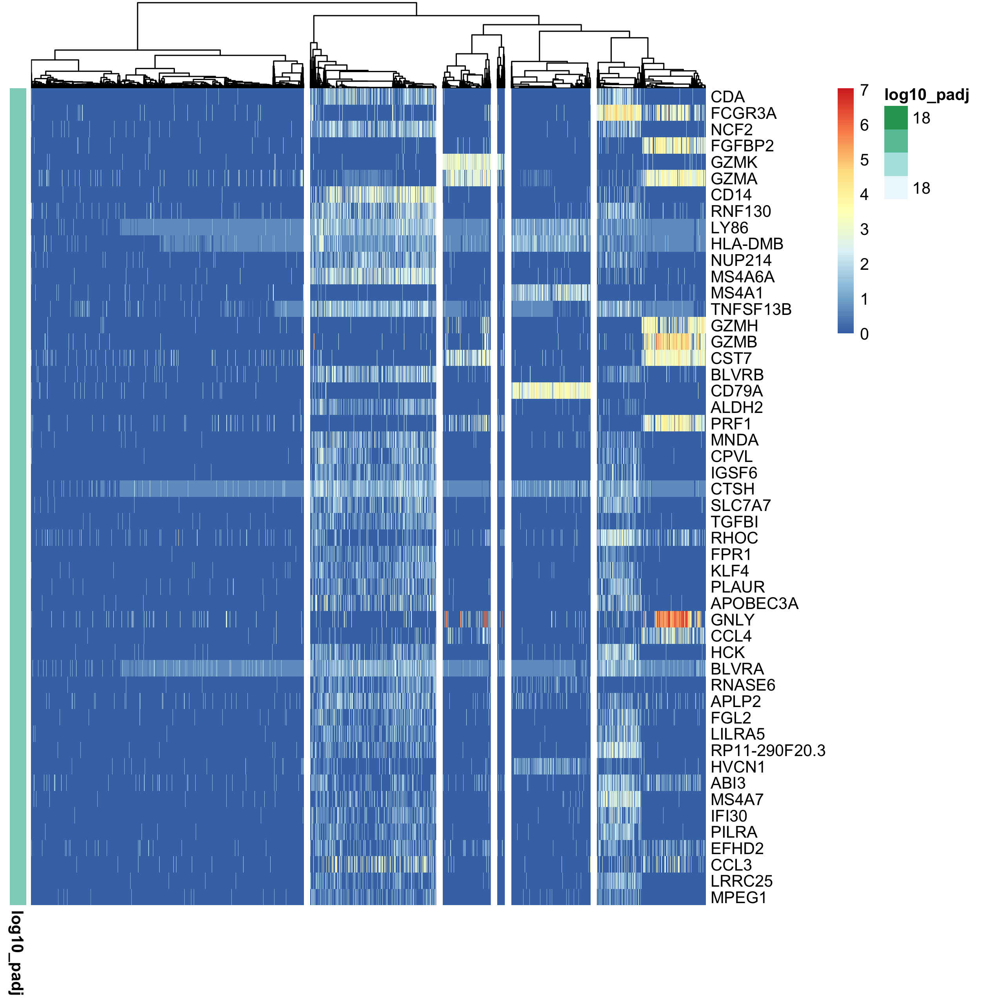

# Appendix D: analyzing scRNA-seq data by existing method IV
In this section, we analyze scRNA-seq datasets using SC3.

The following libraries are used.
```{r, eval = FALSE}
library(tidyverse)              # For efficient handling of data.frame
library(org.Hs.eg.db)           # For using human genome annotation package
library(DT)                     # For using datatable
library(SC3)                    # For using SC3
library(scater)                 # For using SC3
library(SingleCellExperiment)   # For using SC3
```

```{r}
packageVersion("SC3")
```

```
[1] ‘1.18.0’
```


## Preprocessing
Load the data.
```{r, eval = FALSE}
rm(list=ls())
sc68_vehi <- readRDS(file = "backup/01_005_sc68_vehi_normalized.rds")
sc68_cisp <- readRDS(file = "backup/02_005_sc68_cisp_normalized.rds")
pbmc_4000 <- readRDS(file = "backup/10_005_pbmc_4000_normalized.rds")
pbmc_6000 <- readRDS(file = "backup/11_005_pbmc_6000_normalized.rds")
```

Check the size of the gene-by-sample matrices.
```{r, eval = FALSE}
dim(sc68_vehi[["data"]][["raw"]])
dim(sc68_cisp[["data"]][["raw"]])
dim(pbmc_4000[["data"]][["raw"]])
dim(pbmc_6000[["data"]][["raw"]])
```

```
[1] 6581 3923
[1] 6347 2285
[1] 6658 3815
[1] 5169 4878
```

Create SC3 objects (`SingleCellExperiment`).
```{r, eval = FALSE}
create_sce_object <- function(obj){
  obj_sce <- SingleCellExperiment(
    assay = list(counts = as.matrix(obj[["data"]][["bayNorm"]][["Bay_out"]]),
                 logcounts = as.matrix(obj[["data"]][["normalized"]])),
    colData = list(barcode = obj[["sample"]][["barcode"]])
  )
  rowData(obj_sce)$feature_symbol <- obj[["variable"]][["symbol"]]
  obj_sce <- obj_sce[!duplicated(rowData(obj_sce)$feature_symbol),]
  obj <- NULL
  obj[["sce"]] <- obj_sce
  return(obj)
}

sc68_vehi <- create_sce_object(obj = sc68_vehi)
sc68_cisp <- create_sce_object(obj = sc68_cisp)
pbmc_4000 <- create_sce_object(obj = pbmc_4000)
pbmc_6000 <- create_sce_object(obj = pbmc_6000)
```

Run principal component analysis (PCA).
```{r, eval = FALSE}
sc68_vehi[["sce"]] <- runPCA(sc68_vehi[["sce"]])
sc68_cisp[["sce"]] <- runPCA(sc68_cisp[["sce"]])
pbmc_4000[["sce"]] <- runPCA(pbmc_4000[["sce"]])
pbmc_6000[["sce"]] <- runPCA(pbmc_6000[["sce"]])
```


## Cluster cells
Run `sc3()`, in which parameter `ks` is subjectively determined by considering
biological backgrounds.
Here, `sc3()` could not compute for `sc68_vehi` and `sc68_cisp`.
```{r, eval = FALSE}
set.seed(8)
pbmc_4000[["sce"]] <- sc3(pbmc_4000[["sce"]], ks = 2:8, biology = TRUE)
pbmc_6000[["sce"]] <- sc3(pbmc_6000[["sce"]], ks = 2:8, biology = TRUE)
```

Visualize differentially expressed genes, which are calculated using
non-parametric Kruskal-Wallis test in `SC3` package.
```{r, eval = FALSE}
# ----------------------------------------
# pbmc_4000
# ----------------------------------------
p <- sc3_plot_de_genes(pbmc_4000[["sce"]], k = 8)
filename <- "figures/figure_10_0800.png"
ggsave(file = filename, plot = p, dpi = 300, width = 8.5, height = 8.5)
# ----------------------------------------
# pbmc_6000
# ----------------------------------------
p <- sc3_plot_de_genes(pbmc_6000[["sce"]], k = 6)
filename <- "figures/figure_11_0800.png"
ggsave(file = filename, plot = p, dpi = 300, width = 8.5, height = 8.5)
```





## Find differentially expressed genes
Find marker genes by using `sc3_plot_markers()` in `SC3` package.
Although we changed the argument `k` from 2 to 8, the following values seemed
to be the best of all.
```{r, eval = FALSE}
p <- sc3_plot_markers(pbmc_4000[["sce"]], k = 8)
filename <- "figures/figure_10_0801.png"
ggsave(file = filename, plot = p, dpi = 300, width = 8.5, height = 8.5)

p <- sc3_plot_markers(pbmc_6000[["sce"]], k = 8)
filename <- "figures/figure_11_0801.png"
ggsave(file = filename, plot = p, dpi = 300, width = 8.5, height = 8.5)
```

Run `get_de_genes()` in `SC3` package to get differentially expressed genes.
Note that as described in the package of `SC3`, the calculation of differential
expression after clustering can introduce a bias in the distribution of
p-values, and thus it is advised to use the p-values for ranking the genes only.
```{r, eval = FALSE}
pbmc_4000[["DEGs"]] <- data.frame(pval = get_de_genes(
  dataset = pbmc_4000[["sce"]]@assays@data@listData[["logcounts"]],
  labels = pbmc_4000[["sce"]]@colData@listData[["sc3_8_clusters"]]))

pbmc_6000[["DEGs"]] <- data.frame(pval = get_de_genes(
  dataset = pbmc_6000[["sce"]]@assays@data@listData[["logcounts"]],
  labels = pbmc_6000[["sce"]]@colData@listData[["sc3_8_clusters"]]))
```

Run `get_marker_genes()` in `SC3` package to find marker genes, where p-values
are adjusted ones.
```{r, eval = FALSE}
# ----------------------------------------
# pbmc_4000
# ----------------------------------------
tmp <- pbmc_4000[["markers"]]
tmp <- get_marker_genes(
  dataset = pbmc_4000[["sce"]]@assays@data@listData[["logcounts"]],
  labels = pbmc_4000[["sce"]]@colData@listData[["sc3_8_clusters"]])
tmp$gene <- rownames(pbmc_4000[["DEGs"]])
inds <- order(tmp$clusts, tmp$pvalue)
tmp <- tmp[inds,]
tmp <- tmp[which(tmp$pvalue < 0.5),]
pbmc_4000[["markers"]] <- tmp
# ----------------------------------------
# pbmc_6000
# ----------------------------------------
tmp <- pbmc_6000[["markers"]]
tmp <- get_marker_genes(
  dataset = pbmc_6000[["sce"]]@assays@data@listData[["logcounts"]],
  labels = pbmc_6000[["sce"]]@colData@listData[["sc3_8_clusters"]])
tmp$gene <- rownames(pbmc_6000[["DEGs"]])
inds <- order(tmp$clusts, tmp$pvalue)
tmp <- tmp[inds,]
tmp <- tmp[which(tmp$pvalue < 0.5),]
pbmc_6000[["markers"]] <- tmp
```

Users can check the marker genes of each cluster by the following command:
```{r, eval = FALSE}
datatable(pbmc_4000[["markers"]], rownames = FALSE)
datatable(pbmc_6000[["markers"]], rownames = FALSE)
```

* `pbmc_4000`

<iframe src="figures/pbmc_4000_marker_sc3.html" style="width:100%; height:400px;"></iframe>

<br><br><br><br><br><br><br><br><br><br>

* `pbmc_6000`

<iframe src="figures/pbmc_6000_marker_sc3.html" style="width:100%; height:400px;"></iframe>

<br><br><br><br><br><br><br><br><br><br>


## Save results
Save the objects.
```{r, eval = FALSE}
saveRDS(pbmc_4000, file = "backup/10_800_pbmc_4000_sc3.rds")
saveRDS(pbmc_6000, file = "backup/11_800_pbmc_6000_sc3.rds")
```

One can load the results.
```{r, eval = FALSE}
pbmc_4000 <- readRDS(file = "backup/10_800_pbmc_4000_sc3.rds")
pbmc_6000 <- readRDS(file = "backup/11_800_pbmc_6000_sc3.rds")
```


## Infer cell types for PBMC datasets
Load the data.
```{r, eval = FALSE}
rm(list=ls())
source("R/function_scran.R")
pbmc_4000 <- readRDS(file = "backup/10_800_pbmc_4000_sc3.rds")
pbmc_6000 <- readRDS(file = "backup/11_800_pbmc_6000_sc3.rds")
```

Based on the result of `sc3()`, we manually investigate marker genes
using GeneCards as follows:

* `pbmc_4000`

```
1: NK or NKT cells # GZMH (padj ~ 0), GZMK (padj ~ e-143), GNLY (padj ~ e-131)
2: Unspecified
3: T cell          # TRGC2 (padj ~ e-282), TCL1A (padj ~ e-213)
4: Unspecified
5: Unspecified
6: Unspecified
7: Unspecified
8: Monocyte        # GSN (padj ~ e-124), LILRB4 (padj ~ e-114)
```

* `pbmc_6000`

```
1: Unspecified
2: Unspecified
3: Monocyte       # S100A8 (padj ~ 0), CD14 (padj ~ 0), S100A12 (padj ~ e-298)
4: Unspecified
5: B cell         # CD79A (padj ~ 0), CD79B (padj ~ 0), MS4A1 (padj ~ 0)
6: Unspecified
7: B cell         # SPI1 (padj ~ e-240), LYN (padj ~ e-189)
8: NK or NKT cell # GNLY (padj ~ 0), GZMA (padj ~ 0), GZMB (padj ~ 0)
```

Identify the cell types.
```{r, eval = FALSE}
# ----------------------------------------
# pbmc_4000
# ----------------------------------------
tmp <- as.integer(as.character(
  pbmc_4000[["sce"]]@colData@listData[["sc3_8_clusters"]]))
tmp[tmp == 1] <- "NK or NKT cell"
tmp[tmp == 2] <- "Unspecified"
tmp[tmp == 3] <- "T cell"
tmp[tmp == 4] <- "Unspecified"
tmp[tmp == 5] <- "Unspecified"
tmp[tmp == 6] <- "Unspecified"
tmp[tmp == 7] <- "Unspecified"
tmp[tmp == 8] <- "Monocyte"
tmp <- factor(tmp, levels = c("T cell", "Monocyte", "NK or NKT cell",
                              "Unspecified"))
pbmc_4000[["mylabel"]] <- tmp
# ----------------------------------------
# pbmc_6000
# ----------------------------------------
tmp <- as.integer(as.character(
  pbmc_6000[["sce"]]@colData@listData[["sc3_8_clusters"]]))
tmp[tmp == 1] <- "Unspecified"
tmp[tmp == 2] <- "Unspecified"
tmp[tmp == 3] <- "Monocyte"
tmp[tmp == 4] <- "Unspecified"
tmp[tmp == 5] <- "B cell"
tmp[tmp == 6] <- "NK or NKT cell"
tmp[tmp == 7] <- "B cell"
tmp[tmp == 8] <- "NK or NKT cell"
tmp <- factor(tmp, levels = c("Monocyte", "B cell", "NK or NKT cell",
                              "Unspecified"))
pbmc_6000[["mylabel"]] <- tmp
```

The numbers of cells are stored in a table.
```{r, eval = FALSE}
identify_cell <- function(obj){
  tmp <- obj[["mylabel"]]
  cells <- levels(tmp)
  df <- c()
  for(cell in cells){
    df <- rbind(df, c(cell, length(tmp[tmp==cell])))
  }
  df <- as.data.frame(df)
  colnames(df) <- c("cell_type", "n")
  return(df)
}

pbmc_4000[["population"]] <- identify_cell(obj = pbmc_4000)
pbmc_6000[["population"]] <- identify_cell(obj = pbmc_6000)
```

Save the objects.
```{r, eval = FALSE}
saveRDS(pbmc_4000, file = "backup/10_801_pbmc_4000_sc3.rds")
saveRDS(pbmc_6000, file = "backup/11_801_pbmc_6000_sc3.rds")
```
