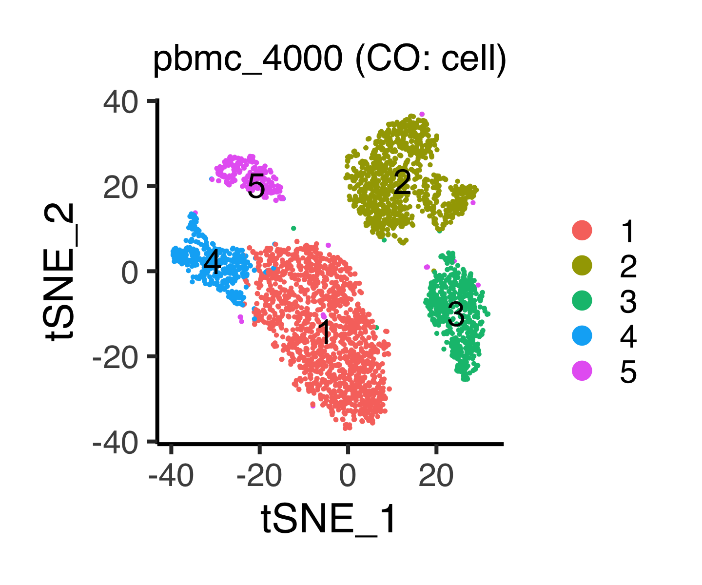
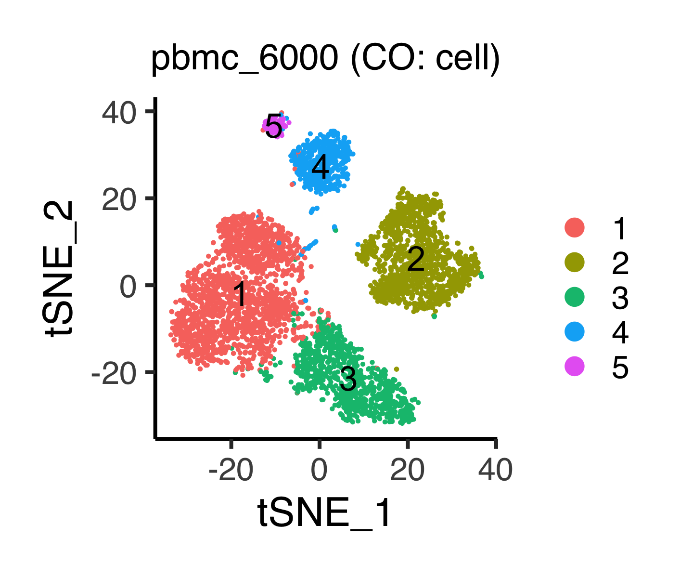
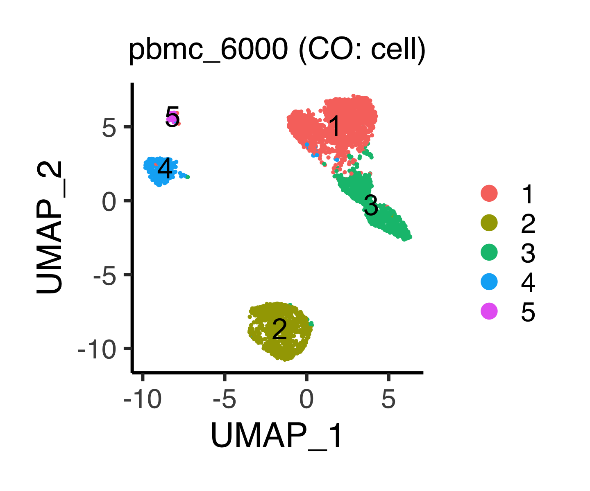

# Appendix E: analyzing scRNA-seq data using ASURAT
In this section, we analyze scRNA-seq datasets using ASURAT.

The following libraries are used.
```{r, eval = FALSE}
library(tidyverse)       # For efficient handling of data.frame
library(DT)              # For using datatable
library(org.Hs.eg.db)    # For using human genome annotation package
library(Seurat)          # For using Seurat
library(DOSE)            # For using DB for Disease Ontology
library(clusterProfiler) # For using DB for Gene Ontology
library(GOSemSim)        # For using godata() in GOSemSim package
```


## Infer cell types for PBMC datasets
Load the data.
```{r, eval = FALSE}
rm(list=ls())
source("R/function_asurat.R")
source("R/plot.R")
pbmc_4000 <- readRDS(file = "backup/10_400_pbmc_4000_all.rds")
pbmc_6000 <- readRDS(file = "backup/11_400_pbmc_6000_all.rds")
```

The following function `plot_tsne_sign()` shows sign-by-cell matrices
in low dimensional space.
Please see [previous section](#cell_type) for the details.
```{r, eval = FALSE}
# ----------------------------------------
# pbmc_4000
# ----------------------------------------
p <- plot_tsne_sign(obj = pbmc_4000, data_type = "CO", category = "cell",
                    algo_name = "seuratFindClusters", theta = NULL, phi = NULL,
                    title = "pbmc_4000 (CO: cell)", title_size = 18,
                    xlabel = "tSNE_1", ylabel = "tSNE_2", zlabel = NULL,
                    default_color = TRUE)
filename <- "figures/figure_10_0900.png"
ggsave(file = filename, plot = p, dpi = 300, width = 4.8, height = 4)
```

```{r, eval = FALSE, echo = FALSE, results = "hide"}
# ----------------------------------------
# pbmc_6000
# ----------------------------------------
p <- plot_tsne_sign(obj = pbmc_6000, data_type = "CO", category = "cell",
                    algo_name = "seuratFindClusters", theta = NULL, phi = NULL,
                    title = "pbmc_6000 (CO: cell)", title_size = 18,
                    xlabel = "tSNE_1", ylabel = "tSNE_2", zlabel = NULL,
                    default_color = TRUE)
filename <- "figures/figure_11_0900.png"
ggsave(file = filename, plot = p, dpi = 300, width = 4.8, height = 4)
```




The following function `plot_umap_sign()` shows sign-by-cell matrices
in low dimensional space.
Please see [previous section](#cell_type) for the details.
```{r, eval = FALSE}
# ----------------------------------------
# pbmc_4000
# ----------------------------------------
p <- plot_umap_sign(obj = pbmc_4000, data_type = "CO", category = "cell",
                    algo_name = "seuratFindClusters", theta = NULL, phi = NULL,
                    title = "pbmc_4000 (CO: cell)", title_size = 18,
                    xlabel = "UMAP_1", ylabel = "UMAP_2", zlabel = NULL,
                    default_color = TRUE)
filename <- "figures/figure_10_0901.png"
ggsave(file = filename, plot = p, dpi = 300, width = 4.8, height = 4)
```

```{r, eval = FALSE, echo = FALSE, results = "hide"}
# ----------------------------------------
# pbmc_6000
# ----------------------------------------
p <- plot_umap_sign(obj = pbmc_6000, data_type = "CO", category = "cell",
                    algo_name = "seuratFindClusters", theta = NULL, phi = NULL,
                    title = "pbmc_6000 (CO: cell)", title_size = 18,
                    xlabel = "UMAP_1", ylabel = "UMAP_2", zlabel = NULL,
                    default_color = TRUE)
filename <- "figures/figure_11_0901.png"
ggsave(file = filename, plot = p, dpi = 300, width = 4.8, height = 4)
```




Visualize the sign scores upregulated in each cell cluster,
using violin plots.
Please see [previous section 1](#cell_type),
[previous section 2](#biological_function), and [previous section 3](#pathway)
for the details.

Based on the above results and the manual investigation using GeneCards,
we annotated each group as follows:

* pbmc_4000

```
1: T cell
2: Monocyte
3: B cell
4: NK or NKT cell
5: NK or NKT cell
```

* pbmc_6000

```
1: T cell
2: Monocyte
3: NK or NKT cell
4: B cell
5: Dendritic cell
```

Identify the cell types.
```{r, eval = FALSE}
# ----------------------------------------
# For `pbmc_4000`
# ----------------------------------------
tmp <- as.integer(as.character(
  pbmc_4000[["sample"]][["seuratFindClusters_CO_cell"]]))
tmp[tmp == 1] <- "T cell"
tmp[tmp == 2] <- "Monocyte"
tmp[tmp == 3] <- "B cell"
tmp[tmp == 4] <- "NK or NKT cell"
tmp[tmp == 5] <- "NK or NKT cell"
tmp <- factor(tmp, levels = c("T cell", "Monocyte", "B cell", "NK or NKT cell"))
pbmc_4000[["sample"]][["mylabel"]] <- tmp
# ----------------------------------------
# For `pbmc_6000`
# ----------------------------------------
tmp <- as.integer(as.character(
  pbmc_6000[["sample"]][["seuratFindClusters_CO_cell"]]))
tmp[tmp == 1] <- "T cell"
tmp[tmp == 2] <- "Monocyte"
tmp[tmp == 3] <- "B cell"
tmp[tmp == 4] <- "NK or NKT cell"
tmp[tmp == 5] <- "Dendritic cell"
tmp <- factor(tmp, levels = c("T cell", "Monocyte", "B cell", "NK or NKT cell",
                              "Dendritic cell"))
pbmc_6000[["sample"]][["mylabel"]] <- tmp
```

The numbers of cells are stored in a table.
```{r, eval = FALSE}
identify_cell <- function(obj){
  tmp <- obj[["sample"]][["mylabel"]]
  cells <- levels(tmp)
  df <- c()
  for(cell in cells){
    df <- rbind(df, c(cell, length(tmp[tmp==cell])))
  }
  df <- as.data.frame(df)
  colnames(df) <- c("cell_type", "n")
  return(df)
}

pbmc_4000[["population"]] <- identify_cell(obj = pbmc_4000)
pbmc_6000[["population"]] <- identify_cell(obj = pbmc_6000)
```

Save the objects.
```{r, eval = FALSE}
saveRDS(pbmc_4000, file = "backup/10_901_pbmc_4000_asurat.rds")
saveRDS(pbmc_6000, file = "backup/11_901_pbmc_6000_asurat.rds")
```
