# Appendix F: creating figures
In this section, we create figures for the paper.

The following libraries are used.
```{r, eval = FALSE}
library(tidyverse)       # For efficient handling of data.frame
library(DT)              # For using datatable
library(scran)           # For using scran
library(Seurat)          # For using Seurat
library(monocle3)        # For using Monocle 3
library(SC3)             # For using SC3
library(ComplexHeatmap)  # For ComplexHeatmap
library(circlize)        # For color mapping function in ComplexHeatmap
library(RColorBrewer)    # For using brewer.pal()
library(scales)          # For using show_col()
library(Spaniel)         # For using Spaniel
```


## PBMCs datasets
### Multi-layered analysis
Load the data.
```{r, eval = FALSE}
source("R/plot.R")
pbmc_4000 <- readRDS(file = "backup/10_400_pbmc_4000_all.rds")
pbmc_6000 <- readRDS(file = "backup/11_400_pbmc_6000_all.rds")
```

Change the labels of `pbmc_4000[["sample"]][["seuratFindClusters_CO_cell"]]`
to make it correspond to those of
`pbmc_6000[["sample"]][["seuratFindClusters_CO_cell"]]`.
```{r, eval = FALSE}
df <- pbmc_4000[["sample"]]
df$seuratFindClusters_CO_cell <- as.character(df$seuratFindClusters_CO_cell)
df[df$seuratFindClusters_CO_cell == "3",]$seuratFindClusters_CO_cell <- "333"
df[df$seuratFindClusters_CO_cell == "4",]$seuratFindClusters_CO_cell <- "444"
df[df$seuratFindClusters_CO_cell == "333",]$seuratFindClusters_CO_cell <- "4"
df[df$seuratFindClusters_CO_cell == "444",]$seuratFindClusters_CO_cell <- "3"
df$seuratFindClusters_CO_cell <- as.factor(df$seuratFindClusters_CO_cell)
pbmc_4000[["sample"]] <- df
```

The following function `plot_MultiHeatmaps_SignxSamp()` vertically concatenates
two or more heat maps across different databases.
```{r, eval = FALSE}
# ----------------------------------------
# pbmc_4000
# ----------------------------------------
filename <- "figures/figure_20_0010.png"
png(file = filename, height = 1500, width = 1500, res = 300)
plot_MultiHeatmaps_SignxSamp(
  obj = pbmc_4000,
  data_types = c("CO", "GO", "KEGG"),
  categories = c("cell", "BP", "pathway"),
  algo_names = c("seuratFindClusters", "seuratFindClusters",
                 "seuratFindClusters"),
  show_labels = c(TRUE, TRUE, TRUE),
  splitting = TRUE, method = "ward.D2", show_nReads = FALSE,
  title = "pbmc_4000",
  names = c("CO:\ncell", "GO:\nBP", "KEGG:\npathway"),
  show_rownames_sign = FALSE, show_rownames_label = FALSE,
  show_rownames_nReads = FALSE, default_colors = c(TRUE, FALSE, FALSE))
dev.off()
# ----------------------------------------
# pbmc_6000
# ----------------------------------------
filename <- "figures/figure_20_0011.png"
png(file = filename, height = 1500, width = 1500, res = 300)
plot_MultiHeatmaps_SignxSamp(
  obj = pbmc_6000,
  data_types = c("CO", "GO", "KEGG"),
  categories = c("cell", "BP", "pathway"),
  algo_names = c("seuratFindClusters", "seuratFindClusters",
                 "seuratFindClusters"),
  show_labels = c(TRUE, TRUE, TRUE),
  splitting = TRUE, method = "ward.D2", show_nReads = FALSE,
  title = "pbmc_6000",
  names = c("CO:\ncell", "GO:\nBP", "KEGG:\npathway"),
  show_rownames_sign = FALSE, show_rownames_label = FALSE,
  show_rownames_nReads = FALSE, default_colors = c(TRUE, FALSE, FALSE))
dev.off()
```

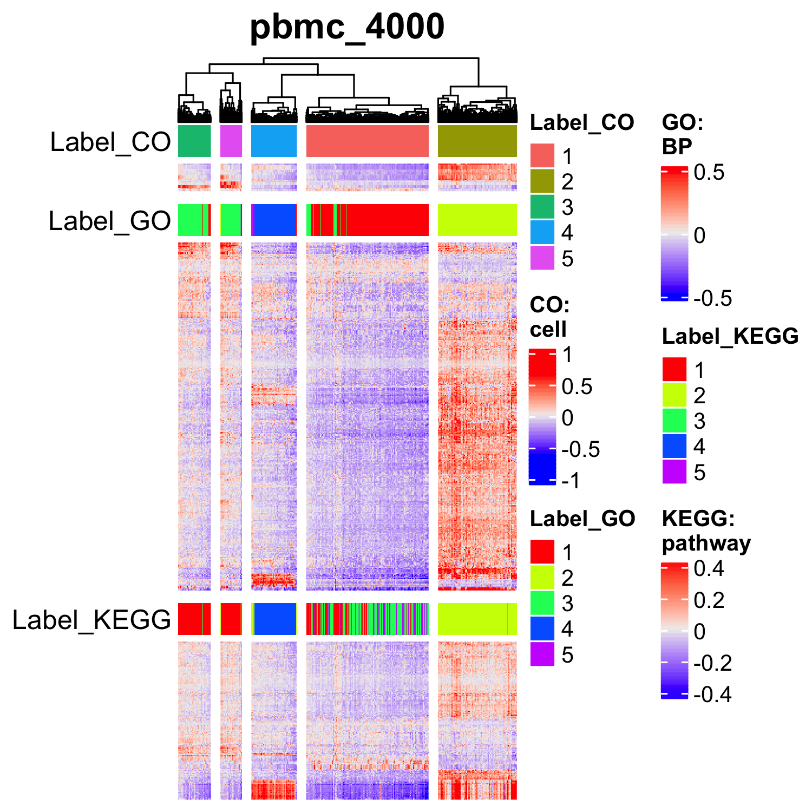
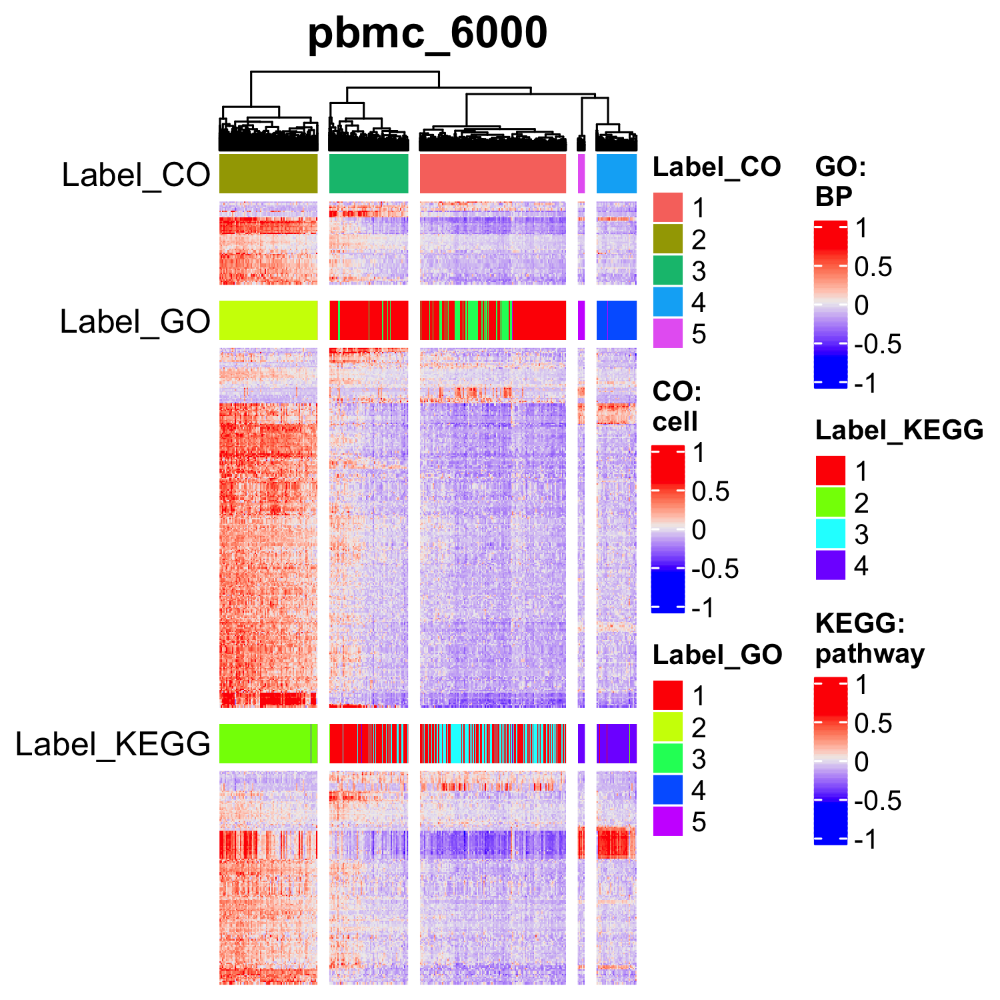

Make UMAPs with clustering results.
```{r, eval = FALSE}
# ----------------------------------------
# pbmc_4000
# ----------------------------------------
p <- plot_umap_sign(obj = pbmc_4000, data_type = "CO", category = "cell",
                    algo_name = "seuratFindClusters",
                    theta = NULL, phi = NULL,
                    title = "pbmc_4000 (CO: cell)", title_size = 16,
                    xlabel = "UMAP_1", ylabel = "UMAP_2", zlabel = NULL,
                    default_color = TRUE)
filename <- "figures/figure_20_0020.png"
ggsave(file = filename, plot = p, dpi = 300, width = 4.7, height = 4)

p <- plot_umap_sign(obj = pbmc_4000, data_type = "GO", category = "BP",
                    algo_name = "seuratFindClusters",
                    theta = NULL, phi = NULL,
                    title = "pbmc_4000 (GO: BP)", title_size = 16,
                    xlabel = "UMAP_1", ylabel = "UMAP_2", zlabel = NULL,
                    default_color = TRUE)
filename <- "figures/figure_20_0021.png"
ggsave(file = filename, plot = p, dpi = 300, width = 4.7, height = 4)

p <- plot_umap_sign(obj = pbmc_4000, data_type = "KEGG", category = "pathway",
                    algo_name = "seuratFindClusters",
                    theta = NULL, phi = NULL,
                    title = "pbmc_4000 (KEGG: pathway)", title_size = 16,
                    xlabel = "UMAP_1", ylabel = "UMAP_2", zlabel = NULL,
                    default_color = TRUE)
filename <- "figures/figure_20_0022.png"
ggsave(file = filename, plot = p, dpi = 300, width = 4.7, height = 4)
# ----------------------------------------
# pbmc_6000
# ----------------------------------------
p <- plot_umap_sign(obj = pbmc_6000, data_type = "CO", category = "cell",
                    algo_name = "seuratFindClusters",
                    theta = NULL, phi = NULL,
                    title = "pbmc_6000 (CO: cell)", title_size = 16,
                    xlabel = "UMAP_1", ylabel = "UMAP_2", zlabel = NULL,
                    default_color = TRUE)
filename <- "figures/figure_20_0025.png"
ggsave(file = filename, plot = p, dpi = 300, width = 4.8, height = 4)

p <- plot_umap_sign(obj = pbmc_6000, data_type = "GO", category = "BP",
                    algo_name = "seuratFindClusters",
                    theta = NULL, phi = NULL,
                    title = "pbmc_6000 (GO: BP)", title_size = 16,
                    xlabel = "UMAP_1", ylabel = "UMAP_2", zlabel = NULL,
                    default_color = TRUE)
filename <- "figures/figure_20_0026.png"
ggsave(file = filename, plot = p, dpi = 300, width = 4.8, height = 4)

p <- plot_umap_sign(obj = pbmc_6000, data_type = "KEGG", category = "pathway",
                    algo_name = "seuratFindClusters",
                    theta = NULL, phi = NULL,
                    title = "pbmc_6000 (KEGG: pathway)", title_size = 16,
                    xlabel = "UMAP_1", ylabel = "UMAP_2", zlabel = NULL,
                    default_color = TRUE)
filename <- "figures/figure_20_0027.png"
ggsave(file = filename, plot = p, dpi = 300, width = 4.8, height = 4)
```


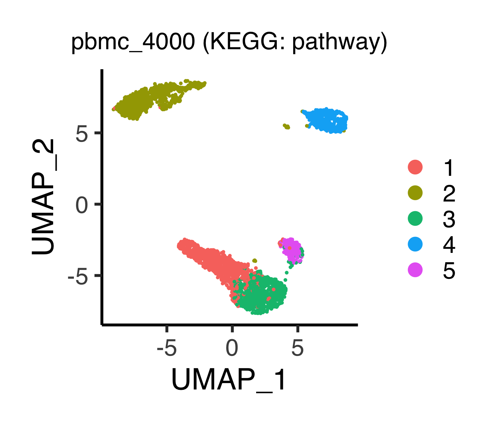

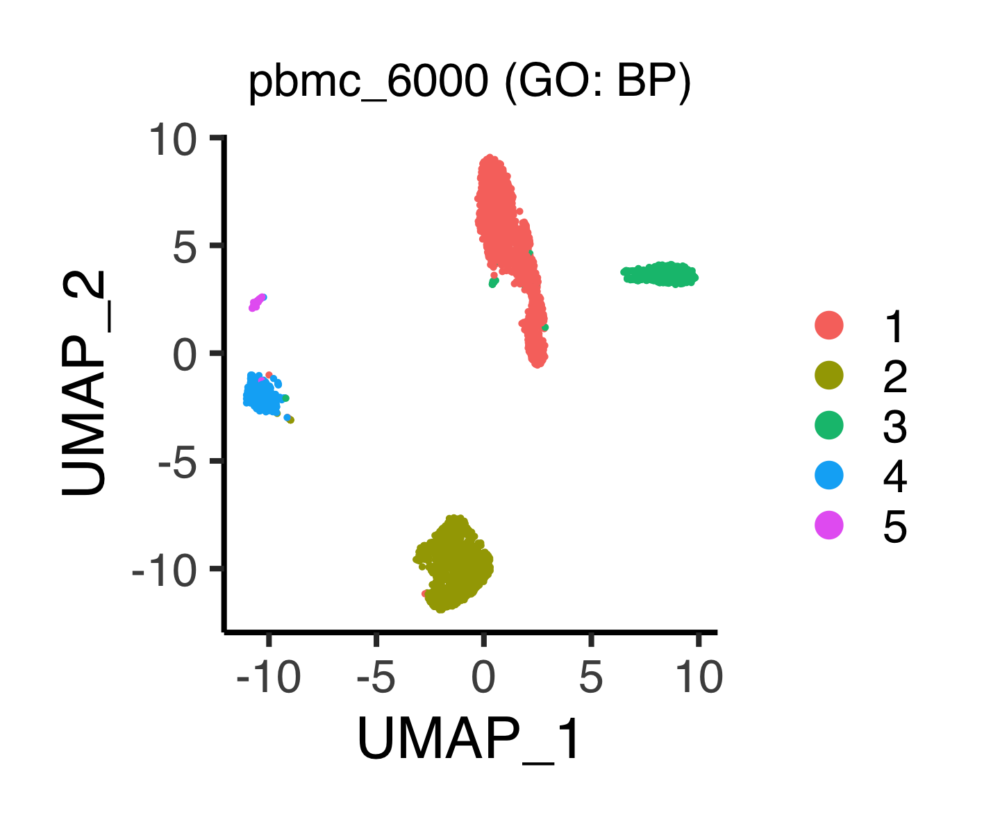
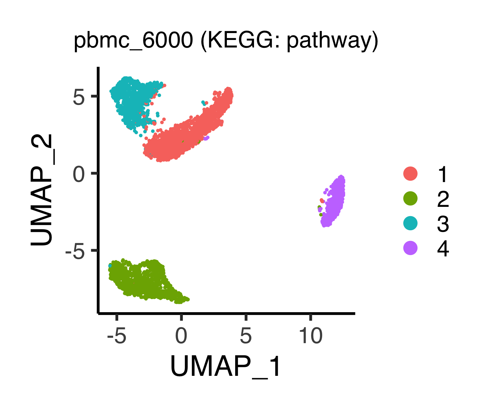

Make violin plots.
```{r, eval = FALSE}
# ----------------------------------------
# pbmc_4000
# ----------------------------------------
#------------------------------
# CO
#------------------------------
p <- plot_violin_signScore(
  obj = pbmc_4000, sign_name = "CL:0000576_S",
  data_type_for_label = "CO", category_for_label = "cell",
  algo_name_for_label = "seuratFindClusters",
  data_type_for_expr = "CO", category_for_expr = "cell",
  title = "CL:0000576_S\nMonocyte\nFGS = {MEF2C, LYN, ...}",
  title_size = 16, default_color = TRUE)
filename <- "figures/figure_20_0030.png"
ggsave(file = filename, plot = p, dpi = 300, width = 4, height = 3.5)

p <- plot_violin_signScore(
  obj = pbmc_4000, sign_name = "CL:0000623_V",
  data_type_for_label = "CO", category_for_label = "cell",
  algo_name_for_label = "seuratFindClusters",
  data_type_for_expr = "CO", category_for_expr = "cell",
  title = "CL:0000623_V\nNatural killer cell\nFGS = {SH2D1A, KLRD1, ...}",
  title_size = 16, default_color = TRUE)
filename <- "figures/figure_20_0031.png"
ggsave(file = filename, plot = p, dpi = 300, width = 4, height = 3.5)

p <- plot_violin_signScore(
  obj = pbmc_4000, sign_name = "CL:0000789_S",
  data_type_for_label = "CO", category_for_label = "cell",
  algo_name_for_label = "seuratFindClusters",
  data_type_for_expr = "CO", category_for_expr = "cell",
  title = "CL:0000789_S\nAlpha-beta T cell\nFGS = {CD3E, CD3D, ...}",
  title_size = 16, default_color = TRUE)
filename <- "figures/figure_20_0032.png"
ggsave(file = filename, plot = p, dpi = 300, width = 4, height = 3.5)
#------------------------------
# GO
#------------------------------
p <- plot_violin_signScore(
  obj = pbmc_4000, sign_name = "GO:0001914_S",
  data_type_for_label = "GO", category_for_label = "BP",
  algo_name_for_label = "seuratFindClusters",
  data_type_for_expr = "GO", category_for_expr = "BP",
  title = "GO:0001914_S\nRegulation of T cell..\nFGS = {PTPRC, IL7R, ...}",
  title_size = 16, default_color = FALSE)
filename <- "figures/figure_20_0033.png"
ggsave(file = filename, plot = p, dpi = 300, width = 4, height = 3.5)

p <- plot_violin_signScore(
  obj = pbmc_4000, sign_name = "GO:0050853_V",
  data_type_for_label = "GO", category_for_label = "BP",
  algo_name_for_label = "seuratFindClusters",
  data_type_for_expr = "GO", category_for_expr = "BP",
  title = "GO:0050853_V\nB cell differentiation\nFGS = {CD19, CD79B, ...}",
  title_size = 16, default_color = FALSE)
filename <- "figures/figure_20_0034.png"
ggsave(file = filename, plot = p, dpi = 300, width = 4, height = 3.5)
#------------------------------
# KEGG
#------------------------------
p <- plot_violin_signScore(
  obj = pbmc_4000, sign_name = "path:hsa04662_V",
  data_type_for_label = "KEGG", category_for_label = "pathway",
  algo_name_for_label = "seuratFindClusters",
  data_type_for_expr = "KEGG", category_for_expr = "pathway",
  title = "path:hsa04662_V\nB cell receptor..\nFGS = {CD19, CD72, ..}",
  title_size = 16, default_color = FALSE)
filename <- "figures/figure_20_0035.png"
ggsave(file = filename, plot = p, dpi = 300, width = 4, height = 3.5)
```


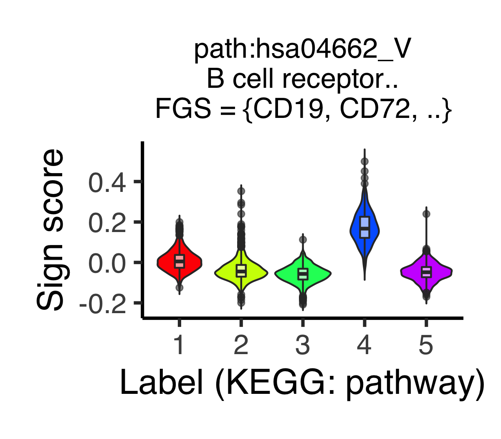

```{r, eval = FALSE}
# ----------------------------------------
# pbmc_6000
# ----------------------------------------
#------------------------------
# CO
#------------------------------
p <- plot_violin_signScore(
  obj = pbmc_6000, sign_name = "CL:0000234_S",
  data_type_for_label = "CO", category_for_label = "cell",
  algo_name_for_label = "seuratFindClusters",
  data_type_for_expr = "CO", category_for_expr = "cell",
  title = "CL:0000234_S\nPhagocyte\nFGS = {CD14, FGR, ...}",
  title_size = 16, default_color = TRUE)
filename <- "figures/figure_20_0040.png"
ggsave(file = filename, plot = p, dpi = 300, width = 4, height = 3.5)

p <- plot_violin_signScore(
  obj = pbmc_6000, sign_name = "CL:0000623_S",
  data_type_for_label = "CO", category_for_label = "cell",
  algo_name_for_label = "seuratFindClusters",
  data_type_for_expr = "CO", category_for_expr = "cell",
  title = "CL:0000623_S\nNatural killer cell\nFGS = {CD160, KLRD1, ...}",
  title_size = 16, default_color = TRUE)
filename <- "figures/figure_20_0041.png"
ggsave(file = filename, plot = p, dpi = 300, width = 4, height = 3.5)

p <- plot_violin_signScore(
  obj = pbmc_6000, sign_name = "CL:0000782_V",
  data_type_for_label = "CO", category_for_label = "cell",
  algo_name_for_label = "seuratFindClusters",
  data_type_for_expr = "CO", category_for_expr = "cell",
  title = "CL:0000782_V\nMyeloid dendritic cell\nFGS = {CD2, CCR7, ...}",
  title_size = 16, default_color = TRUE)
filename <- "figures/figure_20_0042.png"
ggsave(file = filename, plot = p, dpi = 300, width = 4, height = 3.5)
#------------------------------
# GO
#------------------------------
p <- plot_violin_signScore(
  obj = pbmc_6000, sign_name = "GO:0050852_V",
  data_type_for_label = "GO", category_for_label = "BP",
  algo_name_for_label = "seuratFindClusters",
  data_type_for_expr = "GO", category_for_expr = "BP",
  title = "GO:0050852_V\nT cell receptor..\nFGS = {CD3E, CD247, ...}",
  title_size = 16, default_color = FALSE)
filename <- "figures/figure_20_0043.png"
ggsave(file = filename, plot = p, dpi = 300, width = 4, height = 3.5)

p <- plot_violin_signScore(
  obj = pbmc_6000, sign_name = "GO:0002577_V",
  data_type_for_label = "GO", category_for_label = "BP",
  algo_name_for_label = "seuratFindClusters",
  data_type_for_expr = "GO", category_for_expr = "BP",
  title = "GO:0002577_V\nRegulation of antigen..\nFGS = {HLA-DOB, CCR7, ...}",
  title_size = 16, default_color = FALSE)
filename <- "figures/figure_20_0044.png"
ggsave(file = filename, plot = p, dpi = 300, width = 4, height = 3.5)
#------------------------------
# KEGG
#------------------------------
p <- plot_violin_signScore(
  obj = pbmc_6000, sign_name = "path:hsa04658_V",
  data_type_for_label = "KEGG", category_for_label = "pathway",
  algo_name_for_label = "seuratFindClusters",
  data_type_for_expr = "KEGG", category_for_expr = "pathway",
  title = "path:hsa04658_V\nTh1 and Th2 cell diff..\nFGS = {CD247, CD3E, ...}",
  title_size = 16, default_color = FALSE)
filename <- "figures/figure_20_0045.png"
ggsave(file = filename, plot = p, dpi = 300, width = 4, height = 3.5)

p <- plot_violin_signScore(
  obj = pbmc_6000, sign_name = "path:hsa04662_S",
  data_type_for_label = "KEGG", category_for_label = "pathway",
  algo_name_for_label = "seuratFindClusters",
  data_type_for_expr = "KEGG", category_for_expr = "pathway",
  title = "path:hsa04662_S\nB cell receptor..\nFGS = {CD19, CD72, ...}",
  title_size = 16, default_color = FALSE)
filename <- "figures/figure_20_0046.png"
ggsave(file = filename, plot = p, dpi = 300, width = 4, height = 3.5)
```


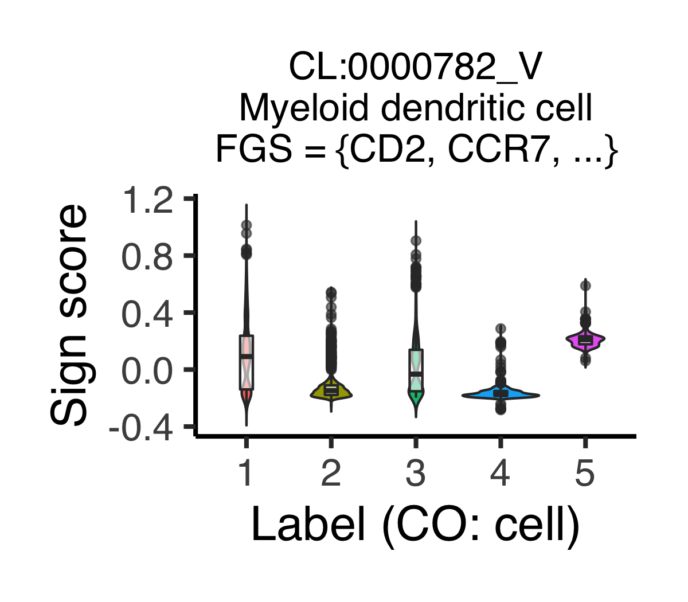


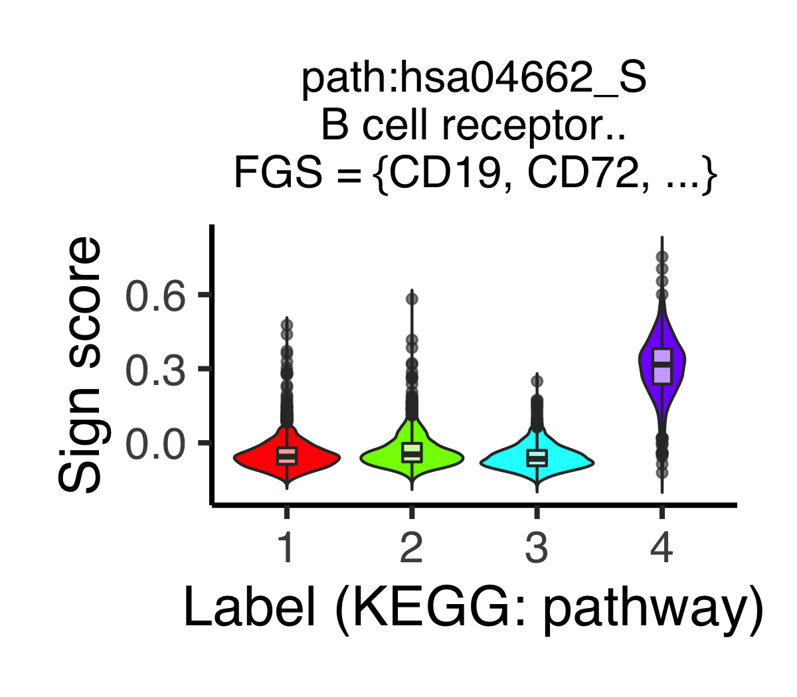


### Infer population ratios
Load the data.
```{r, eval = FALSE}
rm(list = ls())
# ----------------------------------------
# pbmc_4000
# ----------------------------------------
pbmc_4000_scran <- readRDS(file = "backup/10_501_pbmc_4000_scran.rds")
pbmc_4000_seurat <- readRDS(file = "backup/10_601_pbmc_4000_seurat.rds")
pbmc_4000_sccatch <- readRDS(file ="backup/10_602_pbmc_4000_seurat_sccatch.rds")
pbmc_4000_monocle <- readRDS(file = "backup/10_701_pbmc_4000_monocle3.rds")
pbmc_4000_sc3 <- readRDS(file = "backup/10_801_pbmc_4000_sc3.rds")
pbmc_4000_asurat <- readRDS(file = "backup/10_901_pbmc_4000_asurat.rds")
# ----------------------------------------
# pbmc_6000
# ----------------------------------------
pbmc_6000_scran <- readRDS(file = "backup/11_501_pbmc_6000_scran.rds")
pbmc_6000_seurat <- readRDS(file = "backup/11_601_pbmc_6000_seurat.rds")
pbmc_6000_sccatch <- readRDS(file ="backup/11_602_pbmc_6000_seurat_sccatch.rds")
pbmc_6000_monocle <- readRDS(file = "backup/11_701_pbmc_6000_monocle3.rds")
pbmc_6000_sc3 <- readRDS(file = "backup/11_801_pbmc_6000_sc3.rds")
pbmc_6000_asurat <- readRDS(file = "backup/11_901_pbmc_6000_asurat.rds")
```

The hypothetical results can be obtained from Cao et al., Front. Genet. (2020).
```{r, eval = FALSE}
pbmc_4000_scsa <- data.frame(
  cell_type = c("T cell", "Monocyte", "B cell", "NK or NKT cell",
                "Megakaryocyte"),
  n = c(0.4226, 0.2707, 0.1509, 0.1546, 0.0012)
)
pbmc_6000_scsa <- data.frame(
  cell_type = c("T cell", "Monocyte", "B cell", "NK or NKT cell",
                "Megakaryocyte"),
  n = c(0.4920, 0.2652, 0.1292, 0.1102, 0.0035)
)
```

Change the numbers of cells into ratios.
```{r, eval = FALSE}
take_ratio <- function(df){
  df$n <- as.numeric(df$n) / sum(as.numeric(df$n))
  return(df)
}
# ----------------------------------------
# pbmc_4000
# ----------------------------------------
pbmc_4000_scran <- take_ratio(pbmc_4000_scran[["population"]])
pbmc_4000_seurat <- take_ratio(pbmc_4000_seurat@misc[["population"]])
pbmc_4000_sccatch <- take_ratio(pbmc_4000_sccatch@misc[["population"]])
pbmc_4000_monocle <- take_ratio(pbmc_4000_monocle[["population"]])
pbmc_4000_sc3 <- take_ratio(pbmc_4000_sc3[["population"]])
pbmc_4000_asurat <- take_ratio(pbmc_4000_asurat[["population"]])
# ----------------------------------------
# pbmc_6000
# ----------------------------------------
pbmc_6000_scran <- take_ratio(pbmc_6000_scran[["population"]])
pbmc_6000_seurat <- take_ratio(pbmc_6000_seurat@misc[["population"]])
pbmc_6000_sccatch <- take_ratio(pbmc_6000_sccatch@misc[["population"]])
pbmc_6000_monocle <- take_ratio(pbmc_6000_monocle[["population"]])
pbmc_6000_sc3 <- take_ratio(pbmc_6000_sc3[["population"]])
pbmc_6000_asurat <- take_ratio(pbmc_6000_asurat[["population"]])
```

Add the names of algorithms.
```{r, eval = FALSE}
# ----------------------------------------
# pbmc_4000
# ----------------------------------------
pbmc_4000_scsa$algorithm <- "SCSA"
pbmc_4000_scran$algorithm <- "scran"
pbmc_4000_seurat$algorithm <- "Seurat"
pbmc_4000_sccatch$algorithm <- "Seurat with scCATCH"
pbmc_4000_monocle$algorithm <- "Monocle 3"
pbmc_4000_sc3$algorithm <- "SC3"
pbmc_4000_asurat$algorithm <- "ASURAT"
# ----------------------------------------
# pbmc_6000
# ----------------------------------------
pbmc_6000_scsa$algorithm <- "SCSA"
pbmc_6000_scran$algorithm <- "scran"
pbmc_6000_seurat$algorithm <- "Seurat"
pbmc_6000_sccatch$algorithm <- "Seurat with scCATCH"
pbmc_6000_monocle$algorithm <- "Monocle 3"
pbmc_6000_sc3$algorithm <- "SC3"
pbmc_6000_asurat$algorithm <- "ASURAT"
```

Concatenate all of the data.
```{r, eval = FALSE}
# ----------------------------------------
# pbmc_4000
# ----------------------------------------
pbmc_4000_df <- rbind(pbmc_4000_scsa, pbmc_4000_scran, pbmc_4000_seurat,
                      pbmc_4000_sccatch, pbmc_4000_monocle, pbmc_4000_sc3,
                      pbmc_4000_asurat)
# ----------------------------------------
# pbmc_6000
# ----------------------------------------
pbmc_6000_df <- rbind(pbmc_6000_scsa, pbmc_6000_scran, pbmc_6000_seurat,
                      pbmc_6000_sccatch, pbmc_6000_monocle, pbmc_6000_sc3,
                      pbmc_6000_asurat)
```

Show the population sizes.
```{r, eval = FALSE}
ymax <- 0.65
xlabel <- ""
ylabel <- "Ratio"
my_colors <- brewer.pal(6, name = "Set1")
size <- 4.5
alpha <- 0.85
jitter_size <- 0.2
set.seed(16)
p <- ggplot() +
  geom_boxplot(aes(x = pbmc_4000_df$cell_type, y = pbmc_4000_df$n),
               color = "white", alpha = 0, size = 0, coef = 1e10) +
  # ----------------------------------------
  # Cao et al., 2020.
  # ----------------------------------------
  geom_jitter(aes(
    x = pbmc_4000_df[which(pbmc_4000_df$algorithm == "SCSA"),]$cell_type,
    y = pbmc_4000_df[which(pbmc_4000_df$algorithm == "SCSA"),]$n),
    color = "black", size = size, shape = 16, alpha = 1,
    position = position_jitter(w = jitter_size, h = 0)) +
  geom_jitter(aes(
    x = pbmc_6000_df[which(pbmc_6000_df$algorithm == "SCSA"),]$cell_type,
    y = pbmc_6000_df[which(pbmc_6000_df$algorithm == "SCSA"),]$n),
    color = "black", size = size, shape = 16, alpha = 1,
    position = position_jitter(w = jitter_size, h = 0)) +
  # ----------------------------------------
  # pbmc_4000
  # ----------------------------------------
  geom_jitter(aes(
    x = pbmc_4000_df[which(pbmc_4000_df$algorithm == "scran"),]$cell_type,
    y = pbmc_4000_df[which(pbmc_4000_df$algorithm == "scran"),]$n),
    color = my_colors[1], size = size, shape = 16, alpha = alpha,
    position = position_jitter(w = jitter_size, h = 0)) +
  geom_jitter(aes(
    x = pbmc_4000_df[which(pbmc_4000_df$algorithm == "Seurat"),]$cell_type,
    y = pbmc_4000_df[which(pbmc_4000_df$algorithm == "Seurat"),]$n),
    color = my_colors[2], size = size, shape = 16, alpha = alpha,
    position = position_jitter(w = jitter_size, h = 0)) +
  geom_jitter(aes(
    x = pbmc_4000_df[which(pbmc_4000_df$algorithm == "Seurat with scCATCH"),]$cell_type,
    y = pbmc_4000_df[which(pbmc_4000_df$algorithm == "Seurat with scCATCH"),]$n),
    color = my_colors[3], size = size, shape = 16, alpha = alpha,
    position = position_jitter(w = jitter_size, h = 0)) +
  geom_jitter(aes(
    x = pbmc_4000_df[which(pbmc_4000_df$algorithm == "Monocle 3"),]$cell_type,
    y = pbmc_4000_df[which(pbmc_4000_df$algorithm == "Monocle 3"),]$n),
    color = my_colors[4], size = size, shape = 16, alpha = alpha,
    position = position_jitter(w = jitter_size, h = 0)) +
  geom_jitter(aes(
    x = pbmc_4000_df[which(pbmc_4000_df$algorithm == "SC3"),]$cell_type,
    y = pbmc_4000_df[which(pbmc_4000_df$algorithm == "SC3"),]$n),
    color = my_colors[5], size = size, shape = 16, alpha = alpha,
    position = position_jitter(w = jitter_size, h = 0)) +
  geom_jitter(aes(
    x = pbmc_4000_df[which(pbmc_4000_df$algorithm == "ASURAT"),]$cell_type,
    y = pbmc_4000_df[which(pbmc_4000_df$algorithm == "ASURAT"),]$n),
    color = my_colors[6], size = size, shape = 16, alpha = alpha,
    position = position_jitter(w = jitter_size, h = 0)) +
  # ----------------------------------------
  # pbmc_6000
  # ----------------------------------------
  geom_jitter(aes(
    x = pbmc_6000_df[which(pbmc_6000_df$algorithm == "scran"),]$cell_type,
    y = pbmc_6000_df[which(pbmc_6000_df$algorithm == "scran"),]$n),
    color = my_colors[1], size = size, shape = 16, alpha = alpha,
    position = position_jitter(w = jitter_size, h = 0)) +
  geom_jitter(aes(
    x = pbmc_6000_df[which(pbmc_6000_df$algorithm == "Seurat"),]$cell_type,
    y = pbmc_6000_df[which(pbmc_6000_df$algorithm == "Seurat"),]$n),
    color = my_colors[2], size = size, shape = 16, alpha = alpha,
    position = position_jitter(w = jitter_size, h = 0)) +
  geom_jitter(aes(
    x = pbmc_6000_df[which(pbmc_6000_df$algorithm == "Seurat with scCATCH"),]$cell_type,
    y = pbmc_6000_df[which(pbmc_6000_df$algorithm == "Seurat with scCATCH"),]$n),
    color = my_colors[3], size = size, shape = 16, alpha = alpha,
    position = position_jitter(w = jitter_size, h = 0)) +
  geom_jitter(aes(
    x = pbmc_6000_df[which(pbmc_6000_df$algorithm == "Monocle 3"),]$cell_type,
    y = pbmc_6000_df[which(pbmc_6000_df$algorithm == "Monocle 3"),]$n),
    color = my_colors[4], size = size, shape = 16, alpha = alpha,
    position = position_jitter(w = jitter_size, h = 0)) +
  geom_jitter(aes(
    x = pbmc_6000_df[which(pbmc_6000_df$algorithm == "SC3"),]$cell_type,
    y = pbmc_6000_df[which(pbmc_6000_df$algorithm == "SC3"),]$n),
    color = my_colors[5], size = size, shape = 16, alpha = alpha,
    position = position_jitter(w = jitter_size, h = 0)) +
  geom_jitter(aes(
    x = pbmc_6000_df[which(pbmc_6000_df$algorithm == "ASURAT"),]$cell_type,
    y = pbmc_6000_df[which(pbmc_6000_df$algorithm == "ASURAT"),]$n),
    color = my_colors[6], size = size, shape = 16, alpha = alpha,
    position = position_jitter(w = jitter_size, h = 0)) +
  # ----------------------------------------
  # option
  # ----------------------------------------
  ylim(0, ymax) + scale_x_discrete(guide = guide_axis(angle = 45)) +
  labs(title = "", x = xlabel, y = ylabel, colour = "") +
  theme_minimal(base_size = 16, base_family = "Helvetica") +
  theme(plot.title = element_text(hjust = 0.5),
        panel.grid = element_line(color = "gray80"),
        plot.margin = unit(c(1.5,1.5,1.5,1.5), "lines"),
        legend.position = "right")

filename <- "figures/figure_20_0100.png"
ggsave(file = filename, plot = p, dpi = 300, width = 4.5, height = 5)
```

Below are the labels of methods.

* black: SCSA
* red: scran
* cyan: Seurat
* green: Seurat with scCATCH
* purple: Monocle 3
* orange: SC3
* yellow: ASURAT


## Lung cancer dataset
### Heatmaps of marker gene expressions
Load the data.
```{r, eval = FALSE}
rm(list = ls())
source("R/plot.R")
sc68_cisp <- readRDS(file = "backup/02_005_sc68_cisp_normalized.rds")
sc68_cisp_c <- readRDS(file = "backup/02_001_sc68_cisp_raw.rds")
```

Make a log-normalized read count table for ASCL1, NEUROD1, YAP1, and POU2F3.
Load the data.
```{r, eval = FALSE}
cells <- sc68_cisp[["sample"]][["barcode"]]
genes <- c("ASCL1", "NEUROD1", "YAP1", "POU2F3")

mat <- sc68_cisp_c[["data"]][["raw"]]
mat <- mat[which(rownames(mat) %in% genes),]
mat <- mat[, which(colnames(mat) %in% cells)]
tmp <- log(mat + 1)

sc68_cisp[["data"]][["normalized"]] <- tmp
```

The following function `plot_Heatmap_GenexSamp()` shows normalized read counts
of a given gene set as a heatmap, using the results of 
`obj[["data"]][["normalized"]]`.
```{r, eval = FALSE}
# ----------------------------------------
# sc68_cisp
# ----------------------------------------
filename <- "figures/figure_20_0200.png"
png(file = filename, height = 900, width = 2000, res = 300)
plot_Heatmap_GenexSamp(obj = sc68_cisp, genes = genes,
                       method = "ward.D2", show_nReads = TRUE,
                       title = "Lung cancer scRNA-seq", name = "Expression")
dev.off()
```


### Multi-layered analysis
Load the data.
```{r, eval = FALSE}
rm(list = ls())
source("R/function_seurat.R")
source("R/function_asurat.R")
source("R/plot.R")
sc68_cisp_asurat <- readRDS(file = "backup/02_400_sc68_cisp_all.rds")
```

Check the size of the gene-by-sample matrices.
```{r, eval = FALSE}
dim(sc68_cisp_asurat[["data"]][["bayNorm"]][["Bay_out"]])
```

```
[1,] 6347 2285
```

Create Seruat objects.
```{r, eval = FALSE}
sc68_cisp <- CreateSeuratObject(
  counts = as.matrix(sc68_cisp_asurat[["data"]][["bayNorm"]][["Bay_out"]]),
  project = "sc68_cisp")
```

Run Seurat's standard procedures but the clustering result will be replaced
with that of ASURAT.
Hence, parameters `nfeatures`, `sc68_cisp_pc`, and `resolution` are roughly set.
```{r, eval = FALSE}
nfeatures <- round(0.2 * sc68_cisp@assays[["RNA"]]@counts@Dim[2])
sc68_cisp <- process_001_seurat(obj = sc68_cisp, nfeatures = nfeatures)
sc68_cisp_pc <- which(cumsum(sc68_cisp@reductions[["pca"]]@stdev) /
                      sum(sc68_cisp@reductions[["pca"]]@stdev) > 0.9)[1]
sc68_cisp <- process_002_seurat(obj = sc68_cisp, pc = sc68_cisp_pc,
                                resolution = 0.1)
```

Assign a cell cycle phase to each cell.
```{r, eval = FALSE}
s.genes <- cc.genes$s.genes
g2m.genes <- cc.genes$g2m.genes
sc68_cisp <- CellCycleScoring(sc68_cisp, s.features = s.genes,
                              g2m.features = g2m.genes, set.ident = FALSE)
tmp <- factor(sc68_cisp@meta.data[["Phase"]],
              levels = c("G1", "S", "G2M", "Undecided"))
sc68_cisp@meta.data[["Phase"]] <- tmp
sc68_cisp_asurat[["sample"]][["phase"]] <- sc68_cisp@meta.data[["Phase"]]
```

Add the cell labels to `obj@meta.data[["asurat_clusters"]]`, which were inferred
by ASURAT's computations (see [previous section](#cell_type) for the details).
```{r, eval = FALSE}
tmp <- as.factor(sc68_cisp_asurat[["sample"]][["merlot_DO_disease"]])
sc68_cisp@meta.data[["asurat_clusters"]] <- tmp
sc68_cisp <- SetIdent(sc68_cisp, value = "asurat_clusters")
```

Find differentially expressed genes using Seurat's function and stores the
results into `obj@misc[["markers"]]`.
```{r, eval = FALSE}
sc68_cisp@misc[["markers"]] <- FindAllMarkers(
  sc68_cisp, only.pos = T, min.pct = 0.25, logfc.threshold = 0.25)
```

Users can check the marker genes of each cluster by the following command:
```{r, eval = FALSE}
datatable(sc68_cisp@misc[["markers"]], rownames = FALSE)
```

* `sc68_cisp`

<iframe src="figures/sc68_cisp_marker_asurat.html" style="width:100%; height:400px;"></iframe>

Select top `topn` genes, in terms of p-value, and show the expression levels
by complex heat map.
```{r, eval = FALSE}
topn <- sc68_cisp@misc[["markers"]] %>% group_by(cluster)
topn_new <- topn %>% top_n(n=-10, p_val_adj) # Selecting by p_val_adj
topn_genes <- data.frame(gene = topn_new$gene, label = topn_new$cluster)

filename <- "figures/figure_20_0210.png"
png(file = filename, height = 2000, width = 1500, res = 300)
plot_Heatmap_seurat(obj = sc68_cisp, topn_genes = topn_genes,
                    method = "ward.D2", show_nReads = TRUE,
                    title = "sc68_cisp (ASURAT)", name = "Expr level",
                    show_rownames_nReads = FALSE, default_color = TRUE)
dev.off()
```


The following function `plot_MultiHeatmaps_SignxSamp_GenexSamp()` vertically
concatenates two or more heat maps for top n signs, with respect to sign score,
and top n genes with respect to p-value.
Users can remove signs by setting `keywords` (list of keywords separated by `|`)
which obviously seem to be unimportant or untranslatable.
```{r, eval = FALSE}
topn <- sc68_cisp@misc[["markers"]] %>% group_by(cluster)
topn_new <- topn %>% top_n(n=-8, p_val_adj) # Selecting by p_val_adj
topn_genes <- data.frame(gene = topn_new$gene, label = topn_new$cluster)
topn_genes$label <- paste("DEG (group ", topn_genes$label, ")", sep = "")

tmp <- sc68_cisp_asurat[["marker"]][["DO"]][["disease"]][["all"]]
topn <- tmp %>% group_by(Label)
keywords <- "embryonal cancer|aplastic anemia|Diamond-Blackfan anemia"
keywords <- paste(keywords, "|meningioma|cervi|spondylitis")
topn <- topn[!((grepl(keywords, topn$Sign)) |
                 (grepl(keywords, topn$ParentDescription))),]
topn_new <- topn %>% top_n(3, sep_I)
topn_signs_DO <- data.frame(
  sign = topn_new$Sign, description = topn_new$ParentDescription,
  label = topn_new$Label)

keywords <- "viral|learning"
tmp <- sc68_cisp_asurat[["marker"]][["GO"]][["BP"]][["all"]]
topn <- tmp %>% group_by(Label)
topn <- tmp %>% group_by(Label)
topn <- topn[!((grepl(keywords, topn$Sign)) |
                 (grepl(keywords, topn$ParentDescription))),]
topn_new <- topn %>% top_n(2, sep_I)
topn_signs_GO <- data.frame(
  sign = topn_new$Sign, description = topn_new$ParentDescription,
  label = topn_new$Label)

keywords <- paste("Glioma|Ribosome|Oocyte|oocyte|path:hsa04650_S|",
                  "path:hsa04380_S|path:hsa05162_S|path:hsa05416_S|",
                  "path:hsa05140_S|path:hsa04662_S", sep = "")
tmp <- sc68_cisp_asurat[["marker"]][["KEGG"]][["pathway"]][["all"]]
topn <- tmp %>% group_by(Label)
topn <- tmp %>% group_by(Label)
topn <- topn[!((grepl(keywords, topn$Sign)) |
                 (grepl(keywords, topn$ParentDescription))),]
topn_new <- topn %>% top_n(5, sep_I)
topn_signs_KEGG <- data.frame(
  sign = topn_new$Sign, description = topn_new$ParentDescription,
  label = topn_new$Label)

topn_signs <- list(topn_signs_DO, topn_signs_GO, topn_signs_KEGG)

filename <- "figures/figure_20_0211.png"
png(file = filename, height = 3200, width = 2000, res = 300)
plot_MultiHeatmaps_SignxSamp_GenexSamp(
  obj = sc68_cisp_asurat, topn_genes = topn_genes, topn_signs = topn_signs,
  data_types = c("DO", "GO", "KEGG"),
  categories = c("disease", "BP", "pathway"),
  algo_names = c("merlot", NULL, NULL),
  show_labels = c(TRUE, FALSE, FALSE),
  method = "ward.D2", show_nReads = FALSE,
  title = "sc68_cisp (ASURAT)",
  names_signs = c("DO:\ndisease", "GO:\nBP", "KEGG:\npathway"),
  name_genes = "Expression",
  show_rownames_sign = TRUE, show_rownames_label = FALSE,
  show_rownames_nReads = FALSE, default_colors = c(TRUE, FALSE, FALSE),
  show_cellcycle = TRUE
)
dev.off()
```

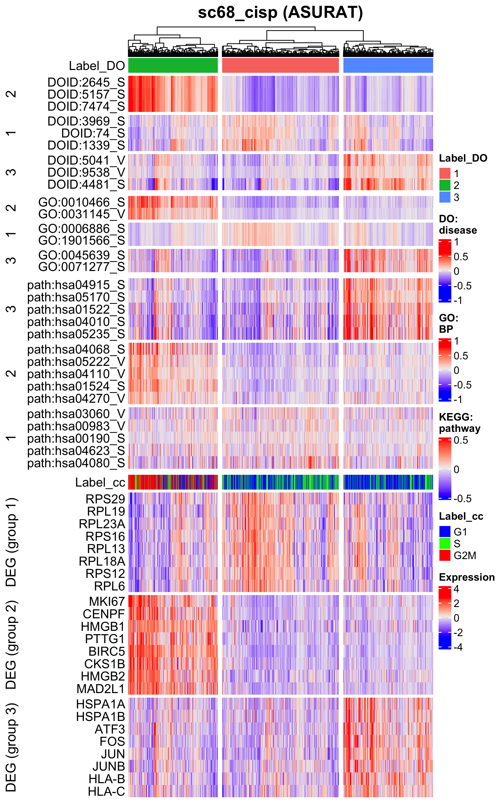

Save the objects.
```{r, eval = FALSE}
saveRDS(sc68_cisp, file = "backup/20_001_sc68_cisp.rds")
saveRDS(sc68_cisp_asurat, file = "backup/20_002_sc68_cisp_asurat.rds")
```

Load the data.
```{r, eval = FALSE}
sc68_cisp <- readRDS(file = "backup/20_001_sc68_cisp.rds")
sc68_cisp_asurat <- readRDS(file = "backup/20_002_sc68_cisp_asurat.rds")
```


## Pancreatic ductal adenocarcinoma (PDAC) datasets
### Clustering PDAC spatial transcriptomes
Load the data.
```{r, eval = FALSE}
pdac_aint <- readRDS(file = "backup/07_400_pdac_aint_all.rds")
pdac_ast1 <- readRDS(file = "backup/05_005_pdac_ast1_normalized.rds")
fn <- "data/2020_001_Moncada/pdac_ast1/tissue_positions_list_spatial_object.tsv"
```

Create a Seurat object keeping only ST spots in integrated data `pdac_aint`.
```{r, eval = FALSE}
# ----------------------------------------
# pdac_aint
# ----------------------------------------
tmp <- pdac_aint[["sample"]]
tmp <- tmp[which(tmp$orig_ident == "ST"),]
pdac_aint[["sample"]] <- tmp

mat <- pdac_aint[["sign"]][["CBxSample"]][["cell"]]
tmp <- pdac_aint[["sample"]][["barcode"]]
mat <- mat[, which(colnames(mat) %in% tmp)]
colnames(mat) <- pdac_ast1[["sample"]][["spot"]]  # This is required by Spaniel
# ----------------------------------------
# se
# ----------------------------------------
se <- Spaniel::createSeurat(counts = mat, barcodeFile = fn,
                            projectName = "PDAC-A", sectionNumber = "1")
se@images <- pdac_aint[["misc"]][["images"]]
```

Pre-processing.
```{r, eval = FALSE}
tmp <- pdac_aint[["sample"]][["seuratFindClusters_CB_cell"]]
se@meta.data[["cluster"]] <- tmp
tmp <- pdac_aint[["sample"]]
tmp <- tmp[which(tmp$orig_ident == "ST"),]
se@meta.data[["phase"]] <- tmp$phase
SetIdent(se, value = "cluster")
se <- ScaleData(se)
```

Visualize putative clusters on histological images.
Note that `spanielPlot_2()` is custom-build.
```{r, eval = FALSE}
p <- spanielPlot(object = se, grob = se@images[[1]], plotType = "Cluster",
                 clusterRes = "cluster", ptSize = 2.5,
                 customTitle = "Cluster (CB: cell)")
filename <- "figures/figure_20_0300.png"
ggsave(file = filename, plot = p, dpi = 300, width = 5.1, height = 4.2)
```


Visualize cell cycle phases on histological images.
Note that `spanielPlot_3()` is custom-build, which can only be used for
plotting cell cycle phases.
```{r, eval = FALSE}
p <- spanielPlot(object = se, grob = se@images[[1]], plotType = "Cluster",
                 clusterRes = "phase", ptSize = 2.5,
                 customTitle = "Cell cycle phase")
filename <- "figures/figure_20_0301.png"
ggsave(file = filename, plot = p, dpi = 300, width = 5.1, height = 4.2)
```


Visualize sign scores on histological images.
Note that `spanielPlot_2()` is custom-build.
Note here that in `se` hyphens "-" were replaced with underscores "_".
```{r, eval = FALSE}
p <- spanielPlot(object = se, grob = se@images[[1]], plotType = "Gene",
                 gene = "DOID:3498-S", ptSizeMax = 2.5,  ptSizeMin = 0,
                 customTitle = "DOID:3498_S")
filename <- "figures/figure_20_0310.png"
ggsave(file = filename, plot = p, dpi = 300, width = 4.7, height = 4.1)
```

```{r, eval = FALSE, echo = FALSE, results = "hide"}
p <- spanielPlot(object = se, grob = se@images[[1]], plotType = "Gene",
                 gene = "CBID:434-S", ptSizeMax = 2.5,  ptSizeMin = 0,
                 customTitle = "CBID:434_S")
filename <- "figures/figure_20_0311.png"
ggsave(file = filename, plot = p, dpi = 300, width = 4.7, height = 4.1)
```

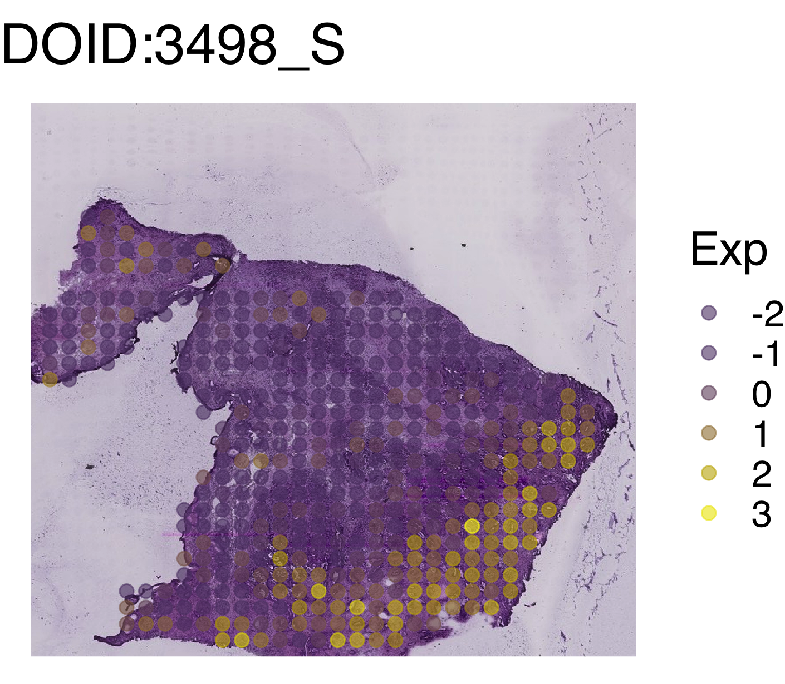
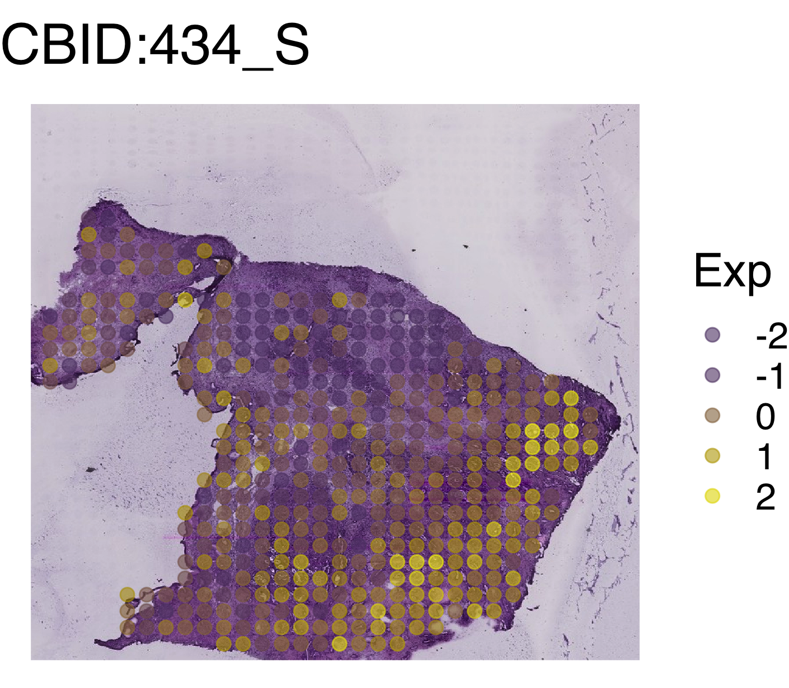

Change datatype.
```{r, eval = FALSE}
mat <- pdac_aint[["sign"]][["GOxSample"]][["BP"]]
tmp <- pdac_aint[["sample"]][["barcode"]]
mat <- mat[, which(colnames(mat) %in% tmp)]
colnames(mat) <- pdac_ast1[["sample"]][["spot"]]  # This is required by Spaniel
se <- Spaniel::createSeurat(counts = mat, barcodeFile = fn,
                            projectName = "PDAC-A", sectionNumber = "1")
se@images <- pdac_aint[["misc"]][["images"]]
se <- ScaleData(se)
```

Visualize sign scores on histological images.
Note that `spanielPlot_2()` is custom-build.
Note here that in `se` hyphens "-" were replaced with underscores "_".
```{r, eval = FALSE}
p <- spanielPlot(object = se, grob = se@images[[1]], plotType = "Gene",
                 gene = "GO:0030857-S", ptSizeMax = 2.5,  ptSizeMin = 0,
                 customTitle = "GO:0030857_S")
filename <- "figures/figure_20_0312.png"
ggsave(file = filename, plot = p, dpi = 300, width = 4.7, height = 4.1)
```


Change datatype.
```{r, eval = FALSE}
mat <- pdac_aint[["sign"]][["KEGGxSample"]][["pathway"]]
tmp <- pdac_aint[["sample"]][["barcode"]]
mat <- mat[, which(colnames(mat) %in% tmp)]
colnames(mat) <- pdac_ast1[["sample"]][["spot"]]  # This is required by Spaniel
se <- Spaniel::createSeurat(counts = mat, barcodeFile = fn,
                            projectName = "PDAC-A", sectionNumber = "1")
se@images <- pdac_aint[["misc"]][["images"]]
se <- ScaleData(se)
```

Visualize sign scores on histological images.
Note that `spanielPlot_2()` is custom-build.
Note here that in `se` hyphens "-" were replaced with underscores "_".
```{r, eval = FALSE}
p <- spanielPlot(object = se, grob = se@images[[1]], plotType = "Gene",
                 gene = "path:hsa04972-S", ptSizeMax = 2.5,  ptSizeMin = 0,
                 customTitle = "KEGG:hsa04972_S")
filename <- "figures/figure_20_0313.png"
ggsave(file = filename, plot = p, dpi = 300, width = 4.63, height = 4.1)
```

```{r, eval = FALSE, echo = FALSE, results = "hide"}
p <- spanielPlot(object = se, grob = se@images[[1]], plotType = "Gene",
                 gene = "path:hsa04512-S", ptSizeMax = 2.5,  ptSizeMin = 0,
                 customTitle = "KEGG:hsa04512_S")
filename <- "figures/figure_20_0314.png"
ggsave(file = filename, plot = p, dpi = 300, width = 4.7, height = 4.1)
```


