```{r, include = FALSE}
knitr::opts_chunk$set(
  collapse = TRUE,
  comment = "#>"
)
```


# Install libraries
ASURAT version 0.1.0 is now available on GitHub.
```{r, eval = FALSE}
devtools::install_github("keita-iida/ASURAT", upgrade = "never")
```

Below are required libraries:
```{r, eval = FALSE}
library(ASURAT)
library(SingleCellExperiment)
library(SummarizedExperiment)
```

If one will analyze human or mouse data, call proper genome annotation packages:
```{r, eval = FALSE}
library(org.Hs.eg.db) # For human
library(org.Mm.eg.db) # For mouse
```


<br><br><br>

# Quick start
## Start by SingleCellExperiment objects
Having a SingleCellExperiment object (e.g., `sce`), one can easily start
ASURAT pipeline by confirming the following requirements:

1. `assays(sce)` contains gene expression data with row and column names as
  variable (gene) and sample (cell), respectively,
2. `rowData(sce)` and `colData(sce)` do not always have to contain data.

If `sce` contains normalized expression data (e.g., `assay(sce, "normalized")`),
set `assay(sce, "centered")` by subtracting the data with the mean expression
levels across samples (cells).
```{r, eval = FALSE}
mat <- assay(sce, "normalized")
assay(sce, "centered") <- sweep(mat, 1, apply(mat, 1, mean), FUN = "-")
```

Save data and move on to the downstream analyses.
```{r, eval = FALSE}
dir.create("backup")
saveRDS(sclc, file = "backup/nn_mmm_filename_normalized.rds")
```

* See [here](#phenotype) for investigating cell or disease types.
* See [here](#function) for investigating biological functions.


<br>

## Start by Seurat objects
Having a Seurat object (e.g., `surt`), one can easily start ASURAT pipeline
by converting Seurat objects into SingleCellExperiment ones, but be careful
if `surt` has more than one assay data.
```{r, eval = FALSE}
sce <- Seurat::as.SingleCellExperiment(surt)
```

Confirming the following requirements:

1. `assays(sce)` contains gene expression data with row and column names as
  variable (gene) and sample (cell), respectively,
2. `rowData(sce)` and `colData(sce)` do not always have to contain data.

If `sce` contains normalized expression data (e.g., `assay(sce, "normalized")`),
set `assay(sce, "centered")` by subtracting the data with the mean expression
levels across samples (cells).
```{r, eval = FALSE}
mat <- assay(sce, "normalized")
assay(sce, "centered") <- sweep(mat, 1, apply(mat, 1, mean), FUN = "-")
```

Save data and move on to the downstream analyses.
```{r, eval = FALSE}
dir.create("backup")
saveRDS(sclc, file = "backup/nn_mmm_filename_normalized.rds")
```

* See [here](#phenotype) for investigating cell or disease types.
* See [here](#function) for investigating biological functions.


<br><br><br>

# Preprocess datasets
## Create SingleCellExperiment objects
Load tutorial data (read count matrices) from the following GitHub URL:
```{r, eval = FALSE}
dir <- "https://github.com/keita-iida/ASURAT_0.1.0/blob/main/inst/"

sclc <- readRDS(url(paste(dir, "sclc_asrt.rds?raw=true", sep = "/")))
pbmc <- readRDS(url(paste(dir, "pbmc_asrt.rds?raw=true", sep = "/")))
```

These are public single-cell RNA sequencing data as explained below:

* `sclc`: small cell lung cancer (SCLC) data, obtained from circulating tumor
  cell-derived xenografts cultured with cisplatin treatments, which were
  generated from lung cancer patients (Stewart, et al., Nat. Cancer, 2020).
  The data were produced with a 10x protocol using UMIs.
  Note that the data were reduced via extremely conservative quality controls
  to keep our vignette simple.

* `pbmc`: peripheral blood mononuclear cells (PBMCs), obtained from healthy
  donors.
  The data were produced with a 10x protocol using UMIs.
  Note that the data were reduced via extremely conservative quality controls
  to keep our vignette simple.

Below is a head of `sclc`:
```{r, eval = FALSE}
sclc[1:5, 1:3]
```
```
       AAACCTGAGACGACGT-1 AAACCTGAGCGCTCCA-1 AAACCTGCACATCCGG-1
NOC2L                   2                  1                  0
SDF4                    3                  2                  0
UBE2J2                  1                  0                  4
PUSL1                   0                  0                  2
INTS11                  0                  0                  1
```

Create SingleCellExperiment objects by inputting gene expression data.
```{r, eval = FALSE}
sclc <- SingleCellExperiment(assays = list(counts = sclc),
                             rowData = data.frame(gene = rownames(sclc)),
                             colData = data.frame(cell = colnames(sclc)))
pbmc <- SingleCellExperiment(assays = list(counts = pbmc),
                             rowData = data.frame(gene = rownames(pbmc)),
                             colData = data.frame(cell = colnames(pbmc)))
```

Check data sizes.
```{r, eval = FALSE}
rbind(dim(sclc), dim(pbmc))
```
```
[1,] 3000 2000
[2,] 4060 2000
```

**How to use SingleCellExperiment package?**

Below are frequently used commands for processing `sce`:

* `assayNames(sce)`: to access the names of assay data,
  e.g., `counts`, `logcounts`, etc.,
* `assay(sce, "counts")`: to access counts data,
* `rowData(sce)`: to access row data,
* `colData(sce)`: to access column data,
* `reducedDimNames(sce)`: to access the names of reducedDim data,
* `reducedDim(sce, "foo")`: to access reducedDim data,
  e.g., `PCA`, `TSNE`, `UMAP`, etc.,
* `altExpNames(sce)`: to access the names of altExp data,
* `altExp(sce, "foohoge")`: to access foohoge data,
* `metadata(sce)`: to access metadata.


<br>

## Control data quality
Remove variables (genes) and samples (cells) with low quality,
by processing the following three steps:

1. remove variables based on expression profiles across samples,
2. remove samples based on the numbers of reads and nonzero expressed variables,
3. remove variables based on the mean read counts across samples.

First of all, add metadata of variables and samples using ASURAT function
`add_metadata_asrt()`.

The arguments are

* `sce`: SingleCellExperiment object, and
* `mitochondria_symbol`: a string representing for mitochondrial genes.
```{r, eval = FALSE}
sclc <- add_metadata_asrt(sce = sclc, mitochondria_symbol = "^MT-")
pbmc <- add_metadata_asrt(sce = pbmc, mitochondria_symbol = "^MT-")
```
One can check the results in `rowData(sce)` and `colData(sce)` slots.


<br>

### Remove variables based on expression profiles
ASURAT function `remove_variables_asrt()` removes variable (gene) data
such that the numbers of non-zero expressing samples (cells) are less than
`min_nsamples`.
```{r, eval = FALSE}
sclc <- remove_variables_asrt(sce = sclc, min_nsamples = 10)
pbmc <- remove_variables_asrt(sce = pbmc, min_nsamples = 10)
```


<br>

### Remove samples based on expression profiles
Qualities of sample (cell) data are confirmed based on proper visualization of
`colData(sce)`.
ASURAT function `plot_dataframe2D_asrt()` shows scatter plots of
two-dimensional data (see [here](#visualization_lowdim) for details).
```{r, eval = FALSE}
dataframe2D <- data.frame(x = colData(sclc)$nReads, y = colData(sclc)$nGenes)
plot_dataframe2D_asrt(dataframe2D = dataframe2D,
                      title = "SCLC", title_size = 20,
                      xlabel = "Number of reads", ylabel = "Number of genes")

dataframe2D <- data.frame(x = colData(sclc)$nReads, y = colData(sclc)$percMT)
plot_dataframe2D_asrt(dataframe2D = dataframe2D,
                      title = "SCLC", title_size = 20,
                      xlabel = "Number of reads", ylabel="Percent of MT reads")
```

```{r, eval = FALSE, echo = FALSE}
filename <- "figures/figure_01_0010.png"
ggsave(file = filename, plot = p, dpi = 100, width = 4.2, height = 4.3)
```


ASURAT function `remove_samples_asrt()` removes sample (cell) data by setting
cutoff values for the metadata.

The arguments are

* `sce`: SingleCellExperiment object,
* `min_nReads` and `max_nReads`: minimum and maximum number of reads,
* `min_nGenes` and `max_nGenes`: minimum and maximum number of non-zero
expressed genes, and
* `min_percMT` and `max_percMT`: minimum and maximum percent of reads that
map to mitochondrial genes, respectively.
```{r, eval = FALSE}
sclc <- remove_samples_asrt(sce = sclc, min_nReads = 0, max_nReads = 1e+10,
                            min_nGenes = 0, max_nGenes = 1e+10,
                            min_percMT = 0, max_percMT = 100)
pbmc <- remove_samples_asrt(sce = pbmc, min_nReads = 0, max_nReads = 1e+10,
                            min_nGenes = 0, max_nGenes = 1e+10,
                            min_percMT = 0, max_percMT = 100)
```


<br>

### Remove variables based on the mean read counts
Qualities of variable (gene) data are confirmed based on proper visualization of
`rowData(sce)`.
ASURAT function `plot_dataframe2D_asrt()` shows scatter plots of
two-dimensional data (see [here](#visualization_lowdim) for details).
```{r, eval = FALSE}
dataframe2D <- data.frame(x = 1:nrow(rowData(sclc)),
                          y = sort(rowData(sclc)$nSamples, decreasing = TRUE))
plot_dataframe2D_asrt(dataframe2D = dataframe2D,
                      title = "SCLC", title_size = 20,
                      xlabel = "Rank of genes", ylabel = "Mean read counts")
```

```{r, eval = FALSE, echo = FALSE}
filename <- "figures/figure_01_0015.png"
ggsave(file = filename, plot = p, dpi = 100, width = 4.2, height = 4.3)
```


ASURAT function `remove_variables_second()` removes variable (gene) data
such that the mean read counts across samples are less than `min_meannReads`.
```{r, eval = FALSE}
sclc <- remove_variables_second(sce = sclc, min_meannReads = 0.01)
pbmc <- remove_variables_second(sce = pbmc, min_meannReads = 0.01)
```


<br>

### Save data
Save data.
```{r, eval = FALSE}
dir.create("backup")
saveRDS(sclc, file = "backup/01_001_sclc_preprocessed.rds")
saveRDS(pbmc, file = "backup/02_001_pbmc_preprocessed.rds")
```
In this tutorial, we use a naming rule for saving files, i.e.,
nn_mmm_filename_contents.rds, where nn and mmm are identifiers for data
and computational steps, respectively.


<br><br><br>

# Normalize data
We normalize data using bayNorm functions (Tang et al., Bioinformatics, 2020)
and log transformation with a pseudo count.
Then, we center the log-normalized data by subtracting with the mean expression
levels across samples (cells).
The resulting normalized-and-centered data are used for downstream analyses.

Load the data.
```{r, eval = FALSE}
sclc <- readRDS(file = "backup/01_001_sclc_preprocessed.rds")
pbmc <- readRDS(file = "backup/02_001_pbmc_preprocessed.rds")
```

Perform `bayNorm()` for attenuating technical biases with respect to
zero inflation and variation of capture efficiencies between samples (cells).
```{r, eval = FALSE}
bayout_1 <- bayNorm::bayNorm(Data = counts(sclc), mode_version = TRUE)
assay(sclc, "normalized") <- bayout_1$Bay_out

bayout_2 <- bayNorm::bayNorm(Data = counts(pbmc), mode_version = TRUE)
assay(pbmc, "normalized") <- bayout_2$Bay_out
```

Perform log-normalization with a pseudo count.
```{r, eval = FALSE}
assay(sclc, "log-normalized") <- log(assay(sclc, "normalized") + 1)
assay(pbmc, "log-normalized") <- log(assay(pbmc, "normalized") + 1)
```

Center row data.
```{r, eval = FALSE}
mat <- assay(sclc, "log-normalized")
assay(sclc, "centered") <- sweep(mat, 1, apply(mat, 1, mean), FUN = "-")

mat <- assay(pbmc, "log-normalized")
assay(pbmc, "centered") <- sweep(mat, 1, apply(mat, 1, mean), FUN = "-")
```

Save data.
```{r, eval = FALSE}
saveRDS(sclc, file = "backup/01_002_sclc_normalized.rds")
saveRDS(pbmc, file = "backup/02_002_pbmc_normalized.rds")
```


<br><br><br>

# Infer cell types or diseases {#phenotype}
We infer cell or disease types at the single-cell level by inputting
related databases such as Disease Ontology, Cell ontology, and
possibly other databases (see [here](#database) for details).

ASURAT transforms centered read count tables to functional feature matrices,
termed sign-by-sample matrices (SSMs).
Using SSMs, we perform unsupervised clustering of samples (cells).


<br>

## Prepare scRNA-seq data and databases
Load data.
```{r, eval = FALSE}
sclc <- readRDS(file = "backup/01_002_sclc_normalized.rds")
pbmc <- readRDS(file = "backup/02_002_pbmc_normalized.rds")
```

Load a Disease Ontology database (see [here](#database) for details).
```{r, eval = FALSE}
dir.create("databases")
oururl <-  "https://github.com/keita-iida/ASURAT_0.1.0/blob/main/databases/"

curl <- paste(oururl, "20201213_human_DO.rda?raw=true", sep = "")
file <- "databases/20201213_human_DO.rda"
download.file(curl, file) ; load(file)
```

Load a combined database of Cell Ontology and MSigDB
(see [here](#database) for details).
```{r, eval = FALSE}
curl <- paste(oururl, "20220108_human_COMSig.rda?raw=true", sep = "")
file <- "databases/20220108_human_COMSig.rda"
download.file(curl, file) ; load(file)
```

Prepare a semantic similarity matrix for Ontology data.
Note that semantic similarity is defined only for ontology data.
```{r, eval = FALSE}
simmat_DO <- human_DO[["similarity_matrix"]][["disease"]]
```

Remove unused data slots to make objects small.
```{r, eval = FALSE}
use <- c("centered", "log-normalized")
assays(sclc) <- assays(sclc)[which(assayNames(sclc) %in% use)]
assays(pbmc) <- assays(pbmc)[which(assayNames(pbmc) %in% use)]
```

Prepare correlation matrices of gene expressions.
```{r, eval = FALSE}
sclc_cormat <- cor(t(assay(sclc, "centered")), method = "spearman")
pbmc_cormat <- cor(t(assay(pbmc, "centered")), method = "spearman")
```

Set gene expression data into `altExp(sce)`.
Here, we avoid using a name "log-normalized" for `altExp()` slots because
Seurat (version 4.0.5) function `as.Seurat()` produced an error with the name.
```{r, eval = FALSE}
oldname <- "log-normalized"
new <- "expressions"
altExp(sclc, new) <- SummarizedExperiment(list(counts = assay(sclc, oldname)))
altExp(pbmc, new) <- SummarizedExperiment(list(counts = assay(pbmc, oldname)))
```

Add ENTREZ Gene IDs to `rowData(sce)`.
```{r, eval = FALSE}
dictionary <- AnnotationDbi::select(org.Hs.eg.db::org.Hs.eg.db,
                                    key = rownames(sclc),
                                    columns = "ENTREZID", keytype = "SYMBOL")
dictionary <- dictionary[!duplicated(dictionary$SYMBOL), ]
rowData(sclc)$geneID <- dictionary$ENTREZID

dictionary <- AnnotationDbi::select(org.Hs.eg.db::org.Hs.eg.db,
                                    key = rownames(pbmc),
                                    columns = "ENTREZID", keytype = "SYMBOL")
dictionary <- dictionary[!duplicated(dictionary$SYMBOL), ]
rowData(pbmc)$geneID <- dictionary$ENTREZID
```

Add formatted databases to SingleCellExperiment object slot
`metadata(sce)$sign`, identifying datatype and category.
```{r, eval = FALSE}
metadata(sclc) <- list(sign = human_DO[["disease"]])
metadata(pbmc) <- list(sign = human_COMSig[["cell"]])
```


<br>

## Create signs
ASURAT function `remove_signs_asrt()` redefines functional gene sets for the
input database by removing genes, which are not included in `rownames(sce)`,
and then removes biological terms including too few or too many genes.

The arguments are

* `sce`: SingleCellExperiment object,
* `min_ngenes`: minimal number of genes> 1 (the default value is 2), and
* `max_ngenes`: maximal number of genes> 1 (the default value is 1000).
```{r, eval = FALSE}
sclc <- remove_signs_asrt(sce = sclc, min_ngenes = 2, max_ngenes = 1000)
pbmc <- remove_signs_asrt(sce = pbmc, min_ngenes = 2, max_ngenes = 1000)
```
The results are stored in `metadata(sce)$sign`.

ASURAT function `cluster_genes_asrt()` clusters functional gene sets using
correlation graph-based decomposition, which produces strongly, variably, and
weakly correlated gene sets (SCG, VCG, and WCG, respectively).

The arguments are

* `sce`: SingleCellExperiment object,
* `cormat`: correlation matrix of gene expressions,
* `th_posi` and `th_nega`: threshold values of positive and negative
correlation coefficients, respectively.

**Tips:**
Empirically, typical values of `th_posi` and `th_nega` are
$0.15 \le {\rm th{\_}posi} \le 0.4$ and $-0.4 \le {\rm th{\_}nega} \le -0.15$,
but we cannot avoid trial and error for setting these values.
An exhaustive parameter searching is time-consuming but helpful for obtaining
"optimal" values (see [below](#dimensionality_reduction)).
```{r, eval = FALSE}
set.seed(8)
sclc <- cluster_genesets_asrt(sce = sclc, cormat = sclc_cormat,
                              th_posi = 0.30, th_nega = -0.20)
pbmc <- cluster_genesets_asrt(sce = pbmc, cormat = pbmc_cormat,
                              th_posi = 0.20, th_nega = -0.20)
```
The results are stored in `metadata(sce)$sign`.

ASURAT function `create_signs_asrt()` defines signs by the following criteria:

1. the number of genes in SCG>= `min_cnt_strg` (the default value is 2) and
2. the number of genes in VCG>= `min_cnt_vari` (the default value is 2),

which are independently applied to SCGs and VCGs, respectively.

**Tips:**
Empirically, typical values of `min_cnt_strg` and `min_cnt_vari` are
$2 \le {\rm min\_cnt\_strg} = {\rm min\_cnt\_vari} \le 3$,
but we cannot avoid trial and error for setting these values.
An exhaustive parameter searching is time-consuming but helpful for obtaining
"optimal" values (see [below](#dimensionality_reduction)).
```{r, eval = FALSE}
sclc <- create_signs_asrt(sce = sclc, min_cnt_strg = 3, min_cnt_vari = 3)
pbmc <- create_signs_asrt(sce = pbmc, min_cnt_strg = 2, min_cnt_vari = 2)
```

Below are head and tail of the results in `metadata(sce)$sign_all`:
```{r, eval = FALSE}
rbind(rbind(head(metadata(sclc)$sign_all, n = 4),
            tail(metadata(sclc)$sign_all, n = 4)))
```

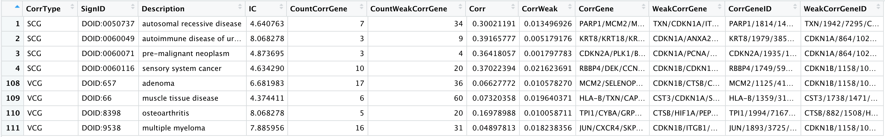

where "CorrType" indicates SCG or VCG, "Corr" means the average correlation
coefficients of SCG or VCG, "CorrWeak" means the average correlation
coefficients of WCG, "CorrGene" means SCG or VCG, and "WeakCorrGene" means WCG.
The orders of gene symbols and ENTREZ IDs, separated by "/", are consistent.


<br>

## Remove redundant signs
ASURAT function `remove_signs_redundant()` removes redundant sings using
semantic similarity matrices.

The arguments are

* `sce`: SingleCellExperiment object,
* `similarity_matrix`: a semantic similarity matrix prepared in
[here](#database),
* `threshold`: a threshold value of semantic similarity, used for regarding
biological terms as similar ones, and
* `keep_rareID`: if `TRUE`, biological terms with the larger ICs are kept.

**Tips:**
The optimal value of `threshold` depends on the ontology structure as well as
the method for computing semantic similarity matrix.
```{r, eval = FALSE}
sclc <- remove_signs_redundant(sce = sclc, similarity_matrix = simmat_DO,
                               threshold = 0.90, keep_rareID = TRUE)
```
The results are stored in `metadata(sce)$sign_SCG`, `metadata(sce)$sign_VCG`,
`metadata(sce)$sign_all`, and if there exist, `metadata(sce)$sign_SCG_redundant`
and `metadata(sce)$sign_VCG_redundant`.

ASURAT function `remove_signs_manually()` removes signs by specifying
IDs (e.g., `DOID:XXX`) or descriptions (e.g., `oocyte`) using `grepl()`.
The arguments are `sce` and `keywords` (keywords separated by `|`).
```{r, eval = FALSE}
keywords <- "foofoo|hogehoge"
sclc <- remove_signs_manually(sce = sclc, keywords = keywords)
```
The results are stored in `metadata(sce)$sign_SCG`, `metadata(sce)$sign_VCG`,
and `metadata(sce)$sign_all`.

There is another ASURAT function `select_signs_manually()`, a counter part of
`remove_signs_manually()`, which removes signs that do not include `keywords`
(keywords separated by `|`).
```{r, eval = FALSE}
keywords <- "lung|pleural|respiratory"
test <- select_signs_manually(sce = sclc, keywords = keywords)
```
The results are stored in `metadata(sce)$sign_SCG`, `metadata(sce)$sign_VCG`,
and `metadata(sce)$sign_all`.


<br>

## Create sign-by-sample matrices (SSMs)
ASURAT function `create_sce_signmatrix()` creates a new SingleCellExperiment
object `new_sce`, consisting of the following information:

* `assayNames(new_sce)`: counts (SSM; entries are termed sign scores),
* `names(colData(new_sce))`: nReads, nGenes, percMT,
* `names(rowData(new_sce))`: ParentSignID, Description, CorrGene, etc.,
* `names(metadata(new_sce))`: sign_SCG, sign_VCG, etc.,
* `altExpNames(new_sce)`: something if there is data in `altExp(sce)`.

The arguments are

* `sce`: SingleCellExperiment object,
* `weight_strg`: weight parameter for SCG (the default value is 0.5), and
* `weight_vari`: weight parameter for VCG (the default is 0.5).
```{r, eval = FALSE}
sclc <- create_sce_signmatrix(sce = sclc, weight_strg = 0.5, weight_vari = 0.5)
pbmc <- create_sce_signmatrix(sce = pbmc, weight_strg = 0.5, weight_vari = 0.5)
```

Below are head and tail of `assay(sce, "counts")`:
```{r, eval = FALSE}
rbind(head(assay(sclc, "counts")[, 1:3], n = 4),
      tail(assay(sclc, "counts")[, 1:3], n = 4))
```
```
               AAACCTGAGACGACGT-1 AAACCTGAGCGCTCCA-1 AAACCTGCACATCCGG-1
DOID:0050737-S       -0.178371286        -0.23921860         0.03258119
DOID:0060071-S       -0.130902510        -0.47394408        -0.23880319
DOID:0070004-S       -0.156659715        -0.26256560        -0.04877884
DOID:1036-S          -0.135098395        -0.38302562        -0.08576164
DOID:635-V           -0.038934940        -0.22272797         0.03864755
DOID:657-V            0.008795144        -0.14227774         0.15652817
DOID:8398-V          -0.024273218         0.01581921        -0.09482382
DOID:9538-V          -0.058562342        -0.16278107         0.09367541
```


<br>

## Dimensionality reduction of SSM {#dimensionality_reduction}
Perform principal component analysis (optional).
```{r, eval = FALSE}
res <- prcomp(t(assay(sclc, "counts")), scale = TRUE)
reducedDim(sclc, "PCA") <- res[["x"]]

res <- prcomp(t(assay(pbmc, "counts")), scale = TRUE)
reducedDim(pbmc, "PCA") <- res[["x"]]
```

Perform t-distributed stochastic neighbor embedding (optional).
```{r, eval = FALSE}
set.seed(1)
res <- Rtsne::Rtsne(t(assay(pbmc, "counts")), dim = 2, pca = FALSE)
reducedDim(pbmc, "TSNE") <- res[["Y"]]
```

Perform uniform manifold approximation and projection (optional).
```{r, eval = FALSE}
set.seed(1)
res <- umap::umap(t(assay(pbmc, "counts")), n_components = 2)
reducedDim(pbmc, "UMAP") <- res[["layout"]]
```

Perform diffusion map (optional).
```{r, eval = FALSE}
set.seed(1)
res <- destiny::DiffusionMap(t(assay(sclc, "counts")))
#res <- destiny::DiffusionMap(reducedDim(sclc, "PCA")[, 1:10])
reducedDim(sclc, "DMAP") <- res@eigenvectors
```

The results can be visualized by ASURAT functions `plot_dataframe2D_asrt()` or
`plot_dataframe3D_asrt()` (see [here](#visualization_lowdim) for details).
```{r, eval = FALSE}
dataframe3D <- as.data.frame(reducedDim(sclc, "DMAP")[, 1:3])
plot_dataframe3D_asrt(dataframe3D = dataframe3D, theta = 45, phi = 20,
                      title="SCLC", xlabel="DC_1", ylabel="DC_2", zlabel="DC_3")

dataframe2D <- as.data.frame(reducedDim(pbmc, "TSNE"))
plot_dataframe2D_asrt(dataframe2D = dataframe2D, title = "PBMC",
                      xlabel = "tSNE_1", ylabel = "tSNE_2")
```

```{r, eval = FALSE, echo = FALSE}
filename <- "figures/figure_01_0110.png"
png(file = filename, height = 500, width = 500, res = 100)
dev.off()

filename <- "figures/figure_02_0110.png"
ggsave(file = filename, plot = p, dpi = 100, width = 3.7, height = 4)
```

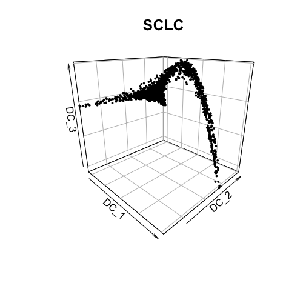


An exhaustive parameter searching may help us find an "optimal" parameter set
producing an interpretable clustering results.

Below are few examples.

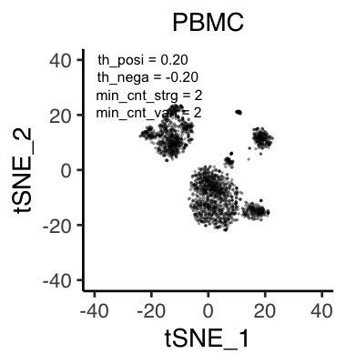
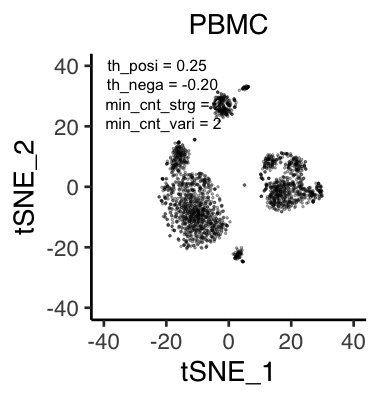
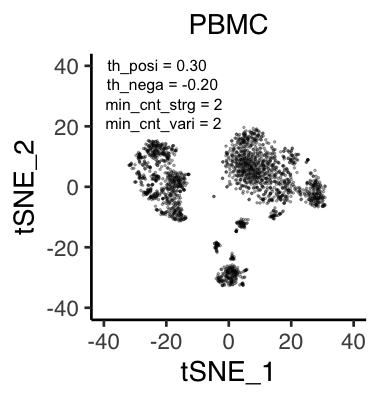
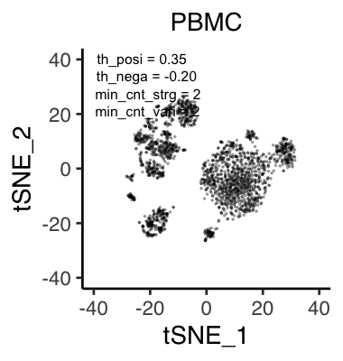


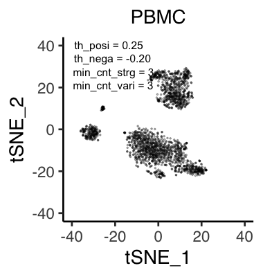
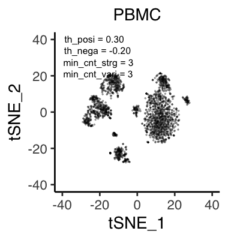


<br>

## Unsupervised clustering of cells
### Use Seurat functions (optional)
To date (December, 2021), one of the most useful clustering methods in
single-cell RNA-seq analysis is a combination of a community detection algorithm
and graph-based unsupervised clustering, developed in Seurat package.

In this tutorial, our strategy is as follows:

1. convert SingleCellExperiment objects into Seurat objects
  (note that `rowData()` and `colData()` must have data),
2. perform `ScaleData()`, `RunPCA()`, `FindNeighbors()`, and `FindClusters()`,
3. convert Seurat objects into temporal SingleCellExperiment objects `temp`,
4. add `colData(temp)$seurat_clusters` into `colData(sce)$seurat_clusters`.
```{r, eval = FALSE}
pbmc_surt <- Seurat::as.Seurat(pbmc, counts = "counts", data = "counts")
#If there is data in `altExp(sce)`, set Seurat default assay as follows:
Seurat::DefaultAssay(pbmc_surt) <- "originalexp"
pbmc_surt <- Seurat::ScaleData(pbmc_surt, features = rownames(pbmc_surt))
pbmc_surt <- Seurat::RunPCA(pbmc_surt, features = rownames(pbmc_surt))
pbmc_surt <- Seurat::FindNeighbors(pbmc_surt, reduction = "pca", dims = 1:20)
pbmc_surt <- Seurat::FindClusters(pbmc_surt, resolution = 0.15)
pbmc_temp <- Seurat::as.SingleCellExperiment(pbmc_surt)
colData(pbmc)$seurat_clusters <- colData(pbmc_temp)$seurat_clusters
```

These results can be visualized by ASURAT functions `plot_dataframe2D_asrt()` or
`plot_dataframe3D_asrt()` (see [here](#visualization_lowdim) for details).
```{r, eval = FALSE}
labels <- colData(pbmc)$seurat_clusters
dataframe2D <- as.data.frame(reducedDim(pbmc, "TSNE"))
plot_dataframe2D_asrt(dataframe2D = dataframe2D, labels = labels, colors = NULL,
                      title = "PBMC (CO & MSigDB)", title_size = 20,
                      xlabel = "tSNE_1", ylabel = "tSNE_2", clabel = "")
```

```{r, eval = FALSE, echo = FALSE}
filename <- "figures/figure_02_0120.png"
ggsave(file = filename, plot = p, dpi = 100, width = 4.8, height = 4)
```

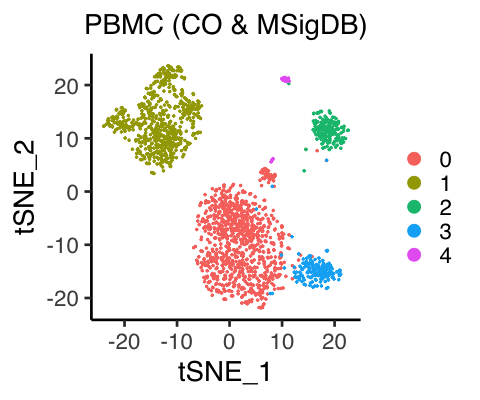


<br>

### Use MERLoT functions (optional)
Another method is using MERLoT embedding an elastic principal tree into sign
space (regarding gene expression space as sign score space), assigning
a pseudotime to each cell, and clustering cells based on tree branches.
```{r, eval = FALSE}
library(merlot)
# Preparation
res0 <- reducedDims(sclc)$DMAP[, 1:3]
mat <- t(as.matrix(assay(sclc, "counts")))
# ScaffoldTree
res1 <- CalculateScaffoldTree(CellCoordinates=res0, NEndpoints=3, random_seed=1)
# ElasticTree
res2 <- CalculateElasticTree(ScaffoldTree = res1, N_yk = 30)
# SignsSpaceEmbedding
res3 <- GenesSpaceEmbedding(ExpressionMatrix=mat, ElasticTree=res2, NCores=3)
# Pseudotime in high dimensional space
res4 <- CalculatePseudotimes(InputTree = res2, T0 = 1)
# Cluster cells based on tree branches embedded in high dimensional space.
res5 <- res3$Cells2Branches
# Store the results
colData(sclc)$merlot_clusters <- factor(res5, levels = 1:max(res5))
res <- list(ScaffoldTree = res1, ElasticTree = res2, SignsSpaceEmbedding = res3,
            Pseudotimes_highdim = res4)
metadata(sclc)$merlot <- res
```

The results can be visualized by ASURAT functions `plot_dataframe2D_asrt()` or
`plot_dataframe3D_asrt()` (see [here](#visualization_lowdim) for details).
```{r, eval = FALSE}
labels <- colData(sclc)$merlot_clusters
dataframe3D <- as.data.frame(reducedDim(sclc, "DMAP")[,1:3])
plot_dataframe3D_asrt(dataframe3D = dataframe3D, labels = labels, colors = NULL,
                      theta = 45, phi = 20, title = "SCLC (DO)",
                      title_size = 1.5,
                      xlabel = "DC_1", ylabel = "DC_2", zlabel = "DC_3")
```

```{r, eval = FALSE, echo = FALSE}
filename <- "figures/figure_01_0120.png"
png(file = filename, height = 500, width = 500, res = 100)
dev.off()
```


<br>

### Cell cycle inference using Seurat functions (optional)
If there is gene expression data in `altExp(sce)`, we can easily infer
cell cycle phases by using Seurat functions in the similar manner as above.
```{r, eval = FALSE}
pbmc_surt <- Seurat::as.Seurat(pbmc, counts = "counts", data = "counts")
#If there is "expressions" data in `altExp(sce)`, set Seurat default assay.
Seurat::DefaultAssay(pbmc_surt) <- "expressions"
pbmc_surt <- Seurat::ScaleData(pbmc_surt, features = rownames(pbmc_surt))
pbmc_surt <- Seurat::RunPCA(pbmc_surt, features = rownames(pbmc_surt))
pbmc_surt <- Seurat::CellCycleScoring(pbmc_surt,
                                      s.features = Seurat::cc.genes$s.genes,
                                      g2m.features = Seurat::cc.genes$g2m.genes)
pbmc_temp <- Seurat::as.SingleCellExperiment(pbmc_surt)
colData(pbmc)$Phase <- colData(pbmc_temp)$Phase
```


<br>

## Investigate significant signs {#separation_index}
Significant signs are analogous to differentially expressed genes but bear
biological meanings.
Note that naïve usages of statistical tests should be avoided because the row
vectors of SSMs are centered.

Instead, ASURAT function `compute_sepI_all()` computes separation indices
for each cluster against the others.

The arguments are

* `sce`: SingleCellExperiment object and
* `labels`: a vector of labels of all the samples.
```{r, eval = FALSE}
labels <- colData(sclc)$merlot_clusters
sclc <- compute_sepI_all(sce = sclc, labels = labels)

labels <- colData(pbmc)$seurat_clusters
pbmc <- compute_sepI_all(sce = pbmc, labels = labels)
```

Below are head and tail of the results in
`metadata(sce)$marker_signs$"Label_2_vs_0/1/3/4"`.
```{r, eval = FALSE}
rbind(head(metadata(pbmc)$marker_signs$"Label_2_vs_0/1/3/4", n = 4),
      tail(metadata(pbmc)$marker_signs$"Label_2_vs_0/1/3/4", n = 4))
```

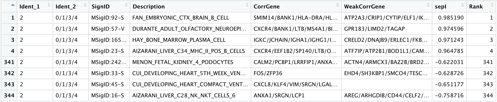

Here, one can see that MSigID:92-S (B cell) is the top significant sign for
cluster 2 versus clusters 0, 1, 3, and 4, based on separation index
${\rm sepI} \approx 0.99$.
This value means that the distribution of sign scores of MSigID:92-S are
well separated between cluster 2 and the others.

ASURAT function `plog_violin_asrt()` shows violin plots showing sign score
distributions (see [here](#violin) for details).
```{r, eval = FALSE}
vname <- "MSigID:92-S" ; pbmc_sub <- pbmc[rownames(pbmc) == vname, ]
labels <- colData(pbmc)$seurat_clusters
colors <- rainbow(length(unique(labels)))[labels]
dataframe1D <- as.data.frame(t(assay(pbmc_sub, "counts")))
title <- paste(vname, "\n", "B cell", "\n", "(CD79A, CD22, ...)", sep = "")

plot_violin_asrt(dataframe1D = dataframe1D, labels = labels, colors = colors,
                 title = title, title_size = 20,
                 xlabel = "Cluster (CO & MSigDB)", ylabel = "Sign score",
                 clabel = "Cluster")
```

```{r, eval = FALSE, echo = FALSE}
filename <- "figures/figure_02_0130.png"
ggsave(file = filename, plot = p, dpi = 100, width = 6, height = 4)
```

<br>

<center>
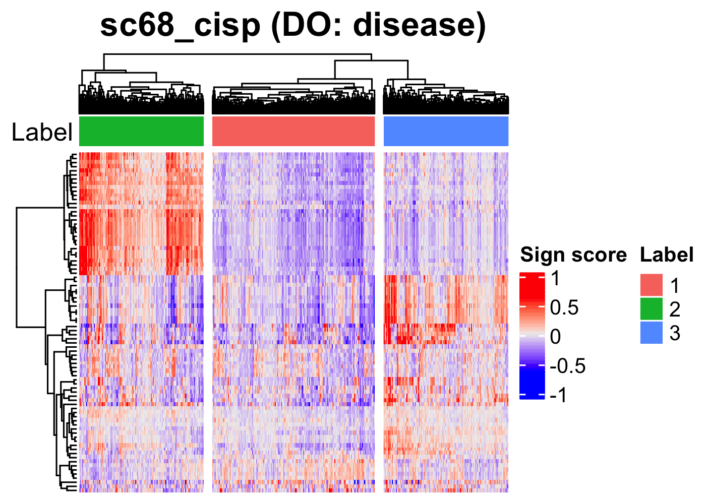
</center>

<br>

On the other hand, MSigID:16-S (NK or NKT cell) is ranked at the bottom with
${\rm sepI} \approx -0.76$, indicating that MSigID:16-S is a negative marker
for cluster 2.

The following figures show distributions of sign scores of different signs
between cluster 2 and the others, showing different separation indices (sepI)
ranging from -0.8 to 1.0.

<br>


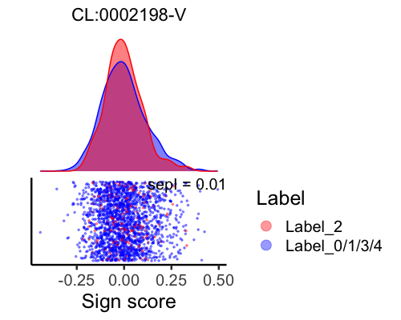


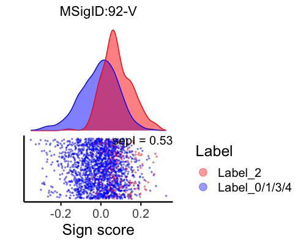


```{r, eval = FALSE, echo = FALSE}
sce <- pbmc
labels <- colData(sce)$seurat_clusters
ident_1 <- 2 ; ident_2 <- c(0, 1, 3, 4)
comp <- paste("Label_", ident_1, "_vs_", paste(ident_2, collapse="/"), sep = "")
inds_1 <- which(labels %in% ident_1) ; inds_2 <- which(labels %in% ident_2)
popu_1 <- colnames(sce)[inds_1]
subsce <- sce[,sort(union(inds_1, inds_2))]
submat <- as.matrix(assay(subsce, "counts"))
View(metadata(subsce)$marker_signs[[comp]])

IDs <- c("MSigID:16-S", "MSigID:62-S", "CL:0002198-V",
         "CL:0000451-S", "MSigID:92-V", "MSigID:92-S")
for(i in 1:length(IDs)){
  SignID <- IDs[i]
  dg <- metadata(subsce)$marker_signs[[comp]]
  sepI <- round(dg[which(dg$SignID == SignID),]$sepI, digits = 2)
  df <- data.frame(x = submat[which(rownames(submat) == SignID),])
  df$c <- ifelse(rownames(df) %in% popu_1,
                 paste("Label_", paste(ident_1, collapse = "/"), sep = ""),
                 paste("Label_", paste(ident_2, collapse = "/"), sep = ""))
  levels <- c(paste("Label_", paste(ident_1, collapse="/"), sep = ""),
              paste("Label_", paste(ident_2, collapse="/"), sep = ""))
  mytext <- paste("sepI = ", round(sepI, digits = 3), sep = "")
  mycolors <- c(rainbow(3)[1], rainbow(3)[3])
  p <- ggplot(df, aes(x=x, y=0, color=factor(c, levels = levels))) +
    geom_jitter(width=0, alpha=0.4, size=.5) +
    theme_classic(base_size=18) + scale_y_continuous(breaks=NULL) +
    scale_colour_manual(values=mycolors) +
    labs(title=SignID, x="Sign score", y="", color="Label") +
    theme(plot.title=element_text(hjust=0.5, vjust=-1, size=16)) +
    annotate("text", x=Inf, y=Inf, label=mytext, hjust=1, vjust=1, size=5) +
    guides(colour=guide_legend(override.aes=list(size=4)))
  p <- ggExtra::ggMarginal(p, type="density", margins="x", size=0.6,
                           groupColour=TRUE, groupFill=TRUE)
  filename <- sprintf("figures/figure_00_%04d.png", 39 + i)
  ggsave(file = filename, plot = p, dpi = 100, width = 5, height = 4)
}
```

<br>

When computing separation indices between given clusters, e.g., cluster 1 versus
clusters 2 and 3, use an ASURAT function `compute_sepI_clusters()`.

The arguments are

* `sce`: SingleCellExperiment object,
* `labels`: a vector of labels of all the samples, and
* `ident_1` and `ident_2`: label names identifying cluster numbers.
```{r, eval = FALSE}
labels <- colData(sclc)$merlot_clusters
test <- compute_sepI_clusters(sce = sclc, labels = labels,
                              ident_1 = 1, ident_2 = c(2, 3))
```
The results are stored in `metadata(sce)$marker_signs$Label_1_vs_2/3`.

**What is a separation index?**

Briefly, a separation index $I \in [-1, 1]$ is a nonparametric measure of significance of
a given sign score for a given subpopulation (see below).

<br>

<center>

</center>

<br>

Let us demonstrate computing a separation index between clusters 0 and 1.
Consider there are only five cells having cluster labels $l_i$ and sign scores
$s_i$ of a given sign as follows:
$$
\{(l_i, s_i)\}_{i=1}^5 = \{(0, 2), (0, 0), (1, 3), (1, 5), (1, -10)\}.
$$
Sort the cells by sign scores in ascending order as follows:
$(s_5, s_2, s_1, s_3, s_4)$, and obtain a vector of cluster labels as follows:
${\boldsymbol v} = (1, 0, 0, 1, 1)$.
Let ${\boldsymbol w}_0 = (0,0,1,1,1)$ and ${\boldsymbol w}_1 = (1,1,1,0,0)$.
Let $d(\cdot, \cdot)$ be an edit distance with only adjacent swapping permitted.
In this case, $d({\boldsymbol v}, {\boldsymbol w}_0) = 2$ and
$d({\boldsymbol v}, {\boldsymbol w}_1) = 4$.
Then, separation index $I({\boldsymbol v})$ is computed as follows:
$$
I({\boldsymbol v}) := \frac{2 d({\boldsymbol v}, {\boldsymbol w}_0)}
{d({\boldsymbol v}, {\boldsymbol w}_0) + d({\boldsymbol v}, {\boldsymbol w}_1)}
= \frac{1}{3}.
$$
Hence, this sign is a candidate of positive marker sign for cluster 1 with
$I = 1/3$, while that of negative marker for cluster 0 with $I = -1/3$.
$\blacksquare$


<br>

## Investigate significant genes
### Use Seurat function
To date (December, 2021), one of the most useful methods of multiple statistical
tests in single-cell RNA-seq analysis is to use a Seurat function
`FindAllMarkers()`.

If there is gene expression data in `altExp(sce)`, we can easily investigate
differentially expressed genes by using Seurat functions in the similar manner
as described before.
```{r, eval = FALSE}
pbmc_surt <- Seurat::as.Seurat(pbmc, counts = "counts", data = "counts")
#If there is "expressions" data in `altExp(sce)`, set Seurat default assay.
Seurat::DefaultAssay(pbmc_surt) <- "expressions"
pbmc_surt <- Seurat::SetIdent(pbmc_surt, value = "seurat_clusters")
res <- Seurat::FindAllMarkers(pbmc_surt, only.pos = TRUE,
                              min.pct = 0.25, logfc.threshold = 0.25)
metadata(pbmc)$marker_genes$all <- res
```

ASURAT function `plog_violin_asrt()` shows violin plots showing gene expression
distributions (see [here](#violin) for details).
```{r, eval = FALSE}
vname <- "BANK1"
expr_sub <- altExp(pbmc, "expressions")
expr_sub <- expr_sub[rownames(expr_sub) == vname]
labels <- colData(pbmc)$seurat_clusters
colors <- rainbow(length(unique(labels)))[labels]
dataframe1D <- as.data.frame(t(assay(expr_sub, "counts")))

plot_violin_asrt(dataframe1D = dataframe1D, labels = labels, colors = colors,
                 title = vname, title_size = 20,
                 xlabel = "Cluster (CO & MSigDB)",
                 ylabel = "Normalized\nexpression", clabel = "Cluster")
```

```{r, eval = FALSE, echo = FALSE}
filename <- "figures/figure_02_0140.png"
ggsave(file = filename, plot = p, dpi = 100, width = 6, height = 3.5)
```

<br>

<center>
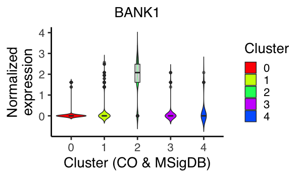
</center>


<br>

## Save data
```{r, eval = FALSE}
saveRDS(sclc, file = "backup/01_003_sclc_DO.rds")
saveRDS(pbmc, file = "backup/02_003_pbmc_COMSig.rds")
```


<br><br><br>

# Infer cell functions {#function}
We infer biological functions at the single-cell level by inputting
related databases such as Gene Ontology, Kyoto Encyclopedia of
Genes and Genomes (see [here](#database) for details).

ASURAT transforms centered read count tables to functional feature matrices,
termed sign-by-sample matrices (SSMs).
Using SSMs, we perform unsupervised clustering of samples (cells).


<br>

## Prepare scRNA-seq data and databases
Load data.
```{r, eval = FALSE}
pbmc <- readRDS(file = "backup/02_002_pbmc_normalized.rds")
```

Load a Gene Ontology database (see [here](#database) for details).
```{r, eval = FALSE}
dir.create("databases")
oururl <-  "https://github.com/keita-iida/ASURAT_0.1.0/blob/main/databases/"

curl <- paste(oururl, "20201213_human_GO.rda?raw=true", sep = "")
file <- "databases/20201213_human_GO.rda"
download.file(curl, file) ; load(file)
```

Load a KEGG database (see [here](#database) for details).
```{r, eval = FALSE}
curl <- paste(oururl, "20201213_human_KEGG.rda?raw=true", sep = "")
file <- "databases/20201213_human_KEGG.rda"
download.file(curl, file) ; load(file)
```

Prepare a semantic similarity matrix for Ontology data.
Note that semantic similarity is defined only for ontology data.
```{r, eval = FALSE}
simmat_GO <- human_GO[["similarity_matrix"]][["BP"]]
```

Remove unused data slots to make objects small.
```{r, eval = FALSE}
use <- c("centered", "log-normalized")
assays(pbmc) <- assays(pbmc)[which(assayNames(pbmc) %in% use)]
```

Prepare correlation matrices of gene expressions.
```{r, eval = FALSE}
pbmc_cormat <- cor(t(assay(pbmc, "centered")), method = "spearman")
```

Set gene expression data into `altExp(sce)`.
Here, we avoid using a name "log-normalized" for `altExp()` slots because
Seurat (version 4.0.5) function `as.Seurat()` produced an error with the name.
```{r, eval = FALSE}
oldname <- "log-normalized"
new <- "expressions"
altExp(pbmc, new) <- SummarizedExperiment(list(counts = assay(pbmc, oldname)))
```

Add ENTREZ Gene IDs to `rowData(sce)`.
```{r, eval = FALSE}
dictionary <- AnnotationDbi::select(org.Hs.eg.db::org.Hs.eg.db,
                                    key = rownames(pbmc),
                                    columns = "ENTREZID", keytype = "SYMBOL")
dictionary <- dictionary[!duplicated(dictionary$SYMBOL), ]
rowData(pbmc)$geneID <- dictionary$ENTREZID
```

Add formatted databases into SingleCellExperiment object slot
`metadata(sce)$sign` by identifying datatype and category.
```{r, eval = FALSE}
pbmc_GO <- pbmc
 metadata(pbmc_GO) <- list(sign = human_GO[["BP"]])

pbmc_KG <- pbmc
metadata(pbmc_KG) <- list(sign = human_KEGG[["pathway"]])
```


<br>

## Create signs
ASURAT function `remove_signs_asrt()` redefines functional gene sets for the
input database by removing genes, which are not included in `rownames(sce)`,
and then removes biological terms including too few or too many genes.

The arguments are

* `sce`: SingleCellExperiment object,
* `min_ngenes`: minimal number of genes> 1 (the default value is 2), and
* `max_ngenes`: maximal number of genes> 1 (the default value is 1000).
```{r, eval = FALSE}
pbmc_GO <- remove_signs_asrt(sce = pbmc_GO, min_ngenes = 2, max_ngenes = 1000)
pbmc_KG <- remove_signs_asrt(sce = pbmc_KG, min_ngenes = 2, max_ngenes = 1000)
```
The results are stored in `metadata(sce)$sign`.

ASURAT function `cluster_genes_asrt()` clusters functional gene sets using
correlation graph-based decomposition, which produces strongly, variably, and
weakly correlated gene sets (SCG, VCG, and WCG, respectively).

The arguments are

* `sce`: SingleCellExperiment object,
* `cormat`: correlation matrix of gene expressions,
* `th_posi` and `th_nega`: threshold values of positive and negative
correlation coefficients, respectively.

**Tips:**
Empirically, typical values of `th_posi` and `th_nega` are
$0.15 \le {\rm th{\_}posi} \le 0.4$ and $-0.4 \le {\rm th{\_}nega} \le -0.15$,
but we cannot avoid trial and error for setting these values.
An exhaustive parameter searching is time-consuming but helpful for obtaining
"optimal" values.
```{r, eval = FALSE}
set.seed(8)
pbmc_GO <- cluster_genesets_asrt(sce = pbmc_GO, cormat = pbmc_cormat,
                                 th_posi = 0.24, th_nega = -0.20)
pbmc_KG <- cluster_genesets_asrt(sce = pbmc_KG, cormat = pbmc_cormat,
                                 th_posi = 0.20, th_nega = -0.20)
```
The results are stored in `metadata(sce)$sign`.

ASURAT function `create_signs_asrt()` defines signs by the following criteria:

1. the number of genes in SCG>= `min_cnt_strg` (the default value is 2) and
2. the number of genes in VCG>= `min_cnt_vari` (the default value is 2),

which are independently applied to SCGs and VCGs, respectively.

**Tips:**
Empirically, typical values of `min_cnt_strg` and `min_cnt_vari` are
$2 \le {\rm min\_cnt\_strg} = {\rm min\_cnt\_vari} \le 3$,
but we cannot avoid trial and error for setting these values.
An exhaustive parameter searching is time-consuming but helpful for obtaining
"optimal" values.
```{r, eval = FALSE}
pbmc_GO <- create_signs_asrt(sce = pbmc_GO, min_cnt_strg = 2, min_cnt_vari = 2)
pbmc_KG <- create_signs_asrt(sce = pbmc_KG, min_cnt_strg = 2, min_cnt_vari = 2)
```

Below are head and tail of the results in `metadata(sce)$sign_all`:
```{r, eval = FALSE}
rbind(rbind(head(metadata(pbmc_GO)$sign_all, n = 4),
            tail(metadata(pbmc_GO)$sign_all, n = 4)))
```


where "CorrType" indicates SCG or VCG, "Corr" means the average correlation
coefficients of SCG or VCG, "CorrWeak" means the average correlation
coefficients of WCG, "CorrGene" means SCG or VCG, and "WeakCorrGene" means WCG.
The orders of gene symbols and ENTREZ IDs, separated by "/", are consistent.


<br>

## Remove redundant signs
ASURAT function `remove_signs_redundant()` removes redundant sings using
semantic similarity matrices.

The arguments are

* `sce`: SingleCellExperiment object,
* `similarity_matrix`: a semantic similarity matrix prepared in
[here](#database),
* `threshold`: a threshold value of semantic similarity, used for regarding
biological terms as similar ones, and
* `keep_rareID`: if `TRUE`, biological terms with the larger ICs are kept.

**Tips:**
The optimal value of `threshold` depends on the ontology structure as well as
the method for computing semantic similarity matrix.
```{r, eval = FALSE}
pbmc_GO <- remove_signs_redundant(sce = pbmc_GO, similarity_matrix = simmat_GO,
                                  threshold = 0.80, keep_rareID = TRUE)
```
The results are stored in `metadata(sce)$sign_SCG`, `metadata(sce)$sign_VCG`,
`metadata(sce)$sign_all`, and if there exist, `metadata(sce)$sign_SCG_redundant`
and `metadata(sce)$sign_VCG_redundant`.

ASURAT function `remove_signs_manually()` removes signs by specifying
IDs (e.g., `GOID:XXX`) or descriptions (e.g., `metabolism`) using `grepl()`.
The arguments are `sce` and `keywords` (keywords separated by `|`).
```{r, eval = FALSE}
keywords <- "COVID-19|hogehoge"
pbmc_KG <- remove_signs_manually(sce = pbmc_KG, keywords = keywords)
```
The results are stored in `metadata(sce)$sign_SCG`, `metadata(sce)$sign_VCG`,
and `metadata(sce)$sign_all`.

There is another ASURAT function `select_signs_manually()`, a counter part of
`remove_signs_manually()`, which removes signs that do not include `keywords`
(keywords separated by `|`).
```{r, eval = FALSE}
keywords <- "lung|pleural|respiratory"
test <- select_signs_manually(sce = pbmc_GO, keywords = keywords)
```
The results are stored in `metadata(sce)$sign_SCG`, `metadata(sce)$sign_VCG`,
and `metadata(sce)$sign_all`.


<br>

## Create sign-by-sample matrices (SSMs)
ASURAT function `create_sce_signmatrix()` creates a new SingleCellExperiment
object `new_sce`, consisting of the following information:

* `assayNames(new_sce)`: counts (SSM; entries are termed sign scores),
* `names(colData(new_sce))`: nReads, nGenes, percMT,
* `names(rowData(new_sce))`: ParentSignID, Description, CorrGene, etc.,
* `names(metadata(new_sce))`: sign_SCG, sign_VCG, etc.,
* `altExpNames(new_sce)`: something if there is data in `altExp(sce)`.

The arguments are

* `sce`: SingleCellExperiment object,
* `weight_strg`: weight parameter for SCG (the default value is 0.5), and
* `weight_vari`: weight parameter for VCG (the default is 0.5).
```{r, eval = FALSE}
pbmc_GO <- create_sce_signmatrix(sce=pbmc_GO, weight_strg=0.5, weight_vari=0.5)
pbmc_KG <- create_sce_signmatrix(sce=pbmc_KG, weight_strg=0.5, weight_vari=0.5)
```

Below are head and tail of `assay(sce, "counts")`:
```{r, eval = FALSE}
rbind(head(assay(pbmc_GO, "counts")[, 1:3], n = 4),
      tail(assay(pbmc_GO, "counts")[, 1:3], n = 4))
```
```
             AAACCTGCAAGGTTCT-1 AAACCTGCAGGCGATA-1 AAACCTGCATGAAGTA-1
GO:0002200-S         0.06403556        -0.08659540        -0.11850662
GO:0002507-S         0.14344038        -0.05468848        -0.11059437
GO:0019835-S        -0.06042647        -0.15463694        -0.18063765
GO:0022412-S         0.02312782        -0.26666103         0.20636368
GO:0070232-V         0.20198155        -0.15420904        -0.02334425
GO:0006879-V        -0.01541034        -0.04261381        -0.11153265
GO:0051289-V        -0.10350923         0.17142068         0.05379736
GO:0000209-V        -0.03117341         0.07300492         0.09915768
```


<br>

## Dimensionality reduction of SSM
Perform principal component analysis (optional).
```{r, eval = FALSE}
res <- prcomp(t(assay(pbmc_GO, "counts")), scale = TRUE)
reducedDim(pbmc_GO, "PCA") <- res[["x"]]

res <- prcomp(t(assay(pbmc_KG, "counts")), scale = TRUE)
reducedDim(pbmc_KG, "PCA") <- res[["x"]]
```

Perform t-distributed stochastic neighbor embedding (optional).
```{r, eval = FALSE}
set.seed(1)
res <- Rtsne::Rtsne(t(assay(pbmc_GO, "counts")), dim = 2, pca = FALSE)
reducedDim(pbmc_GO, "TSNE") <- res[["Y"]]

res <- Rtsne::Rtsne(t(assay(pbmc_KG, "counts")), dim = 2, pca = FALSE)
reducedDim(pbmc_KG, "TSNE") <- res[["Y"]]
```

Perform uniform manifold approximation and projection (optional).
```{r, eval = FALSE}
set.seed(1)
res <- umap::umap(t(assay(pbmc_GO, "counts")), n_components = 2)
reducedDim(pbmc_GO, "UMAP") <- res[["layout"]]

res <- umap::umap(t(assay(pbmc_KG, "counts")), n_components = 2)
reducedDim(pbmc_KG, "UMAP") <- res[["layout"]]
```

The results can be visualized by ASURAT functions `plot_dataframe2D_asrt()` or
`plot_dataframe3D_asrt()` (see [here](#visualization_lowdim) for details).
```{r, eval = FALSE}
dataframe2D <- as.data.frame(reducedDim(pbmc_GO, "TSNE"))
plot_dataframe2D_asrt(dataframe2D = dataframe2D, title = "PBMC (GO)",
                      xlabel = "tSNE_1", ylabel = "tSNE_2")
```

```{r, eval = FALSE, echo = FALSE}
filename <- "figures/figure_02_0210.png"
ggsave(file = filename, plot = p, dpi = 100, width = 3.7, height = 4)
```

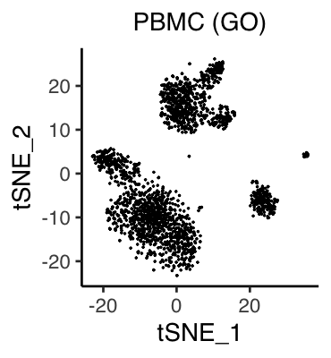
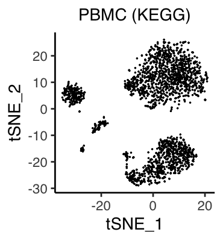


<br>

## Unsupervised clustering of cells
### Use Seurat functions (optional)
To date (December, 2021), one of the most useful clustering methods in
single-cell RNA-seq analysis is a combination of a community detection algorithm
and graph-based unsupervised clustering, developed in Seurat package.

In this tutorial, our strategy is as follows:

1. convert SingleCellExperiment objects into Seurat objects
  (note that `rowData()` and `colData()` must have data),
2. perform `ScaleData()`, `RunPCA()`, `FindNeighbors()`, and `FindClusters()`,
3. convert Seurat objects into temporal SingleCellExperiment objects `temp`,
4. add `colData(temp)$seurat_clusters` into `colData(sce)$seurat_clusters`.
```{r, eval = FALSE}
pbmc_surt <- Seurat::as.Seurat(pbmc_GO, counts = "counts", data = "counts")
#If there is data in `altExp(sce)`, set Seurat default assay as follows:
Seurat::DefaultAssay(pbmc_surt) <- "originalexp"
pbmc_surt <- Seurat::ScaleData(pbmc_surt, features = rownames(pbmc_surt))
pbmc_surt <- Seurat::RunPCA(pbmc_surt, features = rownames(pbmc_surt))
pbmc_surt <- Seurat::FindNeighbors(pbmc_surt, reduction = "pca", dims = 1:50)
pbmc_surt <- Seurat::FindClusters(pbmc_surt, resolution = 0.20)
pbmc_temp <- Seurat::as.SingleCellExperiment(pbmc_surt)
colData(pbmc_GO)$seurat_clusters <- colData(pbmc_temp)$seurat_clusters

pbmc_surt <- Seurat::as.Seurat(pbmc_KG, counts = "counts", data = "counts")
#If there is data in `altExp(sce)`, set Seurat default assay as follows:
Seurat::DefaultAssay(pbmc_surt) <- "originalexp"
pbmc_surt <- Seurat::ScaleData(pbmc_surt, features = rownames(pbmc_surt))
pbmc_surt <- Seurat::RunPCA(pbmc_surt, features = rownames(pbmc_surt))
pbmc_surt <- Seurat::FindNeighbors(pbmc_surt, reduction = "pca", dims = 1:50)
pbmc_surt <- Seurat::FindClusters(pbmc_surt, resolution = 0.25)
pbmc_temp <- Seurat::as.SingleCellExperiment(pbmc_surt)
colData(pbmc_KG)$seurat_clusters <- colData(pbmc_temp)$seurat_clusters
```

These results can be visualized by ASURAT functions `plot_dataframe2D_asrt()` or
`plot_dataframe3D_asrt()` (see [here](#visualization_lowdim) for details).
```{r, eval = FALSE}
labels <- colData(pbmc_GO)$seurat_clusters
dataframe2D <- as.data.frame(reducedDim(pbmc_GO, "TSNE"))
plot_dataframe2D_asrt(dataframe2D = dataframe2D, labels = labels, colors = NULL,
                      title = "PBMC (GO)", title_size = 20,
                      xlabel = "tSNE_1", ylabel = "tSNE_2", clabel = "")
```

```{r, eval = FALSE, echo = FALSE}
filename <- "figures/figure_02_0220.png"
ggsave(file = filename, plot = p, dpi = 100, width = 4.8, height = 4)
```


<br>

## Investigate significant signs
Significant signs are analogous to differentially expressed genes but bear
biological meanings.
Note that naïve usages of statistical tests should be avoided because the row
vectors of SSMs are centered.

Instead, ASURAT function `compute_sepI_all()` computes separation indices
for each cluster against the others.

The arguments are

* `sce`: SingleCellExperiment object and
* `labels`: a vector of labels of all the samples.
```{r, eval = FALSE}
labels <- colData(pbmc_GO)$seurat_clusters
pbmc_GO <- compute_sepI_all(sce = pbmc_GO, labels = labels)

labels <- colData(pbmc_KG)$seurat_clusters
pbmc_KG <- compute_sepI_all(sce = pbmc_KG, labels = labels)
```

Below are head and tail of the results in
`metadata(sce)$marker_signs$"Label_2_vs_0/1/3/4"`.
```{r, eval = FALSE}
rbind(head(metadata(pbmc_GO)$marker_signs$"Label_2_vs_0/1/3/4", n = 4),
      tail(metadata(pbmc_GO)$marker_signs$"Label_2_vs_0/1/3/4", n = 4))
```

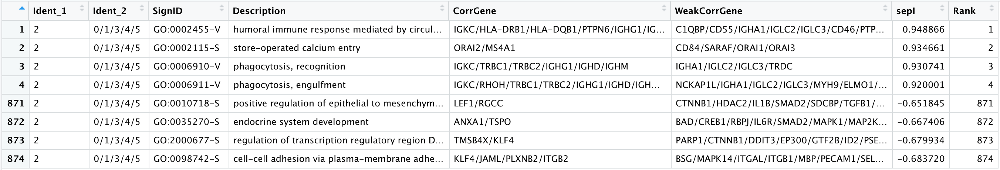

Here, one can see that GO:0002455-V (immune response) is the top significant
sign for cluster 2 versus clusters 0, 1, 3, 4, and 5, based on separation index
${\rm sepI} \approx 0.95$.
This value means that the distribution of sign scores of GO:0002455-V are
well separated between cluster 2 and the others.

On the other hand, GO:0098742-S (cell-cell adhesion) is ranked at the bottom
with ${\rm sepI} \approx -0.68$, indicating that GO:0098742-S is a negative
marker for cluster 2.
See [here](#separation_index) for the definition of separation index.


<br>

## Investigate significant genes
### Use Seurat function
To date (December, 2021), one of the most useful methods of multiple statistical
tests in single-cell RNA-seq analysis is to use a Seurat function
`FindAllMarkers()`.

If there is gene expression data in `altExp(sce)`, we can easily investigate
differentially expressed genes by using Seurat functions in the similar manner
as described before.
```{r, eval = FALSE}
pbmc_surt <- Seurat::as.Seurat(pbmc_GO, counts = "counts", data = "counts")
#If there is "expressions" data in `altExp(sce)`, set Seurat default assay.
Seurat::DefaultAssay(pbmc_surt) <- "expressions"
pbmc_surt <- Seurat::SetIdent(pbmc_surt, value = "seurat_clusters")
res <- Seurat::FindAllMarkers(pbmc_surt, only.pos = TRUE,
                              min.pct = 0.25, logfc.threshold = 0.25)
metadata(pbmc_GO)$marker_genes$all <- res
```


<br>

## Save data
```{r, eval = FALSE}
saveRDS(pbmc_GO, file = "backup/02_004_pbmc_GO.rds")
saveRDS(pbmc_KG, file = "backup/02_004_pbmc_KEGG.rds")
```


<br><br><br>

# Analyze multiple sign-by-sample matrices {#multilayered}
We simultaneously analyze multiple sign-by-sample matrices, which helps us
characterize individual samples (cells) from multiple biological aspects.

Load data.
```{r, eval = FALSE}
pbmc_CM <- readRDS(file = "backup/02_003_pbmc_COMSig.rds")
pbmc_GO <- readRDS(file = "backup/02_004_pbmc_GO.rds")
pbmc_KG <- readRDS(file = "backup/02_004_pbmc_KEGG.rds")
```

ASURAT function `plot_heatmaps_asrt()` shows heatmaps (ComplexHeatmap object)
of sign scores and gene expression levels (if there is a data), where rows and
columns stand for sign (or gene) and sample (cell), respectively
(see [here](#heatmap) for details).

Prepare arguments.
```{r, eval = FALSE}
# ssm_list
ssm_list <- list(SSM_COMSig = assay(pbmc_CM, "counts"),
                 SSM_GO     = assay(pbmc_GO, "counts"),
                 SSM_KEGG   = assay(pbmc_KG, "counts"))
# gem_list
gem_list <- list(Gene_Expr = assay(altExp(pbmc_CM, "expressions"), "counts"))
# ssmlabel_list
label_CM <- data.frame(label = colData(pbmc_CM)$seurat_clusters)
label_GO <- data.frame(label = colData(pbmc_GO)$seurat_clusters)
label_KG <- data.frame(label = colData(pbmc_KG)$seurat_clusters)
label_CM$color <- rainbow(length(unique(label_CM$label)))[label_CM$label]
label_GO$color <- rainbow(length(unique(label_GO$label)))[label_GO$label]
label_KG$color <- rainbow(length(unique(label_KG$label)))[label_KG$label]
ssmlabel_list <- list(Label_COMSig = label_CM, Label_GO = label_GO,
                      Label_KEGG = label_KG)
# gemlabel_list
label_CC <- data.frame(label = colData(pbmc_CM)$Phase, color = NA)
gemlabel_list <- list(Label_CC = label_CC)
```

Plot heatmaps.
```{r, eval = FALSE}
set.seed(1)
plot_heatmaps_asrt(ssm_list = ssm_list, gem_list = gem_list,
                   ssmlabel_list = ssmlabel_list, gemlabel_list = gemlabel_list,
                   nSamples = 100, show_row_names = FALSE,
                   title = "PBMC", title_size = 20)
```

```{r, eval = FALSE, echo = FALSE}
filename <- "figures/figure_02_0410.png"
png(file = filename, height = 600, width = 750, res = 100)
draw(p, padding = unit(c(3, 20, 3, 3), "mm"))
def.off()
```


Select top significant signs and genes for the clustering results using
CO and MSigDB with respect to separation index and p-value, respectively.
```{r, eval = FALSE}
# Significant signs
marker_signs_CM <- metadata(pbmc_CM)$marker_signs$all
marker_signs_CM <- dplyr::group_by(marker_signs_CM, Ident_1)
marker_signs_CM <- dplyr::slice_max(marker_signs_CM, sepI, n = 2)

marker_signs_GO <- metadata(pbmc_GO)$marker_signs$all
marker_signs_GO <- dplyr::group_by(marker_signs_GO, Ident_1)
marker_signs_GO <- dplyr::slice_max(marker_signs_GO, sepI, n = 2)

marker_signs_KG <- metadata(pbmc_KG)$marker_signs$all
marker_signs_KG <- dplyr::group_by(marker_signs_KG, Ident_1)
marker_signs_KG <- dplyr::slice_max(marker_signs_KG, sepI, n = 2)
# Significant genes
marker_genes_CM <- metadata(pbmc_CM)$marker_genes$all
marker_genes_CM <- dplyr::group_by(marker_genes_CM, cluster)
marker_genes_CM <- dplyr::slice_min(marker_genes_CM, p_val_adj, n = 2)
```

Prepare arguments.
```{r, eval = FALSE}
# ssm_list
pbmc_CM_sub <- pbmc_CM[rownames(pbmc_CM) %in% marker_signs_CM$SignID, ]
pbmc_GO_sub <- pbmc_GO[rownames(pbmc_GO) %in% marker_signs_GO$SignID, ]
pbmc_KG_sub <- pbmc_KG[rownames(pbmc_KG) %in% marker_signs_KG$SignID, ]
ssm_list <- list(SSM_COMSig = assay(pbmc_CM_sub, "counts"),
                 SSM_GO     = assay(pbmc_GO_sub, "counts"),
                 SSM_KEGG   = assay(pbmc_KG_sub, "counts"))
# gem_list
expr_sub <- altExp(pbmc_CM_sub, "expressions")
expr_sub <- expr_sub[rownames(expr_sub) %in% marker_genes_CM$gene]
gem_list <- list(Gene_Expr = assay(expr_sub, "counts"))
# ssmlabel_list
label_CM <- data.frame(label = colData(pbmc_CM_sub)$seurat_clusters)
label_GO <- data.frame(label = colData(pbmc_GO_sub)$seurat_clusters)
label_KG <- data.frame(label = colData(pbmc_KG_sub)$seurat_clusters)
label_CM$color <- rainbow(length(unique(label_CM$label)))[label_CM$label]
label_GO$color <- rainbow(length(unique(label_GO$label)))[label_GO$label]
label_KG$color <- rainbow(length(unique(label_KG$label)))[label_KG$label]
ssmlabel_list <- list(Label_COMSig = label_CM, Label_GO = label_GO,
                      Label_KEGG = label_KG)
# gemlabel_list
label_CC <- data.frame(label = colData(pbmc_CM)$Phase, color = NA)
gemlabel_list <- list(Label_CC = label_CC)
```

Plot heatmaps for the selected signs and genes.
```{r, eval = FALSE}
set.seed(1)
plot_heatmaps_asrt(ssm_list = ssm_list, gem_list = gem_list,
                   ssmlabel_list = ssmlabel_list, gemlabel_list = gemlabel_list,
                   nSamples = 100, show_row_names = TRUE,
                   title = "PBMC", title_size = 20)
```

```{r, eval = FALSE, echo = FALSE}
filename <- "figures/figure_02_0420.png"
png(file = filename, height = 1000, width = 1000, res = 100)
draw(p, padding = unit(c(3, 20, 3, 3), "mm"))
dev.off()
```


<br><br><br>

# Appendix. Visualize ASURAT computational results {#visualization}
We introduce ASURAT functions for visualization.


<br>

## Violin plot {#violin}
Load data.
```{r, eval = FALSE}
pbmc <- readRDS(file = "backup/02_003_pbmc_COMSig.rds")
```

ASURAT function `plog_violin_asrt()` shows violin plots (ggplot objects)
showing sign score or gene expression distributions.

The arguments are

* `dataframe1D`: a dataframe with one column,
* `labels`: a vector of labels of all the samples, corresponding to colors,
* `colors`: a vector of colors of all the samples, corresponding to labels;
if `colors = NULL`, default colors are used,
* `title`, `title_size`, `xlabel`, `ylabel`, `clabel` (name of color bar).
```{r, eval = FALSE}
vname <- "MSigID:162-S"
pbmc_sub <- pbmc[rownames(pbmc) %in% vname, ]
labels <- colData(pbmc)$seurat_clusters
colors <- rainbow(length(unique(labels)))[labels]
dataframe1D <- as.data.frame(t(assay(pbmc_sub, "counts")))
title <- paste(vname, "\n", "Naive T cell", "\n", "(CD3E, TRAC, ...)", sep = "")

plot_violin_asrt(dataframe1D = dataframe1D, labels = labels, colors = colors,
                 title = title, title_size = 20,
                 xlabel = "", ylabel = "", clabel = "")
```

Below is an example (see [here](#phenotype) for details).


```{r, eval = FALSE}
vname <- "BANK1"
expr_sub <- altExp(pbmc, "expressions")
expr_sub <- expr_sub[rownames(expr_sub) == vname]
labels <- colData(pbmc)$seurat_clusters
colors <- rainbow(length(unique(labels)))[labels]
dataframe1D <- as.data.frame(t(assay(expr_sub, "counts")))

plot_violin_asrt(dataframe1D = dataframe1D, labels = labels, colors = colors,
                 title = vname, title_size = 20,
                 xlabel = "Cluster (CO & MSigDB)",
                 ylabel = "Normalized\nexpression", clabel = "Cluster")
```

Below is an example (see [here](#phenotype) for details).


<br>

## Low dimensional representation {#visualization_lowdim}
Load data.
```{r, eval = FALSE}
sclc <- readRDS(file = "backup/01_003_sclc_DO.rds")
pbmc <- readRDS(file = "backup/02_003_pbmc_COMSig.rds")
```

ASURAT function `plot_dataframe2D_asrt()` visualizes two-dimensional data
with or without labels and colors.

The arguments are

* `dataframe2D`: a dataframe with two columns,
* `labels`: a vector of labels of all the samples, corresponding to colors,
* `colors`: a vector of colors of all the samples, corresponding to labels;
if `colors = NULL`, default colors are used,
* `title`, `title_size`, `xlabel`, `ylabel`, `clabel` (name of color bar).
```{r, eval = FALSE}
labels <- colData(pbmc)$seurat_clusters
colors <- rainbow(length(unique(labels)))[labels]
dataframe2D <- as.data.frame(reducedDim(pbmc, "TSNE"))
plot_dataframe2D_asrt(dataframe2D = dataframe2D, labels = labels, colors=colors,
                      title = "PBMC", title_size = 20,
                      xlabel = "tSNE_1", ylabel = "tSNE_2", clabel = "")
```

Below is an example (see [here](#phenotype) for details).


ASURAT function `plot_dataframe3D_asrt()` visualizes three-dimensional data
with or without labels and colors.

The arguments are

* `dataframe3D`: a dataframe with three columns,
* `labels`: a vector of labels of all the samples, corresponding to colors,
* `colors`: a vector of colors of all the samples, corresponding to labels;
if `colors = NULL`, default colors are used,
* `theta` and `phi`: angles in degree measure,
* `title`, `title_size`, `xlabel`, `ylabel`, and `zlabel`.
```{r, eval = FALSE}
labels <- colData(sclc)$merlot_clusters
colors <- rainbow(length(unique(labels)))[labels]
dataframe3D <- as.data.frame(reducedDim(sclc, "DMAP")[,1:3])
plot_dataframe3D_asrt(dataframe3D = dataframe3D,
                      labels = labels, colors = colors, theta = 60, phi = 20,
                      title = "SCLC", title_size = 1.5,
                      xlabel = "DC_1", ylabel = "DC_2", zlabel = "DC_3")
```

Below is an example (see [here](#phenotype) for details).


<br>

## Heatmap {#heatmap}
Load data.
```{r, eval = FALSE}
pbmc_CM <- readRDS(file = "backup/02_003_pbmc_COMSig.rds")
pbmc_GO <- readRDS(file = "backup/02_004_pbmc_GO.rds")
pbmc_KG <- readRDS(file = "backup/02_004_pbmc_KEGG.rds")
```

ASURAT function `plot_heatmaps_asrt()` shows heatmaps (`ComplexHeatmap` objects)
of sign scores and gene expression levels (if there is a data),
where rows and columns stand for sign (or gene) and sample (cell), respectively.
Here, the column dendrogram is computed by the first component of `ssm_list`
based on ComplexHeatmap functions.

The arguments are

* `ssm_list`: list of sign-by-sample matrices,
* `gem_list`: list of gene-by-sample matrices,
* `ssmlabel_list`: `NULL` or a list of dataframes of sample (cell) labels
and colors; the length of the list must be as same as that of `ssm_list`, and
the order of labels in each list must be as same as those in `ssm_list`,
* `gemlabel_list`: `NULL` or a list of dataframes of sample (cell) annotations
and colors; the length of the list must be as same as that of `gem_list`, and
the order of labels in each list must be as same as those in `gem_list`,
* `nSamples`: number of samples (cells) used for random sampling,
* `show_row_names`: `TRUE` or `FALSE`: if `TRUE`, row names are shown unless
the maximum number of rows exceeds a certain value,
* `title` and `title_size`.

Prepare arguments.
```{r, eval = FALSE}
# ssm_list
ssm_list <- list(SSM_COMSig = assay(pbmc_CM, "counts"),
                 SSM_GO     = assay(pbmc_GO, "counts"),
                 SSM_KEGG   = assay(pbmc_KG, "counts"))
# gem_list
gem_list <- list(Gene_Expr = assay(altExp(pbmc_CM, "expressions"), "counts"))
# ssmlabel_list
label_CM <- data.frame(label = colData(pbmc_CM)$seurat_clusters)
label_GO <- data.frame(label = colData(pbmc_GO)$seurat_clusters)
label_KG <- data.frame(label = colData(pbmc_KG)$seurat_clusters)
label_CM$color <- rainbow(length(unique(label_CM$label)))[label_CM$label]
label_GO$color <- rainbow(length(unique(label_GO$label)))[label_GO$label]
label_KG$color <- rainbow(length(unique(label_KG$label)))[label_KG$label]
ssmlabel_list <- list(Label_COMSig = label_CM, Label_GO = label_GO,
                      Label_KEGG = label_KG)
# gemlabel_list
label_CC <- data.frame(label = colData(pbmc_CM)$Phase, color = NA)
gemlabel_list <- list(Label_CC = label_CC)
```

Plot heatmaps.
```{r, eval = FALSE}
set.seed(1)
plot_heatmaps_asrt(ssm_list = ssm_list, gem_list = gem_list,
                   ssmlabel_list = ssmlabel_list, gemlabel_list = gemlabel_list,
                   nSamples = 100, show_row_names = FALSE,
                   title = "PBMC", title_size = 20)
```

Below is an example (see [here](#multilayered) for details).


<br><br><br>

# Appendix. Load databases {#database}
Make a directory.
```{r, eval = FALSE}
dir.create("databases")
```

One can select proper databases depending on the biological context.

1. Disease Ontology (DO) database for human cells
2. Cell Ontology (CO) database for human and mouse cells (not recommended)
3. Gene Ontology (GO) database for human and mouse cells
4. Kyoto Encyclopedia of Genes and Genomes (KEGG) for human and mouse cells
5. Molecular Signatures Database (MSigDB) for human cells
6. Custom-built database I: combine CO and MSigDB for human cells
7. Custom-built database II: combine DO, CO, and MSigDB for human cells

**Tips:**
As of December 2020, Cell Ontology database might not be complete enough for
some biological contexts.
For example, well-known marker genes for pancreatic beta cell, Ins1 and Ins2,
are not registered in a gene slot of "type B pancreatic cell" for "CL:0000169".


<br>

## Load prepared databases
### Disease Ontology for human cells (prepared)
Load data.
```{r, eval = FALSE}
oururl <-  "https://github.com/keita-iida/ASURAT_0.1.0/blob/main/databases/"
curl <- paste(oururl, "20201213_human_DO.rda?raw=true", sep = "")
file <- "databases/20201213_human_DO.rda"
download.file(curl, file) ; load(file)
```

Below is a head of `human_DO[["disease"]]`:


where Gene and GeneID mean gene symbol and Entrez Gene ID, respectively, and
IC means information content (Mistry and Pavlidis, BMC Bioinformatics, 2008).
Here, IC of an ontology term is related to how often the term is applied to
genes in the database: the larger ICs are, the more rare (or concrete) the terms
are.

Below is a head of `human_DO[["similarity_matrix"]][["disease"]]`:
```{r, eval = FALSE}
human_DO[["similarity_matrix"]][["disease"]][1:5, 1:5]
```
```
             DOID:0002116 DOID:0014667 DOID:0050013 DOID:0050032 DOID:0050117
DOID:0002116  1.000000000    0.0000000    0.0000000    0.0000000  0.006341264
DOID:0014667  0.000000000    1.0000000    0.6700091    0.6850108  0.437681413
DOID:0050013  0.000000000    0.6700091    1.0000000    0.6772917  0.107690518
DOID:0050032  0.000000000    0.6850108    0.6772917    1.0000000  0.122692200
DOID:0050117  0.006341264    0.4376814    0.1076905    0.1226922  1.000000000
```
where similarities between ontology terms are computed by Jiang's method
(Mistry and Pavlidis, BMC Bioinformatics, 2008).


<br>

### Cell Ontology for human and mouse cells (prepared)
Load data.
```{r, eval = FALSE}
oururl <-  "https://github.com/keita-iida/ASURAT_0.1.0/blob/main/databases/"
curl <- paste(oururl, "20201213_human_CO.rda?raw=true", sep = "") # For human
#curl <- paste(oururl, "20201211_mouse_CO.rda?raw=true", sep = "") # For mouse
file <- "databases/20201213_human_CO.rda"
download.file(curl, file) ; load(file)
```

Below is a head of `human_CO[["cell"]]`:

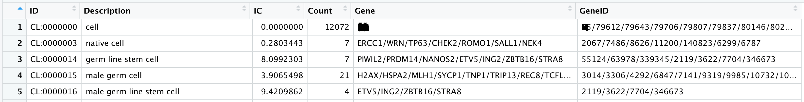

Below is a head of `human_CO[["similarity_matrix"]][["cell"]]`:
```{r, eval = FALSE}
human_CO[["similarity_matrix"]][["cell"]][1:5, 1:5]
```
```
           CL:0000000 CL:0000003 CL:0000014 CL:0000015 CL:0000016
CL:0000000          1 0.00000000 0.00000000 0.00000000  0.0000000
CL:0000003          0 1.00000000 0.00000000 0.00000000  0.0000000
CL:0000014          0 0.06459212 1.00000000 0.45449479  0.4551615
CL:0000015          0 0.05789659 0.08597784 1.00000000  0.4494308
CL:0000016          0 0.08840397 0.05871962 0.04782479  1.0000000
```
where similarities between ontology terms are computed by Lin's method
(Mistry and Pavlidis, BMC Bioinformatics, 2008).

Be careful of using ICs for CO, which may not be always useful.
Nevertheless, we computed IC values as in the future CO database might be
better annotated.


<br>

### Gene Ontology for human and mouse cells (prepared)
Load data.
```{r, eval = FALSE}
oururl <-  "https://github.com/keita-iida/ASURAT_0.1.0/blob/main/databases/"
curl <- paste(oururl, "20201213_human_GO.rda?raw=true", sep = "") # For human
#curl <- paste(oururl, "20201211_mouse_GO.rda?raw=true", sep = "") # For mouse
file <- "databases/20201213_human_GO.rda"
download.file(curl, file) ; load(file)
```

Below is a head of `human_GO[["BP"]]`:

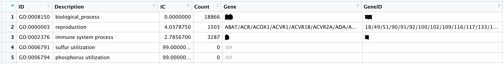

Below is a head of `human_GO[["similarity_matrix"]][["BP"]]`:
```{r, eval = FALSE}
human_GO[["similarity_matrix"]][["BP"]][1:5, 1:5]
```
```
           GO:0008150 GO:0000003 GO:0002376 GO:0006791 GO:0006794
GO:0008150         NA         NA         NA         NA         NA
GO:0000003         NA       1.00       0.43         NA         NA
GO:0002376         NA       0.43       1.00         NA         NA
GO:0006791         NA         NA         NA         NA         NA
GO:0006794         NA         NA         NA         NA         NA
```
where similarities between ontology terms are computed by Jiang's method
(Mistry and Pavlidis, BMC Bioinformatics, 2008).


<br>

### KEGG for human and mouse cells (prepared)
Load data.
```{r, eval = FALSE}
oururl <-  "https://github.com/keita-iida/ASURAT_0.1.0/blob/main/databases/"
curl <- paste(oururl, "20201213_human_KEGG.rda?raw=true", sep = "") # For human
#curl <- paste(oururl, "20201211_mouse_KEGG.rda?raw=true", sep = "") # For mouse
file <- "databases/20201213_human_KEGG.rda"
download.file(curl, file) ; load(file)
```

Below is a head of `human_KEGG[["pathway"]]`:


<br>

## Collect databases
ASURAT has specific functions collecting and reformatting existing databases.
Note that some of the functions may be time-cosuming.


<br>

### Disease Ontology for human cells
```{r, eval = FALSE}
library(DOSE)          # For using `data(DO2EG)`
library(DO.db)         # For using `DOOFFSPRING`
library(org.Hs.eg.db)  # Human: org.Hs.eg.db
library(AnnotationDbi) # For using select() in AnnotationDbi package
```

ASURAT function `format_DO()` reformats a DO database.
```{r, eval = FALSE}
data(DO2EG) # data(DO2EG) is defined in `DOSE` package.
dict_DO <- enrichDO(unlist(DO2EG), ont = "DO", pvalueCutoff = 1,
                    pAdjustMethod = "BH", minGSSize = 0, maxGSSize = 1e+10,
                    qvalueCutoff = 1, readable = FALSE)
human_DO <- format_DO_asrt(dict = dict_DO@result, all_geneIDs = dict_DO@gene,
                           orgdb = org.Hs.eg.db)
save(human_DO, file = "databases/20201213_human_DO.rda", compress = 'xz')
```


<br>

### Cell Ontology for human and mouse cells
```{r, eval = FALSE}
library(ontoProc)
library(org.Hs.eg.db)  # Human: org.Hs.eg.db
                       # Mouse: org.Mm.eg.db
library(AnnotationDbi) # For using select() in AnnotationDbi package
```

ASURAT functions `collect_CO()` and `format_CO()` load a Cell Ontology database
using ontoProc package and reformat the database, respectively.

**Tips:**
As of December 2020, Cell Ontology database might not be complete enough
for some biological contexts.
For example, well-known marker genes for pancreatic beta cell, Ins1 and Ins2,
were not registered for "type B pancreatic cell" with ID "CL:0000169".
```{r, eval = FALSE}
dict_CO <- collect_CO_asrt(orgdb = org.Hs.eg.db)
human_CO <- format_CO_asrt(dict = dict_CO, orgdb = org.Hs.eg.db)
save(human_CO, file = "databases/20201213_human_CO.rda", compress = 'xz')
```


<br>

### Gene Ontology for human and mouse cells
```{r, eval = FALSE}
library(clusterProfiler)
library(GOSemSim)        # For using godata() in GOSemSim package
library(org.Hs.eg.db)    # Human: org.Hs.eg.db
                         # Mouse: org.Mm.eg.db
library(AnnotationDbi)   # For using select() in AnnotationDbi package
```

ASURAT functions `collect_GO()` and `format_GO()` load a Gene Ontology database
using clusterProfiler package and reformat the database, respectively.
Currently, only human and mouse data are acceptable.
```{r, eval = FALSE}
dict_GO <- collect_GO_asrt(orgdb = org.Hs.eg.db)
human_GO <- format_GO_asrt(dict = dict_GO, orgdb = org.Hs.eg.db)
save(human_GO, file = "databases/20201213_human_GO.rda", compress = 'xz')
```


<br>

### KEGG for human and mouse cells
```{r, eval = FALSE}
library(KEGGREST)
library(org.Hs.eg.db)  # Human: org.Hs.eg.db
                       # Mouse: org.Mm.eg.db
library(AnnotationDbi) # For using select() in AnnotationDbi package
```

ASURAT functions `collect_KEGG()` and `format_KEGG()` load a KEGG database
using KEGGREST package via the internet and reformat the database, respectively.

The arguments of `collect_KEGG()` are `organism` and `categories`.
Here, `organism` must obey the naming rule of
[KEGG](http://rest.kegg.jp/list/organism) and `categories` must be one of
`"pathway"` and `"module"` in the current version
(see `KEGGREST` function `listDatabases()`).
```{r, eval = FALSE}
# Note `collect_KEGG()` uses `KEGGREST` function `keggGet()`,
# which may produce both successful and unsuccessful results.
dict_KEGG <- collect_KEGG_asrt(organism = "hsa", category_names = c("pathway"))
human_KEGG <- format_KEGG_asrt(
  dict = list(pathway = dict_KEGG[["pathway"]][["success"]]),
  orgdb = org.Hs.eg.db)
save(human_KEGG, file = "databases/20201213_human_KEGG.rda", compress = 'xz')
```


<br>

### MSigDB for human cells
```{r, eval = FALSE}
library(clustermole)
library(org.Hs.eg.db)  # Human: org.Hs.eg.db
library(AnnotationDbi) # For using select() in AnnotationDbi package
```

Load databases.
```{r, eval = FALSE}
dbtable <- clustermole_markers()
```

Below is a head of `dbtable`:

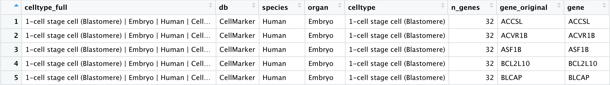

```{r, eval = FALSE}
sort(unique(dbtable$db))
```
```
[1] "ARCHS4"     "CellMarker" "MSigDB"     "PanglaoDB"  "SaVanT"     "TISSUES"   
[7] "xCell"
```

Select species and databases.
```{r, eval = FALSE}
dbtable <- dbtable[which(dbtable$species == "Human"), ]
dbtable <- dbtable[which(dbtable$db == "MSigDB"),]
```

Change gene symbols into entrez IDs.
```{r, eval = FALSE}
dictionary <- AnnotationDbi::select(org.Hs.eg.db, key = dbtable$gene_original,
                                    columns = c("SYMBOL", "ENTREZID"),
                                    keytype = "SYMBOL")
dictionary <- dictionary[!duplicated(dictionary$SYMBOL), ]
dictionary <- dictionary[which(!is.na(dictionary$SYMBOL)),]
for(i in 1:nrow(dbtable)){
  gene <- dbtable$gene_original[i]
  inds <- which(dictionary$SYMBOL == gene)
  dbtable$geneID[i] <- dictionary[inds,]$ENTREZID
}
```

Reformat the database.
Here, the identifier of each biological term are named "MSigID."
```{r, eval = FALSE}
dbtable_geneID <- split(x = dbtable$geneID, f = dbtable$celltype)
dbtable_symbol <- split(x = dbtable$gene_original, f = dbtable$celltype)
stopifnot(identical(length(dbtable_geneID), length(dbtable_symbol)))

res <- c("ID", "Description", "Count", "Gene", "GeneID", "IC")
res <- data.frame(matrix(ncol = 6, nrow = 0, dimnames = list(NULL, res)))
for(i in 1:length(dbtable_geneID)){
  res <- rbind(res, data.frame(
    ID = paste("MSigID:", i, sep = ""),
    Description = names(dbtable_geneID)[i],
    IC = NA,
    Count = length(dbtable_geneID[[i]]),
    Gene = paste(dbtable_symbol[[i]], collapse = "/"),
    GeneID = paste(dbtable_geneID[[i]], collapse = "/")))
}
```

Save data.
```{r, eval = FALSE}
human_MSig <- list(cell = res)
save(human_MSig, file = "databases/20220108_human_MSig.rda", compress = 'xz')
```


<br>

### Custom-built database I: combine CO and MSigDB for human cells
Create a cell type-related database by combining Cell ontology and
MSigDB databases for analyzing human single-cell transcriptome data.
```{r, eval = FALSE}
load(file = "databases/20201213_human_CO.rda")
load(file = "databases/20220108_human_MSig.rda")
res <- rbind(human_CO[["cell"]], human_MSig[["cell"]])
res$IC <- NA
human_COMSig <- list(cell = res)
save(human_COMSig, file = "databases/20220108_human_COMSig.rda",
     compress = 'xz')
```


<br>

### Custom-built database II: combine DO, CO, and MSigDB for human cells
Create a cell type-related database by combining Disease Ontology,
Cell ontology and MSigDB databases for analyzing complex human single-cell
transcriptome data.
```{r, eval = FALSE}
load(file = "databases/20201213_human_DO.rda")
load(file = "databases/20201213_human_CO.rda")
load(file = "databases/20220108_human_MSig.rda")
res <- rbind(human_DO[["disease"]],
             rbind(human_CO[["cell"]], human_MSig[["cell"]]))
res$IC <- NA
human_DOCOMSig <- list(cell = res)
save(human_DOCOMSig, file = "databases/20220108_human_DOCOMSig.rda",
     compress = 'xz')
```


<br><br><br>

# Session information

```{r, eval = FALSE}
sessionInfo()
```

```
R version 4.0.4 (2021-02-15)
Platform: x86_64-apple-darwin17.0 (64-bit)
Running under: macOS Big Sur 11.1

Matrix products: default
LAPACK: /Library/Frameworks/R.framework/Versions/4.0/Resources/lib/libRlapack.dylib

locale:
[1] en_US.UTF-8/en_US.UTF-8/en_US.UTF-8/C/en_US.UTF-8/en_US.UTF-8

attached base packages:
[1] parallel  stats4    stats     graphics  grDevices utils     datasets  methods  
[9] base     

other attached packages:
 [1] org.Mm.eg.db_3.12.0         org.Hs.eg.db_3.12.0        
 [3] AnnotationDbi_1.52.0        SingleCellExperiment_1.12.0
 [5] SummarizedExperiment_1.20.0 Biobase_2.50.0             
 [7] GenomicRanges_1.42.0        GenomeInfoDb_1.26.7        
 [9] IRanges_2.24.1              S4Vectors_0.28.1           
[11] BiocGenerics_0.36.1         MatrixGenerics_1.2.1       
[13] matrixStats_0.61.0          ASURAT_0.99.0              

loaded via a namespace (and not attached):
 [1] Rcpp_1.0.7             lattice_0.20-45        circlize_0.4.13       
 [4] png_0.1-7              assertthat_0.2.1       digest_0.6.28         
 [7] utf8_1.2.2             R6_2.5.1               RSQLite_2.2.8         
[10] evaluate_0.14          ggplot2_3.3.5          pillar_1.6.4          
[13] GlobalOptions_0.1.2    zlibbioc_1.36.0        rlang_0.4.12          
[16] misc3d_0.9-1           blob_1.2.2             GetoptLong_1.0.5      
[19] Matrix_1.3-4           rmarkdown_2.11         bit_4.0.4             
[22] RCurl_1.98-1.5         munsell_0.5.0          DelayedArray_0.16.3   
[25] compiler_4.0.4         xfun_0.27              pkgconfig_2.0.3       
[28] shape_1.4.6            tcltk_4.0.4            htmltools_0.5.2       
[31] tidyselect_1.1.1       tibble_3.1.5           GenomeInfoDbData_1.2.4
[34] fansi_0.5.0            crayon_1.4.2           dplyr_1.0.7           
[37] bitops_1.0-7           grid_4.0.4             gtable_0.3.0          
[40] lifecycle_1.0.1        DBI_1.1.1              magrittr_2.0.1        
[43] scales_1.1.1           cachem_1.0.6           XVector_0.30.0        
[46] ellipsis_0.3.2         vctrs_0.3.8            generics_0.1.1        
[49] plot3D_1.4             rjson_0.2.20           RColorBrewer_1.1-2    
[52] tools_4.0.4            Cairo_1.5-12.2         bit64_4.0.5           
[55] glue_1.4.2             purrr_0.3.4            fastmap_1.1.0         
[58] yaml_2.2.1             clue_0.3-60            colorspace_2.0-2      
[61] cluster_2.1.2          ComplexHeatmap_2.6.2   memoise_2.0.0         
[64] knitr_1.36
```
