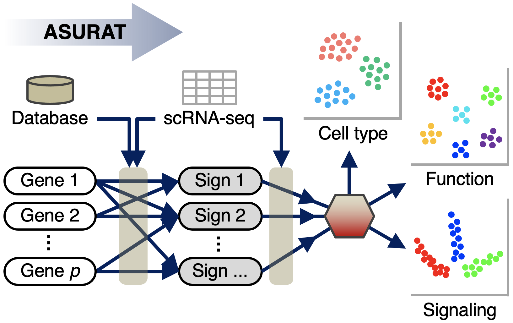
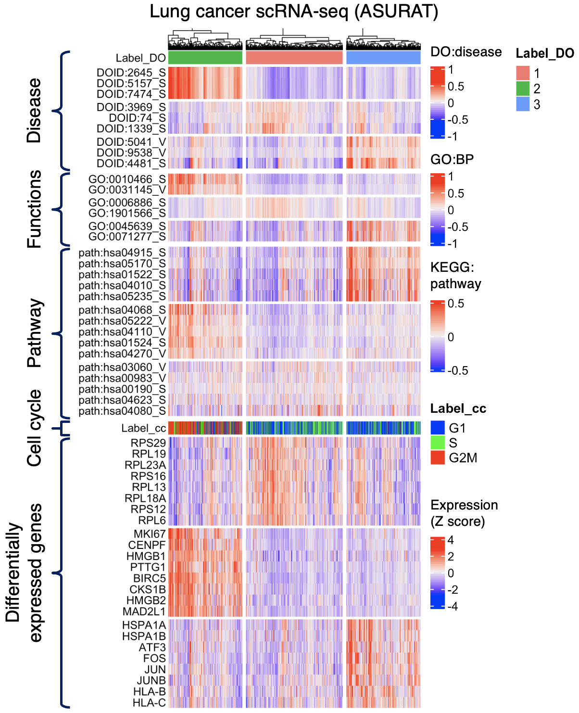

# ASURAT

ASURAT is an analysis pipeline, which simultaneously performs unsupervised clustering and biological interpretation in terms of cell type, disease, biological process, and signaling pathway activity.

Our preprint was released on bioRxiv (12th June, 2021), which will be updated soon, including spatial transcriptome analysis.

https://www.biorxiv.org/content/10.1101/2021.06.09.447731v1

All the procedures necessary for writing the manuscript are written in R bookdown, which can be found from the following URL:

https://keita-iida.github.io/ASURAT_0.0.0.9001/

 

## The latest version of ASURAT (version 0.0.0.9001)

ASURAT (version 0.0.0.9001) is currently in the alpha phase of its development. This means that the functions are not always optimal, which will be updated in the future. I believe that there are no crucial bugs because I checked the whole process many times, but please be patient if there are any inconveniences. This version is maintained in the following URL:

https://github.com/keita-iida/ASURAT_0.0.0.9001

 

## What can ASURAT do?

Using ASURAT, users can transform single-cell RNA-seq data into novel sign-by-sample matrices (SSMs), in which rows and columns stand for biological terms (i.e., signs) and samples (cells), respectively. Here, biological terms are defined by functional gene sets, in terms of cell type, disease, functions, and signaling pathway activity. Thus, users can cluster single-cell transcriptomes from multiple biological aspects and obtain the most interpretable results (see movie).

 

https://user-images.githubusercontent.com/50622599/132665687-c2ecc41e-c4bf-40c5-851f-e644762fd203.mov

 

Concatenating multiple SSMs, gene expression matrices, and other information such as cell cycle, users can characterize individual cells in columns from multiple biological terms in rows, facilitating the interpretation (see the figure below).

 

 

## Quick start from a Seurat object

See the following URL:

https://github.com/keita-iida/ASURAT_0.0.0.9001

